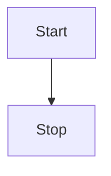

# 主标题

## 1.父标题

### 1.1.子标题

### 1.2.子标题

### 1.3.子标题

#### 1.3.1.孙标题

##### 1.3.1.1.孙孙标题

###### 1.3.1.1.1.孙孙孙标题

**如果标题超过六级就请使用粗体对内容进行分块**

## 2.父标题

这里展示一些代码的使用。

:::details 

:::tabs

@tab 分作用1

```cpp :collapsed-lines
// 文件名
int main() { return 0; }
```
@tab 分作用2

```cpp :collapsed-lines
// 文件名
int main() { return 0; }
``

:::

## 3.父标题

这里展示一些图表的使用。



## 4.父标题

> [!CAUTION]
>
> 警告：...

> [!WARNING]
>
> 注意：...

> [!IMPORTANT]
>
> 补充：...

> [!TIP]
>
> 区别：...

> [!NOTE]
>
> 吐槽：...

