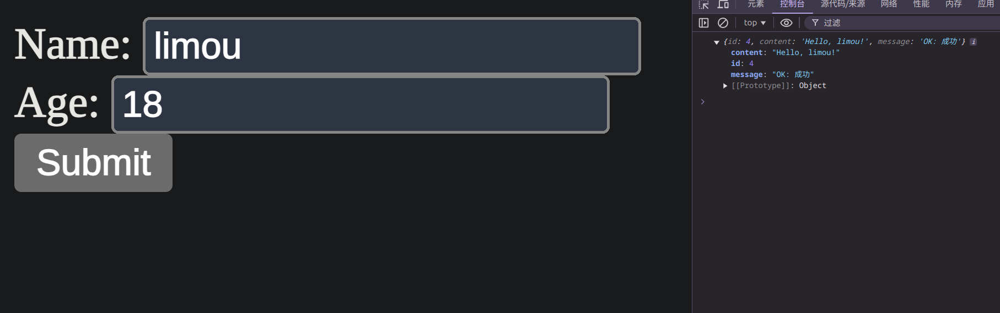

# Spring Boot

## 1.Spring Boot 全面概述

`Spring Boot` 是一个构建在 `Spring` 框架顶部的项目（也就是一个模块）。它提供了一种简便，快捷的方式来设置，配置和运行基于 `Web` 的简单应用程序。是简化版的 `Spring`，旨在快速开发中小型的、快速交付、微服务架构的项目，要比 `Spring` 来得轻量。

它是一个 `Spring` 模块，提供了 **RAD(快速应用程序开发)** 功能。它用于创建独立的基于 `Spring` 的应用程序，因为它需要最少的 `Spring` 配置，因此可以运行。

基本上 `Spring Boot = Spring Framework + Embedded HTTP Server - XML`

可以使用 `Spring STS IDE, Spring Initializr, IDEA Ultimate` 构建一个 `Spring Boot` 项目。

## 2.Spring Boot 基本功能

- **Web 开发** 这是用于 `Web` 应用程序开发的非常适合的子模块。我们可以轻松创建一个独立的 `HTTP` 应用程序，该应用程序使用 `Tomca, Jetty, Undertow` 等嵌入式服务器。我们可以使用  `spring-boot-starter-web` 模块快速启动和运行应用程序。

- **SpringApplication 类** 提供了一种方便的方式来引导 `Spring` 应用程序，可以从 `main` 方法开始，我们可以仅通过调用静态 `run()` 方法来调用应用程序。

    ```java
    // Main.java
    public static void main(String[] args) {
        SpringApplication.run(ClassName.class, args);  
    }
    ```

- **应用程序事件和侦听器** `Spring Boot` 使用事件来处理各种任务。它允许我们创建用于添加侦听器的工厂文件。我们可以使用  `ApplicationListener 键` 来引用它。总是在 `META-INF` 文件夹中创建工厂文件，例如  `META-INF/spring.factories`。

- **应用管理** `Spring Boot` 提供了为应用程序启用与管理员相关的功能的功能。它用于远程访问和管理应用程序。我们可以使用 `spring.application.admin.enabled` 属性在 `Spring Boot` 应用程序中启用它。

- **外部配置** `Spring Boot` 允许我们外部化我们的配置，以便我们可以在不同环境中使用同一应用程序。该应用程序使用 `YAML` 文件来外部化配置。

- **属性文件** `Spring Boot` 提供了一组丰富的应用程序属性。因此，我们可以在项目的属性文件中使用它。该属性文件用于设置诸如  `server-port = 8082` 等属性，它有助于组织应用程序属性。

- **YAML 支持** 它提供了一种方便的方法来指定层次结构。它是 `JSON` 的超集（任何 `JSON` 文档复制进去都可以通过使用）。 `SpringApplication` 类自动支持 `YAML`，它是属性文件的代替方法。

- **类型安全配置** 强大的类型安全配置用于管理和验证应用程序的配置。应用程序配置始终是至关重要的任务，应该是类型安全的。我们还可以使用此库提供的注释。

- **日志** `Spring Boot` 对所有内部记录都使用通用记录。默认情况下管理日志记录依赖项。如果不需要自定义，我们不应更改日志记录依赖项。

- **安全性** `Spring Boot` 应用程序是 `spring` 的 `Web` 应用程序。因此，默认情况下，通过所有 `HTTP` 端点上的基本身份验证，它是安全的。可以使用一组丰富的端点来开发安全的 `Spring Boot` 应用程序。

## 3.Spring Boot 使用教程

### 3.1.快速使用

> [!WARNING]
>
> 注意：不过我的习惯是先体验原生的生成器来配置，然后再来体验 `IDE` 这些便携工具，这种知晓一切的感觉很舒服。因此本教程对于没有下载 `IDEA` 的新手来说是可以无痛运行的（当然，您需要安装 `Java`），因此本教程使用在 `Linux` 环境下使用，请您最好在 `Linux` 操作系统中运行。

#### 3.1.1.构建项目

下面我们将依据 [官方快速入门文档](https://spring.io/quickstart) 尝试构建一个 `Spring Boot` 项目。


1. 我们将打开浏览器访问 [spring initializr](https://start.spring.io/) 来快速生成一个 `Spring Boot` 项目开发脚手架
2. 项目构建工具选择 `Maven`
3. 项目语言选择 `Java`，这也是主要的工业开发语言
4. 选择官方推荐的 `Spring Boot 3.4.0` 版本
5. 创建 `web` 项目，在 `Dependencies(依赖项)` 对话框中，搜索并添加`Spring Web` 依赖项
6. 填写元数据 **项目公司域名组、项目包名、项目名、项目描述、项目包名**
7. 选择项目包类型
8. 选择语言版本，这里我选择 `Java 17`，请注意在您的 `Linux` 里使用 `sudo apt install -y openjdk-17-jd` 下载 `Java 17`，避免版本不匹配
9. 点击 “生成” 按钮，下载 `zip` 文件，然后将其解压缩到计算机上的文件夹中
10. 此时浏览器可以从远端下载到您配置好的 `Spring Boot` 项目脚手架代码

#### 3.1.2.目录结构

下面就是一个 `Spring Boot` 生成的目录结构，相关注释我都写在里面了。

```Shell
# 查看项目目录结构
$ tree demo
demo
├── HELP.md # 项目相关的帮助文档或使用指南
├── mvnw # 在 Linux 或 macOS 上执行的脚本(如果开发环境中没有安装 Maven, mvnw 可以自动下载并使用指定版本的 Maven)
├── mvnw.cmd #  在 Windows 上执行的脚本
├── pom.xml
└── src # 项目源代码
    ├── main # 主要代码
    │   ├── java
    │   │   └── com
    │   │       └── example
    │   │           └── demo
    │   │               └── DemoApplication.java # 程序入口文件
    │   └── resources
    │       ├── application.properties
    │       ├── static
    │       └── templates
    └── test # 测试代码
        └── java
            └── com
                └── example
                    └── demo
                        └── DemoApplicationTests.java # 测试程序入口文件

15 directories, 7 files

```

> [!IMPORTANT]
>
> 补充：`Maven` 有什么用呢？主要是 `Java` 项目的构建工具，类似 `C++` 中的 `CMake` 工具，但是使用起来会稍微简单一些，可以简化和自动化软件的构建、测试、部署、依赖流程。

#### 3.1.3.代码实践

我们将依据 [官方快速入门文档](https://spring.io/quickstart) 在 `Spring Boot` 项目运行打印出 `Hello World`。

在 `src/main/java/com/example/demo` 文件夹中找到 `DemoApplication.java` 文件，初始内容如下，我给出了部分注释。

```Java
// DemoApplication.java
package com.example.demo; // 反域名包名, 声明当前类所在的包

import org.springframework.boot.SpringApplication;
import org.springframework.boot.autoconfigure.SpringBootApplication;

/* @SpringBootApplication 一个复合注解 */
@SpringBootApplication
public class DemoApplication { // 入口类

    public static void main(String[] args) { // 入口方法
        SpringApplication.run(DemoApplication.class, args); // 启动 Spring Boot
    }

}
```

接下来的编码很简单，我们只需要让 `Spring Boot` 项目中添加我们自己的代码，然后运行起来就可以了。

```Java
// DemoApplication.java
package com.example.demo;

// 这里的 import 引入了关于 Spring Boot 和 Spring Web 必要的类和注解
import org.springframework.boot.SpringApplication;
import org.springframework.boot.autoconfigure.SpringBootApplication;
import org.springframework.web.bind.annotation.GetMapping;
import org.springframework.web.bind.annotation.RequestParam;
import org.springframework.web.bind.annotation.RestController;

@SpringBootApplication
@RestController // 控制器注解, 表示该类是一个 RESTful 控制器, 返回的是对象本身, 并自动将其序列化成 JSON 格式返回给客户端, 而不是返回视图
public class DemoApplication {

    public static void main(String[] args) {
      SpringApplication.run(DemoApplication.class, args);
    }

    @GetMapping("/hello") // 这是一个 Spring Web 注解, 用于将 HTTP GET 请求映射到 hello() 上, 路径为 '/hello'
    public String hello(@RequestParam(value = "name", defaultValue = "World") String name) {
      return String.format("Hello %s!", name);
    }

}
```

总的来说：
- 使用 `@GetMapping` 注释可确保将对 `/hello` 的 `HTTP GET` 请求映射到 `hello()`
- 使用 `@RequestParam` 将查询字符串参数 `name` 的值绑定到 `hello()` 的 `name` 参数中，如果请求中不存在 `name` 参数，则使用 `defaultValue` 中定义的值
- 使用 `@GetMapping` 可以映射 `HTTP GET` 方法到您自己的方法上
- 使用 `@RestController` 并且默认存在序列库 `Jackson` 的情况下，`Spring Boot` 会根据一个对象的成员自动序列化为一个 `JSON` 数据（不过有些是直接返回字符串，例如字符串对象），后面会介绍自定义序列化数据的操作

> [!IMPORTANT]
>
> 补充：补充一些基础知识，如果您缺少这些知识，请一定要进行补全。
>
> 1. **RESTful 控制器：**`REST(Representational State Transfer)`是一种基于 `HTTP` 协议的通信方式，主要用于客户端和服务器之间的通信，通常用于提供 **Web API**。`RESTful API` 遵循一系列的设计原则，通常会使用 `HTTP` 动作（如 `GET、POST、PUT、DELETE` 等）来进行数据的操作。控制器注解可以让类中经过映射的方法接收 `HTTP` 请求并返回响应。
> 2. **返回对象本身，而非视图**：传统的 `Spring MVC` 控制器（使用 `@Controller` 注解）通常会返回一个视图名（例如 `JSP` 标签或 `Thymeleaf` 模板），`Spring` 会将数据与视图模板结合并返回给客户端。不过这种开发方式已经有些过时，是不可能完全做到前后端分离开发的，和早期的 `C++ Web` 开发是差不多的，存在很多开发困难。但是，**RESTful 控制器** 的作用是提供一个 **Web API**，可以直接返回 **数据**（如 `JSON` 或 `XML`），而不是视图。在 `@RestController` 中，返回的对象会被自动序列化为 `JSON` 格式（默认使用 **Jackson** 序列化库来将 Java 对象转换成 JSON 格式），直接作为 `HTTP` 响应返回给客户端。

该怎么在命令行中启动我们的 `Spring Boot` 项目就像运行一个普通 `Java` 程序一样呢？首先需要使用 `mvnw` 安装需要的依赖（我们得到的仅仅是带有脚本的脚手架和一些基本的文件，不包含 `Spring Boot` 的源代码），然后才能让我们的 `Spring Boot` 项目生成 `Java` 的字节码，进而

```shell
# 命令行原生启动 Spring Boot
# 进入项目
$ cd demo
$ pwd
/home/ljp/test/java/demo

# 安装依赖
$ ./mvnw clean install # 哪怕是有稳定的网络都需要安装很久, 请耐心等待...

# 运行项目
$ ./mvnw spring-boot:run

# 打包项目
# $ ./mvnw package # 会在 target/ 中打包好 jar 包

# 前台部署
# java -jar target/demo-0.0.1-SNAPSHOT.jar

```

在本地机器的浏览器 `URL` 中直接访问 `http://127.0.0.1:8080/hello`（或者携带参数的 `http://127.0.0.1:8080/hello?name=limou`），就可以在浏览器页面中渲染出 `Hello World!`（`Hello limou!`），其中直接运行项目适合进行开发测试，打包适合直接部署到服务器上运行。

> [!IMPORTANT]
>
> 补充：为什么返回的字符串后不会被渲染为 `JSON` 字符串？
>
> - `Spring` 框架如果检测到返回值是一个字符串，会将它直接作为 `HTTP` 响应体（`text/plain` 或 `text/html`）。
> - 如果返回的内容是一个复杂对象，例如 `Map` 或自定义类实例，`Spring` 才会自动将其序列化为 `JSON` 格式。

> [!IMPORTANT]
>
> 补充：当然仅仅是这样是不够的，为什么，因为这样仅仅是写好了一个后端接口而已，`cpp-http` 可以做到、`python-flask、python-django` 可以做到、`node.js-koa.js` 可以做到，为什么偏偏工业偏爱使用 `java-spring boot` 呢？因此您需要了解更多关于 `Spring Boot` 的配置内容。

### 3.2.搭建服务

根据常见的服务器开发，这里给出一份关于 `Spring Boot` 的总文档，旨在让您只看一遍就知道如何编写一个完整的 `Web` 服务器。

下面是您可能需要的资料：

- [Spring Boot 项目概览](https://spring.io/projects/spring-boot#overview)
- [Spring Boot 参考文档](https://docs.spring.io/spring-boot/index.html)
- [Spring Boot 接口文档](https://docs.spring.io/spring-boot/api/java/index.html)
- [构建 RESTful Web 服务](https://spring.io/guides/gs/rest-service) 和 [使用 RESTful Web 服务](https://spring.io/guides/gs/consuming-rest) 

这里将先根据 [构建 RESTful Web 服务](https://spring.io/guides/gs/rest-service) 和 [使用 RESTful Web 服务](https://spring.io/guides/gs/consuming-rest) 这两份官方文档、其他官方文档、我个人的见解来讲述如何完整编写 `RESTful Web` 规范的 `Web` 服务器。

#### 3.2.1.编码目标

- 我们将实现一个 `Web` 服务器
- 构建常见的 `HTTP` 请求
- 需要自定义返回的 `JSON` 格式

#### 3.2.2.创建项目

这次我们不再使用 `Spring Initializr` 来创建 `Spring Boot` 项目了，而使用著名的 `IDEA` 编辑器来构建一个 `Spring Boot` 项目。


然后打开侧边的 `Maven` 执行和上一节一样的命令行操作，在生命周期中先点击 `clean` 再点击 `install`，最后打开启动文件，点击运行启动函数即可。


可以看到在终端中，`Spring boot` 成功被启动起来了。

#### 3.2.3.简单使用

由于我们需要自定义返回的 `JSON` 字符串，因此需要使用一些 `Resource Representation` 来进行数据建模（就是下面定义的 `Greeting`）。

```shell
# 项目文件结构
$ tree my-restful-web
my-restful-web
├── HELP.md
├── mvnw
├── mvnw.cmd
├── pom.xml
├── src
│   ├── main
│   │   ├── java
│   │   │   └── com
│   │   │       └── limou
│   │   │            └── myrestfulweb
│   │   │                 ├── Greeting.java # 我们将要编写的 "资源表示类"
│   │   │                 ├── GreetingController.java # 我们将要编写的 "资源控制类"
│   │   │                 └── MyRestfulWebApplication.class # 不需要改动的 "启动文件"
│   │   └── resources
│   │       ├── application.properties
│   │       ├── static
│   │       └── templates
...

```

``` java
// Greeting.java: 资源表示
package com.limou.myrestfulweb;

public record Greeting(long id, String content) {
/**
 * record 会自动为类的字段生成以下内容：
 *
 * 常用方法:
 * 构造函数
 * getter()
 * toString()
 * equals()
 * hashCode()
 *
 * 不可变性: record 中的字段是 final 的, 不能更改(在创建后即为只读), 没有提供 setter()
 */
}
```

```java
// GreetingController.java: 资源控制
package com.limou.myrestfulweb;

import java.util.concurrent.atomic.AtomicLong;

import org.springframework.web.bind.annotation.GetMapping;
import org.springframework.web.bind.annotation.RequestParam;
import org.springframework.web.bind.annotation.RestController;

@RestController
/**
 * @RestController 表示这是一个资源控制类
 * 其中每个方法都返回域对象而不是视图, 它是包括 @Controller 和 @ResponseBody 的简写
 */
public class GreetingController {

    private static final String template = "Hello, %s!"; // 需要返回数据的模板
    private final AtomicLong counter = new AtomicLong(); // 用于生成线程安全计数器的对象, 常用于对资源的访问进行计数或生成唯一标识符(ID), 具有一个 incrementAndGet() 可以对计数器进行递增

    @GetMapping("/greeting")
    /**
     * @GetMapping 表示这是一个 Get 方法的映射接口
     * 
     * @RequestMapping(method = RequestMethod.GET) <=> @GetMapping
     * @RequestMapping(method = RequestMethod.POST) <=> @PostMapping
     * 
     * 简而言之 @RequestMapping 可以用于处理任何 HTTP 方法的请求，而 @GetMapping、@PostMapping 等是专门为常见 HTTP 方法提供的简化版本
     */
    public Greeting greeting(@RequestParam(value = "name", defaultValue = "World") String name) {
        /**
         * @RequestParam 表示做一个查询参数到函数参数的映射, 常用于 Get 方法中
         * 'value' 是表单中的键值名
         * '"name"' 是本函数的参数名
         * 剩下的 'defaultValue' 就是当查询参数中没有传递时使用的默认值
         */
        return new Greeting(counter.incrementAndGet(), String.format(template, name)); // 使用前面的资源表示类来进行数据返回(存放了一个不断递增的 ID 字段和一个 name 字段), 可以在浏览器上访问注意到: 这里返回的是一个对象, 严格来说只是一个引用, 但是在浏览器中自动被转化为 JSON 文档对象(自动序列化)
    }

}
```

```java
// MyRestfulWebApplicationTests.java: 启动文件
// 注意无需进行任何改动!
package com.limou.myrestfulweb;

import org.springframework.boot.SpringApplication;
import org.springframework.boot.autoconfigure.SpringBootApplication;

/**
 * @SpringBootApplication 是一个便捷的注释，它添加了以下所有内容:
 * = @SpringBootConfiguration 标识这是一个 Spring Boot 应用程序的配置类
 * + @EnableAutoConfiguration 启用 Spring Boot 的自动配置机制, 根据依赖和类路径内容自动配置应用程序, 避免手动配置大量的 Spring 配置类
 * + @ComponentScan 启用组件扫描, 默认会扫描当前包及其子包中的所有类(如 @Controller, @Service, @Repository, @Component 等注解标记的类)
 */

@SpringBootApplication
public class MyRestfulWebApplication {
    public static void main(String[] args) {
        SpringApplication.run(MyRestfulWebApplication.class, args);
    }
}

```

> [!IMPORTANT]
>
> 补充：`Jackson JSON` 库将 `Greeting` 类型的实例自动封送到 `JSON` 中。默认情况下，`Jackson` 由 `Web` 启动器包含。

> [!WARNING]
>
> 警告：在编码过程中请注意您的包名不一定和我一样...

还是像上一小节一样运行 `Spring Boot` 不过这次我们可以使用 `IDEA` 快速点击运行，然后使用浏览器访问 `http://127.0.0.1:8080/greeting`（或者使用类似 `http://127.0.0.1:8080/greeting?=limou` 的写法）。


#### 3.2.4.高自定义

如果您对 `HTTP` 协议足够熟悉，您一定会像如何高自定义化网络报文的，因此下面给出了一个稍微现代化的写法供您参考，为节省一些说明，我把文件稍微精简了一些...

```shell
# 项目结构
$ tree my-restful-web
my-restful-web
├── HELP.md
├── mvnw
├── mvnw.cmd
├── pom.xml
├── src
│   ├── main
│   │   ├── html
│   │   │   └── test.html # 将要编写的 "前端页面"
│   │   ├── java
│   │   │   └── com
│   │   │       └── limou
│   │   │           └── myrestfulweb
│   │   │              ├── GreetingController.java # 将要编写的 "资源控制"
│   │   │              └── MyRestfulWebApplication.class # 不需要改动的 "启动文件"
│   │   └── resources
│   │       ├── application.properties # 将要编写的 "配置文件"
│   │       ├── static
│   │       └── templates
...

```

```java
// GreetingController.java: 资源控制
package com.limou.myrestfulweb;

import com.fasterxml.jackson.annotation.JsonIgnoreProperties;
import org.springframework.boot.autoconfigure.ssl.SslProperties;
import org.springframework.http.HttpHeaders;
import org.springframework.http.ResponseEntity;
import org.springframework.web.bind.annotation.*;

import java.io.File;
import java.io.IOException;
import java.nio.charset.StandardCharsets;
import java.nio.file.Files;
import java.nio.file.Paths;
import java.util.Map;
import java.util.concurrent.atomic.AtomicLong;

@RestController
/**
 * @RestController 表示这是一个资源控制类
 * 其中每个方法都返回域对象而不是视图, 它是包括 @Controller 和 @ResponseBody 的简写
 */
public class GreetingController {

    // 1. 定义一些后面需要用的成员和方法
    private static final String template = "Hello, %s!"; // 需要返回数据的模板

    private final AtomicLong counter = new AtomicLong(); // 用于生成线程安全计数器的对象, 常用于对资源的访问进行计数或生成唯一标识符(ID), 具有一个 incrementAndGet() 可以对计数器进行递增

    // @JsonIgnoreProperties(ignoreUnknown = true)
    public record Name(String name) {} // 资源描述(请求)

    public record Greeting(long id, String content, String message) {} // 资源描述(响应)

    private static final Map<Integer, String> statusCodeToMessage = Map.of(
            200, "OK: 成功",
            404, "Not Found: 没有找到资源",
            500, "Internal Server Error: 出现服务器问题"
    ); // 自定义错误码映射错误描述的函数

    // 2. 演示如何 获取请求报文中的数据 和 设置响应报文中的数据(GET)
    @GetMapping("/greeting_get")
    /**
     * @GetMapping 表示这是一个 Get 方法的映射接口
     *
     * @RequestMapping(method = RequestMethod.GET) <=> @GetMapping
     * @RequestMapping(method = RequestMethod.POST) <=> @PostMapping
     *
     * 简而言之 @RequestMapping 可以用于处理任何 HTTP 方法的请求，而 @GetMapping、@PostMapping 等是专门为常见 HTTP 方法提供的简化版本
     */
    public ResponseEntity<Greeting> greetingPlus(
            @RequestParam(value = "name", defaultValue = "World") String name,
            @RequestHeader("Cookie") String cookie,
            @RequestBody(required = false) String requestBody) { // 如果传递的数据载荷中是 JSON 时这里其实会自动映射, 如果有未绑定的键可以使用 @JsonIgnoreProperties(ignoreUnknown = true) 来进行不严格匹配(后面的 POST 接口有演示)
        
        // (1) 演示获取请求报文中的数据
        /**
         * @RequestParam 获取请求路径中的查询参数
         * 常用于 Get 方法中
         * 'value' 是表单中的键值名
         * '"name"' 是本函数的参数名
         * 剩下的 'defaultValue' 就是当查询参数中没有传递时使用的默认值
         */

        /**
         * @RequestHeader 获取请求头部中的键
         * 这里获取的是 cookie
         */

        /**
         * @RequestBody 获取请求载荷中的键
         * 不过一般 Get 方法很少有传递业务需要使用的键, 因此这里打印出来大概率是空, 毕竟浏览器没有传递任何的载荷
         * 这里的 required = false 表示如果请求体为空, 则不会抛出异常
         * 在 POST 方法中可以使用其他类型的对象来接受获取内部更加详细的数据
         */

        System.out.println(name);
        System.out.println(cookie);
        System.out.println(requestBody);


        // (2) 演示设置响应报文中的数据
        // a. 准备报头数据
        int customStatusCode = 404; // 错误码
        HttpHeaders headers = new HttpHeaders();
        headers.add("X-Custom-Message", "This is a custom message header");

        // b. 准备载荷数据
        String customStatusMessage = statusCodeToMessage.getOrDefault(customStatusCode, "Unknown status code"); // 错误描述
        Greeting customResponse = new Greeting(counter.incrementAndGet(), String.format(template, name), customStatusMessage);

        // (3) 使用函数调用链返回 ResponseEntity
        return ResponseEntity
                .status(customStatusCode) // 设置状态码
                .headers(headers) // 设置响应头
                .body(customResponse); // 设置响应体
    }

    // 3. 演示如何 获取请求报文中的数据 和 设置响应报文中的数据(POST)
    @PostMapping("/greeting_post")
    public ResponseEntity<Greeting> greeting_plus_post(
            @RequestBody(required = false) Name nameObj) {
        String name = "World";
        if (nameObj!= null && nameObj.name!= null) {
            name = nameObj.name;
            System.out.println(nameObj);
        }

        // 准备报头数据
        int customStatusCode = 200;
        HttpHeaders headers = new HttpHeaders();
        headers.add("X-Custom-Message", "This is a custom message header for POST request");

        // 准备载荷数据
        String customStatusMessage = statusCodeToMessage.getOrDefault(customStatusCode, "Unknown status code");
        Greeting customResponse = new Greeting(counter.incrementAndGet(), String.format(template, name), customStatusMessage);

        return ResponseEntity
                .status(customStatusCode)
                .headers(headers)
                .body(customResponse);
    }

    // 4.可以看到 Spring boot 也有能力做到 Spring MVC 一样返回一个完整的页面视图(不过这种方式不常用, 我这里之所以写这个接口仅仅是为了让您不至于遇到跨域问题从而进行麻烦的配置)
    @GetMapping("/html")
    public String getHTML() throws IOException {
        File file = new File("/home/ljp/test/java/my-restful-web/src/html/test.html");
        byte[] encoded = Files.readAllBytes(Paths.get(file.getAbsolutePath()));
        return new String(encoded, StandardCharsets.UTF_8);
    }
}

```

```html
<!-- test.html: 前端页面 -->
<!DOCTYPE html>
<html lang="en">

<head>
    <meta charset="UTF-8">
    <title>POST Request Example</title>
</head>

<body>
<form id="myForm">
    <label for="name">Name:</label>
    <input type="text" id="name" name="name"><br/>
    <label for="age">Age:</label>
    <input type="text" id="age" name="age"><br/> <!-- 这个字段后端是不需要处理的, 但是我依旧强行传递过去了 -->
    <input type="submit" value="Submit">
</form>
<script>
    document.getElementById('myForm').addEventListener('submit', function (e) {
        e.preventDefault();

        var name = document.getElementById('name').value;
        var age = document.getElementById('age').value;
        var requestBody = {
            "name": name,
            "age": age // 这里表单虽然传递给了后端, 但是由于后端的 "/greeting_plus_post" 接口内的资源表示类使用了 "@JsonIgnoreProperties(ignoreUnknown = true)" 注解, 因此不会抛出异常(您可以去掉这个注解试一试)
        };

        fetch('http://127.0.0.1:8080/greeting_post', {
            method: 'POST',
            headers: {
                'Content-Type': 'application/json'
            },
            body: JSON.stringify(requestBody)
        })
            .then(response => response.json())
            .then(data => {
                console.log(data);
                // 在这里可以根据返回的数据进行进一步的页面展示等操作，比如显示响应中的消息等
            })
            .catch(error => {
                console.error('Error:', error);
            });
    });
</script>
</body>

</html>
```

```shell
# application.properties: 配置文件
spring.application.name=my-restful-web
spring.jackson.deserialization.fail-on-unknown-properties=true # 加上这一句就可以
# 注意这个文件不可以加入任何注释, 记得删除我在这里写的注释

```

```java
// MyRestfulWebApplicationTests.java
// 注意无需进行任何改动!
package com.limou.myrestfulweb;

import org.springframework.boot.SpringApplication;
import org.springframework.boot.autoconfigure.SpringBootApplication;

/**
 * @SpringBootApplication 是一个便捷的注释，它添加了以下所有内容:
 * = @SpringBootConfiguration 标识这是一个 Spring Boot 应用程序的配置类
 * + @EnableAutoConfiguration 启用 Spring Boot 的自动配置机制, 根据依赖和类路径内容自动配置应用程序, 避免手动配置大量的 Spring 配置类
 * + @ComponentScan 启用组件扫描, 默认会扫描当前包及其子包中的所有类(如 @Controller, @Service, @Repository, @Component 等注解标记的类)
 */

@SpringBootApplication
public class MyRestfulWebApplication {
    public static void main(String[] args) {
        SpringApplication.run(MyRestfulWebApplication.class, args);
    }
}

```


> [!IMPORTANT]
>
> 补充：如果不在 `application.properties` 配置文件中加入 `spring.jackson.deserialization.fail-on-unknown-properties=true` 就会默认不约束 `JSON` 报文数据。但是如果加上了，并且没有对资源描述做 `// @JsonIgnoreProperties(ignoreUnknown = true)` 忽略，在有字段缺失时，就会抛出异常。
>
> 

> [!IMPORTANT]
>
> 补充：`@JsonIgnoreProperties` 其实还有一些其他的用法，比如对某些特定字段进行忽略...

> [!CAUTION]
>
> 警告：上述代码中有一个 `/html` 的接口，可以直接组合 `HTML` 返回一个前端页面，这是前后端不分离的做法，也就是类似 `Spring MVC` 的做法，`Spring Boot` 开发一般不会这么做，这只是我为了进行方便的测试 `POST` 方法而已。

当然，如果您不希望使用 `Spring Boot` 做页面返回这种奇怪的做法（毕竟几乎没有人会这么做），可以在启动文件中定义一个定义一个 `RestTemplate` 客户端，用来模拟浏览器进行接口测试（这是 `Spring` 提供的），只需要在启动文件中加入一些代码即可。

```java
// MyRestfulWebApplicationTests.java: 启动文件
// 注意无需进行任何改动!
package com.limou.myrestfulweb;

import org.slf4j.Logger;
import org.slf4j.LoggerFactory;
import org.springframework.boot.CommandLineRunner;
import org.springframework.boot.SpringApplication;
import org.springframework.boot.autoconfigure.SpringBootApplication;
import org.springframework.boot.web.client.RestTemplateBuilder;
import org.springframework.context.annotation.Bean;
import org.springframework.context.annotation.Profile;
import org.springframework.http.HttpEntity;
import org.springframework.http.HttpHeaders;
import org.springframework.http.HttpMethod;
import org.springframework.http.ResponseEntity;
import org.springframework.web.client.RestTemplate;

/**
 * @SpringBootApplication 是一个便捷的注释，它添加了以下所有内容:
 * = @SpringBootConfiguration 标识这是一个 Spring Boot 应用程序的配置类
 * + @EnableAutoConfiguration 启用 Spring Boot 的自动配置机制, 根据依赖和类路径内容自动配置应用程序, 避免手动配置大量的 Spring 配置类
 * + @ComponentScan 启用组件扫描, 默认会扫描当前包及其子包中的所有类(如 @Controller, @Service, @Repository, @Component 等注解标记的类)
 */

@SpringBootApplication
public class MyRestfulWebApplication {

    public static void main(String[] args) {
        SpringApplication.run(MyRestfulWebApplication.class, args);
    }

    private static final Logger log = LoggerFactory.getLogger(MyRestfulWebApplication.class);

    @Bean
    public RestTemplate restTemplate(RestTemplateBuilder builder) {
        return builder.build();
    }

    @Bean
    @Profile("!test")
    public CommandLineRunner run(RestTemplate restTemplate) throws Exception {
        return args -> {
            try {
                String getUrl = "http://127.0.0.1:8080/greeting_get?name=gimou";

                // 创建请求头
                HttpHeaders headers = new HttpHeaders();
                headers.add("Cookie", "your_cookie_value"); // 在这里添加 Cookie 请求头

                // 创建 HttpEntity 并将请求头和请求体设置进去
                HttpEntity<String> entity = new HttpEntity<>(null, headers); // 请求体为 null

                // 使用 exchange 方法发送请求
                ResponseEntity<GreetingController.Greeting> getResponse =
                        restTemplate.exchange(
                                getUrl, // 请求的 URL
                                HttpMethod.GET, // 请求方法
                                entity, // 请求实体，包括头信息
                                GreetingController.Greeting.class // 响应体类型
                        );

                // 打印响应结果
                log.info("Response: {}", getResponse.getBody());
            } catch (Exception e) {
                // 捕获所有异常并记录日志
                log.error("An error occurred while making the request: {}", e.getMessage(), e);
            }
        };
    }


}
```

- 使用上述代码中的 `RestTemplate` 同步客户端根据来测试（不太推荐）
- 使用已经编写好的前端程序，用浏览器进行调试，例如 `Chrome`（但要有前端代码）
- 使用一些现成的接口调用软件，在本地进行测试，例如 `Postman`（比较不错）
- 使用命令行进行测试，例如 `wget, telnet`（更加直观但难上手）

> [!IMPORTANT]
>
> 补充：使用 `RestTemplate` 的方式其实意味着 `Spring Boot` 也是可以开发一个前端的，不过这种前端是无界面的前端，更加适合在终端中执行。

#### 3.2.5.原理深入

不知道您有没有注意到一些问题，我们的确定义了两个东西：

- 资源表示类
- 资源控制类

但是值得令人好奇的是，我们没有调用资源控制类的对象，仅仅是在内部使用了资源表示类的对象，但是浏览器却能调用资源控制类内部的方法，这其实和 `Bean` 机制有关。

在 `Spring` 框架中，`Bean` 是指由 `Spring` 容器管理的对象。`Spring` 使用 `DI(依赖注入)` 机制来创建和管理这些对象，确保对象之间的依赖关系得到正确处理。`Spring` 容器通过配置文件、注解或 `Java` 配置类来管理这些 `Bean`。

而实际上 `Bean` 就是一个普通的 `Java` 对象，但是它被 `Spring` 容器 **创建、管理、注入** 到其他对象中。

`Spring` 容器通过使用注解（如 `@Component、@Service、@Repository`）或 `XML` 配置文件来标识哪些类是 `Bean`，并将这些对象注册到 `Spring` 容器中。

不过更多的原理，我认为可以转移到 `Spring` 那里去理解，毕竟 `Spring Boot` 可以理解为基于 `Spring` 的封装。

在上述代码中：

- 资源控制类 是由 `Spring` 容器自动管理的 `Bean`，`Spring` 会根据配置的 `URL` 映射来自动调用控制器类的方法
- 资源表示类（如 `Greeting`）用于封装返回给客户端的数据。`GreetingController` 类内部使用了 `Greeting` 类，但不需要显式地调用 `GreetingController` 实例
- 通过 `Bean` 管理和 自动映射，`Spring` 会自动处理 `HTTP` 请求并执行相应的方法，开发者无需手动实例化和调用控制器类

#### 3.2.6.常用注解

我相信您一定能明白注解对于 `Spring Boot` 的重要性，因此这里补充一些关于常见注解的详细讲解，您需要按需加入到您的应用中，并且值得注意的是，每一组相关的组件我都会用足够完整的代码供您测试。

- `@SpringBootApplication = @SpringBootConfiguration + @EnableAutoConfiguration + @ComponentScan` 标识 `Spring Boot` 应用程序的配置类、启用 `Spring Boot` 的自动配置机制、启用组件扫描来自动管理实例
- `@RestController = @Controller + @ResponseBody`：控制器
- `@GetMapping = @RequestMapping(method = RequestMethod.GET)`：映射 `Get` 方法的接口
- `@PostMapping = @RequestMapping(method = RequestMethod.POST)`：映射 `Post` 方法的接口
- `@RequestParam`： 获取路径中的查询参数
- `@RequestHeader`：请求报头，从请求报头中获取字段值
- `@RequestBody`：请求载荷，从请求载荷中获取字段值
- `@JsonIgnoreProperties`：对资源描述类约束的控制

## 4.Spring Boot 深入学习

### 4.1.启动流程

`Spring Boot` 的启动流程可以总结为以下几个核心步骤（示例为 `Spring Boot 2.7.6` 版本）：

1.   **启动 main() 方法**：应用从 `main()` 方法启动，并通过 `SpringApplication.run()` 引导应用启动。

2.   **创建 SpringApplication**：应用会创建 `SpringApplication` 对象，推断应用类型、设置初始化器、设置启动监听器、确定主应用类。

3.   **准备环境**：`Spring Boot` 在启动过程中准备应用环境，加载配置文件、系统环境变量以及命令行参数。

4.   **创建并刷新 ApplicationContext**：创建应用上下文，加载配置类和自动配置类，注册 `Bean` 并执行依赖注入等初始化操作。

5.   **在刷新上下文时启动嵌入式 Web 服务器**：对于 `Web` 应用，Spring Boot 会自动启动嵌入式 `Web` 容器（如 `Tomcat`），并注册相关的 `Servlet` 和 `Filter`。

     >   [!IMPORTANT]
     >
     >   补充：`Servlet` 是 `Java EE` 规范的一部分，本质上是处理 `HTTP` 请求的一个类。
     >
     >   *   用于接收请求（如 `GET、POST`）
     >   *   处理业务逻辑
     >   *   响应数据客户（返回 `HTML、JSON` 等）
     >
     >   总结就是核心业务处理。

     >   [!IMPORTANT]
     >
     >   补充：`Filter` 是一种“过滤器”，可以在请求到达 `Servlet` **之前** 或响应返回客户端 **之后** 做处理。常用于：
     >
     >   *   权限校验
     >   *   日志记录
     >   *   编码设置
     >   *   跨域处理
     >
     >   总结就是拦截器/中间件。

     >   [!IMPORTANT]
     >
     >   补充：一般 `Spring` 通过 `@WebServlet` / `@WebFilter` 注解 + `@ServletComponentScan`，不过在 `Spring Boot` 中如果使用 `@RestController` 则会自动配置，除非又特殊场景才会手动使用（例如日志处理）。

6.   **发布应用已启动事件**：对应监听 `stated` 事件逻辑会被触发。

7.   **执行 CommandLineRunner 和 ApplicationRunner**：在应用启动完成后，执行实现了 `CommandLineRunner` 和 `ApplicationRunner` 接口的初始化逻辑。

8.   **发布 ready 事件、应用启动完成**：触发 `ApplicationReadyEvent`，应用进入运行状态，处理业务请求或任务。
