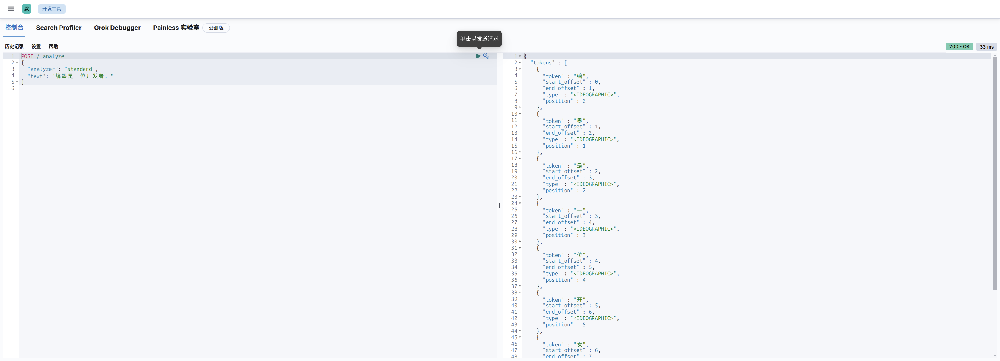

# Elasticsearch

## 1.Elasticsearch 的全面概述

`Elasticsearch` 是一个分布式、开源的搜索引擎，专门用于处理大规模的数据搜索和分析。它基于 `Apache Lucene` 构建，具有实时搜索、分布式计算和高可扩展性，广泛用于全文检索、日志分析、监控数据分析等场景，[可以阅读一下官方文档](https://www.elastic.co/docs)。

## 2.Elasticsearch 的基本功能

基本上我们使用一种叫作分词器的东西在控制面板上对 `Elasticsearch` 进行操作。

## 3.Elasticsearch 的使用教程

### 3.1.核心组件

#### 3.1.1.Elasticsearch

`Elasticsearch` 生态系统非常丰富，包含了一系列工具和功能，帮助用户处理、分析和可视化数据，`Elastic Stack(也称为 ELK Stack)` 是其核心组成部分，由几个部分组成。最核心的部分就是 `Elasticsearch`，是核心的搜索引擎，负责存储数据、索引数据、搜索数据。

#### 3.1.2.Kibana

可视化平台，用于查询、分析、展示 `Elasticsearch` 中的数据，是 `Elastic Stack` 的可视化组件，允许用户通过图表、地图和仪表盘来展示存储在 `Elasticsearch` 中的数据。它提供了简单的查询接口、数据分析和实时监控功能。

#### 3.1.3.Logstash

负责数据处理管道，负责数据收集、数据过滤、数据增强、数据传输到 `Elasticsearch`。是一个强大的数据收集管道工具，能够从多个来源收集、过滤、转换数据，然后将数据发送到 `Elasticsearch`，`Logstash` 支持丰富的输入插件、过滤插件、输出插件。


#### 3.1.4.Beats

轻量级的数据传输工具，收集和发送数据到 `Logstash` 或 `Elasticsearch`。作为轻量级的数据采集代理，负责从不同来源收集数据并发送到 `Elasticsearch` 或 `Logstash`。常见的 `Beats` 包括：

- `Filebeat`：收集日志文件
- `Metricbeat`：收集系统和服务的指标
- `Packetbeat`：监控网络流量


### 3.2.组件部署

我们采用 `Docker` 进行部署，由于我自己的项目用的 `Spring Boot 2.x` 版本，对应的 `Spring Data Elasticsearch` 客户端版本是 `4.x`，支持的 `Elasticsearch` 是 `7.x`，所以建议 `Elasticsearch` 使用 `7.x` 的版本。由于我这里使用的是 `Sping Boot 2.7.2.`，推荐 [部署 Elasticsearch 7.17](https://www.elastic.co/guide/en/elasticsearch/reference/7.17/setup.html)。我个人偏爱 `Docker`，基本上能使用 `Docker` 解决的部署问题我都会使用 `Docker`，因此我们需要先 `sudo docker pull docker.elastic.co/elasticsearch/elasticsearch:7.17.28`，然后编写配置文件 `docker-compose.yaml`，然后参考 [这个文档](https://www.elastic.co/guide/en/elasticsearch/reference/7.17/docker.html) 进行部署，我们部署个单机就足够了。

```yaml
  # 服务
  services:
  ## Elasticsearch
  work-elasticsearch:
    image: docker.elastic.co/elasticsearch/elasticsearch:7.17.28
    container_name: work-elasticsearch
    restart: always
    ports:
      - "9200:9200"
    environment:
      - discovery.type=single-node # 表示单机部署
      - xpack.security.enabled=true # 开启认证
      - ELASTIC_PASSWORD=Qwe54188_ # 提供密码进行认证
      - ES_JAVA_OPTS=-Xms4g -Xmx4g # 设置内存限制, 否则您的主机可能顶不住
    networks:
      - work-network
    mem_limit: 5g # entrypoint 执行的是容器启动时始终执行的主程序, 下面安装了一个插件
    entrypoint: >
      sh -c "
        if [ ! -d /usr/share/elasticsearch/plugins/analysis-ik ]; then
          echo 'Installing IK plugin...';
          elasticsearch-plugin install --batch https://release.infinilabs.com/analysis-ik/stable/elasticsearch-analysis-ik-7.17.28.zip;
        fi;
        exec docker-entrypoint.sh
      "
      
# 网络
networks:
  work-network:
    name: work-network

```

然后使用 `sudo docker-compose up -d work-elasticsearch` 即可快速启动，可使用 `curl -X GET "localhost:9200/?pretty"` 来进行测试。

```bash
$ curl -X GET "localhost:9200/?pretty"
{
  "name" : "9ffcfd197f5f",
  "cluster_name" : "docker-cluster",
  "cluster_uuid" : "4jdj3x2eRvqhZ0L3Eh-TBw",
  "version" : {
    "number" : "7.17.28",
    "build_flavor" : "default",
    "build_type" : "docker",
    "build_hash" : "139cb5a961d8de68b8e02c45cc47f5289a3623af",
    "build_date" : "2025-02-20T09:05:31.349013687Z",
    "build_snapshot" : false,
    "lucene_version" : "8.11.3",
    "minimum_wire_compatibility_version" : "6.8.0",
    "minimum_index_compatibility_version" : "6.0.0-beta1"
  },
  "tagline" : "You Know, for Search"
}

```

不过我们还需要另外一个重要的组件，就是 `Kibana` 可视化平台，可以 [根据部署文档进行部署](https://www.elastic.co/guide/en/kibana/7.17/install.html)，我依旧是 [采用 Docker 的部署方式](https://www.elastic.co/guide/en/kibana/7.17/docker.html)，首先需要拉取 `sudo docker pull docker.elastic.co/kibana/kibana:7.17.28`，然后还是给出 `docker-compose.yaml` 文件。

```yaml
  # 服务
  services:
  ## Elasticsearch
  work-elasticsearch:
    image: docker.elastic.co/elasticsearch/elasticsearch:7.17.28
    container_name: work-elasticsearch
    restart: always
    ports:
      - "9200:9200"
    environment:
      - discovery.type=single-node # 表示单机部署
      - xpack.security.enabled=true # 开启认证
      - ELASTIC_PASSWORD=Qwe54188_ # 提供密码进行认证
      - ES_JAVA_OPTS=-Xms4g -Xmx4g # 设置内存限制, 否则您的主机可能顶不住
    networks:
      - work-network
    mem_limit: 5g # entrypoint 执行的是容器启动时始终执行的主程序, 下面安装了一个插件
    entrypoint: >
      sh -c "
        if [ ! -d /usr/share/elasticsearch/plugins/analysis-ik ]; then
          echo 'Installing IK plugin...';
          elasticsearch-plugin install --batch https://release.infinilabs.com/analysis-ik/stable/elasticsearch-analysis-ik-7.17.28.zip;
        fi;
        exec docker-entrypoint.sh
      "
  
  ## Kibana
  work-kibana:
    image: docker.elastic.co/kibana/kibana:7.17.28
    container_name: work-kibana
    restart: always
    ports:
      - "5601:5601"
    environment:
      - ELASTICSEARCH_HOSTS=http://work-elasticsearch:9200 # 对接搜索引擎
      - ELASTICSEARCH_USERNAME=elastic # 提供用户进行认证
      - ELASTICSEARCH_PASSWORD=Qwe54188_ # 提供密码进行认证
    networks:
      - work-network

# 网络
networks:
  work-network:
    name: work-network
```

然后使用 `sudo docker-compose up -d work-kibana` 快速部署，最后访问 `http://127.0.0.1:5601` 即可得到控制台。


> [!IMPORTANT]
>
> 补充：您可以在容器内部的 `/usr/share/kibana/config/kibana.yml` 末尾添加 `i18n.locale: "zh-CN"` 即可实现汉化控制台。
>
> 

尝试利用 `Kibana` 的开发工具来操作 `Elasticsearch` 的数据，比如查询操作。


然后输入分词器配置。

```http
POST /_analyze
{
  "analyzer": "standard", 
  "text": "缡墨是一位开发者。"
}

```



可以看到对中文的分词是比较糟糕的，因为标准的分词器 `standard` 只支持英文，我们需要使用对中文进行优化的分词器，不过可惜的是以下默认安装的分词器都不支持中文：

- `standard`：标准分词器
- `simple`：简单分词器
- `whitespace`：按空格分词
- `stop`：带停用词的分词器
- `keyword`：不分词，将整个字段作为一个词条
- `pattern`：基于正则表达式的分词器
- `ngram` 和 `edge_ngram`：`n-gram` 分词器

我们需要安装 `IK` 中文分词器（`ES` 插件），其实只需要执行 `.\bin\elasticsearch-plugin.bat install https://release.infinilabs.com/analysis-ik/stable/elasticsearch-analysis-ik-7.17.23.zip` 就可以了，不过在 `Docker` 环境中该怎么做呢？很简单，在 `ES` 启动的时候运行这个指令即可，我们前面的配置文件已经做了这个事情，因此下面就可以直接使用了。`IK` 分词器插件为我们提供了两个分词器，`ik_smart` 和 `ik_max_word`：

- `ik_smart` 是智能分词，尽量选择最像一个词的拆分方式，比如“好学生”会被识别为一个词，适用于 **搜索分词**，即在查询时使用，保证性能的同时提供合理的分词精度。
- `ik_max_word` 尽可能地分词，可以包括组合词，比如“好学生”会被识别为 `3` 个词：好学生、好学、学生，适用于 **底层索引分词**，确保在建立索引时尽可能多地分词，提高查询时的匹配度和覆盖面。


效果还不错。

### 3.3.快速使用

#### 3.3.1.索引操作

分词器的语法我们可以慢慢来研究，不过有一个重要的问题，`ES` 需要读取 `MySQL` 中的数据才能进开始进行分词，而不是我们在控制台中执行。而 `MySQL` 中的数据是有可能变动的，因此我们就需要全量更新和增量更新。为了将 `MySQL` 题目表数据导入到 `ES` 中并实现分词搜索，需要为 `ES` 索引定义 `mapping`。`ES` 的 `mapping` 用于定义字段的类型、分词器及其索引方式，含义类似 `MySQL` 的数据表。

既然是类似数据库概念，那么就需要学习字段的类型，我们对项目中的用户数据进行一个索引 `mapping` 的制作，我们的主要目标是分词搜索用户的标识、帐号、简介、名字、昵称、地址。

| 字段类型       | 描述                                                     | 示例用途                     |
| -------------- | -------------------------------------------------------- | ---------------------------- |
| `text`         | 用于存储需要分词的字符串，适合全文搜索                   | 文章内容、评论               |
| `keyword`      | 用于存储不分词的字符串，适合精确匹配                     | ID、标签、电子邮件           |
| `long`         | 用于存储 64 位整数                                       | 年份、ID、计数器             |
| `integer`      | 用于存储 32 位整数                                       | 小范围整数                   |
| `short`        | 用于存储 16 位整数                                       | 较小的整数                   |
| `byte`         | 用于存储 8 位整数                                        | 非常小的整数                 |
| `double`       | 用于存储双精度浮动数值                                   | 浮动小数点数                 |
| `float`        | 用于存储单精度浮动数值                                   | 较小精度的浮动数值           |
| `boolean`      | 用于存储布尔值（`true` 或 `false`）                      | 状态开关、是否启用           |
| `date`         | 用于存储日期和时间，支持多种日期格式                     | 时间戳、日期字段             |
| `object`       | 用于存储嵌套的 JSON 对象，可以存储多个字段               | 地址、用户资料               |
| `nested`       | 用于存储数组中嵌套的对象，支持多级嵌套和嵌套查询         | 订单项、嵌套数据结构         |
| `range`        | 用于存储数值范围（如日期范围、数值范围等）               | 日期范围、数值范围           |
| `geo_point`    | 用于存储地理坐标（经度、纬度），支持空间查询             | 地理位置、距离查询           |
| `geo_shape`    | 用于存储更复杂的地理形状（如多边形、线条等）             | 多边形区域、复杂形状查询     |
| `ip`           | 用于存储 IP 地址，支持 IP 匹配查询                       | IP 地址、CIDR 匹配           |
| `binary`       | 用于存储二进制数据，适用于图像、音频等文件               | 图像文件、音频文件           |
| `token_count`  | 用于存储文本字段中的词项数量                             | 文本字段长度统计             |
| `version`      | 用于存储版本信息，常用于版本控制                         | 软件版本                     |
| `flattened`    | 用于存储多键值对，适合存储动态字段                       | 动态数据、变化的字段结构     |
| `wildcard`     | 用于支持模糊匹配（`*` 或 `?`）的字符串字段               | 模糊匹配查询                 |
| `scaled_float` | 用于存储以某个比例缩放的浮动数值，通常用于财务或计数数据 | 财务数据、精度缩放的计数数据 |

```json
PUT /work_user_centre
{
  "mappings": {
    "properties": {
      "account": {
        "type": "text",
        "analyzer": "ik_max_word",
        "search_analyzer": "ik_smart",
        "index": true
      },
      "wx_union": {
        "type": "keyword",
        "index": true
      },
      "mp_open": {
        "type": "keyword",
        "index": true
      },
      "email": {
        "type": "keyword",
        "index": true
      },
      "phone": {
        "type": "keyword",
        "index": true
      },
      "ident": {
        "type": "keyword",
        "index": true
      },
      "passwd": {
        "type": "keyword", 
        "index": false
      },
      "avatar": {
        "type": "keyword",
        "index": false
      },
      "tags": {
        "type": "keyword",
        "index": true
      },
      "nick": {
        "type": "text",
        "analyzer": "ik_max_word",
        "search_analyzer": "ik_smart",
        "index": true
      },
      "name": {
        "type": "text",
        "analyzer": "ik_max_word",
        "search_analyzer": "ik_smart",
        "index": true
      },
      "profile": {
        "type": "text",
        "analyzer": "ik_max_word",
        "search_analyzer": "ik_smart",
        "index": true
      },
      "birthday": {
        "type": "date",
        "format": "yyyy-MM-dd",
        "index": true
      },
      "country": {
        "type": "keyword",
        "index": true
      },
      "address": {
        "type": "text",
        "analyzer": "ik_max_word",
        "search_analyzer": "ik_smart",
        "index": true
      },
      "role": {
        "type": "integer",
        "index": true
      },
      "level": {
        "type": "integer",
        "index": true
      },
      "gender": {
        "type": "integer",
        "index": true
      },
      "deleted": {
        "type": "keyword",
        "index": true
      },
      "create_time": {
        "type": "date",
        "format": "yyyy-MM-dd HH:mm:ss"
      },
      "update_time": {
        "type": "date",
        "format": "yyyy-MM-dd HH:mm:ss"
      }
    }
  }
}

```

有几个事情需要说明一下：

- 在 `ES` 中，每个文档都有一个唯一的 `_id` 字段来标识文档，该字段用于文档的主键索引和唯一标识。通常，开发者并不需要显式定义 `id` 字段，因为 `ES` 会自动生成 `_id`，或者在插入数据时，您可以手动指定 `_id`。
-  `"analyzer": "ik_max_word"` 指定了这个字段使用的分词器（`analyzer`）是 `ik_max_word`，`ik_max_word` 是 `IK` 分词器的一种配置，适用于最大化分词的精度，将文本拆分为更多的词项。用于细粒度的分词，能够将句子拆分成更多的词汇，这对于搜索时的精确匹配有帮助。
- `"search_analyzer": "ik_smart"`：指定了一个不同的分词器 `ik_smart` 用于搜索时的分析。`ik_smart` 是另一种分词模式，它会使用较少的词汇进行分词，通常适用于短文本或者对搜索精度要求不那么高的场景。这个设置的目的是在搜索过程中使用 `ik_smart` 来减少分词数量，从而提高查询效率，同时避免不必要的复杂性。
- `"index": true` 是 `ES` 中的一个字段设置，它的作用是决定该字段是否需要被索引。默认情况下，字段是会被索引的，但在某些情况下，您可以显式地设置它为 `false`，来禁用该字段的索引功能。
- `deleted` 使用 `keyword` 类型，表示是否被删除。 因为 `keyword` 是为精确匹配设计的，适用于枚举值精确查询的场景，性能好且清晰。为什么不用 `boolean` 类型呢？因为 `MySQL` 数据库存储的是 `0` 和 `1`，写入 `ES` 时需要转换类型。
- `createTime、updateTime` 时间字段被定义为 `date` 类型，并指定了格式 `"yyyy-MM-dd HH:mm:ss"`。这样做的好处是 `ES` 可以基于这些字段进行时间范围查询、排序和聚合操作，如按时间过滤或统计某时间段的数据。
- 在 `ES` 中，所有的字段类型（包括 `keyword` 和 `text`）默认都支持数组。你可以直接插入一个包含多个值的数组，`ES` 会自动将其视为多个值的集合。在查询时，`ES` 会将数组中的每个值视为独立的 `keyword`，可以进行精确匹配，例如上面的 `tags` 字段。

> [!IMPORTANT]
>
> 补充：但是有一点要注意，推荐在创建索引时添加 `alias`（别名） ，因为它提供了灵活性和简化索引管理的能力。具体原因如下：
>
> - 零停机切换索引：在更新索引或重新索引数据时，你可以创建一个新索引并使用 `alias` 切换到新索引，而不需要修改客户端查询代码，避免停机或中断服务。
> - 简化查询：通过 `alias`，可以使用一个统一的名称进行查询，而不需要记住具体的索引名称（尤其当索引有版本号或时间戳时）。
> - 索引分组：`alias` 可以指向多个索引，方便对多个索引进行联合查询，例如用于跨时间段的日志查询或数据归档。

因此完整的创建映射的 `json` 结构如下，需要在刚刚的控制台中执行：

```json
PUT /user_v1
{
  "aliases": {
    "user": {}
  },
  "mappings": {
    "properties": {
      "account": {
        "type": "text",
        "analyzer": "ik_max_word",
        "search_analyzer": "ik_smart",
        "index": true
      },
      "wx_union": {
        "type": "keyword",
        "index": true
      },
      "mp_open": {
        "type": "keyword",
        "index": true
      },
      "email": {
        "type": "keyword",
        "index": true
      },
      "phone": {
        "type": "keyword",
        "index": true
      },
      "ident": {
        "type": "keyword",
        "index": true
      },
      "passwd": {
        "type": "keyword", 
        "index": false
      },
      "avatar": {
        "type": "keyword",
        "index": false
      },
      "tags": {
        "type": "keyword",
        "index": true
      },
      "nick": {
        "type": "text",
        "analyzer": "ik_max_word",
        "search_analyzer": "ik_smart",
        "index": true
      },
      "name": {
        "type": "text",
        "analyzer": "ik_max_word",
        "search_analyzer": "ik_smart",
        "index": true
      },
      "profile": {
        "type": "text",
        "analyzer": "ik_max_word",
        "search_analyzer": "ik_smart",
        "index": true
      },
      "birthday": {
        "type": "date",
        "format": "yyyy-MM-dd",
        "index": true
      },
      "country": {
        "type": "keyword",
        "index": true
      },
      "address": {
        "type": "text",
        "analyzer": "ik_max_word",
        "search_analyzer": "ik_smart",
        "index": true
      },
      "role": {
        "type": "integer",
        "index": true
      },
      "level": {
        "type": "integer",
        "index": true
      },
      "gender": {
        "type": "integer",
        "index": true
      },
      "deleted": {
        "type": "keyword",
        "index": true
      },
      "create_time": {
        "type": "date",
        "format": "yyyy-MM-dd HH:mm:ss"
      },
      "update_time": {
        "type": "date",
        "format": "yyyy-MM-dd HH:mm:ss"
      }
    }
  }
}
```

响应为：

```json
{
  "acknowledged" : true,
  "shards_acknowledged" : true,
  "index" : "user_v1"
}

```

#### 3.3.2.文档操作

`ES` 支持多种类型的客户端：

- **[HTTP API](https://www.elastic.co/guide/en/elasticsearch/reference/7.17/rest-apis.html)**：`ES` 提供了 `RESTful HTTP API`，用户可以通过直接发送 `HTTP` 请求来执行索引、搜索和管理集群的操作。
- **Kibana**：`Kibana` 是 `ES` 官方提供的可视化工具，用户可以通过 `Kibana` 控制台使用查询语法（如 `DSL、KQL`）来执行搜索、分析和数据可视化。
- **[Java REST Client](https://www.elastic.co/guide/en/elasticsearch/client/java-api-client/7.17/introduction.html)**：`ES` 官方提供的 `Java` 高级 `REST` 客户端库，用于 `Java` 程序中与 `Elasticsearch` 进行通信，支持索引、查询、集群管理等操作。
- **[Spring Data Elasticsearch](https://spring.io/projects/spring-data-elasticsearch)**：`Spring` 全家桶的一员，用于将 `Elasticsearch` 与 `Spring` 框架集成，通过简化的 `Repository` 方式进行索引、查询和数据管理操作。
- **Elasticsearch SQL CLI**：命令行工具，允许通过类 `SQL` 语法直接在命令行中查询 `Elasticsearch` 数据，适用于熟悉 `SQL` 的用户。

这里以 `Spring Boot` 为例子，使用

```xml
<!-- elasticsearch: https://www.elastic.co/docs/get-started/ -->
<dependency>
    <groupId>org.springframework.boot</groupId>
    <artifactId>spring-boot-starter-data-elasticsearch</artifactId>
</dependency>

```

再添加配置文件配置：

```yaml
spring:
  elasticsearch:
    uris: http://127.0.0.1:9200
    username: elastic
    password: Qwe54188_

```

使用 `Spring Data Elasticsearch` 提供的 `Bean` 即可操作 `Elasticsearch`，我们可以直接通过 `@Resource` 注解引入，注入后根据我们创建的索引插入文档，对 `ES` 文档进行一些操作。

```java
package cn.com.edtechhub.workusercentre;

import lombok.Data;
import lombok.extern.slf4j.Slf4j;
import org.elasticsearch.index.query.QueryBuilders;
import org.springframework.boot.CommandLineRunner;
import org.springframework.boot.SpringApplication;
import org.springframework.boot.autoconfigure.SpringBootApplication;
import org.springframework.data.annotation.Id;
import org.springframework.data.elasticsearch.annotations.Document;
import org.springframework.data.elasticsearch.annotations.Field;
import org.springframework.data.elasticsearch.annotations.FieldType;
import org.springframework.data.elasticsearch.core.ElasticsearchRestTemplate;
import org.springframework.data.elasticsearch.core.SearchHit;
import org.springframework.data.elasticsearch.core.SearchHits;
import org.springframework.data.elasticsearch.core.mapping.IndexCoordinates;
import org.springframework.data.elasticsearch.core.query.IndexQuery;
import org.springframework.data.elasticsearch.core.query.IndexQueryBuilder;
import org.springframework.data.elasticsearch.core.query.NativeSearchQueryBuilder;
import org.springframework.data.elasticsearch.core.query.Query;

import javax.annotation.Resource;
import java.util.List;
import java.util.stream.Collectors;

@SpringBootApplication
@Slf4j
public class Test implements CommandLineRunner {

    public static void main(String[] args) {
        SpringApplication.run(Test.class, args);
    }

    @Resource
    private ElasticsearchRestTemplate elasticsearchRestTemplate;

    @Override
    public void run(String... args) throws Exception {
        User user = new User();
        user.setId(1L); // 使用 Long 类型ID
        user.setAccount("testUser");
        user.setNick("limou3434");
        user.setName("缡墨");
        user.setProfile("我是一名测试用户");
        user.setAddress("广州白云区");
        user.setTags(1001);

        // 1. 创建文档
        addUser(user);

        // 2. 查询文档(根据 id)
        searchById(user.getId());

        // 3. 查询文档(根据 account)
        searchByAccount(user.getAccount());

        // 4. 更新文档
        updateUserProfile(user.getId());

        // 5. 删除文档
        // deleteUser(user.getId()); // 可以先别删除在 kibana 中查看一下
        /*
        可以使用下面 json 在 kibana 中查看
        GET /user_v1/_doc/1
         */
    }

    private User addUser(User user) {
        IndexQuery indexQuery = new IndexQueryBuilder()
                .withId(user.getId().toString()) // 显式转为String
                .withObject(user)
                .build();

        String documentId = elasticsearchRestTemplate.index(indexQuery, IndexCoordinates.of("user_v1"));
        log.info("新增文档成功, ID: {}", documentId);
        return user;
    }

    private void searchById(Long id) {
        // 关键修改点：使用Long类型查询
        User user = elasticsearchRestTemplate.get(id.toString(), User.class, IndexCoordinates.of("user_v1"));
        log.info("根据 id 查询结果: {}", user);
    }

    private void searchByAccount(String account) {
        Query query = new NativeSearchQueryBuilder()
                .withQuery(QueryBuilders.matchQuery("account", account))
                .build();

        SearchHits<User> searchHits = elasticsearchRestTemplate.search(query, User.class);
        List<User> users = searchHits.stream()
                .map(SearchHit::getContent)
                .collect(Collectors.toList());

        log.info("根据 account 查询到 {} 条结果: {}", users.size(), users);
    }

    private void updateUserProfile(Long id) {
        User user = elasticsearchRestTemplate.get(id.toString(), User.class, IndexCoordinates.of("user_v1"));
        if (user != null) {
            user.setProfile("更新后的用户简介 [" + System.currentTimeMillis() + "]");

            IndexQuery updateQuery = new IndexQueryBuilder()
                    .withId(user.getId().toString())
                    .withObject(user)
                    .build();

            String updatedId = elasticsearchRestTemplate.index(updateQuery, IndexCoordinates.of("user_v1"));
            log.info("更新文档成功, id: {}", updatedId);
            /*
            可以使用下面 json 在 kibana 中查看
            GET /user_v1/_search
            {
              "query": {
                "match_all": {}
              }
            }
             */
        } else {
            log.warn("未找到 id 为 {} 的文档", id);
        }
    }

    private void deleteUser(Long id) {
        String deletedId = elasticsearchRestTemplate.delete(id.toString(), IndexCoordinates.of("user_v1"));
        log.info("删除文档成功，ID: {}", deletedId);
    }
}

@Data
@Document(indexName = "user_v1") // 由于我们最主要的还是根据下面几个字段来查询, 所以其他字段我暂时不考虑
class User {

    @Id
    private Long id; // 标识

    @Field(type = FieldType.Text, analyzer = "ik_max_word", searchAnalyzer = "ik_smart")
    private String account; // 帐号

    @Field(type = FieldType.Keyword)
    private Integer tags; // 标签

    @Field(type = FieldType.Text, analyzer = "ik_max_word", searchAnalyzer = "ik_smart")
    private String nick; // 昵称

    @Field(type = FieldType.Text, analyzer = "ik_max_word", searchAnalyzer = "ik_smart")
    private String name; // 名字

    @Field(type = FieldType.Text, analyzer = "ik_max_word", searchAnalyzer = "ik_smart")
    private String profile; // 简介

    @Field(type = FieldType.Text, analyzer = "ik_max_word", searchAnalyzer = "ik_smart")
    private String address; // 地址

}

```

> [!IMPORTANT]
>
> 补充：建议 [好好阅读这篇文档](https://www.elastic.co/docs/solutions/search/get-started)。

可能您会发现这种开发模式有点眼熟，没错 `ElasticsearchRestTemplate` 就是有点类似基于 `JDBC` 的 `JdbcTemplate`，不过我们倚仗 `MyBatisPlus`，成功不用编写过多的代码，最终达到从 `entity->service->controller` 的模式，那么 `ES` 有没有办法书写 `Dao` 层呢？有的，官方支持 `Spring` 类型的项目这么做！类似 `MyBatisPlus` 的开发过程，您需要定义 `ES` 的索引实体类（最好内部含有和实体类相互转换的方法），并且继承 `ElasticsearchRepository` 得到操作接口 `UserEsMapper`，然后在 `service` 中您的接口，`serviceImpl` 中实现这些接口。

这种开发模式和我们以往的开发一模一样，在 `UserEsMapper` 中已经实现好了大部分可直接使用的 `CURD` 方法，我们可以先来编写一个接口用来查询用户，不过我们主要是为了分词查询，数据我们自己导入，所以实际上 `UserEsMapper` 在我们的服务中几乎对内提供全量导入和增量导入。而日常查询接口的编写中，我们依旧使用 `ElasticsearchRestTemplate` 来进行接口开发。

`ok` 基本的内容都有了，开始编写代码。

```bash
curl -u elastic:Qwe54188_ -X DELETE "http://localhost:9200/user_v1"

curl -u elastic:Qwe54188_ -X PUT "http://127.0.0.1:9200/user_v1" \
  -H 'Content-Type: application/json' \
  -d '{
    "aliases": {
      "user": {}
    },
    "mappings": {
      "properties": {
        "account": {
          "type": "text",
          "analyzer": "ik_max_word",
          "search_analyzer": "ik_smart",
          "index": true
        },
        "wx_union": {
          "type": "keyword",
          "index": true
        },
        "mp_open": {
          "type": "keyword",
          "index": true
        },
        "email": {
          "type": "keyword",
          "index": true
        },
        "phone": {
          "type": "keyword",
          "index": true
        },
        "ident": {
          "type": "keyword",
          "index": true
        },
        "passwd": {
          "type": "keyword",
          "index": false
        },
        "avatar": {
          "type": "keyword",
          "index": false
        },
        "tags": {
          "type": "keyword",
          "index": true
        },
        "nick": {
          "type": "text",
          "analyzer": "ik_max_word",
          "search_analyzer": "ik_smart",
          "index": true
        },
        "name": {
          "type": "text",
          "analyzer": "ik_max_word",
          "search_analyzer": "ik_smart",
          "index": true
        },
        "profile": {
          "type": "text",
          "analyzer": "ik_max_word",
          "search_analyzer": "ik_smart",
          "index": true
        },
        "birthday": {
          "type": "date",
          "format": "yyyy-MM-dd",
          "index": true
        },
        "country": {
          "type": "keyword",
          "index": true
        },
        "address": {
          "type": "text",
          "analyzer": "ik_max_word",
          "search_analyzer": "ik_smart",
          "index": true
        },
        "role": {
          "type": "integer",
          "index": true
        },
        "level": {
          "type": "integer",
          "index": true
        },
        "gender": {
          "type": "integer",
          "index": true
        },
        "deleted": {
          "type": "keyword",
          "index": true
        },
        "create_time": {
          "type": "date",
          "format": "yyyy-MM-dd HH:mm:ss"
          "index": true
        },
        "update_time": {
          "type": "date",
          "format": "yyyy-MM-dd HH:mm:ss"
          "index": true
        }
      }
    }
  }'

curl -u elastic:Qwe54188_ -X GET "http://127.0.0.1:9200/user_v1/_mapping?pretty"

```

```java
package cn.com.edtechhub.workusercentre.mapper;

import cn.com.edtechhub.workusercentre.model.entity.UserEs;
import org.springframework.data.elasticsearch.repository.ElasticsearchRepository;

/**
 * 用户映射(ES)
 *
 * @author <a href="https://github.com/limou3434">limou3434</a>
 */
public interface UserEsMapper extends ElasticsearchRepository<UserEs, Long> {

}

```

我们需要先来写全量更新的程序和增量更新的程序，不然 `MySQL` 没有导入数据到 `ES` 中的话，`ES` 无法进行分词。

```java
package cn.com.edtechhub.workusercentre.job.once;

import cn.com.edtechhub.workusercentre.mapper.UserEsMapper;
import cn.com.edtechhub.workusercentre.model.entity.User;
import cn.com.edtechhub.workusercentre.model.entity.UserEs;
import cn.hutool.core.collection.CollUtil;
import lombok.extern.slf4j.Slf4j;
import org.springframework.jdbc.core.BeanPropertyRowMapper;
import org.springframework.jdbc.core.JdbcTemplate;
import org.springframework.stereotype.Component;

import javax.annotation.PostConstruct;
import javax.annotation.Resource;
import java.util.List;
import java.util.stream.Collectors;

/**
 * 全量同步用户到 ES
 *
 * @author <a href="https://github.com/limou3434">limou3434</a>
 */
@Component // 注释这个则关闭全量同步
@Slf4j
public class FullSyncUserToEs {

    /**
     * 注入 userEsMapper
     */
    @Resource
    private UserEsMapper userEsMapper;

    /**
     * 注入 jdbcTemplate
     */
    @Resource
    private JdbcTemplate jdbcTemplate;

    /**
     * 执行内容
     */
    @PostConstruct // 在 Spring 容器初始化后时执行一次
    public void run() {
        // 全量获取题目, 数据量不大的情况下使用
        String sql = "SELECT * FROM user";
        List<User> userList = jdbcTemplate.query(sql, new BeanPropertyRowMapper<>(User.class)); // 使用原生 JDBC 绕过逻辑删除避免无法同部到 ES

        log.debug("asdkljuugasd {}", userList);

        if (CollUtil.isEmpty(userList)) {
            return;
        }

        // 转为 ES 实体类
        List<UserEs> userEsList = userList.stream()
                .map(UserEs::EntityToMapping)
                .collect(Collectors.toList());

        // 分页批量插入到 ES
        final int pageSize = 10;
        int total = userEsList.size();

        log.debug("FullSyncUserToEs start, total {}", total);

        for (int i = 0; i < total; i += pageSize) {
            // 注意同步的数据下标不能超过总数据量
            int end = Math.min(i + pageSize, total);
            log.debug("sync from {} to {}", i, end);
            userEsMapper.saveAll(userEsList.subList(i, end));
        }

        log.debug("FullSyncUserToEs end, total {}, is {}", total, userEsList);
    }

}

```

```cpp
package cn.com.edtechhub.workusercentre.job.cycle;

import cn.com.edtechhub.workusercentre.mapper.UserEsMapper;
import cn.com.edtechhub.workusercentre.model.entity.User;
import cn.com.edtechhub.workusercentre.model.entity.UserEs;
import lombok.extern.slf4j.Slf4j;
import org.springframework.jdbc.core.BeanPropertyRowMapper;
import org.springframework.jdbc.core.JdbcTemplate;
import org.springframework.scheduling.annotation.Scheduled;
import org.springframework.stereotype.Component;

import javax.annotation.Resource;
import java.sql.Timestamp;
import java.time.Instant;
import java.time.temporal.ChronoUnit;
import java.util.List;
import java.util.stream.Collectors;

/**
 * 增量同步用户到 ES(每分钟一次)
 *
 * @author <a href="https://github.com/limou3434">limou3434</a>
 */
// todo 取消注释开启任务
@Component // 注释这个则关闭增量同步
@Slf4j
public class IncSyncUserToEs {

    /**
     * 注入 userEsMapper
     */
    @Resource
    private UserEsMapper userEsMapper;

    /**
     * 注入 jdbcTemplate
     */
    @Resource
    private JdbcTemplate jdbcTemplate;

    /**
     * 执行内容
     */
    @Scheduled(fixedRate = 60 * 1000)
    public void run() {

        // 当前时间(UTC)
        Instant now = Instant.now();

        // 2 分钟前(UTC)
        Instant fiveMinutesAgo = now.minus(2, ChronoUnit.MINUTES);

        // 构建 SQL 语句
        String sql = "SELECT * FROM user WHERE update_time >= ?"; //直接用 update_time 比较，无需转换（timestamp 默认是 UTC）

        // 查询数据得到 2 分钟内被更新的数据(不过不包含直接被删除的记录)
        List<User> userList = jdbcTemplate.query(
                sql,
                new BeanPropertyRowMapper<>(User.class),
                Timestamp.from(fiveMinutesAgo)
        );

        // 转为 ES 实体类
        List<UserEs> userEsList = userList.stream()
                .map(UserEs::EntityToMapping)
                .collect(Collectors.toList());

        // 分页批量插入到 ES
        final int pageSize = 10;
        int total = userEsList.size();

        if (total == 0) {
            log.debug("IncSyncUserToEs no data...");
        }
        else {
            log.debug("IncSyncUserToEs start, total {}", total);

            for (int i = 0; i < total; i += pageSize) {
                // 注意同步的数据下标不能超过总数据量
                int end = Math.min(i + pageSize, total);
                log.debug("sync from {} to {}", i, end);
                userEsMapper.saveAll(userEsList.subList(i, end));
            }

            log.debug("IncSyncUserToEs end, total {}, is {}", total, userEsList);
        }
    }
}

```

 您可以使用下面的 `json` 进行查看是否全量更新。

```json
GET /user/_search
{
  "from": 0,
  "size": 30,
  "query": {
    "match_all": {}
  }
}
```

然后我们需要编写索引实体，对照我们之前使用 `MyBatisPlus` 生成的实体类来编写。

```java
package cn.com.edtechhub.workusercentre.model.entity;

import com.baomidou.mybatisplus.annotation.*;

import java.io.Serializable;
import java.util.Date;
import lombok.Data;

/**
 * 用户实体
 *
 * @author <a href="https://github.com/limou3434">limou3434</a>
 */
@TableName(value ="user")
@Data
public class User implements Serializable {
    /**
     * 本用户唯一标识(业务层需要考虑使用雪花算法用户标识的唯一性)
     */
    @TableId(type = IdType.ASSIGN_ID) // 手动添加雪花算法
    private Long id;

    /**
     * 账户号(业务层需要决定某一种或多种登录方式, 因此这里不限死为非空)
     */
    private String account;

    /**
     * 微信号
     */
    private String wxUnion;

    /**
     * 公众号
     */
    private String mpOpen;

    /**
     * 邮箱号
     */
    private String email;

    /**
     * 电话号
     */
    private String phone;

    /**
     * 身份证
     */
    private String ident;

    /**
     * 用户密码(业务层强制刚刚注册的用户重新设置密码, 交给用户时默认密码为 123456, 并且加盐密码)
     */
    private String passwd;

    /**
     * 用户头像(业务层需要考虑默认头像使用 cos 对象存储)
     */
    private String avatar;

    /**
     * 用户标签(业务层需要 json 数组格式存储用户标签数组)
     */
    private String tags;

    /**
     * 用户昵称
     */
    private String nick;

    /**
     * 用户名字
     */
    private String name;

    /**
     * 用户简介
     */
    private String profile;

    /**
     * 用户生日
     */
    private String birthday;

    /**
     * 用户国家
     */
    private String country;

    /**
     * 用户地址
     */
    private String address;

    /**
     * 用户角色(业务层需知 -1 为封号, 0 为用户, 1 为管理, ...)
     */
    private Integer role;

    /**
     * 用户等级(业务层需知 0 为 level0, 1 为 level1, 2 为 level2, 3 为 level3, ...)
     */
    private Integer level;

    /**
     * 用户性别(业务层需知 0 为未知, 1 为男性, 2 为女性)
     */
    private Integer gender;

    /**
     * 是否删除(0 为未删除, 1 为已删除)
     */
    @TableLogic
    private Integer deleted; // 手动修改为逻辑删除

    /**
     * 创建时间(受时区影响)
     */
    private Date createTime;

    /**
     * 更新时间(受时区影响)
     */
    private Date updateTime;

    @TableField(exist = false)
    private static final long serialVersionUID = 1L;

    @Override
    public boolean equals(Object that) {
        if (this == that) {
            return true;
        }
        if (that == null) {
            return false;
        }
        if (getClass() != that.getClass()) {
            return false;
        }
        User other = (User) that;
        return (this.getId() == null ? other.getId() == null : this.getId().equals(other.getId()))
            && (this.getAccount() == null ? other.getAccount() == null : this.getAccount().equals(other.getAccount()))
            && (this.getWxUnion() == null ? other.getWxUnion() == null : this.getWxUnion().equals(other.getWxUnion()))
            && (this.getMpOpen() == null ? other.getMpOpen() == null : this.getMpOpen().equals(other.getMpOpen()))
            && (this.getEmail() == null ? other.getEmail() == null : this.getEmail().equals(other.getEmail()))
            && (this.getPhone() == null ? other.getPhone() == null : this.getPhone().equals(other.getPhone()))
            && (this.getIdent() == null ? other.getIdent() == null : this.getIdent().equals(other.getIdent()))
            && (this.getPasswd() == null ? other.getPasswd() == null : this.getPasswd().equals(other.getPasswd()))
            && (this.getAvatar() == null ? other.getAvatar() == null : this.getAvatar().equals(other.getAvatar()))
            && (this.getTags() == null ? other.getTags() == null : this.getTags().equals(other.getTags()))
            && (this.getNick() == null ? other.getNick() == null : this.getNick().equals(other.getNick()))
            && (this.getName() == null ? other.getName() == null : this.getName().equals(other.getName()))
            && (this.getProfile() == null ? other.getProfile() == null : this.getProfile().equals(other.getProfile()))
            && (this.getBirthday() == null ? other.getBirthday() == null : this.getBirthday().equals(other.getBirthday()))
            && (this.getCountry() == null ? other.getCountry() == null : this.getCountry().equals(other.getCountry()))
            && (this.getAddress() == null ? other.getAddress() == null : this.getAddress().equals(other.getAddress()))
            && (this.getRole() == null ? other.getRole() == null : this.getRole().equals(other.getRole()))
            && (this.getLevel() == null ? other.getLevel() == null : this.getLevel().equals(other.getLevel()))
            && (this.getGender() == null ? other.getGender() == null : this.getGender().equals(other.getGender()))
            && (this.getDeleted() == null ? other.getDeleted() == null : this.getDeleted().equals(other.getDeleted()))
            && (this.getCreateTime() == null ? other.getCreateTime() == null : this.getCreateTime().equals(other.getCreateTime()))
            && (this.getUpdateTime() == null ? other.getUpdateTime() == null : this.getUpdateTime().equals(other.getUpdateTime()));
    }

    @Override
    public int hashCode() {
        final int prime = 31;
        int result = 1;
        result = prime * result + ((getId() == null) ? 0 : getId().hashCode());
        result = prime * result + ((getAccount() == null) ? 0 : getAccount().hashCode());
        result = prime * result + ((getWxUnion() == null) ? 0 : getWxUnion().hashCode());
        result = prime * result + ((getMpOpen() == null) ? 0 : getMpOpen().hashCode());
        result = prime * result + ((getEmail() == null) ? 0 : getEmail().hashCode());
        result = prime * result + ((getPhone() == null) ? 0 : getPhone().hashCode());
        result = prime * result + ((getIdent() == null) ? 0 : getIdent().hashCode());
        result = prime * result + ((getPasswd() == null) ? 0 : getPasswd().hashCode());
        result = prime * result + ((getAvatar() == null) ? 0 : getAvatar().hashCode());
        result = prime * result + ((getTags() == null) ? 0 : getTags().hashCode());
        result = prime * result + ((getNick() == null) ? 0 : getNick().hashCode());
        result = prime * result + ((getName() == null) ? 0 : getName().hashCode());
        result = prime * result + ((getProfile() == null) ? 0 : getProfile().hashCode());
        result = prime * result + ((getBirthday() == null) ? 0 : getBirthday().hashCode());
        result = prime * result + ((getCountry() == null) ? 0 : getCountry().hashCode());
        result = prime * result + ((getAddress() == null) ? 0 : getAddress().hashCode());
        result = prime * result + ((getRole() == null) ? 0 : getRole().hashCode());
        result = prime * result + ((getLevel() == null) ? 0 : getLevel().hashCode());
        result = prime * result + ((getGender() == null) ? 0 : getGender().hashCode());
        result = prime * result + ((getDeleted() == null) ? 0 : getDeleted().hashCode());
        result = prime * result + ((getCreateTime() == null) ? 0 : getCreateTime().hashCode());
        result = prime * result + ((getUpdateTime() == null) ? 0 : getUpdateTime().hashCode());
        return result;
    }

    @Override
    public String toString() {
        StringBuilder sb = new StringBuilder();
        sb.append(getClass().getSimpleName());
        sb.append(" [");
        sb.append("Hash = ").append(hashCode());
        sb.append(", id=").append(id);
        sb.append(", account=").append(account);
        sb.append(", wxUnion=").append(wxUnion);
        sb.append(", mpOpen=").append(mpOpen);
        sb.append(", email=").append(email);
        sb.append(", phone=").append(phone);
        sb.append(", ident=").append(ident);
        sb.append(", passwd=").append(passwd);
        sb.append(", avatar=").append(avatar);
        sb.append(", tags=").append(tags);
        sb.append(", nick=").append(nick);
        sb.append(", name=").append(name);
        sb.append(", profile=").append(profile);
        sb.append(", birthday=").append(birthday);
        sb.append(", country=").append(country);
        sb.append(", address=").append(address);
        sb.append(", role=").append(role);
        sb.append(", level=").append(level);
        sb.append(", gender=").append(gender);
        sb.append(", deleted=").append(deleted);
        sb.append(", createTime=").append(createTime);
        sb.append(", updateTime=").append(updateTime);
        sb.append(", serialVersionUID=").append(serialVersionUID);
        sb.append("]");
        return sb.toString();
    }
}

```

```java
package cn.com.edtechhub.workusercentre.model.entity;

import cn.hutool.core.collection.CollUtil;
import cn.hutool.json.JSONUtil;
import com.baomidou.mybatisplus.annotation.TableField;
import com.baomidou.mybatisplus.core.toolkit.StringUtils;
import lombok.Data;
import lombok.extern.slf4j.Slf4j;
import org.springframework.beans.BeanUtils;
import org.springframework.data.annotation.Id;
import org.springframework.data.elasticsearch.annotations.Document;
import org.springframework.data.elasticsearch.annotations.Field;
import org.springframework.data.elasticsearch.annotations.FieldType;

import java.io.Serializable;
import java.util.Date;
import java.util.List;


/**
 * 用户索引
 */
@Document(indexName = "user")
@Data
@Slf4j
public class UserEs implements Serializable {

    private static final String DATE_TIME_PATTERN = "yyyy-MM-dd HH:mm:ss";

    /**
     * 本用户唯一标识(业务层需要考虑使用雪花算法用户标识的唯一性)
     */
    @Id
    private Long id;

    /**
     * 账户号(业务层需要决定某一种或多种登录方式, 因此这里不限死为非空)
     */
    @Field(name = "account") // 显式指定 ES 字段名, 避免字段风格不一致
    private String account;

    /**
     * 微信号
     */
    @Field(name = "wx_union") // 显式指定 ES 字段名, 避免字段风格不一致
    private String wxUnion;

    /**
     * 公众号
     */
    @Field(name = "mp_open") // 显式指定 ES 字段名, 避免字段风格不一致
    private String mpOpen;

    /**
     * 邮箱号
     */
    @Field(name = "email") // 显式指定 ES 字段名, 避免字段风格不一致
    private String email;

    /**
     * 电话号
     */
    @Field(name = "phone") // 显式指定 ES 字段名, 避免字段风格不一致
    private String phone;

    /**
     * 身份证
     */
    @Field(name = "ident") // 显式指定 ES 字段名, 避免字段风格不一致
    private String ident;

    /**
     * 用户密码(业务层强制刚刚注册的用户重新设置密码, 交给用户时默认密码为 123456, 并且加盐密码)
     */
    @Field(name = "passwd") // 显式指定 ES 字段名, 避免字段风格不一致
    private String passwd;

    /**
     * 用户头像(业务层需要考虑默认头像使用 cos 对象存储)
     */
    @Field(name = "avatar") // 显式指定 ES 字段名, 避免字段风格不一致
    private String avatar;

    /**
     * 用户标签(业务层需要 json 数组格式存储用户标签数组)
     */
    @Field(name = "tags") // 显式指定 ES 字段名, 避免字段风格不一致
    private List<String> tags; // 修改以支持数组查询

    /**
     * 用户昵称
     */
    @Field(name = "nick") // 显式指定 ES 字段名, 避免字段风格不一致
    private String nick;

    /**
     * 用户名字
     */
    @Field(name = "name") // 显式指定 ES 字段名, 避免字段风格不一致
    private String name;

    /**
     * 用户简介
     */
    @Field(name = "profile") // 显式指定 ES 字段名, 避免字段风格不一致
    private String profile;

    /**
     * 用户生日
     */
    @Field(name = "birthday") // 显式指定 ES 字段名, 避免字段风格不一致
    private String birthday;

    /**
     * 用户国家
     */
    @Field(name = "country") // 显式指定 ES 字段名, 避免字段风格不一致
    private String country;

    /**
     * 用户地址
     */
    @Field(name = "address") // 显式指定 ES 字段名, 避免字段风格不一致
    private String address;

    /**
     * 用户角色(业务层需知 -1 为封号, 0 为用户, 1 为管理, ...)
     */
    @Field(name = "role") // 显式指定 ES 字段名, 避免字段风格不一致
    private Integer role;

    /**
     * 用户等级(业务层需知 0 为 level0, 1 为 level1, 2 为 level2, 3 为 level3, ...)
     */
    @Field(name = "level") // 显式指定 ES 字段名, 避免字段风格不一致
    private Integer level;

    /**
     * 用户性别(业务层需知 0 为未知, 1 为男性, 2 为女性)
     */
    @Field(name = "gender") // 显式指定 ES 字段名, 避免字段风格不一致
    private Integer gender;

    /**
     * 是否删除(0 为未删除, 1 为已删除)
     */
    @Field(name = "deleted") // 显式指定 ES 字段名, 避免字段风格不一致
    private Integer deleted; // 手动修改为逻辑删除

    /**
     * 创建时间(受时区影响)
     */
    @Field(name = "create_time", type = FieldType.Date, format = {}, pattern = DATE_TIME_PATTERN)
    // 显式指定 ES 字段名, 避免字段风格不一致
    private Date createTime;

    /**
     * 更新时间(受时区影响)
     */
    @Field(name = "update_time", type = FieldType.Date, format = {}, pattern = DATE_TIME_PATTERN)
    // 显式指定 ES 字段名, 避免字段风格不一致
    private Date updateTime;

    @TableField(exist = false)
    private static final long serialVersionUID = 1L;

    /**
     * 对象转包装类
     */
    public static UserEs EntityToMapping(User user) {
        // 拷贝字段
        if (user == null) {
            return null;
        }
        UserEs userEs = new UserEs();
        BeanUtils.copyProperties(user, userEs);

        // 处理数组字段, 避免纯粹的 JSON 字符无法兼容 ES
        String tags = user.getTags();
        if (StringUtils.isNotBlank(tags)) {
            userEs.setTags(JSONUtil.toList(tags, String.class)); // 快速把 json 数组字符转为数组
        }

        return userEs;
    }

    /**
     * 包装类转对象
     */
    public static User MappingToEntity(UserEs userEs) {
        if (userEs == null) {
            return null;
        }

        User user = new User();
        BeanUtils.copyProperties(userEs, user);

        // 处理数组字段, 避免纯粹的 JSON 字符无法兼容 ES
        List<String> tagList = userEs.getTags();
        if (CollUtil.isNotEmpty(tagList)) {
            user.setTags(JSONUtil.toJsonStr(tagList)); // 快速把数组转为 json 数组字符
        }

        return user;
    }

}

```

然后定义接口服务。

```java
public interface UserService extends IService<User> { 
   /**
     * 用户查询服务(ES)
     */
    List<User> userSearchEs(UserSearchRequest userSearchRequest);
}
```

```java
@Service
@Slf4j
public class UserServiceImpl extends ServiceImpl<UserMapper, User> implements UserService {
    private NativeSearchQuery getQueryWrapperEs(UserSearchRequest userSearchRequest) {
        // 获取参数
        Long id = userSearchRequest.getId();
        String account = userSearchRequest.getAccount();
        String tags = userSearchRequest.getTags();
        String nick = userSearchRequest.getNick();
        String name = userSearchRequest.getName();
        String profile = userSearchRequest.getProfile();
        String address = userSearchRequest.getAddress();
        int pageCurrent = userSearchRequest.getPageCurrent() - 1; // 这里需要减 1 以适配 ES 的分页
        int pageSize = userSearchRequest.getPageSize();
        String sortField = userSearchRequest.getSortField();
        String sortOrder = userSearchRequest.getSortOrder();

        List<String> tagsList = JSONUtil.toList(tags, String.class); // 一行代码转换

        // 构造查询条件
        BoolQueryBuilder boolQueryBuilder = QueryBuilders.boolQuery();

        // 过滤
        boolQueryBuilder.filter(QueryBuilders.termQuery("deleted", 0));
        if (id != null) {
            boolQueryBuilder.filter(QueryBuilders.termQuery("id", id));
        }

        // 查询
        if (StringUtils.isNotBlank(account)) {
            boolQueryBuilder.filter(QueryBuilders.matchQuery("account", account));
        }
        if (CollUtil.isNotEmpty(tagsList)) {
            for (String tag : tagsList) {
                boolQueryBuilder.filter(QueryBuilders.termQuery("tags", tag));
            }
        }
        if (StringUtils.isNotBlank(nick)) {
            boolQueryBuilder.filter(QueryBuilders.matchQuery("nick", nick));
        }
        if (StringUtils.isNotBlank(name)) {
            boolQueryBuilder.filter(QueryBuilders.matchQuery("name", name));
        }
        if (StringUtils.isNotBlank(profile)) {
            boolQueryBuilder.filter(QueryBuilders.matchQuery("profile", profile));
        }
        if (StringUtils.isNotBlank(address)) {
            boolQueryBuilder.filter(QueryBuilders.matchQuery("address", address));
        }

        // 分页
        PageRequest pageRequest = PageRequest.of(pageCurrent, pageSize);

        // 构造查询
        return new NativeSearchQueryBuilder()
                .withQuery(boolQueryBuilder)
                .withPageable(pageRequest)
                .build();
    }
}
```

最后就是控制层。

```java
@RestController // 返回值默认为 json 类型
@RequestMapping("/user")
@Slf4j
public class UserController {
    /**
     * 查询用户网络接口
     */
    @SaCheckLogin
    @SaCheckRole("admin")
    @PostMapping("/search/es")
    @SentinelResource(value = "userSearchEs")
    public BaseResponse<List<UserVO>> userSearchEs(@RequestBody UserSearchRequest userSearchRequest) {
        List<User> userList = userService.userSearchEs(userSearchRequest);
        List<UserVO> userVoList = userList.stream()
                .map(UserVO::removeSensitiveData)
                .collect(Collectors.toList());
        return TheResult.success(CodeBindMessage.SUCCESS, userVoList);
    }
}
```

待补充...
