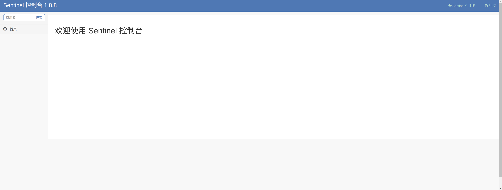
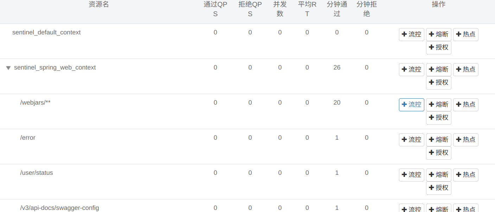
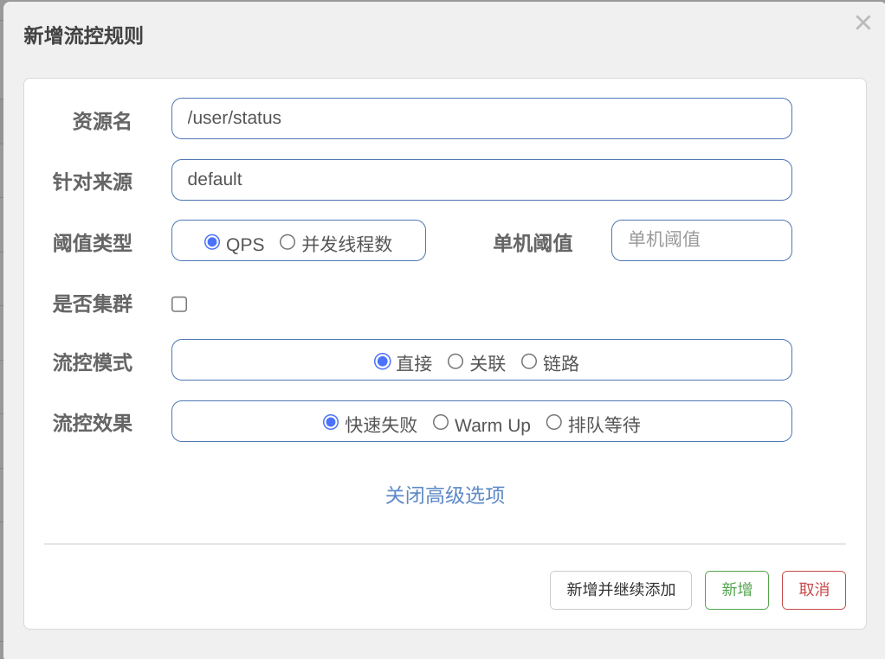

# Sentinel

## 1.Sentinel 的全面概述

随着微服务的流行，服务和服务之间的稳定性变得越来越重要。`Sentinel` 是面向分布式、多语言异构化服务架构的流量治理组件，主要以流量为切入点，从流量路由、流量控制、流量整形、熔断降级、系统自适应过载保护、热点流量防护等多个维度来帮助开发者保障微服务的稳定性。

- `2012` 年，`Sentinel` 诞生，主要功能为入口流量控制
- `2013-2017` 年，`Sentinel` 在阿里巴巴集团内部迅速发展，成为基础技术模块，覆盖了所有的核心场景。`Sentinel` 也因此积累了大量的流量归整场景以及生产实践
- `2018` 年，`Sentinel` 开源，并持续演进
- `2019` 年，`Sentinel` 朝着多语言扩展的方向不断探索，推出 `C++` 原生版本，同时针对 `Service Mesh` 场景也推出了 `Envoy` 集群流量控制支持，以解决 `Service Mesh` 架构下多语言限流的问题
- `2020` 年，推出 `Sentinel Go` 版本，继续朝着云原生方向演进
- `2021` 年，`Sentinel` 正在朝着 `2.0` 云原生高可用决策中心组件进行演进；同时推出了 `Sentinel Rust` 原生版本。同时我们也在 `Rust` 社区进行了 `Envoy WASM extension` 及 `eBPF extension` 等场景探索
- `2022` 年，`Sentinel` 品牌升级为流量治理，领域涵盖流量路由/调度、流量染色、流控降级、过载保护/实例摘除等；同时社区将流量治理相关标准抽出到 `OpenSergo` 标准中，`Sentinel` 作为流量治理标准实现

## 2.Sentinel 的基本功能

`Sentinel` 最为基本的功能，就是先使用 `Sentinel` 的代码来定义自己的项目中的某些东西为资源，再加以规则来作为限制。

- **资源**：是 `Sentinel` 的关键概念。它可以是 `Java` 应用程序中的任何内容，例如，由应用程序提供的服务，或由应用程序调用的其它应用提供的服务，甚至可以是一段代码。在接下来的文档中，我们都会用资源来描述代码块。只要通过 `Sentinel API` 定义的代码（在 `Java` 也可以使用注解），就是资源，能够被 `Sentinel` 保护起来。大部分情况下，可以使用方法签名，`URL`，甚至服务名称作为资源名来标示资源。
- **规则**：围绕资源的实时状态设定的规则，可以包括流量控制规则、熔断降级规则以及系统保护规则。所有规则可以动态实时调整。

而 `Sentinel` 也有一些自动识别的机制，例如自动识别某个项目中的所有网络接口，并且都定义为资源，然后再部署一个控制台，以这种类似切面的方式入侵到项目中，本文最主要学习这种模式，如果您希望使用清晰的代码来配置 `Sentinel`，可以 [详细查阅文档](https://sentinelguard.io/zh-cn/docs/introduction.html)。这里有个简单的代码可以说明 `Sentinel` 的接口调用过程，下面先来定义资源：

```java
// 通过代码定义资源
Entry entry = null;
// 务必保证finally会被执行
try {
  // 资源名可使用任意有业务语义的字符串
  entry = SphU.entry("自定义资源名");
  // 被保护的业务逻辑
  // do something...
} catch (BlockException e1) {  // BlockException 异常是一个父类异常
  // 资源访问阻止，被限流或被降级
  // 进行相应的处理操作
} finally {
  if (entry != null) {
    entry.exit();
  }
}
```

如果上述代码触发后续指定的某种规则，就会抛出对应的异常（这些异常都是 `BlockException` 的子类）：

- `FlowException` 流量控制异常
- `DegradeException` 熔断降级异常
- `ParamFlowException` 热点参数异常
- `SystemBlockException` 系统保护异常

我们只需要捕获不同种类的异常就可以判断出属于那一种规则保护，并且做出对应的动作。我们再来定义规则：

```java
private static void initFlowQpsRule() {
    List<FlowRule> rules = new ArrayList<>();
    FlowRule rule1 = new FlowRule();
    rule1.setResource(resource);
    // Set max qps to 20
    rule1.setCount(20);
    rule1.setGrade(RuleConstant.FLOW_GRADE_QPS);
    rule1.setLimitApp("default");
    rules.add(rule1);
    FlowRuleManager.loadRules(rules);
}

```

> [!IMPORTANT]
>
> 补充：还可以使用更加便捷的注解 `@SentinelResource` 来做到相同的事情。
>
> | 参数名               | 类型         | 必填 | 说明                                                         |
> | -------------------- | ------------ | ---- | ------------------------------------------------------------ |
> | `value`              | `String`     | 是   | 资源名称，唯一标识这个被保护的资源（比如接口名、方法名等）   |
> | `entryType`          | `EntryType`  | 否   | 资源的类型，默认是 `EntryType.OUT`，用于区分调用方向（出站/入站） |
> | `blockHandler`       | `String`     | 否   | 当触发限流/降级/系统保护（抛出 `BlockException`）时的处理方法名 |
> | `blockHandlerClass`  | `Class<?>[]` | 否   | 如果 `blockHandler` 在其它类中定义，则指定其类名。方法需为 `public static` |
> | `fallback`           | `String`     | 否   | 执行方法发生**业务异常**（非 BlockException）时的 fallback 方法名 |
> | `fallbackClass`      | `Class<?>[]` | 否   | 如果 `fallback` 在其他类中定义，指定其类名。方法需为 `public static` |
> | `defaultFallback`    | `String`     | 否   | 默认降级方法名，所有异常（除了忽略的）都会进入这里；只有 `fallback` 未配置时才会生效 |
> | `exceptionsToIgnore` | `Class<?>[]` | 否   | 指定不会触发 `fallback` 的异常类型，这些异常将原样抛出       |
>
> ```java
> // 通过注解定义资源
> public class TestService {
> 
>  // 对应的 `handleException` 函数需要位于 `ExceptionUtil` 类中，并且必须为 static 函数.
>  @SentinelResource(value = "test", blockHandler = "handleException", blockHandlerClass = {ExceptionUtil.class})
>  public void test() {
>      System.out.println("Test");
>  }
> 
>  // 原函数
>  @SentinelResource(value = "hello", blockHandler = "exceptionHandler", fallback = "helloFallback")
>  public String hello(long s) {
>      return String.format("Hello at %d", s);
>  }
> 
>  // Fallback 函数，函数签名与原函数一致或加一个 Throwable 类型的参数.
>  public String helloFallback(long s) {
>      return String.format("Halooooo %d", s);
>  }
> 
>  // Block 异常处理函数，参数最后多一个 BlockException，其余与原函数一致.
>  public String exceptionHandler(long s, BlockException ex) {
>      // Do some log here.
>      ex.printStackTrace();
>      return "Oops, error occurred at " + s;
>  }
> }
> 
> ```
>
> 为什么有了 `blockHandler` 还需要 `fallback` 呢？在项目中我们有些时候会使用全局异常处理器 `ExceptionHandler` 来处理业务异常，但是有些时候颗粒度不够，就可以考虑使用 `fallback` 来进行更加颗粒度的处理。
>
> 特别地，若 `blockHandler` 和 `fallback` 都进行了配置，则被限流降级而抛出 `BlockException` 时只会进入 `blockHandler` 处理逻辑。若未配置 `blockHandler`、`fallback` 和 `defaultFallback`，则被限流降级时会将 `BlockException` 直接抛出。
>
> 还有一点非常需要注意，`blockHandler` 和 `fallback` 参数对应的方法必须和原方法参数一一对应。不过 `blockHandler` 允许额外携带一个 `BlockException` 异常类型的参数，而 `fallback` 则允许额外携带一个 `Throwable` 异常类型的参数，具体可以 [查阅该注解的文档](https://sentinelguard.io/zh-cn/docs/annotation-support.html)。

## 3.Sentinel 的使用教程

### 3.1.控制面板

直接上代码把，依旧是使用我们的用户中心项目进行配置，我们先来配置一个控制台吧，不过 [官方提供的安装包默认的是 .jar](https://github.com/alibaba/Sentinel/releases)。直接使用 `java -Dserver.port=8131 -Dsentinel.dashboard.auth.username=sentinel -Dsentinel.dashboard.auth.password=Qwe54188_ -Dserver.servlet.session.timeout=86400 -jar app.jar`，最后访问`http://127.0.0.1:8131` 且输入密码后即可得到控制台。



> [!CAUTION]
>
> 警告：不过我个人喜欢使用 `Docker`，我按照下面的镜像文件映射到本地端口，试图在容器内部署，但这种情况下客户端程序也必须是同一容器网络下的容器，否则 `Docker` 无法在默认的网络模式下直接访问宿主主机，那怕做了端口映射。因此这适合在测试环境和生产环境中使用...
>
> ```dockerfile
> # 基础镜像
> FROM openjdk:17-jdk-slim
> 
> # 编译代码
> COPY ./sentinel-dashboard-1.8.8.jar ./app.jar
> 
> # 运行端口
> EXPOSE 8131
> 
> # 启动命令
> CMD ["java", "-Dserver.port=8131", "-Dsentinel.dashboard.auth.username=sentinel", "-Dsentinel.dashboard.auth.password=Qwe54188_", "-Dserver.servlet.session.timeout=86400", "-jar", "app.jar"]
> 
> ```

后续我们不再使用代码来制定规则，而是使用控制台，不过值得注意的是，而当规则触发后，然后我们依旧采用注解 `@SentinelResource` 来定义触发后的调用。

### 3.2.流量控制


流量控制在网络传输中是一个常用的概念，它用于调整网络包的发送数据。然而，从系统稳定性角度考虑，在处理请求的速度上，也有非常多的讲究。任意时间到来的请求往往是随机不可控的，而系统的处理能力是有限的。我们需要根据系统的处理能力对流量进行控制。`Sentinel` 作为一个调配器，可以根据需要把随机的请求调整成合适的形状。

但是流量控制需要控制什么东西呢？流量控制有以下几个角度:

- **资源的调用关系**，例如资源的调用链路，资源和资源之间的关系；
- **运行指标**，例如 `QPS`、线程池、系统负载等；
- **控制的效果**，例如直接限流、冷启动、排队等...

我们把所有的服务都视为是 `Sentinel 控制台` 的客户端，因此这些服务如果需要资源保护，就需要引入依赖。注意我们使用的是 `Spring Boot2.7.4`，您可以 [参考这篇文档](https://sentinelguard.io/zh-cn/docs/open-source-framework-integrations.html) 来查阅多种不同框架的适配。

```xml
<!-- Sentinel -->
<dependency>
    <!-- 这是核心依赖, 有这个就可以定义资源、设置规则、流量控制... -->
    <groupId>com.alibaba.csp</groupId>
    <artifactId>sentinel-core</artifactId>
    <version>1.8.6</version>
</dependency>
<dependency>
    <!-- 这是和控制台通信的依赖 -->
  <groupId>com.alibaba.csp</groupId>
  <artifactId>sentinel-transport-simple-http</artifactId>
  <version>1.8.6</version>
</dependency>
```

还需要做一个配置类，这个配置类可以把所有的请求接口都自动转化为资源进行限制。

```java
@Configuration
public class SentinelConfig {

    @Bean
    public FilterRegistrationBean sentinelFilterRegistration() {
        FilterRegistrationBean<Filter> registration = new FilterRegistrationBean<>();
        registration.setFilter(new CommonFilter());
        registration.addUrlPatterns("/*");
        registration.setName("sentinelFilter");
        registration.setOrder(1);

        return registration;
    }
}
```

然后启动客户端时，就需要在启动处加入 `-Dcsp.sentinel.dashboard.server=127.0.0.1:8131` 告知控制台的地址，如果您有多个客户端，则可以使用 `-Dcsp.sentinel.api.port=xxx` 来指定客户端的端口号（毕竟多个客户端端口不能冲突嘛，默认值是 `8719`）。这样就可以把所有的网络接口都识别到，然后只对网络接口进行资源管理，同时可以使用控制台进行限流。



不过还有更加容易的依赖方法，就是使用下面这个依赖，下面这个依赖就可以直接使用。

```xml
<!-- Sentinel: https://sentinelguard.io/zh-cn/index.html -->
<dependency>
    <!-- 本依赖内部集成 Sentinel 的所有核心依赖, 包括上面的两个依赖 -->
    <groupId>com.alibaba.cloud</groupId>
    <artifactId>spring-cloud-starter-alibaba-sentinel</artifactId>
    <version>2021.0.5.0</version>
</dependency>
```

我们先来研究这里的“流控”按钮，并且打开高级选项。这里可以限制 `QPS, 每秒请求次数` 或者限制并发线程数来达到限制流量的目的，这挺容易理解的，可以尝试限制一下对 `/user/status` 进行限制，填写需要限制的 `QPS` 次数后，就可以在流控规则中看到该规则，然后我们在接口文档中不断访问这个接口。




可以看到有一段时间是不允许访问 `/user/status` 接口的，除此之外我们还需要做一个响应规则触发的异常处理方法，因此我们最好在接口处使用，这里的示例代码也来源自 `work-user-centre` 中，您可以前往一看。

```java
/**
 * 用户控制层
 *
 * @author <a href="https://github.com/limou3434">limou3434</a>
 */
@RestController // 返回值默认为 json 类型
@RequestMapping("/user")
public class UserController { // 通常控制层有服务层中的所有方法, 并且还有组合而成的方法, 如果组合的方法开始变得复杂就会封装到服务层内部
 
   /**
     * 流量控制异常处理方法
     */
    public static BaseResponse<?> blockExceptionHandle(BlockException ex) {
        // 流量控制异常
        if (ex instanceof FlowException) {
            return TheResult.error(CodeBindMessage.TOO_MANY_REQUESTS, "请求频繁，请稍后重试");
        }
        // 熔断降级异常
        else if (ex instanceof DegradeException) {
            return TheResult.error(CodeBindMessage.SERVICE_DEGRADED, "服务退化，请稍后重试");
        }
        // 热点参数异常
        else if (ex instanceof ParamFlowException) {       
            return TheResult.error(CodeBindMessage.PARAM_LIMIT, "请求繁忙，请稍后重试");
        }
        // 系统保护异常
        else {
            return TheResult.error(CodeBindMessage.SYSTEM_BUSY, "系统繁忙，请稍后重试");
        }
    }
   /**
     * 获取状态网络接口
     */
    @SaIgnore
    @SentinelResource(value = "userStatus", blockHandler = "blockExceptionHandle")
    @GetMapping("/status")
    public BaseResponse<UserStatus> userStatus() {
        UserStatus userStatus = userService.userStatus();
        return TheResult.success(CodeBindMessage.SUCCESS, userStatus);
    }
}

```

> [!CAUTION]
>
> 警告：这里只是恰好 `/user/status` 接口没有参数，所以注解的两个方法就只需要各自携带允许的参数即可。


能拓展的点有很多，例如在触发流量控制异常的时候对用户的 `IP` 进行查询，然后视情况来做封禁...

### 3.3.熔断降级


- **熔断**：除了流量控制以外，降低调用链路中的不稳定资源也是 `Sentinel` 的使命之一。由于调用关系的复杂性，如果调用链路中的某个资源出现了不稳定，最终会导致请求发生堆积。这个问题和 [Hystrix](https://github.com/Netflix/Hystrix/wiki#what-problem-does-hystrix-solve) 里面描述的问题是一样的。`Hystrix` 是一个库（这个库已经不再维护），它通过添加延迟容忍和容错逻辑来帮助您控制这些分布式服务之间的交互。`Hystrix` 通过隔离服务之间的访问点、阻止服务之间的级联故障以及提供回退选项来实现这一点，所有这些都可以提高系统的整体弹性。而 `Sentinel` 和 `Hystrix` 的原则是一致的：当调用链路中某个资源出现不稳定，例如，表现为 `timeout`，异常比例升高的时候，则对这个资源的调用进行限制，并让请求快速失败，避免影响到其它的资源，最终产生雪崩的效果。
- **降级**：说白了，比如在做缓存的 `Redis` 中的数据因为 `Redis` 节点宕机而无法访问时，熔断机制可以快速返回错误的响应而不是堆集请求最终导致雪崩。并且在熔断的基础上，可以尝试恢复熔断，一旦多次不成功或是异常时间过长，还可以做降级策略，比如不再使用 `Redis` 而是自动回退到 `MySQL` 中进行访问，并且向开发人员发送警告。

在限制的手段上，`Sentinel` 和 `Hystrix` 采取了完全不一样的方法。`Hystrix` 通过 [线程池](https://github.com/Netflix/Hystrix/wiki/How-it-Works#benefits-of-thread-pools) 的方式，来对资源进行隔离。这样做的好处是资源和资源之间做到了最彻底的隔离；缺点是除了增加了线程切换的成本，还需要预先给各个资源做线程池大小的分配。而 `Sentinel` 对这个问题采取了两种手段:

- **通过并发线程数进行限制**：和资源池隔离的方法不同，`Sentinel` 通过限制资源并发线程的数量，来减少不稳定资源对其它资源的影响。这样不但没有线程切换的损耗，也不需要您预先分配线程池的大小。当某个资源出现不稳定的情况下，例如响应时间变长，对资源的直接影响就是会造成线程数的逐步堆积。当线程数在特定资源上堆积到一定的数量之后，对该资源的新请求就会被拒绝。堆积的线程完成任务后才开始继续接收请求。
- **通过响应时间对资源进行降级**：除了对并发线程数进行控制以外，`Sentinel` 还可以通过响应时间来快速降级不稳定的资源。当依赖的资源出现响应时间过长后，所有对该资源的访问都会被直接拒绝，直到过了指定的时间窗口之后才重新恢复。

还是我们之前部署的控制台，只要设置好规则，然后在异常中做处理就可以了。控制台熔断规则中有一个 `RT` 就是响应时间，例如在调用一些查询量较大的调用时，有可能会因为 `Redis` 挂掉导致响应时间过长，这个时候一旦符合设置的 `RT` 上限值，就会触发异常 `DegradeException`，并且还可以设置熔断的时间以等待 `Redis` 恢复，同时在恢复会进行试触，会检查接口是否不再抛出异常，否则就继续进入熔断状态。不过降级需要我们自己来实现，如何实现呢？这个时候就不能只使用一个 `blockExceptionHandle`，需要对特定的方法自己填充 `blockHandler` 参数并且自己捕获熔断异常进而调用降级的服务。

降级这部分我就不演示了，我让这个熔断异常被抛出就足以说明问题。对于 `RT` 来说，我们可以在接口中使用 `Thread.sleep(100); // 模拟 100 毫秒的延迟响应时间` 来模拟，而异常比例就可以抛出 `if (true) {  throw new RuntimeException("模拟异常");  }` 来进行模拟。然后统计时长要稍微大于 `100ms`，这样才能统计到完整的调用结果查验是否有接口超出 `RT` 设置。


> [!CAUTION]
>
> 警告：异常的您可以自己试一试，或者干脆传错参数也是可以模拟的。但是需要注意的是，异常降级仅针对业务异常（比如请求参数错误、或者数据库操作失败等问题），对 `Sentinel` 限流降级本身的异常（`BlockException`）不生效。为了统计异常比例或异常数，如果写代码则需要通过 `Tracer.trace(ex)` 记录业务异常。但是我们使用的是 `@SentinelResource` 注解，会自动统计业务异常，无需手动调用。不过这种异常必须没有被处理过，或者处理过后继续被抛出才能被统计到。关于这个问题，

### 3.4.热点参数

不过有些情况下，直接使用流量控制或熔断降级会导致某个接口直接让所有人都不可用，这种范围还是太大了，我们需要颗粒度更小的方法。而热点参数则可以更居接口的参数，例如某件商品的 `ID` 值 `1000` 被传递过来，一旦触发热点参数规则，对该值就会进行限制，但是对 `ID` 为 `2000` 的商品就没有影响。

### 3.5.系统保护

`Sentinel` 同时提供 [系统维度的自适应保护能力](https://sentinelguard.io/zh-cn/docs/system-adaptive-protection.html)。防止系统雪崩，是系统防护中重要的一环。当系统负载较高的时候，如果还持续让请求进入，可能会导致系统崩溃，无法响应。在集群环境下，网络负载均衡会把本应这台机器承载的流量转发到其它的机器上去。

如果这个时候其它的机器也处在一个边缘状态的时候，这个增加的流量就会导致这台机器也崩溃，最后导致整个集群不可用。针对这个情况，`Sentinel` 提供了对应的保护机制，让系统的入口流量和系统的负载达到一个平衡，保证系统在能力范围之内处理最多的请求。

### 3.6.持久规则

规则推送分为 `3` 种模式，这 [在官方文档中有所介绍](https://sentinelguard.io/zh-cn/docs/dashboard.html)：

| 推送模式                                                     | 说明                                                         | 优点                         | 缺点                                                         |
| ------------------------------------------------------------ | ------------------------------------------------------------ | ---------------------------- | ------------------------------------------------------------ |
| [原始模式](https://github.com/alibaba/Sentinel/wiki/在生产环境中使用-Sentinel#原始模式) | API 将规则推送至客户端并直接更新到内存中，扩展写数据源（[`WritableDataSource`](https://github.com/alibaba/Sentinel/wiki/动态规则扩展)） | 简单，无任何依赖             | 不保证一致性；规则保存在内存中，重启即消失。严重不建议用于生产环境 |
| [Pull 模式](https://github.com/alibaba/Sentinel/wiki/在生产环境中使用-Sentinel#Pull模式) | 扩展写数据源（[`WritableDataSource`](https://github.com/alibaba/Sentinel/wiki/动态规则扩展)）， 客户端主动向某个规则管理中心定期轮询拉取规则，这个规则中心可以是 RDBMS、文件 等 | 简单，无任何依赖；规则持久化 | 不保证一致性；实时性不保证，拉取过于频繁也可能会有性能问题。 |
| **[Push 模式](https://github.com/alibaba/Sentinel/wiki/在生产环境中使用-Sentinel#Push模式)** | 扩展读数据源（[`ReadableDataSource`](https://github.com/alibaba/Sentinel/wiki/动态规则扩展)），规则中心统一推送，客户端通过注册监听器的方式时刻监听变化，比如使用 Nacos、Zookeeper 等配置中心。这种方式有更好的实时性和一致性保证。**生产环境下一般采用 push 模式的数据源。** | 规则持久化；一致性；快速     | 引入第三方依赖                                               |

不过我们先使用推送模式，后续我再来和您说如何持久化我们的规则。这里还有一个问题，我们如何让接口在流量控制的情况下，看到被限制的响应呢？
