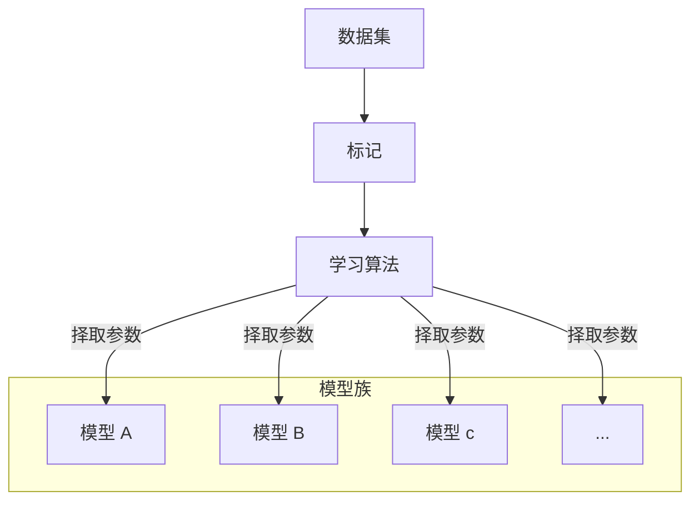
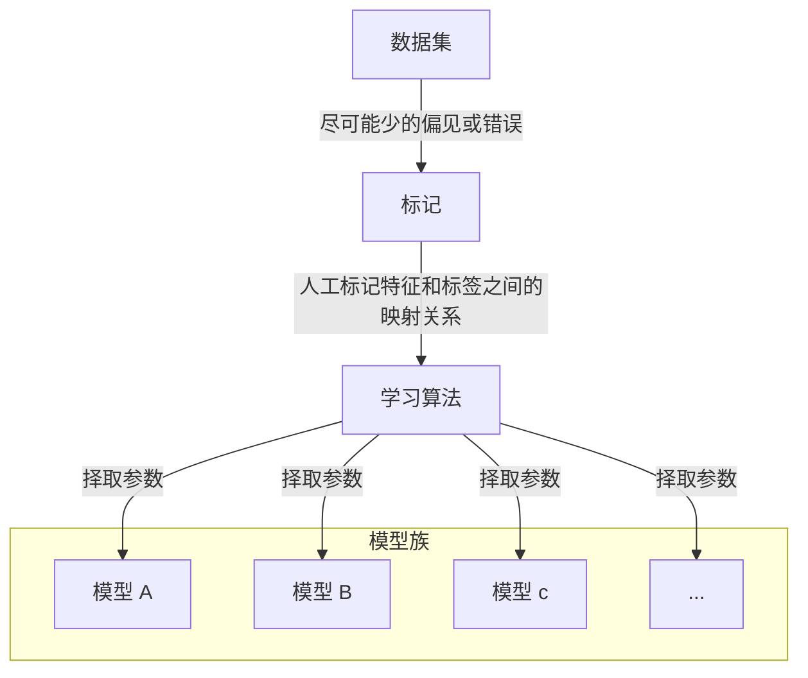
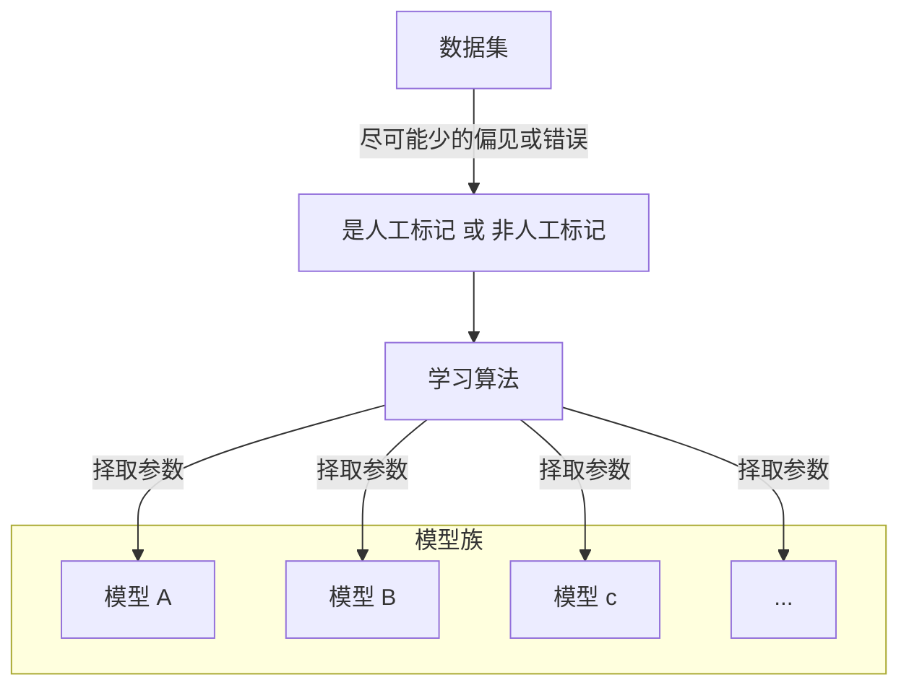
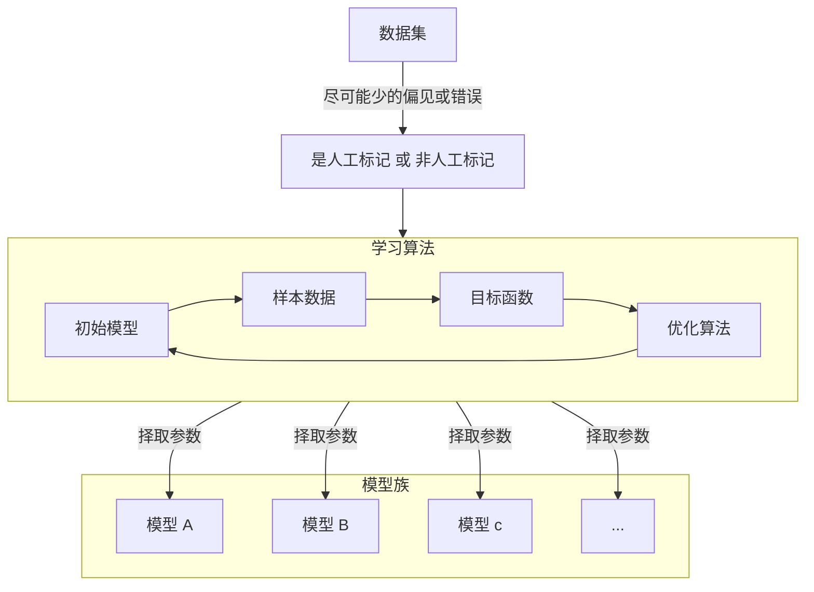
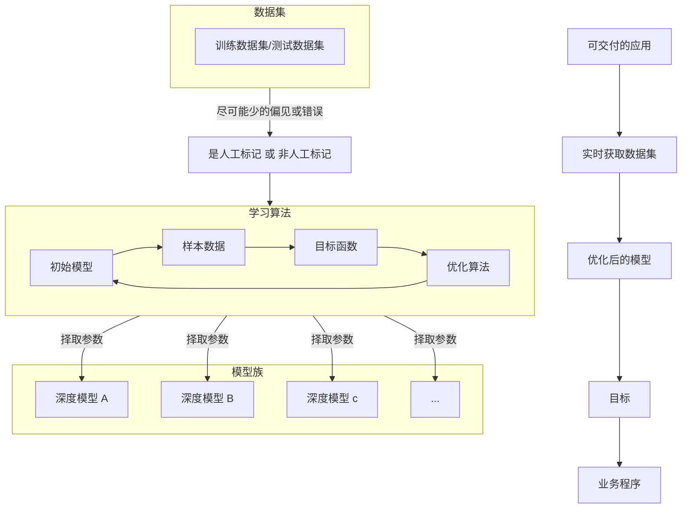

# 基础内容

## 1.机器学习分类

### 1.1.机器学习的流程

现在，假如需要我们编写程序来响应一个“唤醒词”（比如 “Alexa”、“Hey Siri”）。 我们试着用一台计算机和一个代码编辑器编写代码。问题看似很难解决：麦克风每秒钟将收集大约 `44000` 个样本，每个样本都是声波振幅的测量值。而该测量值与唤醒词难以直接关联。那又该如何编写程序，令其输入麦克风采集到的原始音频片段, 输出是否 `{是, 否}`（表示该片段是否包含唤醒词）的可靠预测呢？我们对编写这个程序毫无头绪，这就是需要机器学习的原因。

通常，即使我们不知道怎样明确地告诉计算机如何从输入映射到输出，大脑仍然能够自己执行认知功能。换句话说，即使我们不知道如何编写计算机程序来识别提示词，大脑自己也能够识别它。有了这一能力，我们就可以收集一个包含大量音频样本的 **数据集, dataset**，并对包含和不包含唤醒词的样本进行 **标记, annotate** 后。利用机器学习算法，我们不需要设计一个“明确地”识别唤醒词的系统。相反，我们只需要定义一个灵活的程序算法，其输出由许多 **参数, parameter** 决定，然后使用数据集来确定当下的“最佳参数集”，这些参数通过某种性能度量方式来达到完成任务的最佳性能。

那么到底什么是参数呢？参数可以被看作旋钮，旋钮的转动可以调整程序的行为。任一调整参数后的程序被称为 **模型, model**。通过操作参数而生成的所有不同程序（输入-输出映射）的集合称为 **模型族, family models**。使用数据集来选择参数的元程序被称为 **学习算法, learning algorithm**。



### 1.2.机器学习的细节

#### 1.2.1.数据集

可以看出来，优质的数据在这其中占据很大的地位。每个数据集由一个个 **样本, sample** 组成，大多时候，它们遵循 **独立同分布** 的原则。 样本有时也叫做 **数据点/数据实例**，通常每个样本由一组称为 **特征/协变量** 的属性组成。机器学习模型会根据这些属性进行预测，在上面的监督学习问题中，要预测的是一个特殊的属性，它被称为 **标签/目标**。

例如当处理图像数据时，每一张单独的照片即为一个样本，它的特征由每个像素数值的有序列表表示。 比如，`200×200` 彩色照片由 `200×200×3=120000` 个数值组成，其中的“3”对应于每个空间位置的红、绿、蓝通道的强度。再比如，对于一组医疗数据，给定一组标准的特征（如年龄、生命体征和诊断），此数据可以用来尝试预测患者是否会存活。而标签就是“猫、狗、鸟”等。

-   当每个样本的特征类别数量都是相同的时候，其特征向量是固定长度的，这个长度被称为数据的 **维数**。固定长度的特征向量是一个方便的属性，它可以用来量化学习大量样本。
-   然而，并不是所有的数据都可以用“固定长度”的向量表示。以图像数据为例，如果它们全部来自标准显微镜设备，那么“固定长度”是可取的；但是如果图像数据来自互联网，它们很难具有相同的分辨率或形状。这时，将图像裁剪成标准尺寸是一种方法，但这种办法很局限，有丢失信息的风险。此外，文本数据更不符合“固定长度”的要求。比如，对于亚马逊等电子商务网站上的客户评论，有些文本数据很简短（比如“好极了”），有些则长篇大论。与传统机器学习方法相比，深度学习的一个主要优势是可以处理不同长度的数据。

一般来说，拥有越多数据的时候，工作就越容易。更多的数据可以被用来训练出更强大的模型，从而减少对预先设想假设的依赖。不过仅仅拥有海量的数据是不够的，我们还需要正确的数据。如果数据中充满了错误甚至是偏见，那么模型很可能无效。



#### 1.2.2.标记

标记最主要的事情就是把原始的数据集特征到标签的一个映射，例如：

-   `image_001.jpg → "猫"`
-   `image_002.jpg → "狗"`

其实如果是我们自己标记的（无论是否人工）这个过程都叫做标记，标记的结果就是特征有了标签，而机器学习预测得到的最终结果就是模型，根据模型输入数据得到目标（个人习惯自己标记的叫标签，机器预测的叫目标，差不多是一个东西）。



#### 1.2.3.学习算法

最直接粗暴的学习算法就是使用随机函数，但这很粗暴并且很难得出一个我们需要的模型，因此一个学习算法内部通常包含以下内容：

1.   设定相关参数，初始参数得到初始模型（模型）
2.   获取数据样本（数据）
3.   调整参数尽量调优模型（优化算法）
4.   检查新得到的模型是否符合需要（目标函数）
5.   重复 `2、3、4` 的步骤



>   [!IMPORTANT]
>
>   补充：继续深入目标函数。机器学习这里所说的“学习”，是指自主提高模型完成某些任务的效能。但是，什么才算真正的提高呢？在机器学习中，我们需要定义模型的 **优劣程度的度量**，这个度量在大多数情况是“可优化”的，这被称之为目标函数。我们通常定义一个目标函数，并希望优化它到最低点。因为越低越好，所以这些函数有时被称为损失函数。但这只是一个惯例，我们也可以取一个新的函数，优化到它的最高点。这两个函数本质上是相同的，只是翻转一下符号。
>
>   当任务在试图预测数值时，最常见的损失函数是 **平方误差**，即预测值与实际值之差的平方。 当试图解决分类问题时，最常见的目标函数是 **最小化错误率**，即预测与实际情况不符的样本比例。有些目标函数（如平方误差）很容易被优化，有些目标（如错误率）由于不可微性或其他复杂性难以直接优化。在这些情况下，通常会优化 **替代目标**。
>
>   通常，损失函数是根据模型参数定义的，并取决于数据集。在一个数据集上，我们可以通过最小化总损失来学习模型参数的最佳值。 该数据集由一些为训练而收集的样本组成，称为 **训练数据集**。然而，在训练数据上表现良好的模型，并不一定在“新数据集”上有同样的性能，这里的“新数据集”通常称为 **测试数据集**。
>
>   因此，可用数据集通常可以分成两部分：
>
>   -   训练数据集用于拟合模型参数
>   -   测试数据集用于评估拟合模型
>
>   然后我们观察模型在这两部分数据集的性能。“一个模型在训练数据集上的性能”可以被想象成“一个学生在模拟考试中的分数”。这个分数用来为一些真正的期末考试做参考，即使成绩令人鼓舞，也不能保证期末考试成功。换言之，测试性能可能会显著偏离训练性能。当一个模型在训练集上表现良好，但不能推广到测试集时，这个模型被称为 **过拟合** 的。就像在现实生活中，尽管模拟考试考得很好，真正的考试不一定百发百中。

>   [!IMPORTANT]
>
>   补充：继续深入优化算法。当我们获得了一些数据源及其表示、一个模型和一个合适的损失函数，接下来就需要一种算法，它能够搜索出最佳参数，以最小化损失函数。深度学习中，大多流行的优化算法通常基于一种基本方法 —— **梯度下降**。 简而言之，在每个步骤中，梯度下降法都会检查每个参数，看看如果仅对该参数进行少量变动，训练集损失会朝哪个方向移动。然后，它在可以减少损失的方向上优化参数。

#### 1.2.4.模型

深度学习与经典方法的区别主要在于：前者关注的功能强大的模型，这些模型由神经网络错综复杂的交织在一起，包含层层数据转换，因此被称为深度学习。在讨论深度模型的过程中也将提及一些传统方法。

而我们最终得到的进一步细节就如下：



### 1.3.机器学习的方案

我们还需要探究一下机器学习自发展起来的各种方案：有监督学习、无监督学习、环境互动、强化学习。

#### 1.3.1.有监督学习

**监督学习** 擅长在“给定输入特征”的情况下预测标签。每个“特征-标签”对都称为一个样本。有时，即使标签是未知的，样本也可以指代输入特征。我们的目标是生成一个模型，能够将任何输入特征映射到标签（即预测）。

监督学习之所以能发挥作用，是因为在训练参数时，我们为模型提供了一个数据集，其中每个样本都有真实的标签。用概率论术语来说，我们希望预测“估计给定输入特征的标签”的条件概率。虽然监督学习只是几大类机器学习问题之一，但是在工业中，大部分机器学习的成功应用都使用了监督学习。这是因为在一定程度上，许多重要的任务可以清晰地描述为，在给定一组特定的可用数据的情况下，估计未知事物的概率。比如：根据计算机断层扫描肿瘤图像，预测是否为癌症；给出一个英语句子，预测正确的法语翻译；根据本月的财务报告数据，预测下个月股票的价格；

监督学习的学习过程一般可以分为三大步骤：

1.   从已知大量数据样本中随机选取一个子集，为每个样本获取真实标签
     1.   有时，这些样本已有标签（例如，患者是否在下一年内康复）
     2.   有时，这些样本可能需要被人工标记（例如，图像分类）
     3.   这些输入和相应的标签一起构成了训练数据集
2.   选择有监督的学习算法，它将训练数据集作为输入，并输出一个“已完成学习的模型”
3.   将之前没有见过的样本特征放到这个“已完成学习的模型”中，使用模型的输出作为相应标签的预测

综上所述，即使使用简单的描述给定输入特征的预测标签，监督学习也可以采取多种形式的模型，并且需要大量不同的建模决策，这取决于输入和输出的类型、大小和数量。例如，我们使用不同的模型来处理“任意长度的序列”或“固定长度的序列”。

而有监督学习主要有以下常见的任务：

| 任务 | 说明                                                         | 应用         |
| ---- | ------------------------------------------------------------ | ------------ |
| 回归 | 最简单的任务，根据 **特征-标签** 训练得到模型，以后新的属性进来就可以预测得到新的目标 | 未来的降雨量 |
| 分类 | 训练数据时有明确的标签，根据 **特征-标签** 训练得到模型，以后新的属性进来就可以根据 **已有** 的标签进行分类 | 识别手写汉字 |
| 标记 | 学习预测不相互排斥的类别，并且允许一个样本同时属于多个已有的标签 | 博文内容标签 |
| 搜索 | 根据搜索词、网页为特征，评分为标签，训练得到模型后，用户需要给出搜索词，而网页我们自己输入，一个一个输入到模型中得到最终评分，再根据评分排序 | 谷歌搜索引擎 |
| 推荐 | 用户不用搜索词，而是依靠用户画像和某些内容作为特征，评分为标签，训练得到模型后，根据输入的用户画像和内容得出评分，排序推荐给用户 | 电商货物推荐 |
| 序列 | 输入的样本之间具有时间依赖性关系或顺序关系，模型可能就需要拥有“记忆”功能来处理连续的样本（例如处理视频需要上下帧，而不再像图片一样图片和图片之间没有关联） | 监控重症病人 |

#### 1.3.2.无监督学习

到目前为止，所有的例子都与监督学习有关，即需要向模型提供巨大数据集：每个样本包含特征和相应标签值。打趣一下，“监督学习”模型像一个打工仔，有一份极其专业的工作和一位极其平庸的老板。老板站在身后，准确地告诉模型在每种情况下应该做什么，直到模型学会从情况到行动的映射。取悦这位老板很容易，只需尽快识别出模式并模仿他们的行为即可。

相反，如果工作没有十分具体的目标，就需要“自发”地去学习了。比如，老板可能会给我们一大堆数据，然后要求用它做一些数据科学研究，却没有对结果有要求。这类数据中不含有“目标”的机器学习问题通常被为 **无监督学习**。

由于无监督学习的特殊性，我暂时不展开对应的细节，因为我们无法理解某些细节，不过可以先提前预览下无监督学习主要任务：

| 任务                 | 说明                                                         | 应用         |
| -------------------- | ------------------------------------------------------------ | ------------ |
| 聚类                 | 训练数据时无明确的标签，根据 **特征** 来训练得到模型，以后新的属性进来就可以根据 **发现** 的标签进行分类 | 消费习惯划分 |
| 成分分析             | 能否找到少量的参数来准确地捕捉数据的线性相关属性？           |              |
| 因果关系和概率图模型 | 我们能否描述观察到的许多数据的根本原因？                     |              |
| 生成对抗网络         | 为我们提供一种合成数据的方法，甚至像图像和音频这样复杂的非结构化数据。潜在的统计机制是检查真实和虚假数据是否相同的测试，它是无监督学习的另一个重要而令人兴奋的领域。 |              |

#### 1.3.3.环境互动

有人一直心存疑虑：机器学习的输入（数据）来自哪里？机器学习的输出又将去往何方？ 到目前为止，不管是监督学习还是无监督学习，我们都会预先获取大量数据，然后启动模型，不再与环境交互。这里所有学习都是在算法与环境断开后进行的，被称为离线学习。

这种简单的离线学习有它的魅力。好的一面是，我们可以孤立地进行模式识别，而不必分心于其他问题。但缺点是，解决的问题相当有限。这时我们可能会期望人工智能不仅能够做出预测，而且能够与真实 **环境互动**。与预测不同，“与真实环境互动”实际上会影响环境。这里的人工智能是“智能代理”，而不仅是“预测模型”。因此，我们必须考虑到它的行为可能会影响未来的观察结果。

考虑“与真实环境互动”将打开一整套新的建模问题。以下只是几个例子。

-   环境还记得我们以前做过什么吗？
-   环境是否有助于我们建模？例如，用户将文本读入语音识别器。
-   环境是否想要打败模型？例如，一个对抗性的设置，如垃圾邮件过滤或玩游戏？
-   环境是否重要？
-   环境是否变化？例如，未来的数据是否总是与过去相似，还是随着时间的推移会发生变化？是自然变化还是响应我们的自动化工具而发生变化？

当训练数据和测试数据不同时，最后一个问题提出了分布偏移的问题。

#### 1.3.4.强化学习


如果你对使用机器学习开发与环境交互并采取行动感兴趣，那么最终可能会专注于 **强化学习**。这可能包括应用到机器人、对话系统，甚至开发视频游戏的人工智能。 深度强化学习将深度学习应用于强化学习的问题，是非常热门的研究领域。突破性的深度 `Q` 网络在雅达利游戏中仅使用视觉输入就击败了人类，以及 `AlphaGo` 程序在棋盘游戏围棋中击败了世界冠军，是两个突出强化学习的例子。

在强化学习问题中，“智能体”在一系列的时间步骤上与环境交互。在每个特定时间点，智能体从环境接收一些 `观察, observation`，并且必须选择一个 `动作, action`，然后通过某种机制（有时称为执行器）将其传输回环境，最后智能体从环境中获得 `奖励, reward`。此后新一轮循环开始，智能体接收后续观察，并选择后续操作，依此类推。请注意，强化学习的目标是产生一个好的 `策略, policy`。强化学习智能体选择的“动作”受策略控制，即一个从环境观察映射到行动的功能。

## 2.相关内容基础

### 2.1.数据操作

-   张量：$n$ 维数组
    -   在 `MXNet` 中为 `ndarray`
    -   在 `PyTorch` 和 `TensorFlow` 中为 `Tensor`（可知识 `GPU`）
    -   在 `Numpy` 中为 `ndarray`（仅支持 `CPU`）

```python
import torch

# 创建张量
x = torch.arange(12) # 创建一个行向量 x, 默认生成从 0 到 11 的 12 个数字存储在内部, 说白了就是一个一维数组
print("创建第一个张量", x) # 打印出张量的内容 tensor([ 0,  1,  2,  3,  4,  5,  6,  7,  8,  9, 10, 11])

# 查看张量
if x.size() == x.shape: # 实际上这里张量的大小就等价于张量的形状
    print("大小", x.size())
    print("形状", x.shape)

print("元素个数", x.numel()) # 可以输出 6, 也就是总共 6 个元素

# 转换张量
X = x.reshape(3, 4) # 也可以根据现有的张量进行转换
print("转化后的张量", X) # X = x.reshape(4, 4) # 这样做会报错

# 初始张量
print(torch.zeros((2, 3, 4)))
print(torch.ones((2, 3, 4)))
print(torch.randn(2, 3, 4))
print(
    torch.tensor(
        [
            [
                [-0.0135,  0.0665,  0.0912,  0.3212],
                [ 1.4653,  0.1843, -1.6995, -0.3036],
                [ 1.7646,  1.0450,  0.2457, -0.7732]
            ],
            [
                [-0.0135,  0.0665,  0.0912,  0.3212],
                [ 1.4653,  0.1843, -1.6995, -0.3036],
                [ 1.7646,  1.0450,  0.2457, -0.7732]
            ]
        ]
    )
)

# 运算张量
## 简单运算
x = torch.tensor([1.0, 2, 4, 8])
y = torch.tensor([2, 2, 2, 2])
print("加", x + y)
print("减", x - y)
print("乘", x * y)
print("除", x / y)
print("幂", x ** y)  # "**" 运算符是求幂运算

## 复杂运算
x = torch.tensor([0, 1, 2, 3], dtype=torch.float32)
print("e^x", torch.exp(x)) # 对每个元素都进行 e^x 的运算
print("log10(x)", torch.log(x))
print("√x", torch.sqrt(x))
print("sin(x)", torch.sin(x))
print("cos(x)", torch.cos(x))
print("tan(x)", torch.tan(x))
print("abs(x)", torch.abs(x))
print("所有元素求和", x.sum())

x = torch.tensor(
    [
        [ 0.,  1.,  2.,  3.],
        [ 4.,  5.,  6.,  7.],
        [ 8.,  9., 10., 11.]
    ]
)

y = torch.tensor(
    [
        [ 2.,  1.,  4.,  3.],
        [ 1.,  2.,  3.,  4.],
        [ 4.,  3.,  2.,  1.]
    ]
)

print("0 轴拼接", torch.cat((x, y), dim=0))
print("1 轴拼接", torch.cat((x, y), dim=1))

x = torch.tensor([[0, 1, 2, 3], 
                  [4, 5, 6, 7], 
                  [8, 9, 10, 11]])

y = torch.tensor([[2, 1, 4, 3], 
                  [1, 2, 3, 4], 
                  [4, 3, 2, 1]])

print("布尔张量", x == y)

## 广播机制
a = torch.arange(3).reshape((3, 1))
b = torch.arange(2).reshape((1, 2))
print("广播前", a)
print("广播前", b)
print("广播后", a+b) # a 复制己列, b 复制己行, 两者再按元素相加
# 0   + 0 1
# 1
# 2
# --------
# 0 0   0 1
# 1 1   0 1
# 2 2   0 1
# --------
# 0 1
# 1 2
# 2 3

## 索引切片
t = torch.tensor(
    [
        [10, 20, 30],
        [40, 50, 60],
        [70, 80, 90]
    ]
)

print("索引", t[0, 1]) # 访问处于第 0 轴、第 1 轴的元素
print("切片", t[0:2, 1:]) # 取前两行, 第二列及后面的所有列

# 张量内存
X = torch.tensor([1.0, 2, 4, 8])
Y = torch.tensor([2, 2, 2, 2])

before = id(Y)
Y = Y + X
print("耗费内存", id(Y) == before) # 这是因为这里的逻辑是先把加后的结果存储到某一处内存, 然后再让 Y 指向该内存, 这样很耗费内存

Z = torch.zeros_like(Y)
before = id(Z)
Z[:] = X + Y # 使用切片避免消耗
print("节省内存的方法", id(Z) == before)

before = id(X)
X += Y # 或者使用更加容易理解的 +=
print("另一种节省内存的方法", id(X) == before)

```

### 2.2.数据处理

一般而言，会考虑使用 `.csv` 文件来存储大量的文本数据，这些数据通常都是以字符的形式存储在文件中（比如我们后续需要存储的数据集）。因此就必须要求我们有对 `.csv` 文件的管理，并且还需要转化为我们之前说的张量才行。

```python
import os
import pandas as pd
import torch

# 写入数据
data_file = os.path.join('.', 'house_tiny.csv')
with open(data_file, 'w') as f:
    f.write('NumRooms,Alley,Price\n') # 列名
    f.write('NA,Pave,127500\n') # 每行表示一个数据样本
    f.write('2,NA,106000\n')
    f.write('4,NA,178100\n')
    f.write('NA,NA,140000\n')

# 读取数据
data = pd.read_csv(data_file)
print("读取所有", data)
print("读取部分", data.iloc[:, 0:2])
print("读取元素", data.iloc[0, 2])

# 处理缺失
inputs = data.iloc[:, 0:2]
# 填充数值型列：'NumRooms' 用均值填充
inputs["NumRooms"] = inputs["NumRooms"].fillna(inputs["NumRooms"].mean()) # 用非空值得平均值填充 NA
print("处理缺失 - 平均值填充\n", inputs)

# 使用 pd.get_dummies 将 'Alley' 列进行独热编码
inputs = pd.get_dummies(inputs, dummy_na=True) # 防止虚拟变量陷阱
print("处理缺失 - 二分法填充\n", inputs) # 默认情况缺失值会被忽略, 如果设置 dummy_na=True, 则会为所有缺失值创建额外的列, 标记该位置是否为缺失值

# 类型转换
print("转换张量", torch.tensor(inputs.to_numpy(dtype=float))) # 这里会自动把表转化为对应二维维度的张量

```

### 2.3.线性代数

#### 2.3.1.基础概念

-   $x$ 标量由只有一个元素的张量表示。如果用变量表示不确定的标量，一般用未知的符号 $x, y, z, ...$ 表示，在存储进计算机之前变量也不知道自己会接受到那些具体的标量，例如：`1`
-   $\textbf{x}$ 向量可以被视为标量组成的列表，也就是一维张量，例如：`[1, 2, 3]`
    -   向量具有元素
    -   向量具有维度
    -   向量具有形状
-   $\textbf{X}$ 矩阵可以被视为向量组成的列表，也就是二维张量，例如：`[[1, 2, 3], [3, 2, 1]]`
    -   矩阵具有元素
    -   矩阵具有维度
    -   矩阵具有形状
-   $\mathbb{X}$ 张量可以囊括上面标量、向量、矩阵的概念，我们已经用过很多次了，而且在代码中我们其实也是使用张量的概念来创建前面的概念，本笔记的数学表示将使用 $Latex$ 表示，而代码表示将使用 `code` 表示。

>   [!IMPORTANT]
>
>   补充：向量的维度其实就是向量的长度，但是对于张量来说维度更多是指轴数。

```python
import torch

x = torch.tensor(3.0)
y = torch.tensor(2.0)
z = torch.tensor([0, 1, 2, 3])
k = torch.tensor([0, 1, 2, 3]).reshape(2, 2)
print("标量 x", x)
print("标量 y", y)
print("向量 z\n", z)
print(
    "元素:", z[2], ",",
    "维度:", len(z), ",",
    "形状:", z.shape
)
print("矩阵 k\n", k)
print(
    "元素:", k[0][0], ",",
    "维度:", len(k), ",",
    "形状:", k.shape
)

```

#### 2.3.2.求和降维

张量的一些线性代数知识有点多，并且可能和编程无关，因此我决定拆分出来，不让您难受。对所有的张量都可以进行求和操作，例如：

-   标量 $\sum x = a$
-   向量 $\sum{\textbf{x}} = \sum_{i=0}^{d} a_{i}$
-   矩阵 $\sum{\textbf{X}} = \sum^{d}_{i = 0}\sum^{d}_{j=0} a_{i}a_{j}$

不过其实这里的求和是有讲究的，如果求和只是单纯把所有元素相加，那也太过于容易了。不过，这确实是一种默认情况，调用 `sum()` 函数时确实会把任意维度的张量从所有轴上坍缩为一个标量。但是其实也是可以指定张量沿某个轴进行降维。如果按照某个轴进行降维，那么该轴就会消失（不过对于程序员最好的理解方法就是，站在不同维度上视张量为一个数组，求和就是根据不同轴把所有元素都相加起来）。在代码中用户可以选择是否把轴给真正的消除，不消除则可以方便后续的拓展

```python
import torch

x = torch.arange(24).reshape(2, 3, 4)
print(x)

print(x.sum(dim=0, keepdims=True))
print(x.sum(dim=0))
print(x.sum(dim=1))
print(x.sum(dim=2))
print(x.sum() == x.sum(dim=[0, 1, 2]))

print(x.float().mean())
print(x.sum(dim=0) / x.shape[0]) # shape[0] 代表从形状中获取 0 轴上的元素个数, 这里就是 2, 整个公式意味着不仅仅需要降维, 还需要对降维后的元素进行平均值计算

```

#### 2.3.3.张量乘法

在 `PyTorch` 中，`+`, `-`, `*`, `/` 等操作符都执行逐元素的操作。如果两个张量的形状不同，`PyTorch` 会尝试通过广播机制自动调整形状，以便进行逐元素的运算，这我们之前在数据操作中就使用过了。但我们知道在线性代数中，还有向量、行列、矩阵的概念，张量对我们程序员而言就是一个可以存储数据的多维数组，可以利用其实例来表示线性代数中的概念。因此我们在实际使用中理清这些概念进行学习会更加容易理解一些，接下来让我们试试用张量表示线性代数中的某些概念后，再进行对应的操作。

##### 2.3.3.1.向量与向量

```python
import torch

a = torch.tensor([1, 2, 3])
b = torch.tensor([4, 5, 6])

# 计算点乘
dot_product = torch.dot(a, b)
print(f"点乘结果: {dot_product}")
# (1 2 3) · (4 5 6) = 1*4 + 2*5 + 3*6 = 32

# 计算叉乘
cross_product = torch.cross(a, b)
print(f"叉乘结果: {cross_product}")  
# (1 2 3) * (4 5 6) =
# i j k
# 1 2 3
# 4 5 6 =
# (2*6*i - 3*5*i, 3*4*j - 1*6*j, 1*5*k - 2*4*k)
# (-3, 6, -3)
# [-3, 6, -3]

```

##### 2.3.3.2.矩阵和向量

```python
import torch

A = torch.tensor([[1, 2, 3], [4, 5, 6]]) # shape (2, 3)
x = torch.tensor([7, 8, 9]) # shape (3,)

# 计算矩阵和向量的乘法(其实就是把矩阵单作多个向量来理解)
print(torch.mv(A, x))
# ┌         ┐
# | (1 2 3) | (7
# | (4 5 6) |  8 =
# └         ┘  9)
# ┌                   ┐
# | (1 2 3) · (7 8 9) |
# | (4 5 6) · (7 8 9) |  
# └                   ┘
# ┌                ┐
# | ( 7 + 16 + 27) |
# | (28 + 40 + 54) |
# └                ┘
# 输出 tensor([50, 122])

```

##### 2.3.3.3.矩阵和矩阵

```python
import torch

A = torch.tensor([[1, 2, 3], [4, 5, 6]]) # shape (2, 3)
B = torch.tensor([[7, 8], [9, 10], [11, 12]]) # shape (3, 2)

# 计算矩阵和矩阵的乘法(其实就是把矩阵单作多个向量来理解)
print(torch.matmul(A, B))
# ┌         ┐ ┌           ┐
# | (1 2 3) | |  (7   (8  |
# | (4 5 6) | |   9   10  |
# └         ┘ |  11)  12) |
#             └           ┘
# ┌                                    ┐
# | (1 2 3)·(7 9 11) (1 2 3)·(8 10 12) |
# | (4 5 6)·(7 9 11) (4 5 6)·(8 10 12) |
# └                                    ┘
# ┌                            ┐
# | 1*7+2*9+3*11 1*8+2*10+3*12 |
# | 4*7+5*9+6*11 4*8+5*10+6*12 |
# └                            ┘
# 输出 tensor([[ 58,  64],
#            [139, 154]])

```

#### 2.3.4.范数运算

范数表示一个张量有多大，这里考虑的大小概念不涉及维度。例如对于一个向量的范数，其实就是向量的长度。不过其实范数也一定是一个函数计算的过程，所以对于张量的范数可以表示为 $f(\mathbb{X})$，而范数需要满足：

-   非负性 $f(\mathbb{X}) \ge 0$
-   齐次性 $f(\alpha \mathbb{X}) = |\alpha| f(\mathbb{X})$
-   三角不等性 $f(\mathbb{X} + \mathbb{Y}) \le f(\mathbb{X}) + f(\mathbb{Y})$

值得注意的是，向量的长度仅仅是范数的一种，对于更高维度的张量可根据需求选取不同的范数。

```python
import torch

x = torch.tensor([[1.0, 2.0], [3.0, 4.0]])

# 计算 Frobenius 范数(L2 范数)
frobenius_norm = torch.norm(x)

# 计算 L1 范数(列和范数)
l1_norm = torch.norm(x, p=1)

# 计算 L∞ 范数(行和范数)
l_inf_norm = torch.norm(x, p=float('inf'))

print(f"Frobenius Norm (L2 Norm): {frobenius_norm}")
print(f"L1 Norm: {l1_norm}")
print(f"L∞ Norm: {l_inf_norm}")

```

### 2.4.微分问题

#### 2.4.1.极限

-   微分：拆解细节，研究变化
-   积分：汇总细节，研究总量


在 `2500` 年前，古希腊人把一个多边形分成三角形，并把它们的面积相加，才找到计算多边形面积的方法。为了求出曲线形状（比如圆）的面积，古希腊人在这样的形状上刻内接多边形。内接多边形的等长边越多，就越接近圆。这个过程也被称为逼近法。事实上，逼近法就是积分的起源。`2000` 多年后，微积分的另一支，微分被发明出来。在微分学最重要的应用是优化问题，即考虑如何把事情做到最好。

在深度学习中，我们“训练”模型，不断更新它们，使它们在看到越来越多的数据时变得越来越好。通常情况下，变得更好意味着最小化一个损失函数（衡量“模型有多糟糕”这个问题的分数）。

最终，我们真正关心的是生成一个模型，它能够在从未见过的数据上表现良好。但“训练”模型只能将模型与我们实际能看到的数据相拟合。因此，我们可以将拟合模型的任务分解为两个关键问题：

-   优化：用模型拟合观测数据的过程
-   泛化：数学原理和实践者的智慧，能够指导我们生成出有效性超出用于训练的数据集本身的模型

#### 2.4.2.导函数

##### 2.4.2.1.导数

极限可以应用在导数问题中。注意，求导数问题是求极限的过程，但是求极限不一定是导数问题。假设我们有一个函数 $f:\mathbb{R} \to \mathbb{R}$，其输入和输出都是标量。如果 $y=f(x)$ 的导函数存在，这个极限被定义为 $y' = f'(x) = \displaystyle \lim_{h \to 0} \frac{f(x + h) - f(x)}{h} = \frac{dy}{dx}$，这是数学表达式上的定义。从数学角度上来看，这个问题实际上就是探究一个函数在某个点处的斜率（当然这个函数是连续的一个及其普通的函数）。如果 $f'(a)$ 存在，那么表示 $f$ 在 $a$ 处是可微的，如果 $f$ 在一个区间内的每个数上都是可微的，则此函数在此区间中是可微的。如果仅仅是看导数的定义，会得出一个结论，导数就是用来逼近曲线切点的切线斜率的一个公式。

>   [!WARNING]
>
>   注意：以后的代码运行环境在 `jupyter notebook --ip=0.0.0.0 --port=8888 --no-browser` 中，请您提前安装好相关的依赖，并且运行后续的学习代码（之前的代码都可以在终端中直接运行）。

>   [!NOTE]
>
>   吐槽：就像刀子不够安全，但太好用了，那就教你怎么用，而不是把刀子丢了。使用微分表示 $\frac{dy}{dx}$ 一样，从理论上来说这种表示方式并不严谨，很多人容易误会这是分数，但其实不是！可是在运行过程中非常符合我们的直觉，就如同鬼魂一般的存在...

```python
import numpy as np
from matplotlib_inline import backend_inline
from d2l import torch as d2l

# 设置函数公式 f(x)
def f(x):
    return 3 * x ** 2 - 4 * x # 3x^2 - 4x

# 设置极限公式 f'(x)
def numerical_lim(f, x, h):
    return (f(x + h) - f(x)) / h

# 我们需要求 x=1 时 f(x) 的导数(斜率), 不过我们采取逐步逼近的形式
h = 0.1
for i in range(5):
    print(f'h={h:.5f}, numerical limit={numerical_lim(f, 1, h):.5f}')
    h *= 0.1
    
# 尝试绘制图片
#@save
def use_svg_display():
    """使用 svg 格式在 Jupyter 中显示绘图"""
    backend_inline.set_matplotlib_formats('svg')

#@save
def set_figsize(figsize=(3.5, 2.5)):
    """设置 matplotlib 的图表大小"""
    use_svg_display()
    d2l.plt.rcParams['figure.figsize'] = figsize
    
#@save
def set_axes(axes, xlabel, ylabel, xlim, ylim, xscale, yscale, legend): 
    """设置 matplotlib 的轴"""
    axes.set_xlabel(xlabel)
    axes.set_ylabel(ylabel)
    axes.set_xscale(xscale)
    axes.set_yscale(yscale)
    axes.set_xlim(xlim)
    axes.set_ylim(ylim)
    if legend:
        axes.legend(legend)
    axes.grid()
    
#@save
def plot(X, Y=None, xlabel=None, ylabel=None, legend=None, xlim=None,
         ylim=None, xscale='linear', yscale='linear',
         fmts=('-', 'm--', 'g-.', 'r:'), figsize=(3.5, 2.5), axes=None):
    """绘制数据点"""
    if legend is None:
        legend = []

    set_figsize(figsize)
    axes = axes if axes else d2l.plt.gca()

    # 如果 X 有一个轴, 输出 True
    def has_one_axis(X):
        return (hasattr(X, "ndim") and X.ndim == 1 or isinstance(X, list)
                and not hasattr(X[0], "__len__"))

    if has_one_axis(X):
        X = [X]
    if Y is None:
        X, Y = [[]] * len(X), X
    elif has_one_axis(Y):
        Y = [Y]
    if len(X) != len(Y):
        X = X * len(Y)
    axes.cla()
    for x, y, fmt in zip(X, Y, fmts):
        if len(x):
            axes.plot(x, y, fmt)
        else:
            axes.plot(y, fmt)
    set_axes(axes, xlabel, ylabel, xlim, ylim, xscale, yscale, legend)
    
x = np.arange(0, 3, 0.1)
plot(x, [f(x), 2 * x - 3], 'x', 'f(x)', legend=['f(x)', 'Tangent line (x=1)'])
```

##### 2.4.2.2.偏导数

我们不仔细探讨导数是如何求解出来的，高中那一套就够了.我们再结合大学很多人学习过的偏导数，实际上就是不只针对一个变量的函数进行求导，还考虑到多个变量。为了计算 $y = f(x_1, x_2, x_3, ...)$ 的导数/偏导数，我们可以把其他的变量都看作常数，而只针对某一个变量进行求偏导 $\displaystyle  y' = \lim_{h \to 0} \frac{f(x_1, \dots, x_i + h, \dots, x_n) - f(x_1, \dots, x_i, \dots, x_n)}{h} = \frac{\partial f}{\partial x_i}$。如果仅仅是看偏导的定义，会得出一个结论，偏导就是用来逼近曲面切点的切线斜率的一个公式（但是会假设其他变量不变的前提，另外其实不只是曲面，其他的多元函数也可以使用）。

```python
import numpy as np
import matplotlib.pyplot as plt
from mpl_toolkits.mplot3d import Axes3D
import logging

logging.getLogger('matplotlib.font_manager').disabled = True

# 定义多元函数
def f(x, y): # f(x, y) = 3x^2 + 2xy + y^2
    return 3 * x ** 2 + 2 * x * y + y ** 2

# 设置网格范围
x = np.linspace(-2, 2, 100) # 得到一维列表
y = np.linspace(-2, 2, 100) # 得到一维列表
X, Y = np.meshgrid(x, y) # X 是每一行都复制 x, Y 是每一列都复制 y
Z = f(X, Y) # 得到对应的 Z 列表

# 选择切点 (x0, y0, z0)
x0, y0 = 1, 2
z0 = f(x0, y0)

# 计算偏导数
def partial_x(f, x, y, h=1e-5):
    """计算关于 x 的偏导"""
    return (f(x + h, y) - f(x, y)) / h

def partial_y(f, x, y, h=1e-5):
    """计算关于 y 的偏导"""
    return (f(x, y + h) - f(x, y)) / h

df_dx = partial_x(f, x0, y0)
df_dy = partial_y(f, x0, y0)

# 尝试绘制图片
# 创建切平面（用一阶泰勒展开）
X_tangent, Y_tangent = np.meshgrid(np.linspace(x0-1, x0+1, 10),
                                   np.linspace(y0-1, y0+1, 10))
Z_tangent = z0 + df_dx * (X_tangent - x0) + df_dy * (Y_tangent - y0)

# 绘制图像
fig = plt.figure(figsize=(8, 6))
ax = fig.add_subplot(111, projection='3d')

# 原函数曲面
ax.plot_surface(X, Y, Z, cmap='viridis', alpha=0.7, edgecolor='none')

# 切平面
ax.plot_surface(X_tangent, Y_tangent, Z_tangent, color='red', alpha=0.5)

# 标记切点
ax.scatter(x0, y0, z0, color='black', s=50)
ax.text(x0, y0, z0 + 2, f"∂f/∂x={df_dx:.2f}, ∂f/∂y={df_dy:.2f}", color='black')

ax.set_xlabel('x')
ax.set_ylabel('y')
ax.set_zlabel('f(x, y)')
ax.set_title('table')
plt.tight_layout()
plt.show()

```

##### 2.4.2.3.方向导数

之前我们只考虑了 $x、y$ 轴的上的偏导数问题，问题是从曲面的不同方向观察角度上来看，或者说沿着 $z$ 轴向下切曲面可以得到不同的曲线，因此我们还可以根据不同的单位向量 $\vec{v} = (x, y)$ 来定义一个方向向量，并以这个方向移动 $h$ 个单位来获取偏导数，此时就得到了方向导数 $\displaystyle D_{\vec{v}} f(x_0, y_0) = \lim_{h \to 0} \frac{f(x_0 + ha, y_0 + hb) - f(x_0, y_0)}{h}$，为了降低您的理解难度我没有进行多维的拓展（强调这里的方向向量是单位向量，也就是长度为 $1$）。

##### 2.4.2.4.梯度向量

我们可以连结一个多元函数对其所有变量的偏导数，以得到该函数的梯度向量。具体而言，设函数 $f: R_n \to R$ 的输入是一个 $n$ 维向量 $x=[x_1,x_2,…,x_n]^⊤$，并且输出是一个标量（从张量的角度上来解释多元函数）。函数 $f(x)$ 相对于 $x$ 的梯度是一个包含 $n$ 个偏导数的向量 $∇_xf(x)=[\frac{∂f(x)}{∂x_1},\frac{∂f(x)}{∂x_2},...,\frac{∂f(x)}{∂x_n}]^⊤$。梯度的含义有些抽象，不过可以用一个例子来说明，在爬山的时候，如果你拥有描述山体高度变化的函数 $z = f(x, y)$，并且可以求出该函数的梯度向量，则根据求出的梯度向量再结合自己的坐标 $(x, y)$ 就可以知道往哪一个方向可以最快到达最高点。至于原理，待证明...

>   [!NOTE]
>
>   吐槽：所谓的 `n` 维向量只是指这个向量中包含元素的个数，虽然很奇怪，但是确实有这种叫法。

#### 2.4.2.链式法则

但是大多数情况下，我们遇到的函数都是高度嵌套的，幸运的是我们可以利用链式法则来简化这种运行，证明待补充...对于单变量的函数有 $\frac{dy}{dx} = \frac{dy}{du} \cdot \frac{du}{dx}$，已经可以看到使用“dy、dx”形式的简洁之处。而更加复杂的多元函数在 $x_i$ 上求偏导数（$y$ 有多个函数作为变量，每一个变量内部都具有 $n$ 个相同 $x_i$ 变量），则有 $\frac{\partial y}{\partial x_i} = \sum_{j} \frac{\partial y}{\partial u_j} \cdot \frac{\partial u_j}{\partial x_i}$。

#### 2.4.3.自动微分

深度学习框架通过自动计算导数，即可以使用自动微分来加快求导，避免出现计算错误。首先我们需要重新审视一下在深度学习中的函数，这些函数通常都是输入一个 $n$ 维向量 $x=[x_1,x_2,…,x_n]^⊤$，输出一个标量，并且我们由于做了转置所以其实我们用的向量已经被拓展为一个矩阵了。其实就是对多元函数从张量上的理解，不过是书写形式不同罢了。

例如原本的具有四个变量的函数 $y(x_1, x_2, x_3, x_4) = 2(x_1^2 + x_2^2 + x_3^2 + x_4^2) \iff y = 2 \textbf{x}^T \textbf{x}, 其中 \textbf{x} 为矩阵 [x_1, x_2, x_3, x_4]$，这样就方便我们在代码中进行张量的运算了。

```python
import torch

# 先给出一个张量实例, 也就是前面说的矩阵, 我们用了一个张量来表示矩阵
x = torch.arange(4.0, requires_grad=True) # requires_grad 为 True 代表跟踪 x 的计算
print(x) # tensor([0., 1., 2., 3.], requires_grad=True)

# 根据函数定义带入张量实例进行计算, 得到函数值, 到这里我们就完成了一次多元函数的计算, 这种使用张量矩阵表示函数的方式, 能够快速在代码中表示一个多元函数
y = 2 * torch.dot(x, x)
print(y) # tensor(28., grad_fn=<MulBackward0>)

y.backward() # 开始自动求导, 不加 requires_grad 则 PyTorch 默认你不关心这个张量的梯度, 就不帮你算导数
print(x.grad) # 获取求导后存储的值, 还没有求导直接 x.grad() 为空
print(4 * x) # 验证结果, 结果和 x.grad 相同, 都是 tensor([ 0.,  4.,  8., 12.])

```

第一次接触这种代码会感到奇怪，实际上在使用 `y.backward()` 的时候会从输出变量 `y` 开始，沿着构图回溯每一个设置了 `requires_grad=True` 变量，然后分别进行偏导计算（不过我们只设置了一个参数，因此就退化为求导），然后直接读取变量 `x` 中的属性就可以求得对应的偏导了，这里我提前告知您该函数的偏导为 $y' = 4 \textbf{x}$，我们可以在代码中验证一下结果。

### 2.5.概率理论


### 2.6.补充知识


## 3.神经网络类别