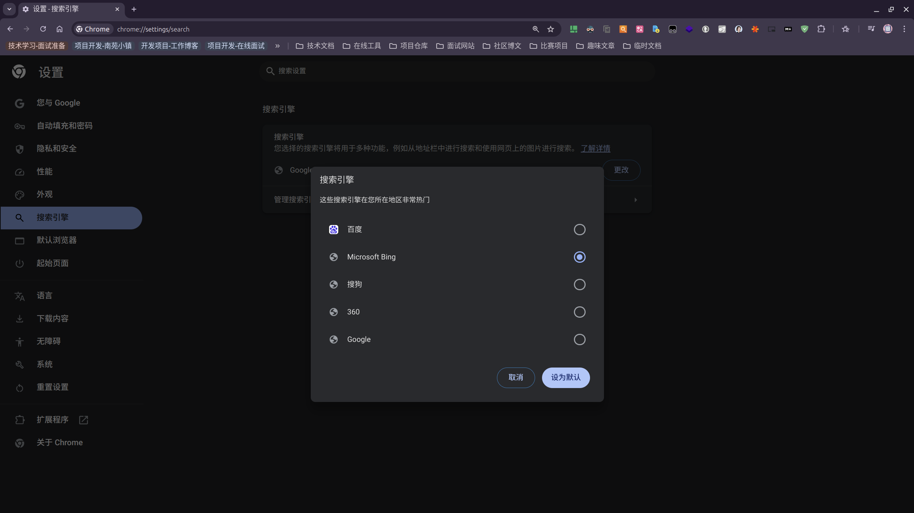
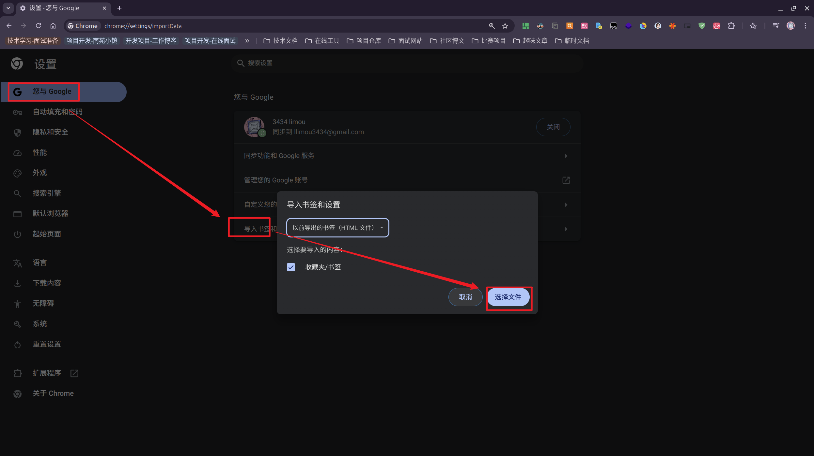
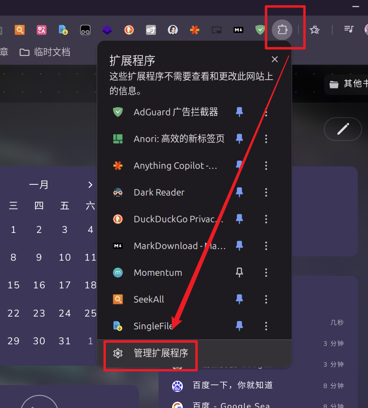
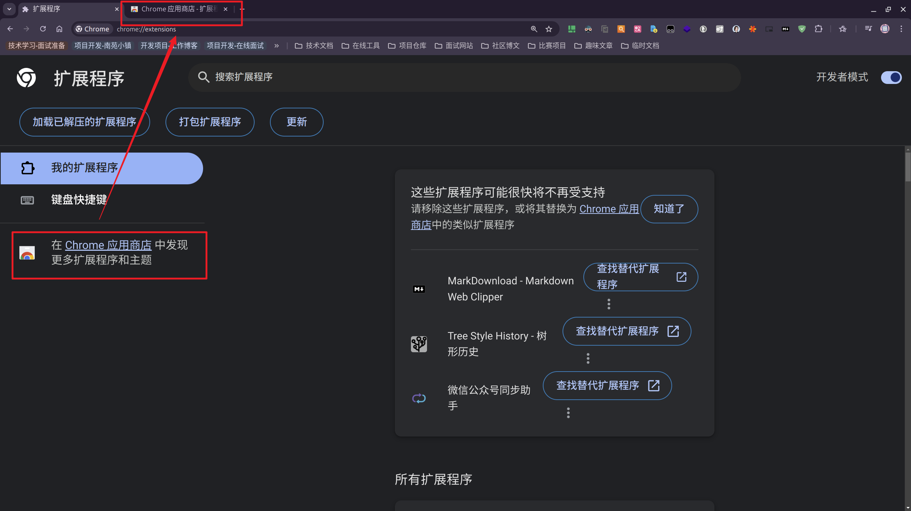
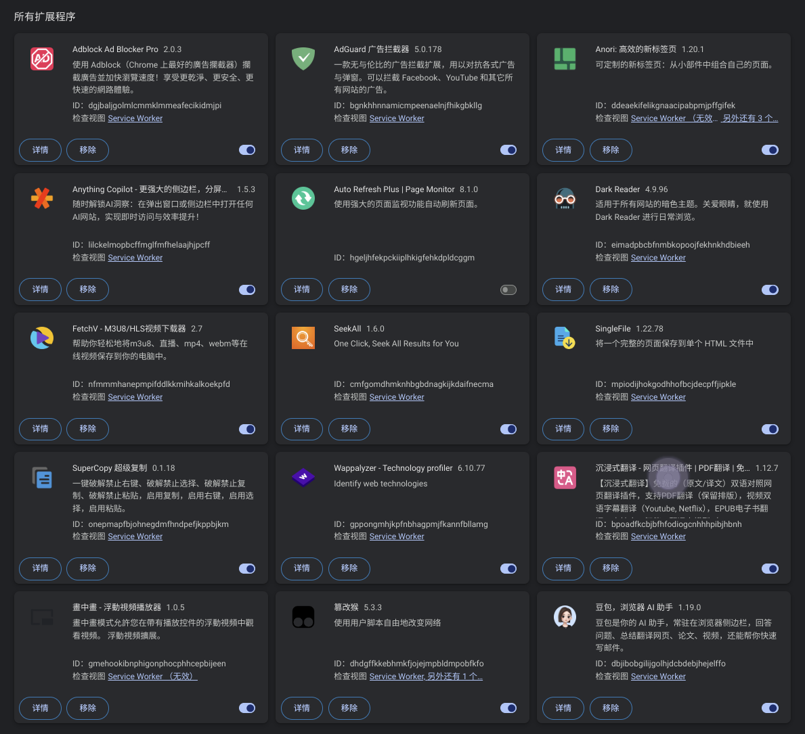
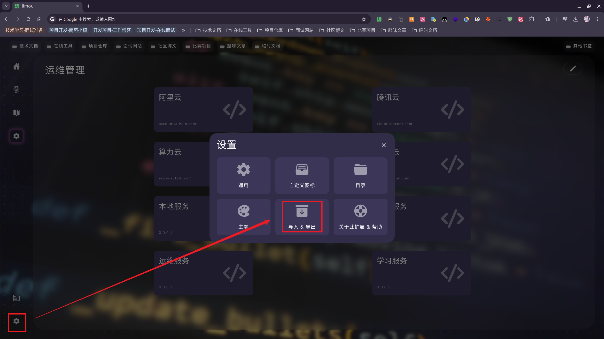
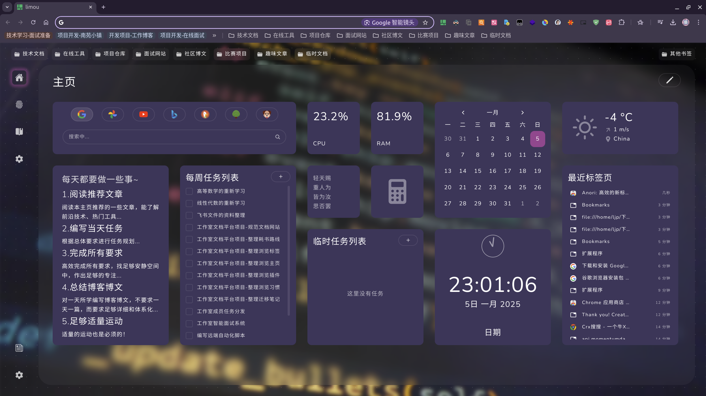
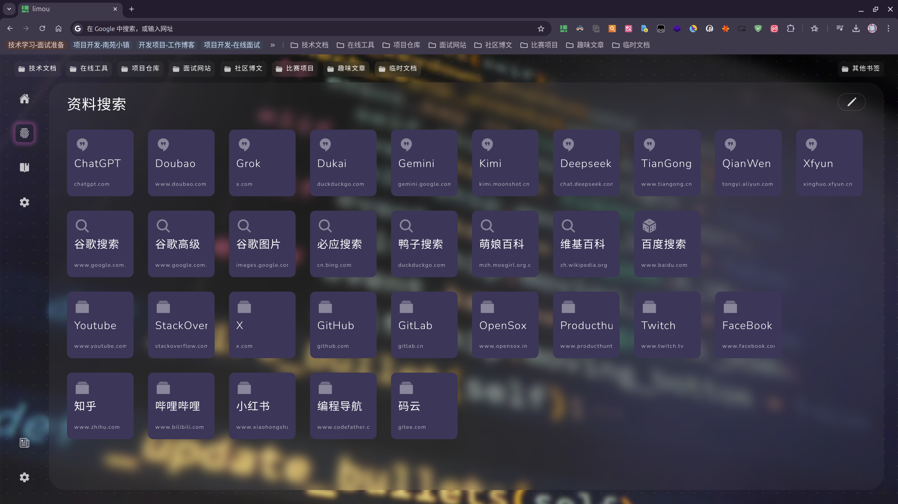
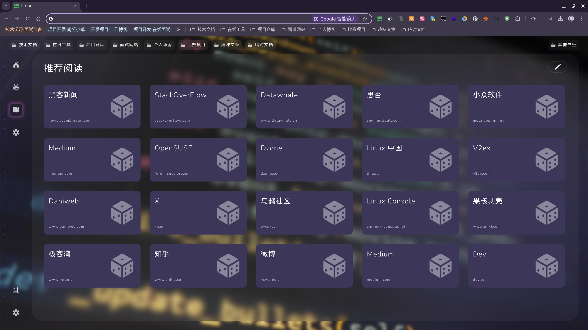

<!-- @include: basic.md#statement -->

# 学习路线

- 入门路线是针对从未接触过计算机技术的人开设的课程
- 进阶路线是针对已经接触过计算机技术的人开设的课程

## 1.入门路线

### 1.1.武装自己

作为一名技术人员，我们需要有一些品味，并且我们有很多先辈、前行者已经留下了大量的资料和工具，一个一个搜集是比较冗长的。本文将带您武装自己，带您探索许多有用的“装甲”，让我们更加专业！

#### 1.1.1.配置浏览器

浏览器是作为技术人员最需要掌握的软件，下面我就带领您武装好自己的谷歌浏览器。

> [!WARNING]
>
> 注意：请使用谷歌浏览器，这是综合能力最优良的浏览器。

##### 1.1.1.1.配置浏览器软件

前往 [谷歌官网下载谷歌浏览器安装包](https://support.google.com/chrome/answer/95346?hl=zh-Hans&co=GENIE.Platform%3DDesktop)。

##### 1.1.1.2.配置浏览器引擎

首先，抛弃 `360` 搜索引擎、百度搜索引擎这类被利益熏昏头脑的搜索引擎，请转用 [Bing 搜索引擎](https://cn.bing.com/)，修改搜索引擎过程如下。

> [!IMPORTANT]
>
> 补充：如果有条件下面的搜索引擎也值的您考虑：
>
> - [Google 搜索引擎](https://www.google.com.hk/)
> - [DockDockGo 搜索引擎](https://duckduckgo.com/)
>
> 另外，谷歌浏览器的默认搜索就是 `Google` 搜索引擎，如果没有特殊的魔法阵是无法正常使用的，因此一般推荐修改为 `Bing` 搜索引擎。

> [!NOTE]
>
> 吐槽：我个人使用百度搜索引擎只有一种情况，测试国内网络 `ping` 是否正常。

> [!CAUTION]
>
> 警告：再次强调，禁止使用百度搜索引擎，做一个环保的技术人员，接触高质量的网页。如果可以，请让您的移动设备也这么做。

##### 1.1.1.3.配置浏览器标签

在技术学习的过程中，有一些网页值的我们收藏，这里集成了一份标签配置，您可以自己导入进行使用，查阅我收藏的每一个网站有什么作用。您自己在学习过程中，也可以对我的分类进行自定义。

<a href="/config/browser_tab_config.html" download>点击这里下载标签配置文件</a>，然后根据下面操作导入标签页。

##### 1.1.1.4.配置浏览器拓展

在这里就可以下载到一些拓展程序，加强浏览器的功能。

> [!CAUTION]
>
> 警告：如果您没有处于魔法阵中，则可能无法打开拓展商店。因此就需要使用一些替代方案，例如使用 [Crx](https://www.crxsoso.com/) 进行替代，类似的方案有很多。

根据您喜好搜索拓展，点击安装后，查看拓展的使用说明即可享受强大拓展带来的效益，这里我推荐一些好用的拓展程序供您使用。

> [!WARNING]
>
> 注意：不过需要注意的是，拓展也不能安装太多，否则浏览器一启动后，过多的拓展程序有可能将内存占满。首先会浏览器发生卡顿，严重会使您电脑发生卡顿。

> [!CAUTION]
>
> 警告：某些不出名的拓展程序最好不要随意下载，这些拓展可能带有恶意病毒，可能会对您的计算机造成危害。

另外，这里面有一个非常出名的浏览器插件，也就是 **油猴插件**，能够修改某些网页的内容和行为，非常强大。这个插件的本质其实就是在浏览器渲染的网站主页中，插入一些 `JS` 代码以增强网站功能。

##### 1.1.1.5.配置浏览器主页

借助 [Anori](https://chromewebstore.google.com/detail/anori-%E9%AB%98%E6%95%88%E7%9A%84%E6%96%B0%E6%A0%87%E7%AD%BE%E9%A1%B5/ddeaekifelikgnaacipabpmjpffgifek) 拓展（安装该拓展时需要确认把 `Anori` 修改为默认主页），我们可以实现对主页的精美配置，这里我也给出 <a href="/config/anori_index_tab_config.zip" download>一份配置文件（点击这里下载）</a>，您可以直接导入或者执行配置。

把下载好的压缩包配置文件导入到设置中即可。

下面是我配置好的浏览器主页。

#### 1.1.2.配置计算机

##### 1.1.2.1.配置开发软件

我推荐的软件必须要满足以下要求：

- 足够现代
- 高效好用
- 可跨平台

这里只列出一些常见的软件，不教如何进行安装，请自行使用上面配置好的浏览器中的 `Bing` 进行搜索。

- 编程开发工具：[JetBrains 全家桶（主要下载：Clion、PyCharm、WebStorm、IDEA）](https://www.jetbrains.com/ides/#choose-your-ide)
- 文本编辑工具：[Tyopra（非常好用但要收费）](https://typora.io/)
- 工作办公工具：[WPS](https://www.wps.cn/)
- 远程桌面工具：[Todesk](https://www.todesk.com/)、[向日葵远程连接](https://sunlogin.oray.com/)

##### 1.1.2.2.配置常用软件

待补充...

##### 1.1.2.3.配置工具软件

待补充...

#### 1.1.3.配置服务器

如果您希望深入学习技术，一个专属于您的测试服务器是非常有必要的。

- 工作室为您提供了一个专属服务器（您无需向云服务器厂商购买服务器），内部已经进行了大量的基础配置，无需您手动进行配置。
- 服务器用户名默认就是您名字拼音中的首字母，并且都是小写，例如张三就是 `zs`，至于服务器密码是随机的，需要您向工作室服务器运维工程师进行请示才能获取。
- 默认情况下，这些服务器只能在工作室内网中进行访问，而无法在外网中直接访问，因此如果有必要在工作室外访问服务器，也需要向运维工程师进行请示。
- 一旦获取了自己的服务器，第一件事就是修改为自己熟悉的密码，也请避免被被人误用。

> [!CAUTION]
>
> 警告：该服务器属于工作室，仅供工作室成员内部进行测试和学习使用，禁止私自转交给非工作室成员进行使用！

### 1.2.开始学习

待补充...

### 1.3.技术影响

您需要提高您的技术影响力，因此要求您做到以下几个事情：

- [ ] 使用 `Git` 配合 `Gitee/GitHub` 提交每日的练习代码，生成壮观的小绿点
- [ ] 使用 `Markdown` 编写学习笔记，发布到一些博文网站平台中，例如 `CSDN/知乎/博客园/51CTO/微信公众号`（如果内容是工作室文档独有的，优先考虑发布到工作室文档中）

## 2.进阶路线

皓叔也叫“左耳朵耗子”，全名 **陈皓**，是值得尊敬的骨灰程序员，可惜天妒英才，在 2023 年 5 月去世。那天站长印象深刻，站长才购买他的专栏《程序员练级攻略》不久。

在没有任何人带领的情况下，站长的很多学习方向都是皓叔指导的，非常感谢他，因此站长全力支持了他的专栏和博客广告，只是没想到他的酷壳文章停滞在了 AI 浪潮刚刚兴起的时期，不然在那之后一定会有更多有趣的文章吧...

不过《程序员练级攻略》并不算太贵，尽管站长把这一系列的文章打印了出来，不过有能力的话，您也可以 [自费支持下这一系列的文章](https://time.geekbang.org/column/intro/100002201s)，就当是对皓哥的一种尊重。

这里列出站长打印的 HTML 文章链接，站长没有进行修改，能让您原滋原味读取到，请不要外传。

> [!WARNING]
>
> 警告：可惜我下载 html 文件的时候无法把跳转链接获取到，后面再来改进吧...

<!-- TODO: 可以考虑建立一个 Vuepress 假后端(当然也要看文档确认没有对应的接口...), 可以封装一些常见的 API 供予客户端进行调用, 例如下面这里可以获取到 html 中的文件列表后再来渲染列表, 而不是一个一个书写 -->

  <el-table :data="tableData" border style="width: 100%">
    <el-table-column label="链接">
      <template #default="{ row }">
        <a :href="row.link" target="_blank">{{ row.link }}</a>
      </template>
    </el-table-column>
    <el-table-column 
        prop="description"
        label="描述"
    />
  </el-table>

<!-- TODO: 这里的黑暗模式可以封装一下 -->

<!-- @include: basic.md#comment -->
