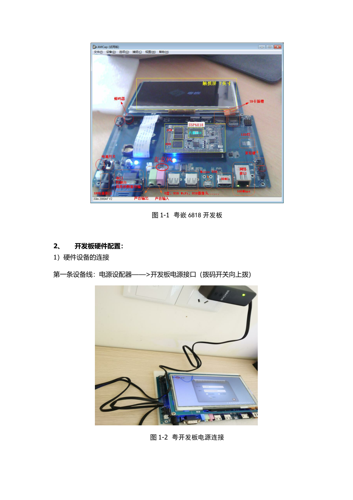

# 快速入门

## 开发环境

- 搭载 ESXi 裸机操作系统
- Ubuntu16.04 虚拟云服务器
- 粤嵌 6818 开发板
- 跨平台编译器 arm-linux-gcc 



## 显示器编程

```cpp
#include <sys/types.h>
#include <sys/stat.h>
#include <sys/fcntl.h>
#include <unistd.h>
#include <stdio.h>

int main() {
    // 获取文件描述符
    int lcd_fd;
    lcd_fd = open("/dev/fb0", O_RDWR);
    if (lcd_fd == -1) {
        perror("Error open()");
        return -1; 
    }

    int lcd_buf[800 * 480]; // 定义显存的大小, 显存大小为 800 * 480 == 4B

    // 读写文件描述符
    int i = 0;
    int colour = 0x00ff0000;
    for (i = 0; i < 800*400; i++>) {
        lcd_buf[i] = colour;
        write(lcd_fd, lcd_buf, sizeof(lcd_buf));
    }

    // 关闭文件描述符
    if (close(lcd_fd) == -1) {
        perror("Error close()");
        return -1;
    } 

    return 0;
}
```


## 输入子系统编程

## 音视频编程
