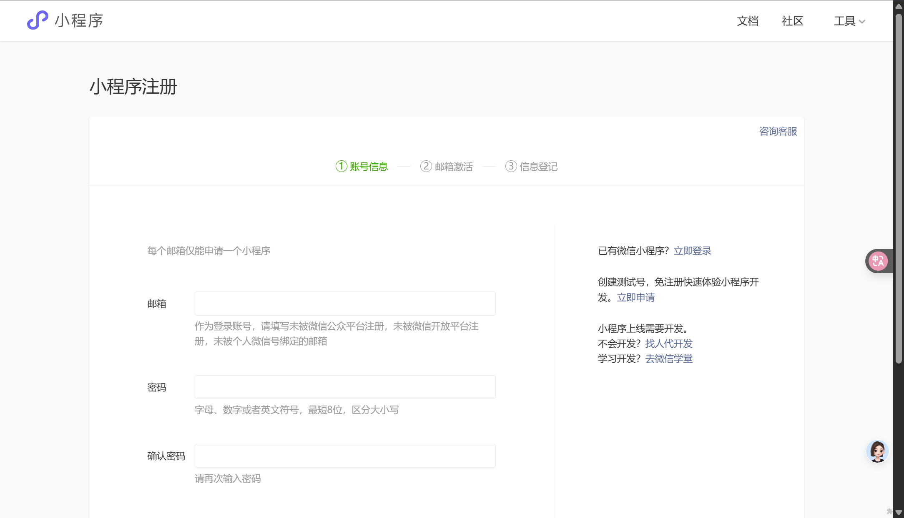
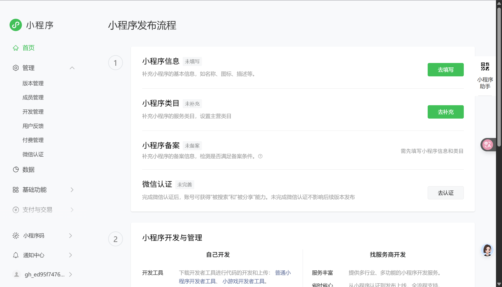
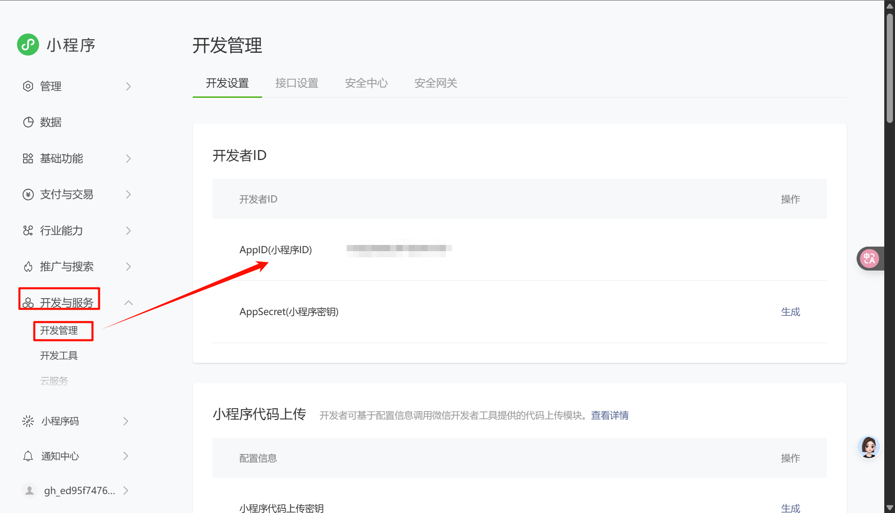
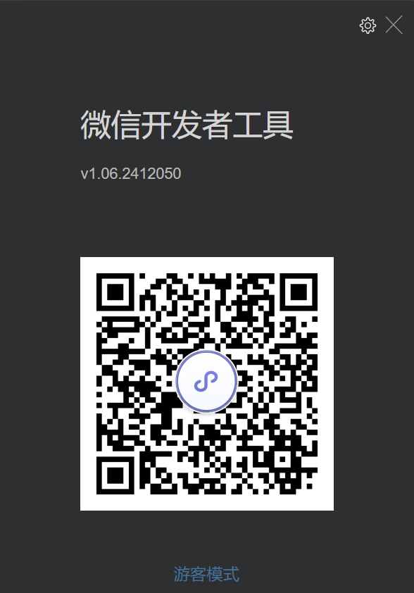
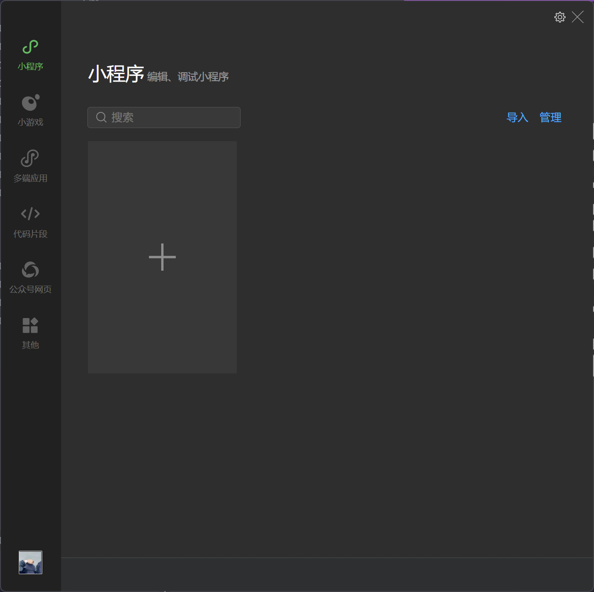
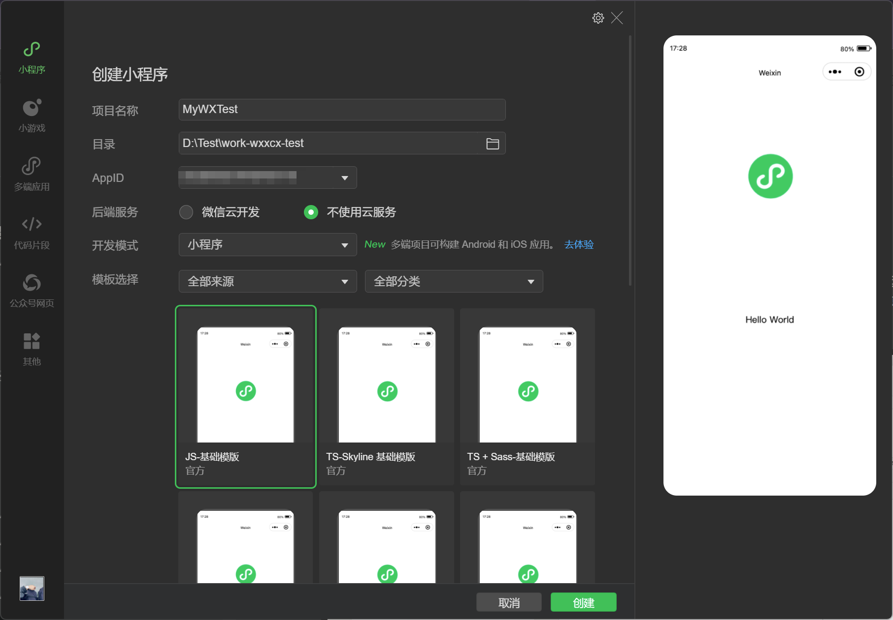
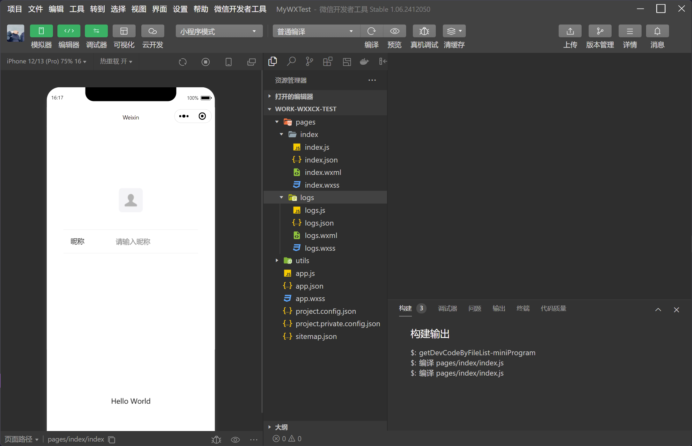
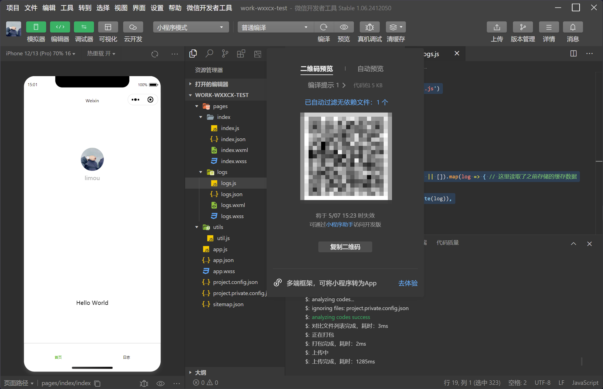
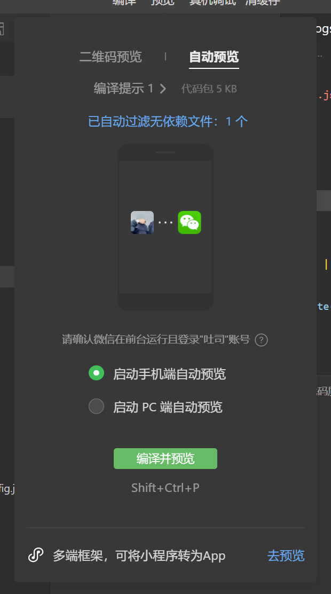

# 快速入门

## 1.微信小程序的简介

小程序是一种全新的连接用户与服务的方式，它可以在微信内被便捷地获取和传播，同时具有出色的使用体验。小程序并非凭空冒出来的一个概念。当微信中的 `WebView` 逐渐成为移动 `Web` 的一个重要入口时，微信就有相关的 `JS API` 了。

```js
// 使用 WeixinJSBridge 预览图片
WeixinJSBridge.invoke('imagePreview', {
    current: 'http://inews.gtimg.com/newsapp_bt/0/1693121381/641',
    urls: [ // 所有图片的URL列表，数组格式
        'https://img1.gtimg.com/10/1048/104857/10485731_980x1200_0.jpg',
        'https://img1.gtimg.com/10/1048/104857/10485726_980x1200_0.jpg',
        'https://img1.gtimg.com/10/1048/104857/10485729_980x1200_0.jpg'
    ]
}, function(res) {
    console.log(res.err_msg)
})
```

以上代码是一个调用微信原生组件浏览图片的 `JS API`，相比于额外引入一个 `JS` 图片预览组件库，这种调用方式显得非常简洁和高效。

实际上，微信官方是没有对外暴露过如此调用的，此类 `API` 最初是提供给腾讯内部一些业务使用，很多外部开发者发现了之后，依葫芦画瓢地使用了，逐渐成为微信中网页的事实标准。`2015` 年初，微信发布了一整套网页开发工具包，称之为 `JS-SDK`，开放了拍摄、录音、语音识别、二维码、地图、支付、分享、卡券等几十个 `API`。给所有的 `Web` 开发者打开了一扇全新的窗户，让所有开发者都可以使用到微信的原生能力，去完成一些之前做不到或者难以做到的事情。

同样是调用原生的浏览图片，调用方式如下面代码所示。

```javascript
// 使用 JS-SDK 调用图片预览组件
wx.previewImage({
  current: 'https://img1.gtimg.com/10/1048/104857/10485726_980x1200_0.jpg',
  urls: [ // 所有图片的URL列表，数组格式
    'https://img1.gtimg.com/10/1048/104857/10485731_980x1200_0.jpg',
    'https://img1.gtimg.com/10/1048/104857/10485726_980x1200_0.jpg',
    'https://img1.gtimg.com/10/1048/104857/10485729_980x1200_0.jpg'
  ],
  success: function(res) {
    console.log(res)
  }
})
```

`JS-SDK` 是对之前的 `WeixinJSBridge` 的一个包装，以及新能力的释放，并且由对内开放转为了对所有开发者开放，在很短的时间内获得了极大的关注。从数据监控来看，绝大部分在微信内传播的移动网页都使用到了相关的接口。

`JS-SDK` 解决了移动网页能力不足的问题，通过暴露微信的接口使得 `Web` 开发者能够拥有更多的能力，然而在更多的能力之外，`JS-SDK` 的模式并没有解决使用移动网页遇到的体验不良的问题。用户在访问网页的时候，在浏览器开始显示之前都会有一个白屏的过程，在移动端，受限于设备性能和网络速度，白屏会更加明显。小程序团队把很多技术精力放置在如何帮助平台上的 Web 开发者解决这个问题。因此小程序团队设计了一个 `JS-SDK` 的增强版本，其中有一个重要的功能，称之为“微信 `Web` 资源离线存储”。

>   [!IMPORTANT]
>
>   补充：以下文字引用自内部的文档（没有最终对外开放）：
>
>   微信 `Web` 资源离线存储是面向 `Web` 开发者提供的基于微信内的 `Web` 加速方案。
>
>   通过使用微信离线存储，`Web` 开发者可借助微信提供的资源存储能力，直接从微信本地加载 `Web` 资源而不需要再从服务端拉取，从而减少网页加载时间，为微信用户提供更优质的网页浏览体验。每个公众号下所有 `Web App` 累计最多可缓存 `5M` 的资源。

这个设计有点类似 `HTML5` 的 `Application Cache`，但在设计上规避了一些 `Application Cache` 的不足。

在内部测试中，小程序团队发现离线存储能够解决一些问题，但对于一些复杂的页面依然会有白屏问题，例如页面加载了大量的 `CSS` 或者是 `JavaScript` 文件。除了白屏，影响 `Web` 体验的问题还有缺少操作的反馈，主要表现在两个方面：页面切换的生硬和点击的迟滞感。

微信面临的问题是如何设计一个比较好的系统，使得所有开发者在微信中都能获得比较好的体验。这个问题是之前的 `JS-SDK` 所处理不了的，需要一个全新的系统来完成，它需要使得所有的开发者都能做到：

-   快速的加载
-   更强大的能力
-   原生的体验
-   易用且安全的微信数据开放
-   高效和简单的开发

这就是小程序的由来。

## 2.微信小程序的区别

小程序的主要开发语言是 `JS`。小程序的开发与普通的网页开发有不少相似之处，对于前端开发者来说，从网页开发迁移到小程序开发的成本并不高，但是二者还是有些许区别的。

网页开发中，渲染任务和脚本任务是互斥的，这也是为什么长时间的脚本运行可能会导致页面失去响应，而在小程序中，二者是分开的，分别运行在不同的线程中。网页开发者可以使用到各种浏览器暴露出来的 `DOM API`，进行 `DOM` 选中和操作。而如上文所述，**小程序的逻辑层和渲染层是分开的**，逻辑层运行在不同于渲染层的独立 `JS` 运行时中，因此并不能直接使用 `DOM API` 和 `BOM API`。这一区别导致了前端开发非常熟悉的一些库，例如 `jQuery`、`Zepto` 等，在小程序中是无法运行的。同时逻辑层的 `JS` 运行时与 `NodeJS` 环境也不尽相同，所以一些 `NPM` 的包在小程序中也是无法运行的。

网页开发者需要面对的环境是各式各样的浏览器，`PC` 端需要面对 `IE、Chrome、QQ浏览器` 等，在移动端需要面对 `Safari、Chrome` 以及 `iOS、Android` 系统中的各式 `WebView`。而小程序开发过程中需要面对的是两大操作系统 `iOS` 和 `Android` 的微信客户端，以及用于辅助开发的小程序开发者工具，小程序中三大（`JS`）运行环境也是有所区别的。

| **运行环境**     | **逻辑层**       | **渲染层**          |
| :--------------- | :--------------- | :------------------ |
| `iOS`            | `JavaScriptCore` | `WKWebView`         |
| 安卓             | `V8`             | `chromium` 定制内核 |
| 小程序开发者工具 | `NWJS`           | `Chrome WebView`    |

网页开发者在开发网页的时候，只需要使用到浏览器，并且搭配上一些辅助工具或者编辑器即可。小程序的开发则有所不同，需要经过申请小程序账号、安装小程序开发者工具、配置项目等等过程才可完成。

## 3.微信小程序的体验

开发者可使用微信客户端(`6.7.2` 及以上版本)扫码下方小程序码，体验小程序。也可以查看官方提供的 [小程序示例源码](https://github.com/wechat-miniprogram/miniprogram-demo)。


## 4.微信小程序的结构

### 4.1.核心文件

一个小程序包含一个描述整体程序的 `app` 和多个描述各自页面的 `page`，因此分别了解两个概念对应的代码文件。

一个小程序主体部分由三个文件组成，必须放在项目的根目录，如下：

| 文件                                                         | 必需 | 作用             |
| :----------------------------------------------------------- | :--- | :--------------- |
| [app.js](https://developers.weixin.qq.com/miniprogram/dev/framework/app-service/app.html) | 是   | 小程序逻辑       |
| [app.json](https://developers.weixin.qq.com/miniprogram/dev/framework/config.html) | 是   | 小程序公共配置   |
| [app.wxss](https://developers.weixin.qq.com/miniprogram/dev/framework/view/wxss.html) | 否   | 小程序公共样式表 |

一个小程序页面由四个文件组成，分别是：

| 文件类型                                                     | 必需 | 作用       |
| :----------------------------------------------------------- | :--- | :--------- |
| [js](https://developers.weixin.qq.com/miniprogram/dev/framework/app-service/page.html) | 是   | 页面逻辑   |
| [wxml](https://developers.weixin.qq.com/miniprogram/dev/framework/view/wxml/) | 是   | 页面结构   |
| [json](https://developers.weixin.qq.com/miniprogram/dev/framework/config.html#页面配置) | 否   | 页面配置   |
| [wxss](https://developers.weixin.qq.com/miniprogram/dev/framework/view/wxss.html) | 否   | 页面样式表 |

>   [!WARNING]
>
>   注意：为了方便开发者减少配置项，描述页面的四个文件必须具有相同的路径和相同文件名（后缀可不同）。

>   [!WARNING]
>
>   注意：会被编译的文件（上传后无法直接访问）
>
>   *   `.js`：`JS` 代码文件
>   *   `app.json`：全局配置文件
>   *   `.wxml`：页面结构文件
>   *   `.wxss`：样式文件（前提是页面被写进了 `app.json` 的 `pages` 字段）
>
>   这些文件会被编译打包，上传到微信后台时不会原样保留，无法直接通过 `URL` 或路径访问。另外，开发工具中虽然可以访问任意文件，但最终上传到微信服务器时，只有后缀名在以下白名单内的文件才会被打包上传，详情可以 [查阅官方文档中的白名单](https://developers.weixin.qq.com/miniprogram/dev/framework/structure.html)。

## 5.微信小程序的开发

### 5.1.申请账号

开发小程序的第一步，您需要拥有一个小程序账号，通过这个账号您就可以管理您的小程序。进入 [小程序注册页](https://mp.weixin.qq.com/wxopen/waregister?action=step1) 根据指引填写信息和提交相应的资料，就可以拥有自己的小程序账号。这里我使用的是我的 `Google` 邮箱，您可以选择您的邮箱，然后就可以得到下面首页。





然后就可以获取到最重要的 `AppID` 了，请务必重视这个 `ID` 值，这相当于小程序平台的一个身份证，后续你会在很多地方要用到 `AppID`（注意这里要区别于服务号或订阅号的 `AppID`）。



然后我们需要安装开发者工具来做微信小程序的开发，请 [前往安装指引页面](https://developers.weixin.qq.com/miniprogram/dev/devtools/download.html)。打开后用之前扫码注册的微信来登录开发者工具。

>   [!CAUTION]
>
>   警告：需要注意的是，微信开发者工具从任务栏打开会出现一些细小的 `Bug`，例如调试器出错，因此最好直接在安装目录或桌面图标中打开。



>   [!WARNING]
>
>   注意：如果登录进去可能和您的本地代理有关...

### 5.2.创建项目

然后创建一个新的项目，并且填入之前就得到的 `Apple ID`，同时先勾选不适用云服务。





默认会自动进行编译，或者您自己进行一次编译，就可以得到以下界面。



### 5.3.文件目录

继续来解读我们这里的代码，这里通过文件树来展开。

```cmd
$ tree -L 3 work-wxxcx-test
.
|-- project.config.json # 在工具上做的任何配置都会写入到这个文件， 当您重新安装工具或者换电脑工作时, 只需载入同一个项目的代码包, 开发者工具就自动会帮你恢复到个性化配置(包括编辑器的颜色、代码上传时自动压缩等等一系列选项)
|-- app.json # 小程序的全局配置, 包括了小程序的所有页面路径、界面表现、网络超时、底部 tab 等
|-- app.wxss
|-- app.js
|-- pages
|   |-- index
|   |   |-- index.json # 首页页面的页面配置, 可以区别于全局配置进行配置, 页面中配置项会覆盖 app.json 的 window 中相同的配置项
|   |   |-- index.wxml # 类似 html 作用的文件, 同 React.js 和 Vue.js 类似提倡吧渲染和逻辑分离, 让后续的 js 代码更多管理数据状态而不是管理渲染逻辑
|   |   |-- index.wxss # WXSS 是一套样式语言, 用于描述 WXML 的组件样式, WXSS 用来决定 WXML 的组件应该怎么显示
|   |   `-- index.js # 用于编写关于页面的响应逻辑, 也就是 JS 代码
|   `-- logs
|       |-- logs.json 
|       |-- logs.wxml
|       |-- logs.wxss
|       `-- logs.js
|-- project.private.config.json
|-- sitemap.json
`-- utils
    `-- util.js
    
```

### 5.4.代码解读

#### 5.4.1.JSON

我这里不完全跟着原有的项目配置，而是在原有项目的基础上进行一些修改。我对全局配置做了一些修改。

```yaml
# app.js: 注意这里的格式是 json 不允许带上注释, 请自己删除注释
{
  "pages": [ # 用于描述当前小程序所有页面路径，这是为了让微信客户端知道当前你的小程序页面定义在哪个目录, 可看到有两个页面
    "pages/index/index",
    "pages/logs/logs"
  ],
  "window": { # 定义小程序所有页面的顶部背景颜色，文字颜色定义
    "navigationBarTextStyle": "black", # 导航栏文本样式
    "navigationBarTitleText": "Weixin", # 导航栏标题文本
    "navigationBarBackgroundColor": "#ffffff" # 导航栏背景颜色
  },
  "tabBar": { # 配置导航栏的具体内容列表
    "list": [
      {
        "pagePath": "pages/index/index",
        "text": "首页"
      },
      {
        "pagePath": "pages/logs/logs",
        "text": "日志"
      }
    ]
  },
  "networkTimeout": { # 设置网络请求的超时时间, 后续您需要写对应的回调函数才能看到超时后的响应
    "request": 10000,
    "downloadFile": 10000
  },
  "debug": true # 设置为调试模式
  "style": "v2",
  "componentFramework": "glass-easel",
  "sitemapLocation": "sitemap.json",
  "lazyCodeLoading": "requiredComponents"
}

```

然后就是两个页面的 `.json` 文件，这两个文件我不做修改，保持原样。

```yaml
# index.json
{
  "usingComponents": {
  }
}
```

```yaml
# logs.json
{
  "usingComponents": {
  }
}
```

然后就是工具配置文件，这个文件不用我们改动，我们对开发工具的改动就会让这个文件自动变动，最终在其他工具中打开会自动读取该文件改动开发工具。

```yaml
# project.config.json
{
  "compileType": "miniprogram",
  "libVersion": "trial",
  "packOptions": {
    "ignore": [],
    "include": []
  },
  "setting": {
    "coverView": true,
    "es6": true,
    "postcss": true,
    "minified": true,
    "enhance": true,
    "showShadowRootInWxmlPanel": true,
    "packNpmRelationList": [],
    "babelSetting": {
      "ignore": [],
      "disablePlugins": [],
      "outputPath": ""
    }
  },
  "condition": {},
  "editorSetting": {
    "tabIndent": "auto",
    "tabSize": 2
  },
  "appid": "wxd20d021f7d543179"
}
```

>   [!IMPORTANT]
>
>   补充：更加详细的配置 `.json` 的内容可以 [查阅官方文档](https://developers.weixin.qq.com/miniprogram/dev/framework/config.html#%E5%85%A8%E5%B1%80%E9%85%8D%E7%BD%AE)，而工具配置如果需要自己修改，则可以 [参考这篇官方文档](https://developers.weixin.qq.com/miniprogram/dev/devtools/projectconfig.html)。

#### 5.4.2.WXML

这里先简单介绍微信的渲染逻辑，`WXML` 是这么写：

```html
<text>{{msg}}</text>
```

而 `JS` 只需要管理状态即可：

```js
this.setData({ msg: "Hello World" })
```

通过 `{{ }}` 的模板语法把一个变量绑定到界面上，我们称为数据绑定。仅仅通过数据绑定还不够完整的描述状态和界面的关系，还需要依托 `<block>` 带来的 `if/else, for` 等控制能力，在小程序里边，这些控制能力都用 `wx:` 开头的属性来表达，有些许接近 `Vue.js`，甚至还有 `...` 这种语法。并且还可以继续把整个 `WXML` 继续封装为一个模板标签 `<template>` 供其他标签使用，也就是说模板语法内部还可以继续套模板语法来使用。

再来看看项目中两个页面对应的 `.wxml` 就可以看懂了。

```xml
<!--index.wxml-->
<!-- 可滚动区域, 支持纵向滚动 -->
<scroll-view class="scrollarea" scroll-y type="list">
  <!-- 主要容器 -->
  <view class="container">
    <!-- 用户信息(利用条件语法做三种不同的渲染逻辑) -->
    <view class="userinfo">
      <!-- 第一种渲染方案(在当前微信基础库可以支持 <input type="nickname"> 新功能并且用户未授权时渲染) -->
      <block wx:if="{{canIUseNicknameComp && !hasUserInfo}}">
        <!-- 选择头像的按钮 -->
        <button class="avatar-wrapper" open-type="chooseAvatar" bind:chooseavatar="onChooseAvatar"> <!-- 这里的 bind: 后面的是事件对象和事件回调, 事件对象在标签的官方文档中有定义, 不同的标签有不同的事件对象, 这点不如 Vue.js 书写简单, 因为 Vue.js 具有运行时自动识别的能力, 这里的 chooseavatar 是 "选择头像事件对象" -->
          <image class="avatar" src="{{userInfo.avatarUrl}}"></image>
        </button>
        <!-- 输入昵称文本框 -->
        <view class="nickname-wrapper">
          <text class="nickname-label">昵称</text>
          <input type="nickname" class="nickname-input" placeholder="请输入昵称" bind:change="onInputChange" />
        </view>
      </block>
      <!-- 第二种渲染方案(在当前微信基础库无法支持 <input type="nickname"> 新功能并且用户未授权时渲染) -->
      <block wx:elif="{{!hasUserInfo}}">
        <button wx:if="{{canIUseGetUserProfile}}" bindtap="getUserProfile"> 获取头像昵称 </button>
        <view wx:else> 请使用2.10.4及以上版本基础库 </view>
      </block>
      <!-- 第三种渲染方案(在用户已授权时渲染) -->
      <block wx:else>
        <image bindtap="bindViewTap" class="userinfo-avatar" src="{{userInfo.avatarUrl}}" mode="cover"></image>
        <text class="userinfo-nickname">{{userInfo.nickName}}</text>
      </block>
    </view>
    <!-- 用户格言 -->
    <view class="usermotto">
      <text class="user-motto">{{motto}}</text> <!-- 只是简单把数据渲染未文本而已 -->
    </view>
  </view>
</scroll-view>
```

```xml
<!--logs.wxml-->
<scroll-view class="scrollarea" scroll-y type="list">
  <block wx:for="{{logs}}" wx:key="timeStamp" wx:for-item="log"> <!-- wx:for-item 代表每次遍历渲染的的元素项名称, 如果不写默认的元素项名称为 item, 还有一个 wx:for-index 可以自定义下标名称, 否则默认为 index -->
    <view class="log-item">{{index + 1}}. {{log.date}}</view>
  </block>
</scroll-view>

```

>   [!IMPORTANT]
>
>   补充：关于更多的模板语法和 `js` 的渲染关系，可以 [查看这篇文档](https://developers.weixin.qq.com/miniprogram/dev/framework/view/wxml/)。

#### 5.4.3.WXSS

为了适应广大的前端开发者，`WXSS` 具有 `CSS` 大部分特性（这也意味着 `WXML` 也必须具备和选择器相关的属性字段）。同时为了更适合开发微信小程序，WXSS 对 `CSS` 进行了扩充以及修改。

与 `CSS` 相比，`WXSS` 扩展的特性有：

*   尺寸单位 `rpx`，可以根据屏幕宽度进行自适应
*   样式导入，`@import 相对路径;` 语句可导入外联样式表

>   [!IMPORTANT]
>
>   补充：关于更多对模板的风格配置可以 [继续查阅文档](https://developers.weixin.qq.com/miniprogram/dev/framework/view/wxss.html)。

#### 5.4.4.JS

一个服务仅仅只有界面展示是不够的，还需要和用户做交互：响应用户的点击、获取用户的位置等等。在小程序里边，我们就通过编写 `JS` 脚本文件来处理用户的操作。

```xml
<view>{{ msg }}</view>
<button bind:tap="clickMe">点击我</button>
```

```js
Page({
  clickMe: function() {
    this.setData({ msg: "Hello World" })
  }
})
```

因此我们就可以理解我们项目中的 `JS` 代码了。

```js
// app.js
App({
  // 下面这个回调在小程序启动后就会执行一次, 是官方的回调
  onLaunch() {
    const logs = wx.getStorageSync('logs') || [] // 读取本地的 logs 日志数组, 如果没有则使用空数组
    logs.unshift(Date.now()) // 将当前时间戳 Date.now() 插入数组最前面
    wx.setStorageSync('logs', logs) // 再写回本地缓存, 方便其他页面从本地缓存中使用日志消息
    wx.login({ // 登录
      success: res => {
        // 发送 res.code 到后台换取 openId, sessionKey, unionId, 这几个重要的登录字段我后续再来讲解
      }
    })
  },
  globalData: { // 这是定义在全局的数据, 所有页面都能通过 getApp().globalData.userInfo 访问它
    userInfo: {
      avatarUrl: 'https://avatars.githubusercontent.com/u/113878415?s=400&u=9f10b63e033c9504615bc475581441478424e04b&v=4',
      nickName: 'limou3434',
    }
  }
  // 一般情况下, 缓存数据和全局数据有不同的用途, 最好不要乱用
  // (1)长期保存数据: 用缓存数据
  // (2)临时共享数据: 用全局数据
})

```

```json
// index.js
const defaultAvatarUrl = 'https://mmbiz.qpic.cn/mmbiz/icTdbqWNOwNRna42FI242Lcia07jQodd2FJGIYQfG0LAJGFxM4FbnQP6yfMxBgJ0F3YRqJCJ1aPAK2dQagdusBZg/0'
const app = getApp() // 用后后续读取全局数据

Page({
  // 最终要渲染到页面上的页面数据
  data: {
    motto: 'Hello World',
    userInfo: {
      avatarUrl: defaultAvatarUrl,
      nickName: '',
    },
    hasUserInfo: false,
    canIUseGetUserProfile: wx.canIUse('getUserProfile'),
    canIUseNicknameComp: wx.canIUse('input.type.nickname'),
  },
  // 下面这个回调在小程序启动后就会执行一次, 是官方的回调
  onLoad() {
    console.log(app.globalData.userInfo) // 这里读取了之前的全局数据
  },
  bindViewTap() {
    wx.navigateTo({
      url: '../logs/logs'
    })
  },
  onChooseAvatar(e) {
    const { avatarUrl } = e.detail
    const { nickName } = this.data.userInfo
    this.setData({
      "userInfo.avatarUrl": avatarUrl,
      hasUserInfo: nickName && avatarUrl && avatarUrl !== defaultAvatarUrl,
    })
  },
  onInputChange(e) {
    const nickName = e.detail.value
    const { avatarUrl } = this.data.userInfo
    this.setData({
      "userInfo.nickName": nickName,
      hasUserInfo: nickName && avatarUrl && avatarUrl !== defaultAvatarUrl,
    })
  },
  getUserProfile(e) {
    // 推荐使用 wx.getUserProfile 获取用户信息, 开发者每次通过该接口获取用户个人信息均需用户确认, 开发者妥善保管用户快速填写的头像昵称, 避免重复弹窗
    wx.getUserProfile({
      desc: '展示用户信息', // 声明获取用户个人信息后的用途, 后续会展示在弹窗中, 请谨慎填写
      success: (res) => {
        console.log(res)
        this.setData({
          userInfo: res.userInfo,
          hasUserInfo: true
        })
      }
    })
  },
})

```

```json
// logs.js
const util = require('../../utils/util.js')

Page({
  data: {
    logs: []
  },
  onLoad() {
    this.setData({
      logs: (wx.getStorageSync('logs') || []).map(log => { // 这里读取了之前存储的缓存数据
        return {
          date: util.formatTime(new Date(log)),
          timeStamp: log
        }
      })
    })
  }
})

```

这里我这里展示了一些关于全局数据和缓存数据的区别（后者可以长期存储一些数据，因此这里多次打开小程序会让日志消息越来越多），这点值得您注意。

>   [!IMPORTANT]
>
>   补充：如果需要了解更多事件相关的事件对象，可以 [查阅这个文档](https://developers.weixin.qq.com/miniprogram/dev/framework/view/wxml/event.html)。另外还有很多丰富的 `微信 API` 也值得您调用，可以 [查阅这篇文档](https://developers.weixin.qq.com/miniprogram/dev/framework/app-service/api.html)。

### 5.5.封装组件

微信小程序官方提供了较多的组件可以直接调用，这里列出一些关键的组件分类供您参考：

-   视图容器组件
-   基础内容组件
-   表单提交组件
-   页面导航组件
-   资源媒体组件
-   无障访问组件
-   地图组件
-   画布组件

>   [!IMPORTANT]
>
>   补充：如果需要更加细致了解组件，可以 [查阅这篇文档](https://developers.weixin.qq.com/miniprogram/dev/component/)。

### 5.6.原理解析

#### 5.6.1.双层架构


首先，我们来简单了解下小程序的运行环境。小程序的运行环境分成渲染层和逻辑层，其中 `WXML` 模板和 `WXSS` 样式工作在渲染层，`JS` 脚本工作在逻辑层。

小程序的渲染层和逻辑层分别由 `2` 个线程管理：渲染层的界面使用了 `WebView` 进行渲染；逻辑层采用 `JsCore` 线程运行 `JS` 脚本。一个小程序存在多个界面，所以渲染层存在多个 `WebView` 线程，这两个线程的通信会经由微信客户端 `Native` 做中转，逻辑层发送网络请求也经由 `Native` 转发。

#### 5.6.2.程序页面

微信客户端在打开小程序之前，会把整个小程序的代码包下载到本地，紧接着通过 `app.json` 的 `pages` 字段就可以知道您当前小程序的所有页面路径，并且会率先把 `index` 作为首页加载进来。小程序启动之后，在 `app.js` 定义的 `App` 实例的 `onLaunch()` 回调会被立刻执行，这个回调会在小程序启动之后触发。而页面中的 `.js` 则会在每次刷新页面后执行 `onLoad()` 回调。

## 6.微信小程序的多端

但是实际上存在一个叫做 `uni-app` 的开发工具，该工具是为了兼容多端应用而生，我们可以了解以下这种技术的开发过程。`uni-app` 是一个使用 `Vue.js` 开发所有前端应用的框架，开发者编写一套代码，可发布到 `iOS、Android、Web(响应式)、各种小程序(微信/支付宝/百度/头条/飞书/QQ/快手/钉钉/淘宝)、快应用` 等多个平台。官方文档还给了一个演示多个平台的 [二维码例子](https://uniapp.dcloud.net.cn/)，您可以前往一看。

>   [!NOTE]
>
>   吐槽：官方文档其实阐述了一段往事，您可以了解以下，这里张贴一部分供您查阅。
>
>   很多人以为小程序是微信先推出的，其实，`DCloud` 才是这个行业的开创者。
>
>   `DCloud` 于 `2012` 年开始研发小程序技术，优化 `webview` 的功能和性能，并加入 `W3C` 和 `HTML5` 中国产业联盟，推出了 `HBuilder` 开发工具，为后续产业化做准备。
>
>   `2015` 年，`DCloud` 正式商用了自己的小程序，产品名为“流应用”，它不是 `B/S` 模式的轻应用，而是能接近原生功能、性能的 `App`，并且即点即用，第一次使用时可以做到边下载边使用。
>
>   为将该技术发扬光大，`DCloud` 将技术标准捐献给工信部旗下的 [HTML5中国产业联盟](https://www.html5plus.org/)，并推进各家流量巨头接入该标准，开展小程序业务。
>
>   `360` 手机助手率先接入，在其 `3.4` 版本实现应用的秒开运行。
>
>   随后 `DCloud` 推动大众点评、携程、京东、有道词典、唯品会等众多开发者为流应用平台提供应用。
>
>   在 `2015` 年 `9` 月，`DCloud` 推进微信团队开展小程序业务，演示了流应用的秒开应用、扫码获取应用、分享链接获取应用等众多场景案例，以及分享了 `webview` 体验优化的经验。
>
>   微信团队经过分析，于 `2016` 年初决定上线小程序业务，但其没有接入联盟标准，而是订制了自己的标准。
>
>   `DCloud` 持续在业内普及小程序理念，推进各大流量巨头，包括手机厂商，陆续上线类似小程序/快应用等业务。
>
>   部分公司接入了联盟标准，但更多公司因利益纷争严重，标准难以统一。
>
>   技术是纯粹的，不应该因为商业利益而分裂。开发者面对如此多的私有标准不是一件正确的事情。
>
>   造成混乱的局面非 `DCloud` 所愿。于是我们决定开发一个免费开源的框架。
>
>   既然各巨头无法在标准上达成一致，那么就通过这个框架为开发者抹平各平台差异。
>
>   这，就是 `uni-app` 的由来。
>
>   *   因为多年积累，所以 `DCloud` 拥有 `800` 多万开发者，并不意外
>   *   因为 `DCloud` 一直都有小程序的 `iOS、Android` 引擎，所以 `uni-app` 的 `App` 端和小程序端保持高度一致，并不意外
>   *   因为 `DCloud` 在引擎上的持续投入，所以 `uni-app` 的 `App` 端功能、性能比大多数小程序引擎都优秀，并不意外
>   *   因为 `DCloud` 对各家小程序太了解了，所以做好抹平各端差异的跨端框架，并不意外
>
>   现在，`uni-app` 已经是业内最风靡的应用框架，支撑着 `12` 亿活跃手机用户的庞大生态。
>
>   世界兜兜转转，当你踏出第一步时，随后很多事不会按你的预期发展。但只要你不忘初心，你想要的那个目标，最终会换个方式实现。
>
>   ...

>   [!IMPORTANT]
>
>   补充：`WebView` 实际上是一种 **嵌入浏览器引擎的控件技术**，允许您在 `App、小程序、桌面应用` 中 **嵌入网页内容(HTML/CSS/JS)**，实现“网页内嵌”的效果。

我个人是比较舒徐 `Vue.js` 的使用方式的，因此这里我默认您和我一样，如果您没有学习过 `Vue.js` 请直接查询官方的学习资料（`Vue.js` 的学习非常简单）。

待补充...


安装汉化

运行配置


## 7.微信小程序的部署

到现在微信小程序的设计确实简洁且美观，不过由于各种法规条例，导致部署一款微信小程序不是非常得容易，针对个人开发者总是有各种挑战。

首先我们以上面的程序为模板，开始实际部署微信小程序，我们需要经过以下步骤：

1.   编码
2.   测试
3.   预览
4.   部署
     1.   上传代码
     2.   提交审核
     3.   发布预览
     4.   小程序码

可以看到，最为困难的地方实际上反而不是编码的地方...我们先来预览吧，点击上述的预览即可得到编译后的二维码在本手机上进行预览。



此时使用手机登录相同账号的微信进行扫码就可以得到我们预览的小程序。也可以选择开启自动预览模式，编译后就在对应微信账号中打开。



最终可以在相应登录的微信账号上得到的手机小程序界面。

