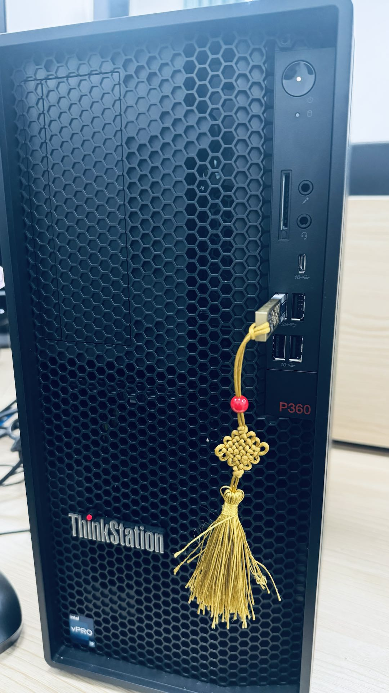
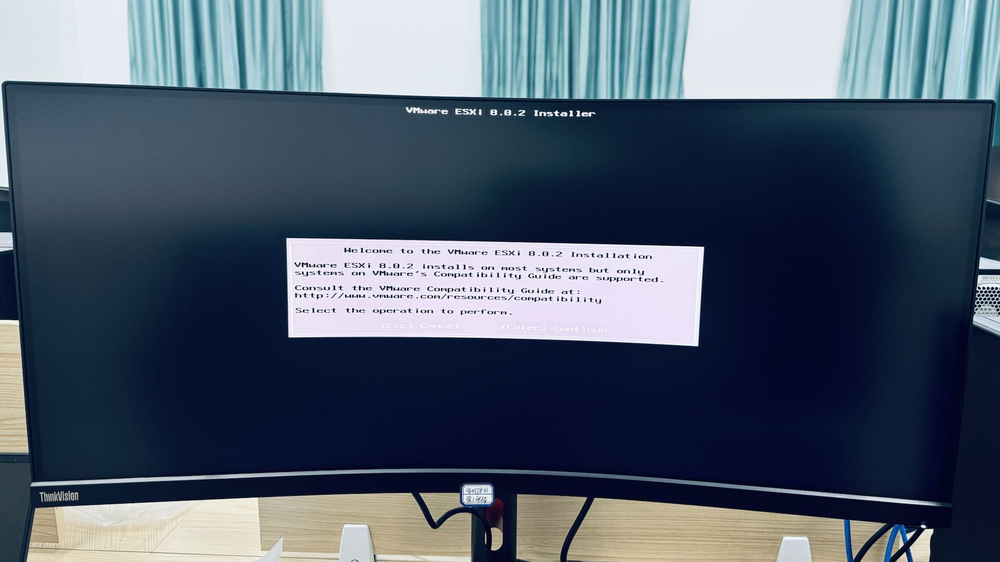
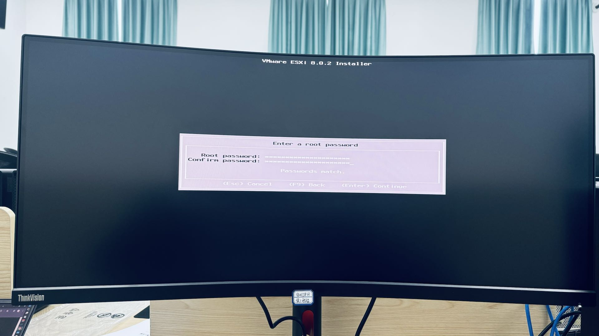
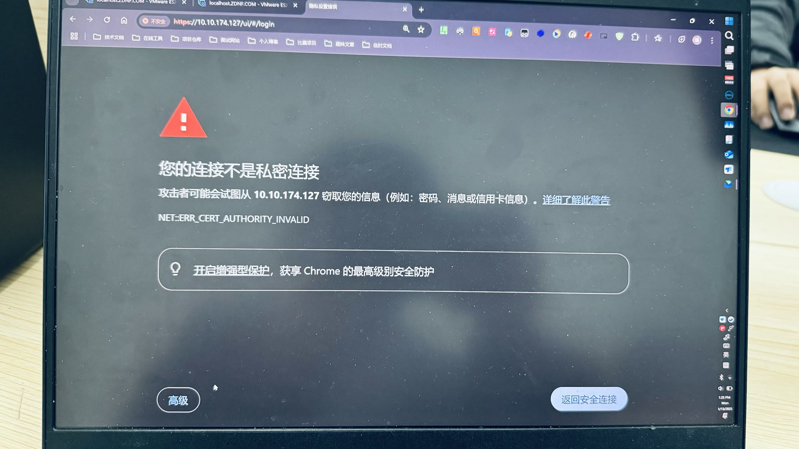
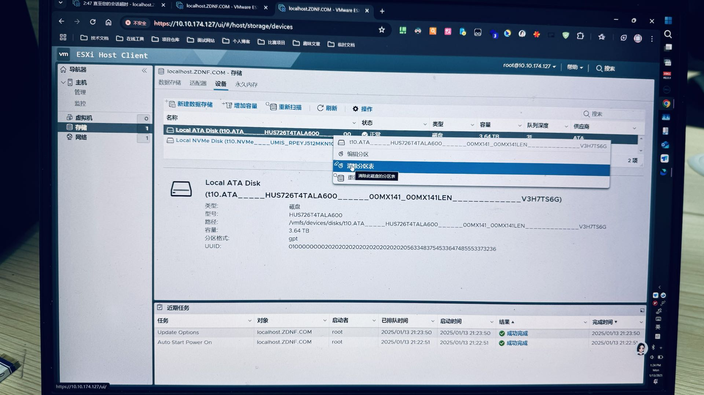
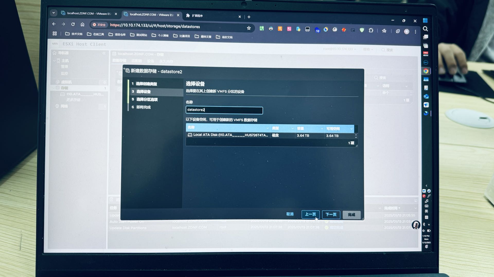
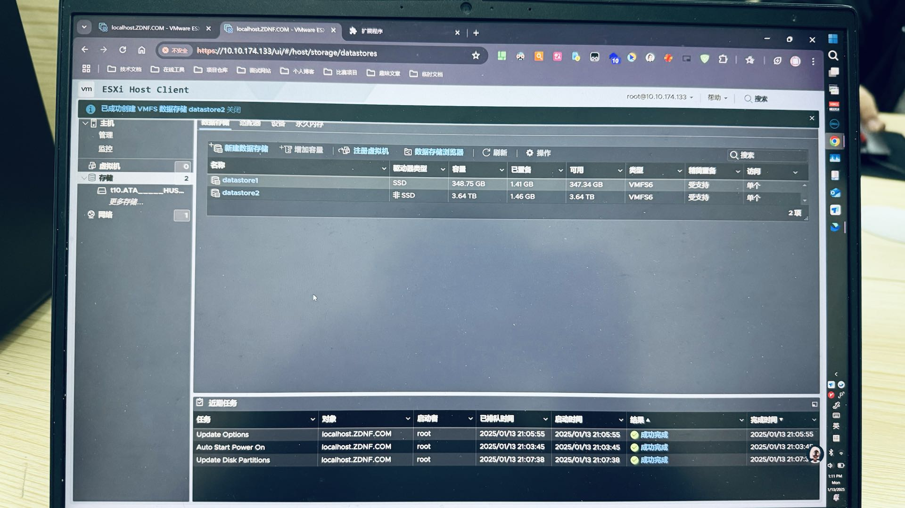

# 虚拟主机

### 1.安装 ESXi 操作系统

初始化一台物理机器上的操作系统成本是很高的，因此这里推荐您部署一台 `ESXi` 主机，利用 `ESXi` 操作系统之上可以在同一个物理主机上虚拟化出多个操作系统，也就是多个虚拟主机。

首先需要制作一个 `ESXi` 安装镜像启动盘，待补充...

开机进入 `BIOS` 界面。

选择启动设备为您的安装启动 `U` 盘。

以下就是初始化安装 `ESXi` 设置的界面，我们根据指引一步一步来完成即可。

这里出现两个安装协议等界面，使用 `[enter]` 和 `[f11]` 即可完成两个步骤。

等待安装...

使用方向盘选择一个磁盘作为 `ESXi` 的系统盘（注意这个盘会被 `ESXi` 全部占有，数据会被全部清空），按下 `[enter]` 确认即可（另外一个作为 `ESXi` 后续的数据盘）。

> [!IMPORTANT]
>
> 补充：如果您出现无法识别磁盘的问题，可能需要修改启动模式为 `AHCI` 后重启再次选择启动设备菜单才可以识别。
>
> 

类似 `Linux`，`ESXi` 也有用户管理机制，因此您需要设置 `root` 的管理员密码，方便后续登陆使用 `ESXi` 系统。

如果出现警告也可以继续 `[f11]`（尝试一下没什么坏处，大部分情况下也不会出现问题）。

重启主机即可完成 `ESXi` 的安装过程。

> 补充：如果您出现 `CPU` 不兼容的问题，则可以在重启的倒计时页面中，反复输入 `[shift + o]`，直到中断 `ESXi` 系统的初始化过程（在反复键入 `[shift + o]` 的过程中有可能会输入字符 `O`，请一定记得仔细删除），并且输入 `cpuUniformityHardCheckPanic=FALSE` 后键入 `[enter]` 来跳过 `CPU` 检查即可（还是那句话，尝试一下没什么坏处，大部分情况下也不会出现问题）。
>
> 

安装 `ESXi` 操作系统成功，不过这个操作系统最简单的操作方式是使用启动界面处的 `https` 地址，在浏览器中访问即可。

> [!IMPORTANT]
>
> 补充：这里如果没有看到系统盘以外的数据盘，可能是数据盘内存放一些旧数据无法被 `ESXi` 挂载，这边建议您备份好重要数据后，清空该磁盘分区后挂载到 `ESXi` 系统上，方便后续创建多个虚拟主机。
>
> 
>
> 
>
> 
>
> 
>
> 
>
> 
>
> 
>
> 
>
> 

## 2.创建多个虚拟机

待补充...

