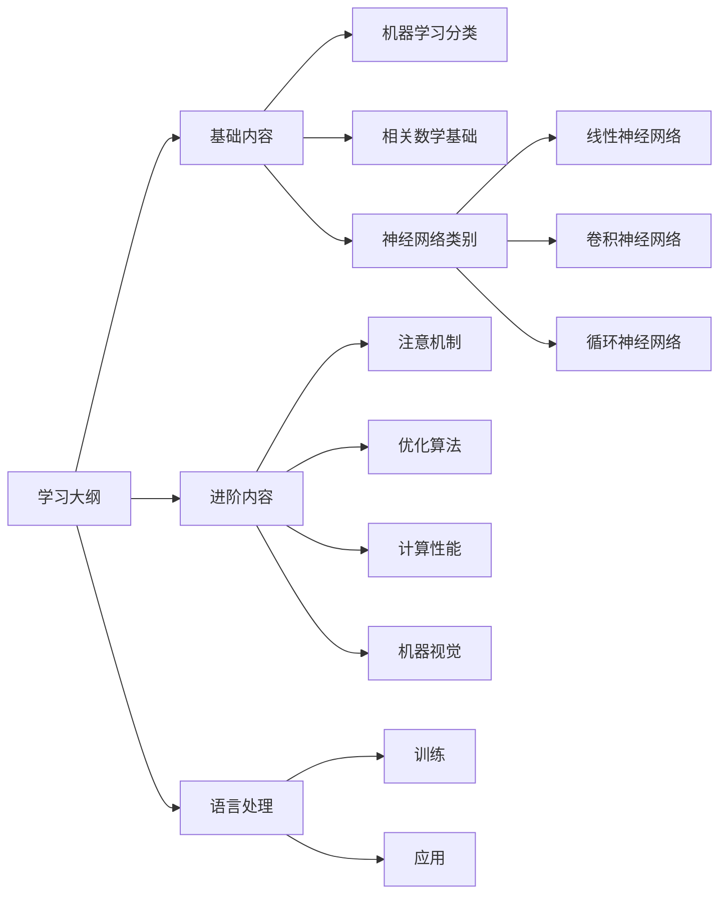

# 快速入门

## 1.内容概要

为了完善业务逻辑，开发人员必须细致地考虑应用程序所有可能遇到的边界情况，并为这些边界情况设计合适的规则。当买家单击将商品添加到购物车时，应用程序会向购物车数据库表中添加一个条目，将该用户 `ID` 与商品 `ID` 关联起来。 虽然一次编写出完美应用程序的可能性微乎其微，但在大多数情况下，开发人员可以从上述的业务逻辑出发，编写出符合业务逻辑的应用程序，并不断测试直到满足用户的需求。 根据业务逻辑设计自动化系统，驱动正常运行的产品和系统，是一个人类认知上的非凡壮举。

幸运的是，对日益壮大的机器学习科学家群体来说，实现很多任务的自动化并不再屈从于人类所能考虑到的逻辑。想象一下，假如开发人员要试图解决以下问题之一：

*   编写一个应用程序，接受地理信息、卫星图像和一些历史天气信息，并预测明天的天气；
*   编写一个应用程序，接受自然文本表示的问题，并正确回答该问题；
*   编写一个应用程序，接受一张图像，识别出该图像所包含的人，并在每个人周围绘制轮廓；
*   编写一个应用程序，向用户推荐他们可能喜欢，但在自然浏览过程中不太可能遇到的产品。

在这些情况下，即使是顶级程序员也无法提出完美的解决方案， 原因可能各不相同。有时任务可能遵循一种随着时间推移而变化的模式，我们需要程序来自动调整。有时任务内的关系可能太复杂（比如像素和抽象类别之间的关系），需要数千或数百万次的计算。 即使人类的眼睛能毫不费力地完成这些难以提出完美解决方案的任务，这其中的计算也超出了人类意识理解范畴。 **机器学习** 是一类强大的可以从经验中学习的技术。通常采用观测数据或与环境交互的形式，机器学习算法会积累更多的经验，其性能也会逐步提高。相反，对于刚刚所说的电子商务平台，如果它一直执行相同的业务逻辑，无论积累多少经验，都不会自动提高，除非开发人员认识到问题并更新软件。

## 2.环境配置

-   前往 [官方文档](https://www.anaconda.com/download/success) 获取对应的 `Conda` 安装脚本
-   根据这个老哥的 [指引](https://zhuanlan.zhihu.com/p/459607806)，安装 `Conda` 搭建虚拟环境
-   根据 [《动手学深度学习》](https://zh.d2l.ai/chapter_installation/index.html) 安装 `torch、torchvision、d2l`

```bash
$ pip3 install torch torchvision torchaudio --index-url https://download.pytorch.org/whl/cu121
$ pip3 install d2l==0.17.6
$ conda create --name learn python=3.9 -y # 创建环境
$ conda activate learn # 切换环境
$ conda deactivate # 退出环境

```

如果嫌弃下载得比较缓慢，可以利用 `tmux` 的分离功能慢慢下载。

```bash
# 分离会话
$ tmux # Ctrl+b 后按 d 这样就可以脱离当前终端时刻运行

# 查看会话
$ tmux ls

# 恢复会话
$ tmux attach -t <会话名称或编号>

```

然后还需要下载书籍代码。

```bash
$ mkdir d2l-zh && cd d2l-zh
$ curl https://zh-v2.d2l.ai/d2l-zh-2.0.0.zip -o d2l-zh.zip
$ sudo apt update && sudo apt install unzip && unzip d2l-zh.zip && rm d2l-zh.zip
$ cd pytorch
$ jupyter notebook # 在 Web 浏览器中打开 http://localhost:8888 阅读 Jupyter 笔记本

```

## 3.目录大纲

快速入门之前先预览一下学习大纲。



## 4.体验代码

待补充...

