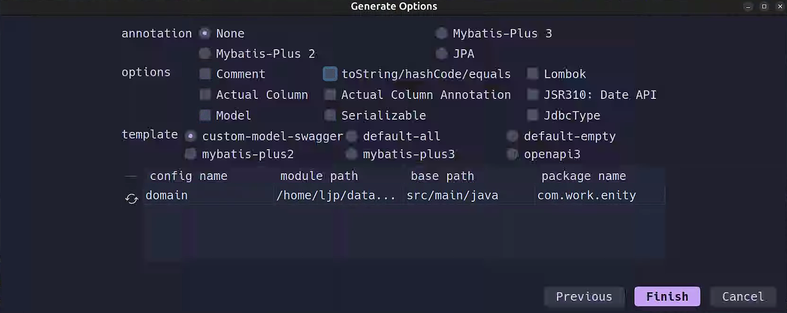

##### 3.1.3.1.理解

到 `MyBatisPlus` 这里，我们就需要对我们编写数据库操作做一个规范了，这个规范就是工作室数据操作的规范，也是我一直采用的规范，这个规范将会带您再下面的代码实践环节中进行实践，开发一个用户表的增删查改。

>   [!CAUTION]
>
>   警告：不过由于 `MyBatisPlus` 最好是结合 `Spring` 系列的全家桶来使用，如果您没有使用 `Spring` 的经历，最好先学习完 `Spring` 的相关内容（至少阅读过 `Spring` 和 `SpringBoot` 的文章后再回来阅读这里后面的知识）。

由于 `MyBatisPlus` 是对 `MyBatis` 的强化，我们需要提前了解前要知识，避免后续的内容一知半解。

##### 3.1.3.2.使用

上面这个弹窗的配置我已经一一进行了解释，您看需要进行配置即可，下面是我填写的配置以及生成结果。

然后就会跳出以下配置。

这里我也配置一份供您参考。

### 3.2.代码实践

使用 `MyBatisPlus` 来快速实现对一个用户表的增删查改。

