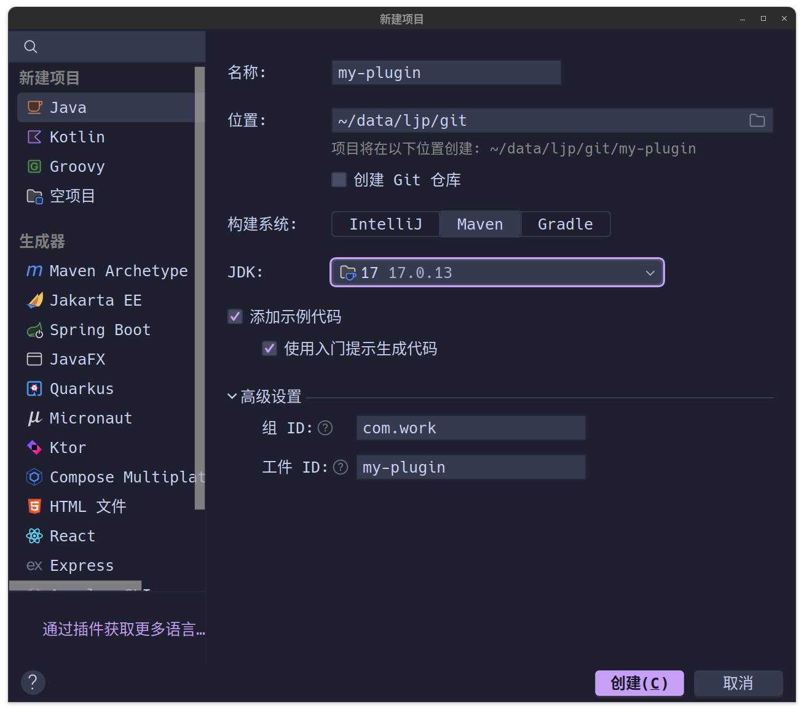

# Maven 快速入门

## 1.Maven 全面概述

[Apache Maven](https://maven.apache.org/) 是一种软件项目管理和理解工具。基于项目对象模型的概念（`POM`），`Maven` 可以从中央信息中管理项目的构建，报告和文档。

## 2.Maven 基本功能

因此实际上 `Maven` 的基本功能就是作为 `Java` 的项目包管理器，可以快速配置项目的依赖并且进行版本配置管理，其配置的理念是基于项目对象模型 `project object model`。具体来说，`Maven` 回使用 `pom.xml` 这种项目描述文档来描述一个项目以及对应的依赖。

然后再基于这份文档，使用 `maven` 的命令行工具进行依赖管理即可，类似 `Cpp` 的 `Vcpkg` 工具、`Python` 的 `Pip` 工具...

## 3.Maven 使用教程

### 3.1.下载安装

在安装之前，由于 `Maven` 是 `Java` 工具，您必须先保证下载好 `Java` 才能继续安装 `Maven`。

```shell
# 下载安装
# 检查 Java 的版本
$ java --version
openjdk 17.0.13 2024-10-15
OpenJDK Runtime Environment (build 17.0.13+11-Ubuntu-2ubuntu124.04)
OpenJDK 64-Bit Server VM (build 17.0.13+11-Ubuntu-2ubuntu124.04, mixed mode, sharing)

# 拉取二进制压缩包并且解压查看
$ wget https://dlcdn.apache.org/maven/maven-3/3.9.9/binaries/apache-maven-3.9.9-bin.zip
$ unzip apache-maven-3.9.9-bin.zip

$ cd apache-maven-3.9.9/
$ ls
bin  boot  conf  lib  LICENSE  NOTICE  README.txt

# 把二进制可执行文件目录添加到 PATH 环境变量中
$ vim ~/.bashrc && cat ~/.bashrc
# ...
$PATH=<maven_path>:$PATH # 请将 maven

# 检查是否安装成功
$ mvn -v
Apache Maven 3.9.9 (8e8579a9e76f7d015ee5ec7bfcdc97d260186937)
Maven home: /home/ljp/tools/maven/apache-maven-3.9.9
Java version: 17.0.13, vendor: Ubuntu, runtime: /usr/lib/jvm/java-17-openjdk-amd64
Default locale: zh_CN, platform encoding: UTF-8
OS name: "linux", version: "6.8.0-51-generic", arch: "amd64", family: "unix"

```

### 3.2.可选配置

-   **MAVEN_ARGS 环境变量(操作 MVC 的参数)** 从 `Maven 3.9.0` 开始，此变量包含传递给 `Maven` 的参数，优先于用户的命令行参数。例如，可以通过 `-B -V checkstyle:checkstyle` 定义选项和目标。其中 `-B` 表示跳过交互式提示，`-V` 表示显示 Maven 的版本信息，`checkstyle:checkstyle` 是一个目标任务，表示运行 Checkstyle 插件进行代码检查。

-   **MAVEN_OPTS 环境变量(操作 JVM 的参数)** 该变量包含用于启动 `Maven` 所需的 `JVM` 参数，可以用来向 `JVM` 提供额外的选项。例如，`JVM` 的内存设置可以通过 `-Xms256m -Xmx512m` 来定义。

-   **settings.xml 文件** `settings.xml` 用于存储跨项目的 `Maven` 配置，通常存储在两个目录中

    -   用户级别配置目录 `$USER_HOME/.m2/settings.xml`
    -   全局级别配置目录 `$MAVEN_HOME/conf/settings.xml`

    您可以稍微查看一下全局级别配置文件，稍微了解一下，当存在用户级别配置文件时，就会优先使用用户级别配置文件。

    ```xml
    <!-- settings.xml -->
    <?xml version="1.0" encoding="UTF-8"?>
    
    <settings xmlns="http://maven.apache.org/SETTINGS/1.2.0"
              xmlns:xsi="http://www.w3.org/2001/XMLSchema-instance"
              xsi:schemaLocation="http://maven.apache.org/SETTINGS/1.2.0 https://maven.apache.org/xsd/settings-1.2.0.xsd">
      <!-- 配置本地仓库
       | 配置 Maven 下载好后的依赖存储目录
       |
       | 默认值: ${user.home}/.m2/repository
      <localRepository>/path/to/local/repo</localRepository>
      -->
    
      <!-- 配置交互模式
       | 配置 Maven 是否运行过程和用户交互
       | 
       | 默认值: true
      <interactiveMode>true</interactiveMode>
      -->
    
      <!-- 配置离线模式
       | 配置 Maven 是否直接在本地获取依赖
       |
       | 默认值: false
      <offline>false</offline>
      -->
    
      <!-- 配置插件小组
       | 配置 Maven 配置插件的查询地址标识
       |
       | 默认值: 无默认值
       |-->
      <pluginGroups>
        <!-- pluginGroup
        <pluginGroup>com.your.plugins</pluginGroup>
        -->
      </pluginGroups>
    
      <!-- 配置代理服务
       | 配置 Maven 访问外部仓库时代理服务
       |
       | 默认值: 无默认值
       |-->
      <proxies>
        <!-- proxy
        <proxy>
          <id>optional</id>
          <active>true</active>
          <protocol>http</protocol>
          <username>proxyuser</username>
          <password>proxypass</password>
          <host>proxy.host.net</host>
          <port>80</port>
          <nonProxyHosts>local.net|some.host.com</nonProxyHosts>
        </proxy>
        -->
      </proxies>
    
      <!-- 配置本机认证
       | 配置 Maven 访问远端仓库的认证信息
       |-->
      <servers>
        <!-- server 使用密码
        <server>
          <id>deploymentRepo</id>
          <username>repouser</username>
          <password>repopwd</password>
        </server>
        -->
    
        <!-- server 使用密钥
        <server>
          <id>siteServer</id>
          <privateKey>/path/to/private/key</privateKey>
          <passphrase>optional; leave empty if not used.</passphrase>
        </server>
        -->
      </servers>
    
      <!-- 配置镜像地址
       | 配置 Maven 镜像地址提高下载速度
       |
       |-->
      <mirrors>
        <!-- mirror
        <mirror>
          <id>mirrorId</id>
          <mirrorOf>repositoryId</mirrorOf>
          <name>Human Readable Name for this Mirror.</name>
          <url>http://my.repository.com/repo/path</url>
        </mirror>
        -->
        <mirror>
          <id>maven-default-http-blocker</id>
          <mirrorOf>external:http:*</mirrorOf>
          <name>Pseudo repository to mirror external repositories initially using HTTP.</name>
          <url>http://0.0.0.0/</url>
          <blocked>true</blocked>
        </mirror>
      </mirrors>
    
      <!-- 配置特定设置
       | 配置 Maven 根据标识激活特定设置
       | 例如使用 -D env=dev 就可以触发 name=env value=dev 所对应的 activation 设置
       |
       |-->
      <profiles>
        <!-- profile
        <profile>
          <id>env-dev</id>
    
          <activation>
            <property>
              <name>target-env</name>
              <value>dev</value>
            </property>
          </activation>
    
          <properties>
            <tomcatPath>/path/to/tomcat/instance</tomcatPath>
          </properties>
        </profile>
        -->
          
        <!-- profile
        <profile>
          <id>jdk-1.4</id>
    
          <activation>
            <jdk>1.4</jdk>
          </activation>
    
          <repositories>
            <repository>
              <id>jdk14</id>
              <name>Repository for JDK 1.4 builds</name>
              <url>http://www.myhost.com/maven/jdk14</url>
              <layout>default</layout>
              <snapshotPolicy>always</snapshotPolicy>
            </repository>
          </repositories>
        </profile>
        -->
      </profiles>
    
      <!-- activeProfiles
       | 配置 Maven 平时默认激活特定设置
       |
      <activeProfiles>
        <activeProfile>填写上面定义的 value</activeProfile>
        <activeProfile>可以继续填写...</activeProfile>
      </activeProfiles>
      -->
    </settings>
    
    ```

-   **.mvn 目录** 位于 `Maven` 项目的顶级目录中，一般包含三个文件

    *   `.mvn/maven.config` 从 `Maven 3.3.1+` 开始，可以通过 `.mvn/maven.config` 文件简化 `Maven` 命令行参数的设置（每个参数最好直接单独一行），这样就不再需要使用 `MAVEN_ARGS`

    *   `.mvn/jvm.config` 从 `Maven 3.3.1+` 开始，可以通过 `.mvn/jvm.config` 文件为每个项目定义 `JVM` 配置（每个参数最好直接单独一行），这样就不再需要使用 `MAVEN_OPTS`

    *   `.mvn/extensions.xml` 过去的做法（直到 `Maven 3.2.5`）是创建一个 `JAR` 文件并将其手动放入 `${MAVEN_HOME}/lib/ext` 目录中，或者通过 `mvn -Dmaven.ext.class.path=extension.jar` 命令行选项来加载扩展。现在可以通过定义 `.mvn/extensions.xml`，一般实际开发中用来拓展 `Maven` 核心功能的，和 `settings.xml` 作用还是有很大不同的，不要混淆一谈，有需要了解一下即可（修改后可用 `mvn help:effective-settings` 进行配置检查）。

>   [!IMPORTANT]
>
>   补充：不过一般情况下，我们无需改动以上的环境变量和配置文件。
>
>   -   对于环境变量一般使用 `.mvn/maven.config` 和 `.mvn/jvm.config` 来替代，这样每一个项目配置起来比较灵活
>   -   一般也用不到 `.mvn/extensions.xml` 这种需要拓展 `Maven` 功能。
>   -   而对于经过正常魔法手段的网络环境下，一般也无需配置 `settings.xml`，使用默认的即可，如果需要修改，一般也只有以下三个个人开发者需求（最好只修改用户级别的 `settings.xml` 配置文件）
>       -   可能需要改动依赖存储的目录，以避免系统磁盘占用过多，只需要改动 `<localRepository>` 标签即可
>       -   可能需要改动网络代理的配置，以使用魔法阵来健康上网，只需要改动 `<proxy>` 标签即可
>       -   可能需要配置一些插件，后续使用 `Maven` 管理的 `Java` 项目（这里指专门开发 `Maven` 插件的 `Java` 项目）开发完毕后进行 `mvn install` 后会把插件安装到本地仓库 `~/.m2/repository/` 中，此时需要使用这里面的插件标签来标识该插件以简化命令行的使用
>
>   因此总结来说，使用 `.mvn/maven.config`、`.mvn/jvm.config`、`settings.xml` 的概率是最大的。
>
>   另外，一般开发环境使用 `mvn` 的命令行多一些，因为命令行的可选参数优先级最高，可以覆盖 `.mvn/maven.config`、`.mvn/jvm.config` 这两个配置文件。而测试环境、生产环境一般使用 `.mvn/maven.config`、`.mvn/jvm.config` 这两个配置文件会多一些，因为更加方便。

### 3.3.常用指令

这里先列出并且大概说下 `mvn` 工具的常见指令。

-   `mvn [options] [<goal(s)>] [<phase(s)>]` 使用通用的
    -   `options` 可选参数，比如 `-Dproperty=value`（设置属性）、`-X`（启用调试模式）等
    -   `goal` 具体目标，通常是指执行某些自定插件
    -   `phase` 生命阶段，通常是指生命周期内的阶段
-   `mvn -h` 可以查询相关的指令帮助
-   `mvn verify` 最为典型的指令调用

>   [!IMPORTANT]
>
>   补充：`Maven` 生命周期是一套预定义的 `phases, 构建阶段`，确保项目按照既定顺序进行构建。`Maven` 有 `3` 个 `Lifecycle, 生命周期`，分别是
>
>   -   `clean`（“清理” 生命周期），包含多个阶段。本生命周期内，在执行某个阶段时，会自动执行该阶段前面的所有阶段
>       -   `pre-clean`：执行清理前的操作
>       -   `clean`：删除 `target/` 目录
>       -   `post-clean`：执行清理后的操作
>   -   `default`（“构建” 生命周期），包含多个阶段。本生命周期内，在执行某个阶段时，会自动执行该阶段前面的所有阶段
>       -   `validate` 验证项目是否正确，并检查 `pom.xml` 配置
>       -   `compile` 编译源码（`src/main/java`）到 `target/classes`
>       -   `test` 运行单元测试（基于 `src/test/java`），不过有时可以使用 `mvn clean package -DskipTests` 跳过测试阶段
>       -   `package` 将编译后的代码打包（如 `jar`、`war`）
>       -   `verify` 运行集成测试，确保打包的应用正常
>       -   `install` 安装 `jar`/`war` 到本地仓库下（`~/.m2/repository/`），一般会安装一些项目，比如自定义的插件项目和其他的服务项目，以方便别的项目进行本地依赖
>       -   `deploy`  发布 `jar`/`war` 到远程仓库（如 `Nexus`）
>   -   `site`（“文档” 生命周期），包含多个阶段。本生命周期内，在执行某个阶段时，会自动执行该阶段前面的所有阶段
>       -   `pre-site`：执行文档生成前的任务
>       -   `site`：生成 HTML 文档
>       -   `post-site`：执行文档生成后的任务
>       -   `site-deploy`：发布站点到服务器
>
>   而在 `pom.xml` 中的 `plugin, 插件` 标签可以绑定到特定阶段，扩展构建过程。也就是说，您可以在 `Maven` 的构建过程中，插入额外的任务（例如代码生成、代码检查、打包方式自定义等），以干预生命周期的行为。

### 3.4.代码实践

#### 3.4.1.编写普通 Maven 项目

##### 3.4.1.1.创建项目

```shell
# 创建项目
$ mvn archetype:generate -DgroupId=com.work -DartifactId=work-maven-test -DarchetypeArtifactId=maven-archetype-quickstart -DarchetypeVersion=1.5 -DinteractiveMode=false

# archetype:generate 是插件中定义的目标, 用来基于模板生成新项目结构
# -DgroupId 指定本项目的 groupId, 就是公司域名的倒写
# -DartifactId 指定本项目的 artifactId, 就是本项目的具体名称
# -DarchetypeArtifactId 指定本项目的 archetypeArtifactId, 就是生成本项目所使用的项目模板
# -DarchetypeVersion=1.5 指定本项目的 archetypeVersion, 就是所使用的 Archetype 模板的版本
# -DinteractiveMode=false 表示禁用交互模式, 避免用户手动输入, 转为让 Maven 自动进行配置填充参数
# 以下是上述指令的运行结果...

[INFO] Scanning for projects...
Downloading from central: https://repo.maven.apache.org/maven2/org/apache/maven/plugins/maven-antrun-plugin/3.1.0/maven-antrun-plugin-3.1.0.pom
Downloaded from central: https://repo.maven.apache.org/maven2/org/apache/maven/plugins/maven-antrun-plugin/3.1.0/maven-antrun-plugin-3.1.0.pom (9.1 kB at 7.6 kB/s)
Downloading from central: https://repo.maven.apache.org/maven2/org/apache/maven/plugins/maven-antrun-plugin/3.1.0/maven-antrun-plugin-3.1.0.jar
Downloaded from central: https://repo.maven.apache.org/maven2/org/apache/maven/plugins/maven-antrun-plugin/3.1.0/maven-antrun-plugin-3.1.0.jar (41 kB at 74 kB/s)
Downloading from central: https://repo.maven.apache.org/maven2/org/apache/maven/plugins/maven-assembly-plugin/3.7.1/maven-assembly-plugin-3.7.1.pom
Downloaded from central: https://repo.maven.apache.org/maven2/org/apache/maven/plugins/maven-assembly-plugin/3.7.1/maven-assembly-plugin-3.7.1.pom (15 kB at 46 kB/s)
Downloading from central: https://repo.maven.apache.org/maven2/org/apache/maven/plugins/maven-assembly-plugin/3.7.1/maven-assembly-plugin-3.7.1.jar
Downloaded from central: https://repo.maven.apache.org/maven2/org/apache/maven/plugins/maven-assembly-plugin/3.7.1/maven-assembly-plugin-3.7.1.jar (240 kB at 142 kB/s)
Downloading from central: https://repo.maven.apache.org/maven2/org/apache/maven/plugins/maven-dependency-plugin/3.7.0/maven-dependency-plugin-3.7.0.pom
Downloaded from central: https://repo.maven.apache.org/maven2/org/apache/maven/plugins/maven-dependency-plugin/3.7.0/maven-dependency-plugin-3.7.0.pom (19 kB at 30 kB/s)
Downloading from central: https://repo.maven.apache.org/maven2/org/apache/maven/plugins/maven-dependency-plugin/3.7.0/maven-dependency-plugin-3.7.0.jar
Downloaded from central: https://repo.maven.apache.org/maven2/org/apache/maven/plugins/maven-dependency-plugin/3.7.0/maven-dependency-plugin-3.7.0.jar (207 kB at 41 kB/s)
Downloading from central: https://repo.maven.apache.org/maven2/org/apache/maven/plugins/maven-release-plugin/3.0.1/maven-release-plugin-3.0.1.pom
Downloaded from central: https://repo.maven.apache.org/maven2/org/apache/maven/plugins/maven-release-plugin/3.0.1/maven-release-plugin-3.0.1.pom (9.8 kB at 16 kB/s)
Downloading from central: https://repo.maven.apache.org/maven2/org/apache/maven/release/maven-release/3.0.1/maven-release-3.0.1.pom
Downloaded from central: https://repo.maven.apache.org/maven2/org/apache/maven/release/maven-release/3.0.1/maven-release-3.0.1.pom (11 kB at 20 kB/s)
Downloading from central: https://repo.maven.apache.org/maven2/org/apache/maven/plugins/maven-release-plugin/3.0.1/maven-release-plugin-3.0.1.jar
Downloaded from central: https://repo.maven.apache.org/maven2/org/apache/maven/plugins/maven-release-plugin/3.0.1/maven-release-plugin-3.0.1.jar (61 kB at 36 kB/s)
Downloading from central: https://repo.maven.apache.org/maven2/org/apache/maven/plugins/maven-metadata.xml
Downloading from central: https://repo.maven.apache.org/maven2/org/codehaus/mojo/maven-metadata.xml
Downloaded from central: https://repo.maven.apache.org/maven2/org/apache/maven/plugins/maven-metadata.xml (14 kB at 26 kB/s)
Downloaded from central: https://repo.maven.apache.org/maven2/org/codehaus/mojo/maven-metadata.xml (21 kB at 11 kB/s)
Downloading from central: https://repo.maven.apache.org/maven2/org/apache/maven/plugins/maven-archetype-plugin/maven-metadata.xml
Downloaded from central: https://repo.maven.apache.org/maven2/org/apache/maven/plugins/maven-archetype-plugin/maven-metadata.xml (1.0 kB at 3.6 kB/s)
[INFO] 
[INFO] ------------------< org.apache.maven:standalone-pom >-------------------
[INFO] Building Maven Stub Project (No POM) 1
[INFO] --------------------------------[ pom ]---------------------------------
[INFO] 
[INFO] >>> archetype:3.3.1:generate (default-cli) > generate-sources @ standalone-pom >>>
[INFO] 
[INFO] <<< archetype:3.3.1:generate (default-cli) < generate-sources @ standalone-pom <<<
[INFO] 
[INFO] 
[INFO] --- archetype:3.3.1:generate (default-cli) @ standalone-pom ---
[INFO] Generating project in Batch mode
Downloading from central: https://repo.maven.apache.org/maven2/archetype-catalog.xml
Downloaded from central: https://repo.maven.apache.org/maven2/archetype-catalog.xml (16 MB at 18 kB/s)
[INFO] ----------------------------------------------------------------------------
[INFO] Using following parameters for creating project from Old (1.x) Archetype: maven-archetype-quickstart:1.0
[INFO] ----------------------------------------------------------------------------
[INFO] Parameter: basedir, Value: /home/ljp/data/ljp/test
[INFO] Parameter: package, Value: com.work
[INFO] Parameter: groupId, Value: com.work
[INFO] Parameter: artifactId, Value: work-maven-test
[INFO] Parameter: packageName, Value: com.work
[INFO] Parameter: version, Value: 1.0-SNAPSHOT
[INFO] project created from Old (1.x) Archetype in dir: /home/ljp/data/ljp/test/work-maven-test
[INFO] ------------------------------------------------------------------------
[INFO] BUILD SUCCESS
[INFO] ------------------------------------------------------------------------
[INFO] Total time:  15:25 min
[INFO] Finished at: 2025-02-11T13:07:47+08:00
[INFO] ------------------------------------------------------------------------

```

然后查看一下创建好的项目中生成的比较重要的项目文件。

```shell
# 查看配置好的项目
$ ls
work-maven-test
$ tree work-maven-test
├── pom.xml
└── src
    ├── main
    │   └── java
    │       └── com
    │           └── work
    │               └── App.java
    └── test
        └── java
            └── com
                └── work
                    └── AppTest.java

10 directories, 3 files
```

```xml
<!-- pox.xml -->
<project xmlns="http://maven.apache.org/POM/4.0.0" xmlns:xsi="http://www.w3.org/2001/XMLSchema-instance"
         xsi:schemaLocation="http://maven.apache.org/POM/4.0.0 http://maven.apache.org/maven-v4_0_0.xsd">
    <modelVersion>4.0.0</modelVersion>
    <groupId>com.work</groupId>
    <artifactId>work-maven-test</artifactId>
    <packaging>jar</packaging>
    <version>1.0-SNAPSHOT</version>
    <name>work-maven-test</name>
    <dependencies>
        <dependency>
            <groupId>junit</groupId>
            <artifactId>junit</artifactId>
            <version>3.8.1</version>
            <scope>test</scope>
        </dependency>
    </dependencies>
</project>

```

```java
// App.java
package com.work;

/**
 * Hello world!
 *
 */
public class App 
{
    public static void main( String[] args )
    {
        System.out.println( "Hello World!" );
    }
}

```

```java
// AppTest.java
package com.work;

import junit.framework.Test;
import junit.framework.TestCase;
import junit.framework.TestSuite;

/**
 * Unit test for simple App.
 */
public class AppTest 
    extends TestCase
{
    /**
     * Create the test case
     *
     * @param testName name of the test case
     */
    public AppTest( String testName )
    {
        super( testName );
    }

    /**
     * @return the suite of tests being tested
     */
    public static Test suite()
    {
        return new TestSuite( AppTest.class );
    }

    /**
     * Rigourous Test :-)
     */
    public void testApp()
    {
        assertTrue( true );
    }
}

```

>   [!IMPORTANT]
>
>   补充：欸，好像上述的结果和我们直接使用 `IDEA` 中的内置 `Maven` 创建的 `Java` 项目不太一样，原因是因为使用不同的模板，我们使用的模板适合大部分的 `Java` 项目。

`src/main/java `目录包含项目源代码，`src/test/java` 目录包含测试源，而 `pom.xml`文件是项目的项目对象模型，主要用于描述本项目（的依赖情况）。

##### 3.4.1.2.编写项目

`pom.xml` 可能看上去有些许复杂，但是我可以帮助您抽丝剥茧，简化您对该文件的理解难度，因此我对上述的 `pom.xml` 做了一些修改和注释，以供您理解和作为模板参考。

```xml
<!-- 理解 pox.xml -->
<!--
 'xmlns=' XML 命名空间
 'xmlns:xsi' XML Schema 实例命名空间
 'xsi:schemaLocation=' 指定 XML Schema 位置
 这些声明的主要作用是帮助 XML 解析器正确地验证和处理 Maven POM 文件，确保它符合 Maven 规范。
 -->
<project
         xmlns="http://maven.apache.org/POM/4.0.0"
         xmlns:xsi="http://www.w3.org/2001/XMLSchema-instance"
         xsi:schemaLocation="http://maven.apache.org/POM/4.0.0 http://maven.apache.org/maven-v4_0_0.xsd"
         >
    <!-- 指定 Maven 项目对象模型 POM 的版本 -->
    <modelVersion>4.0.0</modelVersion>
    <!-- 定义项目的所属组织 -->
    <groupId>com.work</groupId>
    <!-- 定义项目的具体名称 -->
    <artifactId>work-maven-test</artifactId>
    <!-- 指定项目构建的打包类型为 .jar -->
    <packaging>jar</packaging>
    <!-- 定义项目的版本号 -->
    <version>v0.1.0</version>
    <!-- 和 artifactId 的名称保持一样即可(这是一个可选字段) -->
    <name>work-maven-test</name>
    <!-- 填写为本项目制定的官方网址 -->
    <url>https://work-maven-test.work.com</url>
    <!-- 填写所有依赖项的容器, 在内部填写一个一个 dependency 标签 -->
    <url>http://maven.apache.org</url>
    <!-- 填写依赖的 Java 版本 -->
    <properties>
        <java.version>17</java.version>
    </properties>
    <dependencies>
        <!-- 依赖名称: 依赖官网/依赖源码 -->

        <!-- Junit: https://junit.org/junit5/ -->
        <dependency>
            <groupId>junit</groupId>
            <artifactId>junit</artifactId>
            <version>3.8.1</version>
            <scope>test</scope> <!-- 如果不指定 scope 会默认将依赖设置为 compile 生命阶段, 因此设置 scope 本质是确保某些依赖只在某个阶段被使用 -->
        </dependency>
        
    </dependencies>
</project>

```

我们引入一个依赖到项目中进行实战，就选择 `Google` 开发的 `Gson` 吧，再次修改 `pom.xml`。

```xml
<!-- 修改 pom.xml -->
<!--
 'xmlns=' XML 命名空间
 'xmlns:xsi' XML Schema 实例命名空间
 'xsi:schemaLocation=' 指定 XML Schema 位置
 这些声明的主要作用是帮助 XML 解析器正确地验证和处理 Maven POM 文件，确保它符合 Maven 规范。
 -->
<project
         xmlns="http://maven.apache.org/POM/4.0.0"
         xmlns:xsi="http://www.w3.org/2001/XMLSchema-instance"
         xsi:schemaLocation="http://maven.apache.org/POM/4.0.0 http://maven.apache.org/maven-v4_0_0.xsd"
         >
    <!-- 指定 Maven 项目对象模型 POM 的版本 -->
    <modelVersion>4.0.0</modelVersion>
    <!-- 定义项目的所属组织 -->
    <groupId>com.work</groupId>
    <!-- 定义项目的具体名称 -->
    <artifactId>work-maven-test</artifactId>
    <!-- 指定项目构建的打包类型为 .jar -->
    <packaging>jar</packaging>
    <!-- 定义项目的版本号 -->
    <version>v0.1.0</version>
    <!-- 和 artifactId 的名称保持一样即可(这是一个可选字段) -->
    <name>work-maven-test</name>
    <!-- 填写为本项目制定的官方网址 -->
    <url>https://work-maven-test.work.com</url>
    <!-- 填写依赖的 Java 版本 -->
    <properties>
        <java.version>17</java.version>
    </properties>
    <!-- 填写所有依赖项的容器, 在内部填写一个一个 dependency 标签 -->
    <dependencies>
        <!-- 依赖名称: 依赖官网/依赖源码 -->

        <!-- Junit: https://junit.org/junit5/ -->
        <dependency>
            <groupId>junit</groupId>
            <artifactId>junit</artifactId>
            <version>3.8.1</version>
            <scope>test</scope> <!-- 如果不指定 scope 会默认将依赖设置为 compile 生命阶段, 因此设置 scope 本质是确保某些依赖只在某个阶段被使用 -->
        </dependency>

        <!-- Gson: https://github.com/google/gson -->
        <dependency>
            <groupId>com.google.code.gson</groupId>
            <artifactId>gson</artifactId>
            <version>2.12.1</version>
        </dependency>

    </dependencies>
</project>

```

然后修改 `App.java` 文件，在内部使用关于 `Gson` 的代码进行依赖测试。

```java
// 修改 App.java
package com.work;

import com.google.gson.Gson;

public class App {
    public static void main(String[] args) {
        // 创建一个对象
        Person person = new Person("John", 30);

        // 创建Gson实例
        Gson gson = new Gson();

        // 将对象转换为 JSON 字符串
        String json = gson.toJson(person);
        System.out.println("JSON Output: " + json);

        // 将 JSON 字符串转换为对象
        Person personFromJson = gson.fromJson(json, Person.class);
        System.out.println("Person Name: " + personFromJson.getName());
        System.out.println("Person Age: " + personFromJson.getAge());
    }
}

class Person {
    private String name;
    private int age;

    public Person(String name, int age) {
        this.name = name;
        this.age = age;
    }

    public String getName() {
        return name;
    }

    public int getAge() {
        return age;
    }
}

```

然后清理项目，打包得到我们的 `jar` 包（跳过测试阶段），最后看看能不能得到预期的结果。

```shell
# 查看执行结果
$ mvn clean package -DskipTests
[INFO] Scanning for projects...
[INFO] 
[INFO] ----------------------< com.work:work-maven-test >----------------------
[INFO] Building work-maven-test v0.1.0
[INFO]   from pom.xml
[INFO] --------------------------------[ jar ]---------------------------------
Downloading from central: https://repo.maven.apache.org/maven2/com/google/code/gson/gson/2.12.1/gson-2.12.1.pom
Downloaded from central: https://repo.maven.apache.org/maven2/com/google/code/gson/gson/2.12.1/gson-2.12.1.pom (13 kB at 11 kB/s)
Downloading from central: https://repo.maven.apache.org/maven2/com/google/code/gson/gson-parent/2.12.1/gson-parent-2.12.1.pom
Downloaded from central: https://repo.maven.apache.org/maven2/com/google/code/gson/gson-parent/2.12.1/gson-parent-2.12.1.pom (27 kB at 38 kB/s)
Downloading from central: https://repo.maven.apache.org/maven2/com/google/errorprone/error_prone_annotations/2.36.0/error_prone_annotations-2.36.0.pom
Downloaded from central: https://repo.maven.apache.org/maven2/com/google/errorprone/error_prone_annotations/2.36.0/error_prone_annotations-2.36.0.pom (4.3 kB at 17 kB/s)
Downloading from central: https://repo.maven.apache.org/maven2/com/google/errorprone/error_prone_parent/2.36.0/error_prone_parent-2.36.0.pom
Downloaded from central: https://repo.maven.apache.org/maven2/com/google/errorprone/error_prone_parent/2.36.0/error_prone_parent-2.36.0.pom (16 kB at 58 kB/s)
Downloading from central: https://repo.maven.apache.org/maven2/com/google/code/gson/gson/2.12.1/gson-2.12.1.jar
Downloaded from central: https://repo.maven.apache.org/maven2/com/google/code/gson/gson/2.12.1/gson-2.12.1.jar (286 kB at 384 kB/s)
Downloading from central: https://repo.maven.apache.org/maven2/com/google/errorprone/error_prone_annotations/2.36.0/error_prone_annotations-2.36.0.jar
Downloaded from central: https://repo.maven.apache.org/maven2/com/google/errorprone/error_prone_annotations/2.36.0/error_prone_annotations-2.36.0.jar (19 kB at 77 kB/s)
[INFO] 
[INFO] --- clean:3.2.0:clean (default-clean) @ work-maven-test ---
[INFO] 
[INFO] --- resources:3.3.1:resources (default-resources) @ work-maven-test ---
[WARNING] Using platform encoding (UTF-8 actually) to copy filtered resources, i.e. build is platform dependent!
[INFO] skip non existing resourceDirectory /home/ljp/data/ljp/test/work-maven-test/src/main/resources
[INFO] 
[INFO] --- compiler:3.13.0:compile (default-compile) @ work-maven-test ---
[INFO] Recompiling the module because of changed source code.
[WARNING] File encoding has not been set, using platform encoding UTF-8, i.e. build is platform dependent!
[INFO] Compiling 1 source file with javac [debug target 1.8] to target/classes
[WARNING] 未与 -source 8 一起设置引导类路径
[INFO] 
[INFO] --- resources:3.3.1:testResources (default-testResources) @ work-maven-test ---
[WARNING] Using platform encoding (UTF-8 actually) to copy filtered resources, i.e. build is platform dependent!
[INFO] skip non existing resourceDirectory /home/ljp/data/ljp/test/work-maven-test/src/test/resources
[INFO] 
[INFO] --- compiler:3.13.0:testCompile (default-testCompile) @ work-maven-test ---
[INFO] Recompiling the module because of changed dependency.
[WARNING] File encoding has not been set, using platform encoding UTF-8, i.e. build is platform dependent!
[INFO] Compiling 1 source file with javac [debug target 1.8] to target/test-classes
[WARNING] 未与 -source 8 一起设置引导类路径
[INFO] 
[INFO] --- surefire:3.2.5:test (default-test) @ work-maven-test ---
Downloading from central: https://repo.maven.apache.org/maven2/org/apache/maven/surefire/maven-surefire-common/3.2.5/maven-surefire-common-3.2.5.jar
Downloaded from central: https://repo.maven.apache.org/maven2/org/apache/maven/surefire/maven-surefire-common/3.2.5/maven-surefire-common-3.2.5.jar (308 kB at 640 kB/s)
Downloading from central: https://repo.maven.apache.org/maven2/org/apache/maven/surefire/surefire-api/3.2.5/surefire-api-3.2.5.jar
Downloading from central: https://repo.maven.apache.org/maven2/org/apache/maven/surefire/surefire-logger-api/3.2.5/surefire-logger-api-3.2.5.jar
Downloading from central: https://repo.maven.apache.org/maven2/org/apache/maven/surefire/surefire-extensions-api/3.2.5/surefire-extensions-api-3.2.5.jar
Downloading from central: https://repo.maven.apache.org/maven2/org/apache/maven/surefire/surefire-booter/3.2.5/surefire-booter-3.2.5.jar
Downloading from central: https://repo.maven.apache.org/maven2/org/apache/maven/surefire/surefire-extensions-spi/3.2.5/surefire-extensions-spi-3.2.5.jar
Downloaded from central: https://repo.maven.apache.org/maven2/org/apache/maven/surefire/surefire-logger-api/3.2.5/surefire-logger-api-3.2.5.jar (14 kB at 55 kB/s)
Downloading from central: https://repo.maven.apache.org/maven2/org/apache/maven/shared/maven-common-artifact-filters/3.1.1/maven-common-artifact-filters-3.1.1.jar
Downloaded from central: https://repo.maven.apache.org/maven2/org/apache/maven/shared/maven-common-artifact-filters/3.1.1/maven-common-artifact-filters-3.1.1.jar (61 kB at 96 kB/s)
Downloading from central: https://repo.maven.apache.org/maven2/commons-io/commons-io/2.15.1/commons-io-2.15.1.jar
Downloaded from central: https://repo.maven.apache.org/maven2/org/apache/maven/surefire/surefire-extensions-spi/3.2.5/surefire-extensions-spi-3.2.5.jar (8.2 kB at 9.6 kB/s)
Downloading from central: https://repo.maven.apache.org/maven2/org/apache/maven/surefire/surefire-shared-utils/3.2.5/surefire-shared-utils-3.2.5.jar
Downloaded from central: https://repo.maven.apache.org/maven2/commons-io/commons-io/2.15.1/commons-io-2.15.1.jar (501 kB at 417 kB/s)
Downloaded from central: https://repo.maven.apache.org/maven2/org/apache/maven/surefire/surefire-api/3.2.5/surefire-api-3.2.5.jar (171 kB at 130 kB/s)
Downloaded from central: https://repo.maven.apache.org/maven2/org/apache/maven/surefire/surefire-booter/3.2.5/surefire-booter-3.2.5.jar (118 kB at 85 kB/s)
Downloaded from central: https://repo.maven.apache.org/maven2/org/apache/maven/surefire/surefire-extensions-api/3.2.5/surefire-extensions-api-3.2.5.jar (26 kB at 12 kB/s)
Downloaded from central: https://repo.maven.apache.org/maven2/org/apache/maven/surefire/surefire-shared-utils/3.2.5/surefire-shared-utils-3.2.5.jar (2.4 MB at 1.1 MB/s)
[INFO] Tests are skipped.
[INFO] 
[INFO] --- jar:3.4.1:jar (default-jar) @ work-maven-test ---
[INFO] Building jar: /home/ljp/data/ljp/test/work-maven-test/target/work-maven-test-v0.1.0.jar
[INFO] ------------------------------------------------------------------------
[INFO] BUILD SUCCESS
[INFO] ------------------------------------------------------------------------
[INFO] Total time:  7.012 s
[INFO] Finished at: 2025-02-11T15:36:18+08:00
[INFO] ------------------------------------------------------------------------

# 找到上述 Build 成功的 jar 所在地
$ ls
pom.xml  src  target

$ cd target && ls
classes            generated-test-sources  maven-status  work-maven-test-v0.1.0.jar
generated-sources  maven-archiver          test-classes

$ java -jar work-maven-test-v0.1.0.jar
work-maven-test-v0.1.0.jar中没有主清单属性

```

欸怎么回事？没有主清单属性其实是因为 `work-maven-test-v0.1.0.jar` 文件中的 `META-INF/MANIFEST.MF` 文件在打包的时候没有指定启动主类，我们需要自己添加主类位置（或者您使用 `jar -xf work-maven-test-v0.1.0.jar` 解包后在 `META-INF/MANIFEST.MF` 中添加 `Main-Class: com.example.Main` 也是可以的，不过我个人不推荐这么做）。

```shell
# 尝试运行 jar 包
$ java -cp "work-maven-test-v0.1.0.jar" com.work.App
Exception in thread "main" java.lang.NoClassDefFoundError: com/google/gson/Gson
        at com.work.App.main(App.java:11)
Caused by: java.lang.ClassNotFoundException: com.google.gson.Gson
        at java.base/jdk.internal.loader.BuiltinClassLoader.loadClass(BuiltinClassLoader.java:641)
        at java.base/jdk.internal.loader.ClassLoaders$AppClassLoader.loadClass(ClassLoaders.java:188)
        at java.base/java.lang.ClassLoader.loadClass(ClassLoader.java:525)
        ... 1 more
        
```

嗯？怎么找不到 `Gson` 包，其实是需要我们手动引入才可以，早在使用 `package` 时就拉取了 `Gson` 的 `.jar` 包，找到后一起运行即可。

```shell
# 再次尝试运行
$ java -cp "work-maven-test-v0.1.0.jar:/home/ljp/.m2/repository/com/google/code/gson/gson/2.12.1/gson-2.12.1.jar" com.work.App
JSON Output: {"name":"John","age":30}
Person Name: John
Person Age: 30

```

终于运行成功了，但是每次都需要这么做有些麻烦，有没有便携的方法呢？有！

```shell
# 确保在项目根目录下执行下面的指令
$ mvn exec:java -Dexec.mainClass="com.work.App"
[INFO] Scanning for projects...
[INFO] 
[INFO] ----------------------< com.work:work-maven-test >----------------------
[INFO] Building work-maven-test v0.1.0
[INFO]   from pom.xml
[INFO] --------------------------------[ jar ]---------------------------------
[INFO] 
[INFO] --- exec:3.5.0:java (default-cli) @ work-maven-test ---
Downloading from central: https://repo.maven.apache.org/maven2/org/codehaus/plexus/plexus-utils/4.0.2/plexus-utils-4.0.2.pom
Downloaded from central: https://repo.maven.apache.org/maven2/org/codehaus/plexus/plexus-utils/4.0.2/plexus-utils-4.0.2.pom (13 kB at 5.7 kB/s)
Downloading from central: https://repo.maven.apache.org/maven2/org/apache/commons/commons-exec/1.4.0/commons-exec-1.4.0.pom
Downloaded from central: https://repo.maven.apache.org/maven2/org/apache/commons/commons-exec/1.4.0/commons-exec-1.4.0.pom (9.5 kB at 24 kB/s)
Downloading from central: https://repo.maven.apache.org/maven2/org/ow2/asm/asm/9.7.1/asm-9.7.1.pom
Downloaded from central: https://repo.maven.apache.org/maven2/org/ow2/asm/asm/9.7.1/asm-9.7.1.pom (2.4 kB at 3.2 kB/s)
Downloading from central: https://repo.maven.apache.org/maven2/org/ow2/asm/asm-commons/9.7.1/asm-commons-9.7.1.pom
Downloaded from central: https://repo.maven.apache.org/maven2/org/ow2/asm/asm-commons/9.7.1/asm-commons-9.7.1.pom (2.8 kB at 10 kB/s)
Downloading from central: https://repo.maven.apache.org/maven2/org/ow2/asm/asm-tree/9.7.1/asm-tree-9.7.1.pom
Downloaded from central: https://repo.maven.apache.org/maven2/org/ow2/asm/asm-tree/9.7.1/asm-tree-9.7.1.pom (2.6 kB at 9.4 kB/s)
Downloading from central: https://repo.maven.apache.org/maven2/org/codehaus/plexus/plexus-utils/4.0.2/plexus-utils-4.0.2.jar
Downloaded from central: https://repo.maven.apache.org/maven2/org/codehaus/plexus/plexus-utils/4.0.2/plexus-utils-4.0.2.jar (193 kB at 82 kB/s)
Downloading from central: https://repo.maven.apache.org/maven2/org/apache/commons/commons-exec/1.4.0/commons-exec-1.4.0.jar
Downloading from central: https://repo.maven.apache.org/maven2/org/ow2/asm/asm/9.7.1/asm-9.7.1.jar
Downloading from central: https://repo.maven.apache.org/maven2/org/ow2/asm/asm-commons/9.7.1/asm-commons-9.7.1.jar
Downloading from central: https://repo.maven.apache.org/maven2/org/ow2/asm/asm-tree/9.7.1/asm-tree-9.7.1.jar
Downloaded from central: https://repo.maven.apache.org/maven2/org/ow2/asm/asm-commons/9.7.1/asm-commons-9.7.1.jar (73 kB at 98 kB/s)
Downloaded from central: https://repo.maven.apache.org/maven2/org/ow2/asm/asm-tree/9.7.1/asm-tree-9.7.1.jar (52 kB at 47 kB/s)
Downloaded from central: https://repo.maven.apache.org/maven2/org/apache/commons/commons-exec/1.4.0/commons-exec-1.4.0.jar (66 kB at 57 kB/s)
Downloaded from central: https://repo.maven.apache.org/maven2/org/ow2/asm/asm/9.7.1/asm-9.7.1.jar (126 kB at 98 kB/s)
JSON Output: {"name":"John","age":30}
Person Name: John
Person Age: 30
[INFO] ------------------------------------------------------------------------
[INFO] BUILD SUCCESS
[INFO] ------------------------------------------------------------------------
[INFO] Total time:  8.002 s
[INFO] Finished at: 2025-02-11T16:21:36+08:00
[INFO] ------------------------------------------------------------------------

```

果然，无需我们做什么，就可以直接借用 `mvn` 的手来自动配置所有的依赖，可以完全确保跟着 `pom.xml` 填写配置来自动管理依赖。

>   [!IMPORTANT]
>
>   补充：不过在有些时候不应该借助 `mvn` 来运行，而应该把所有的依赖都打进 `.jar` 中，例如生产环境中是几乎不可能安装一个 `Maven` 在生产环境中的，必须保证 `Jave` 运行时环境可以直接使用 `.jar` 包。
>
>   对于我们上述的项目来说可以尝试使用 `maven-jar-plugin` 插件，而对于一些 `spring boot` 项目中，经常可以看到有人会使用 `spring-boot-maven-plugin` 插件来把所有的依赖都打进一个 `.jar` 包中。
>
>   ```xml
>   <project>
>       <!-- 其他的配置标签 -->
>       <build>
>           <plugins>
>               <plugin>
>                   <groupId>org.apache.maven.plugins</groupId>
>                   <artifactId>maven-assembly-plugin</artifactId>
>                   <version>3.1.0</version>
>                   <configuration>
>                       <archive>
>                           <manifestEntries>
>                               <Main-Class>com.work.App</Main-Class>
>                           </manifestEntries>
>                       </archive>
>                       <descriptorRefs>
>                           <descriptorRef>jar-with-dependencies</descriptorRef>
>                       </descriptorRefs>
>                   </configuration>
>                   <executions>
>                       <execution>
>                           <phase>package</phase>
>                           <goals>
>                               <goal>single</goal>
>                           </goals>
>                       </execution>
>                   </executions>
>               </plugin>
>           </plugins>
>       </build>
>   </project>
>   
>   ```
>
>   这样就可以直接使用 `java -jar target/work-maven-test-v0.1.0-jar-with-dependencies.jar `来得到结果了。至于 `Spring Boot` 项目的，我暂时给出下面的插件配置，但是等您了解了 `Spring Boot` 的使用时，我们再来进行实验。
>
>   ```xml
>   <project>
>       <!-- 其他的配置标签 -->
>       <build>
>           <plugins>
>               <plugin>
>                   <groupId>org.springframework.boot</groupId>
>                   <artifactId>spring-boot-maven-plugin</artifactId>
>               </plugin>
>           </plugins>
>       </build>
>   </project>
>   
>   ```

#### 3.4.3.本地资源 Maven 项目

##### 3.4.3.1.创建项目

有时为了临时的开发测试，或者减低项目的依赖难度，我们没把 `.jar` 包传递到远端仓库，因此就需要放置到项目源代码中一起被托管。此时就需要一些临时的解决方案，把本地持有的 `.jar` 交给 `Maven` 管理。

待补充...

##### 3.4.3.2.编写项目

待补充...

#### 3.4.3.创建插件 Maven 项目

##### 3.4.3.1.创建项目

接下来我们不再使用命令行的配置，而是转为使用 `IDEA` 中的集成 `Maven` 来创建项目（因此默认使用 `maven-archetype-webapp` 模板来生成项目），实战的同时编写一个插件项目，并且通过生命阶段 `install` 安装到本地项目中，最好优化使用体验，使得用户可以在 `Maven` 中使用该插件来执行某一个目标。

我们定义一个额外的插件查找路径，以 `prefix:goal` 方式执行自定义插件。假设您有一个 `Maven` 插件，名为 `com.work:my-plugin`（也就是 `Group ID:Artifact ID`），其中包含一个 `sayhello` 目标（`goal`）。

并且您希望用户能够使用 `mvn my:sayhello`，而不是完整的 `mvn com.work:my-plugin:sayhello`。



>   [!NOTE]
>
>   吐槽：目标这个说法我怀疑是来自于 `makefile` 这些早期的构建工具，每一个目标说白了就是对应一个构建指令。

##### 3.4.3.2.编写项目

首先，您需要一个自定义 `Maven` 插件 `my-plugin`，还是像之前一样构建一个项目后，定义我们的 `pom.xml`。

```xml
<!-- pom.xml -->
<?xml version="1.0" encoding="UTF-8"?>
<!--
 'xmlns=' XML 命名空间
 'xmlns:xsi' XML Schema 实例命名空间
 'xsi:schemaLocation=' 指定 XML Schema 位置
 这些声明的主要作用是帮助 XML 解析器正确地验证和处理 Maven POM 文件，确保它符合 Maven 规范。
 -->
<project xmlns="http://maven.apache.org/POM/4.0.0"
         xmlns:xsi="http://www.w3.org/2001/XMLSchema-instance"
         xsi:schemaLocation="http://maven.apache.org/POM/4.0.0 http://maven.apache.org/xsd/maven-4.0.0.xsd">
    <!-- 指定 Maven 项目对象模型 POM 的版本 -->
    <modelVersion>4.0.0</modelVersion>
    <!-- 定义项目的所属组织 -->
    <groupId>com.work</groupId>
    <!-- 定义项目的具体名称 -->
    <artifactId>my-plugin</artifactId>
    <!-- 指定项目构建的打包类型为 .jar -->
    <packaging>jar</packaging>
    <!-- 定义项目的版本号 -->
    <version>v0.1.0</version>
    <!-- 和 artifactId 的名称保持一样即可(这是一个可选字段) -->
    <name>my-plugin</name>
    <!-- 填写为本项目制定的官方网址 -->
    <url>https://my-plugin.work.com</url>
    <!-- 填写依赖的 Java 版本 -->
    <properties>
        <maven.compiler.source>17</maven.compiler.source>
        <maven.compiler.target>17</maven.compiler.target>
        <project.build.sourceEncoding>UTF-8</project.build.sourceEncoding>
    </properties>
    <!-- 填写所有依赖项的容器, 在内部填写一个一个 dependency 标签 -->
    <dependencies>
        <!-- 依赖名称: 依赖官网/依赖源码 -->

        <!-- Junit: https://junit.org/junit5/ -->
        <dependency>
            <groupId>junit</groupId>
            <artifactId>junit</artifactId>
            <version>3.8.1</version>
            <scope>test</scope> <!-- 如果不指定 scope 会默认将依赖设置为 compile 生命阶段, 因此设置 scope 本质是确保某些依赖只在某个阶段被使用 -->
        </dependency>
、
        <!-- maven-plugin-api: https://maven.apache.org/ref/3.9.9/maven-plugin-api/ -->
        <dependency>
            <groupId>org.apache.maven</groupId>
            <artifactId>maven-plugin-api</artifactId>
            <version>3.8.1</version>
        </dependency>

    </dependencies>
</project>
```

>   [!CAUTION]
>
>   警告：编写好 `pom.xml` 后一定要点击下面这个按钮来同步配置。
>
>   

注意上面的 `pom.xml` 中我们引入的 `maven-plugin-api` 提供了用于开发 `Maven` 插件的核心 `API`。利用依赖来实现 `sayhello` 目标（`MyMojo.java`），是的你没看错 `mvc` 的指令是可以使用 `Java` 来实现的。

不过我还没怎么仔细查阅插件开发文档，以后有需要再补充吧，待补充...

### 3.5.自搭仓库

自行搭建一个 `Maven` 仓库，也还没怎么仔细查阅文档，以后有需要再来补充吧，待补充...
