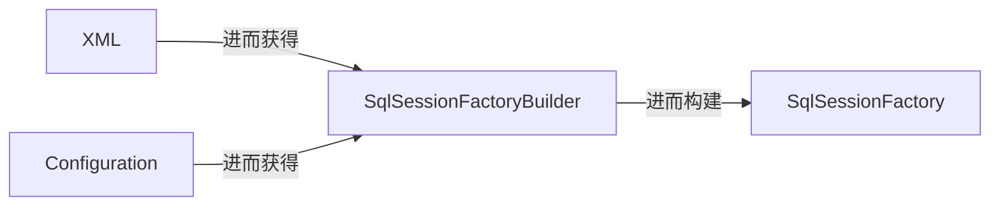

# MyBatisPlus 快速入门

## 1.MyBatisPlus 全面概述

顺序来说：

-   [JDBC, Java Database Connectivity, Java 数据库连接](https://docs.oracle.com/javase/8/docs/technotes/guides/jdbc/) 基于通用数据库访问标准（本质上是一个 `API` 规范）本身不包含数据库驱动，它需要具体数据库驱动 `Driver` 来结合使用，最终完成完整的数据库通信。
-   [MyBatis](https://mybatis.org/mybatis-3/getting-started.html) 是基于 `JDBC` 的封装，因此我们有必要先了解 `JDBC` 后，再来理解为什么需要使用 `MyBatis` 来封装 `JDBC`。
-   [MyBatisPlus](https://baomidou.com/introduce/) 是基于 `MyBatis` 的拓展，在理解了 `MyBatis` 后，再根据官方的描述来感知 `MyBatisPlus` 对于 `MyBatis` 的优化。

## 2.MyBatisPlus 基本功能

待补充...

## 3.MyBatisPlus 使用教程

### 3.1.基础知识

#### 3.1.1.JDBC

##### 3.1.1.1.理解

-   **从组件上来理解**：`JDBC` 是 `Java DataBase Connectivity` 的缩写，它是 `Java` 程序访问数据库的标准接口。使用 `Java` 程序访问数据库时，`Java` 代码并不是直接通过 `TCP` 连接去访问数据库，而是通过 `JDBC` 接口来访问，而 `JDBC` 接口则通过 `JDBC Driver` 来实现真正对数据库的访问。

    而具体的 `JDBC Driver` 是由数据库厂商提供的。例如 `MySQL` 的 `JDBC` 驱动由 `Oracle` 提供。因此，访问某个具体的数据库，我们只需要引入该厂商提供的 `JDBC` 驱动，就可以通过 `JDBC` 接口来访问，这样保证了 `Java` 程序编写的是一套数据库访问代码，却可以访问各种不同的数据库，因为他们都提供了标准的 `JDBC Driver`。

    ```mermaid
    graph LR
    A["Java App\n(Developer 开发 app)"]
    B["JDBC Interface\n(Oracle 提供 java.sql)"]
    C["JDBC Driver\n(Vendor 提供 MySQL Driver))"]
    D["Database\n(Vendor 提供 MySQL Database)"]
    A --> B --> C -->|"TCP/..."| D
    
    ```

-   **从代码上来理解**：从代码来看，我们在 `Java` 代码中如果要访问 `MySQL`，那么必须编写代码操作 `JDBC` 接口。注意到 `JDBC` 接口是 `Java` 标准库自带的，所以可以直接编译。`Java` 标准库自带的 `JDBC` 接口其实就是定义了一组接口，而某个具体的 `JDBC` 驱动其实就是实现了这些接口的类。而一个 `MySQL` 的 `JDBC` 的驱动就是一个 `.jar` 包，它本身也是纯 `Java` 编写的。

    我们自己编写的代码只需要引用 `Java` 标准库提供的 `java.sql` 包下面的相关接口，由此再间接地通过 `MySQL Driver` 的 `.jar` 包通过网络访问 `MySQL` 服务器，所有复杂的网络通讯都被封装到 `JDBC Driver` 中。因此，`Java` 程序本身只需要引入一个 `MySQL` 驱动的 `.jar` 包就可以正常访问 `MySQL` 服务器。

使用 `JDBC` 的好处是，各数据库厂商使用相同的接口，`Java` 代码不需要针对不同数据库分别开发。而且 `Java` 程序在编译期仅依赖 `java.sql` 包，不依赖具体数据库的 `.jar` 包。也可随时替换底层数据库，访问数据库的 `Java` 代码基本不变。说白了就是分层软件设计的好处，网络协议、操作系统...就是经典的例子。

##### 3.1.1.2.使用

###### 3.1.1.2.1.基本接口

|              | `java.sql`                                   | `javax.sql`                     |
| ------------ | -------------------------------------------- | ------------------------------- |
| **作用**     | 提供基础的 `JDBC API`                        | 提供高级 `JDBC Expand`          |
| **主要功能** | 连接数据库、执行 `SQL` 语句、处理查询结果... | 数据源管理、连接池、事务管理... |

在使用接口之前，我给您我的开发环境的配置，最好和我的配置一样。

```shell
# 确认开发环境的配置
$ java --version
openjdk 17.0.13 2024-10-15
OpenJDK Runtime Environment (build 17.0.13+11-Ubuntu-2ubuntu124.04)
OpenJDK 64-Bit Server VM (build 17.0.13+11-Ubuntu-2ubuntu124.04, mixed mode, sharing)

$ mvn --version
Apache Maven 3.9.9 (8e8579a9e76f7d015ee5ec7bfcdc97d260186937)
Maven home: /home/ljp/tools/maven/apache-maven-3.9.9
Java version: 17.0.13, vendor: Ubuntu, runtime: /usr/lib/jvm/java-17-openjdk-amd64
Default locale: zh_CN, platform encoding: UTF-8
OS name: "linux", version: "6.8.0-51-generic", arch: "amd64", family: "unix"

$ mysql --version
mysql  Ver 8.0.40-0ubuntu0.24.04.1 for Linux on x86_64 ((Ubuntu))

```

在确定本机拥有以上环境后，使用 `Maven` 快速创建一个 `Java` 项目。

```shell
# 创建项目
$ mvn archetype:generate -DgroupId=com.work -DartifactId=work-jdbc-test -DarchetypeArtifactId=maven-archetype-quickstart -DarchetypeVersion=1.5 -DinteractiveMode=false

```

并且使用以下 `pom.xml` 文件来导入 `JDBC` 对应的驱动依赖 `mysql-connector-java`，这样在我们使用 `java.sql` 接口类时才能有对应的实现类。

```xml
<!-- pom.xml -->
<!--
 'xmlns=' XML 命名空间
 'xmlns:xsi' XML Schema 实例命名空间
 'xsi:schemaLocation=' 指定 XML Schema 位置
 这些声明的主要作用是帮助 XML 解析器正确地验证和处理 Maven POM 文件，确保它符合 Maven 规范。
 -->
<project
         xmlns="http://maven.apache.org/POM/4.0.0"
         xmlns:xsi="http://www.w3.org/2001/XMLSchema-instance"
         xsi:schemaLocation="http://maven.apache.org/POM/4.0.0 http://maven.apache.org/maven-v4_0_0.xsd"
         >
    <!-- 指定 Maven 项目对象模型 POM 的版本 -->
    <modelVersion>4.0.0</modelVersion>
    <!-- 定义项目的所属组织 -->
    <groupId>com.work</groupId>
    <!-- 定义项目的具体名称 -->
    <artifactId>work-project</artifactId>
    <!-- 填写依赖的 Java 版本和使用的字符集 -->
    <properties>
        <project.build.sourceEncoding>UTF-8</project.build.sourceEncoding>
        <maven.compiler.release>17</maven.compiler.release>
    </properties>
    <!-- 指定项目构建的打包类型为 .jar -->
    <packaging>jar</packaging>
    <!-- 定义项目的版本号 -->
    <version>0.1.0</version>
    <!-- 和 artifactId 的名称保持一样即可(这是一个可选字段) -->
    <name>work-project</name>
    <!-- 填写为本项目制定的官方网址 -->
    <url>https://work.com</url>
    <!-- 填写所有依赖项的容器, 在内部填写一个一个 dependency 标签 -->
    <dependencies>
        <!-- 依赖名称: 依赖官网/依赖源码 -->

        <!-- Junit: https://junit.org/junit5/ -->
        <dependency>
            <groupId>org.junit.jupiter</groupId>
            <artifactId>junit-jupiter-api</artifactId>
            <version>5.9.3</version>
            <scope>test</scope> <!-- 如果不指定 scope 会默认将依赖设置为 compile 生命阶段, 因此设置 scope 本质是确保某些依赖只在某个阶段被使用 -->
        </dependency>
        
        <!-- JDBC: https://central.sonatype.com/artifact/com.mysql/mysql-connector-j -->
        <dependency>
          <groupId>com.mysql</groupId>
          <artifactId>mysql-connector-j</artifactId>
          <version>9.2.0</version>
          <scope>runtime</scope>
        </dependency>

    </dependencies>
    <!-- 构建插件 -->
    <build>
        <plugins>
            <plugin>
                <groupId>org.apache.maven.plugins</groupId>
                <artifactId>maven-assembly-plugin</artifactId>
                <version>3.1.0</version>
                <configuration>
                    <archive>
                        <manifestEntries>
                            <!-- 填写启动类 -->
                            <Main-Class>com.work.App</Main-Class>
                        </manifestEntries>
                    </archive>
                    <descriptorRefs>
                        <!-- 集成的最终 .jar 包名称 -->
                        <descriptorRef>jar-with-dependencies</descriptorRef>
                    </descriptorRefs>
                </configuration>
                <executions>
                    <execution>
                        <phase>package</phase>
                        <goals>
                            <goal>single</goal>
                        </goals>
                    </execution>
                </executions>
            </plugin>
        </plugins>
    </build>
</project>

```

准备一个数据库中的数据表，并导入一些假数据。

```sql
-- work-jdbc-test.sql
-- 创建数据库 work-jdbc-test
DROP DATABASE IF EXISTS work_jdbc_test; -- 这里故意在数据库存在时直接删除整个数据库, 方便我们进行重复的调试
CREATE DATABASE work_jdbc_test;

-- 创建一个登录用户
CREATE USER IF NOT EXISTS limou@'%' IDENTIFIED BY '123456';
GRANT ALL PRIVILEGES ON work_jdbc_test.* TO limou@'%' WITH GRANT OPTION;
FLUSH PRIVILEGES;

-- 创建表 students
USE work_jdbc_test;
CREATE TABLE students (
  id BIGINT AUTO_INCREMENT NOT NULL,
  name VARCHAR(50) NOT NULL,
  gender TINYINT(1) NOT NULL,
  grade INT NOT NULL,
  score INT NOT NULL,
  PRIMARY KEY(id)
) Engine=INNODB DEFAULT CHARSET=UTF8;

-- 插入初始数据
INSERT INTO students (name, gender, grade, score) VALUES ('小明', 1, 1, 88);
INSERT INTO students (name, gender, grade, score) VALUES ('小红', 1, 1, 95);
INSERT INTO students (name, gender, grade, score) VALUES ('小军', 0, 1, 93);
INSERT INTO students (name, gender, grade, score) VALUES ('小白', 0, 1, 100);
INSERT INTO students (name, gender, grade, score) VALUES ('小牛', 1, 2, 96);
INSERT INTO students (name, gender, grade, score) VALUES ('小兵', 1, 2, 99);
INSERT INTO students (name, gender, grade, score) VALUES ('小强', 0, 2, 86);
INSERT INTO students (name, gender, grade, score) VALUES ('小乔', 0, 2, 79);
INSERT INTO students (name, gender, grade, score) VALUES ('小青', 1, 3, 85);
INSERT INTO students (name, gender, grade, score) VALUES ('小王', 1, 3, 90);
INSERT INTO students (name, gender, grade, score) VALUES ('小林', 0, 3, 91);
INSERT INTO students (name, gender, grade, score) VALUES ('小贝', 0, 3, 77);

```

```shell
# 创建数据库中的数据表并导入数据
$ mysql -u root -p < work-jdbc-test.sql
```

接下来我直接使用代码来教会您使用 `JDBC` 接口来调用 `JDBC Driver` 最终达到操作数据库的目的，看代码学起来会非常快，不是么。

```java
// App.java
package com.work;

import java.sql.*;

public class App {
    public static void main(String[] args) {
        System.out.println("Hello JDBC!");

        // 1. 获取链接
        // Connection 代表一个 JDBC 连接, 其实就是获得 Java 程序和 MySQL 直接的 TCP 连接
        // 因此打开一个 Connection 时, 需要准备 url、user、passwd(根据厂家规定来设置), 这样才能成功连接
        // 而连接到数据库的本 Java 程序其实也被叫做 MySQL 的客户端
        String JDBC_URL = "jdbc:mysql://localhost:3306/work_jdbc_test";
        String JDBC_USER = "limou";
        String JDBC_PASSWORD = "123456";
        try (Connection conn = DriverManager.getConnection(JDBC_URL, JDBC_USER, JDBC_PASSWORD)) { // try 可以确保执行完毕后自动将比较昂贵的 conn 链接释放, 下面的 try 也是类似

            // 2. 使用链接
            try (Statement stmt = conn.createStatement()) { // 获取到 Statement 语句对象用于后续执行语句
                String searchGender = "gender=1"; // 需要传递的筛选条件 gender 变量
                try (ResultSet resu = stmt.executeQuery("SELECT id, grade, name, gender FROM students WHERE " + searchGender)) { // 拼接封装需要查询的原生查询语句的结果集
                    int i = 0;
                    while (resu.next()) { // 循环执行, resu.next() 用于判断是否有下一行数据并获取该行数据
                        // 必须根据 SELECT 列的对应位置来调用 getxxx() 否则对应位置的数据类型不对将报错
                        // 需要并且索引要从 1 开始, 可以理解为获取下一行
                        long id = resu.getLong(1);
                        long grade = resu.getLong(2);
                        String name = resu.getString(3);
                        int gender = resu.getInt(4);
                        i++;
                        System.out.println(i + ": " + id + " " + grade + " " + name + " " + gender);
                    }

                }
                catch (SQLException e) {
                    System.out.println("Error executing query: " + e.getMessage());
                }

            }
            catch (SQLException e) {
                System.out.println("Error creating statement: " + e.getMessage());
            }

        }
        catch (SQLException e) {
            System.out.println("Error connecting to database: " + e.getMessage());
        }

        // 关闭连接
        // 由于 Connection 实现了 AutoCloseable 接口中的 void close(), 因此不管是否抛出异常都会在 try 中保证 conn.close() 的使用, 进而释放链接(而 Statement 和 ResultSet 这两个类也是类似, 无需我们进行手动释放)
    }
}

```

以上我们就把常见的接口实践了一遍，接下来就是检验我们成果的时候了，运行一下吧。

```shell
Hello JDBC!
1: 1 1 小明 1
2: 2 1 小红 1
3: 5 2 小牛 1
4: 6 2 小兵 1
5: 9 3 小青 1
6: 10 3 小王 1

```

不过上面的代码是由 `SQL` 注入的风险的，因为万一上面的 `searchGender` 变量是用户传递的，你永远也不知道用户传递的是不是，使用 `PreparedStatement` 可以避免 `SQL` 注入，其实现原理是通过以下几个关键步骤来确保安全的。

-   **SQL 语句和参数分离**：当我们使用 `PreparedStatement` 时，`SQL` 查询本身和用户输入的参数是分开的，`SQL` 查询语句使用占位符 (`?`) 来代替具体的参数值
-   **预编译 SQL 语句**：`PreparedStatement` 会在传递 `SQL` 语句给数据库之前，先对 `SQL` 语句进行预编译，生成执行计划。预编译的过程确保了 `SQL` 语句的结构是固定的，无法被用户输入修改，这意味着 `SQL` 注入攻击无法通过拼接恶意 `SQL` 来改变查询语句的结构
-   **绑定参数**：然后通过 `PreparedStatement` 的 `setXXX()` 方法（如 `setObject()`, `setString()`, `setInt()` 等）将用户输入的值绑定到 `SQL` 查询中的占位符上。这样，数据库会将用户输入的值视为单独的参数，而不是 `SQL` 代码，这意味着 SQL 查询中的 `?` 占位符会被实际的参数值替代，而不改变查询的逻辑结构
-   **输入数据的转义处理**：`PreparedStatement` 会自动对绑定的参数进行处理，确保它们作为值而非 `SQL` 代码执行。具体来说，`PreparedStatement` 会对传入的参数值进行转义或编码处理，确保如果用户输入中含有特殊字符（例如单引号 `'`、分号 `;` 等）时，这些字符不会被当作 `SQL` 语句的一部分来执行。它们会被当作普通的数据处理，从而避免 `SQL` 注入攻击
-   **执行查询**：一旦参数被绑定，数据库就会按预编译的 `SQL` 语句执行查询。数据库执行时会严格按照 `SQL` 语句的结构来处理，不会受到任何参数值的影响。

因此上述的代码可以修改为如下的版本，以避免 `SQL` 注入。同时，我还加入了一些别的操作，让您快速理解 `JDBC` 中最为基本的操作。

```java
// App.java
package com.work;

import java.sql.*;

public class App {
    public static void main(String[] args) {
        System.out.println("Hello JDBC!");

        // 1. 获取链接
        // Connection 代表一个 JDBC 连接, 其实就是获得 Java 程序和 MySQL 直接的 TCP 连接
        // 因此打开一个 Connection 时, 需要准备 url、user、passwd(根据厂家规定来设置), 这样才能成功连接
        // 而连接到数据库的本 Java 程序其实也被叫做 MySQL 的客户端
        String JDBC_URL = "jdbc:mysql://localhost:3306/work_jdbc_test";
        String JDBC_USER = "limou";
        String JDBC_PASSWORD = "123456";
        // try 可以确保执行完毕后自动将比较昂贵的 conn 链接释放, 下面的 try 也是类似
        try (Connection conn = DriverManager.getConnection(
                JDBC_URL,
                JDBC_USER,
                JDBC_PASSWORD
        )) {
            // 2. 使用链接
            // (1) 做查询操作
            // a. SQL 模板
            String searchSql = "SELECT id, grade, name, gender FROM students WHERE gender=?";

            // b. 数据传递
            int searchGender = 0;

            // c. 创建语句
            try (PreparedStatement prep = conn.prepareStatement(searchSql)) {

                // d. 绑定参数
                prep.setInt(1, searchGender); // 使用 setXXX 方法绑定参数，避免 SQL 注入

                // e. 执行语句
                try (ResultSet resu = prep.executeQuery()) {
                    int i = 0;
                    while (resu.next()) {
                        /*
                        循环执行, resu.next() 用于判断是否有下一行数据并获取该行数据
                        必须根据 SELECT 列的对应位置来调用 getxxx() 否则对应位置的数据类型不对将报错
                        需要并且索引要从 1 开始, 可以理解为获取下一行
                        */
                        long id = resu.getLong(1);
                        long grade = resu.getLong(2);
                        String name = resu.getString(3);
                        int gender = resu.getInt(4);
                        i++;
                        System.out.println(i + ": " + id + " " + grade + " " + name + " " + gender);
                    }
                }
                catch (SQLException e) {
                    System.out.println("Error executing query: " + e.getMessage());
                }
            }
            catch (SQLException e) {
                System.out.println("Error creating search statement: " + e.getMessage());
            }

            // (2) 做插入操作
            // a. SQL 模板
            String installSql = "INSERT INTO students (grade, name, gender, score) VALUES (?, ?, ?, ?)";

            // b. 数据传递
            int installGrade = 1;
            String installName = "小某";
            int installGender = 1;
            int installScore = 100;

            // c. 创建语句
            long id = -1; // 存储一份下面插入记录的 id 值, 留作后续根据 id 值对该记录进行操作
            try (PreparedStatement prep = conn.prepareStatement(
                    installSql,
                    Statement.RETURN_GENERATED_KEYS // 由于我没有指定传递 installId, 所以 MySQL 会自动增长 id 值, 因此这里设置的状态可以在插入后立刻获取到插入时的 id 值
            )) {
                // d. 绑定参数
                prep.setInt(1, installGrade); // 需要传递的插入数据 installGrade 变量
                prep.setString(2, installName); // 需要传递的插入数据 installName 变量
                prep.setInt(3, installGender); // 需要传递的插入数据 installGender 变量
                prep.setInt(4, installScore); // 需要传递的插入数据 installScore 变量

                // e. 执行语句
                int n = prep.executeUpdate();
                if (n > 0) {
                    System.out.println("执行成功，并且影响到了 " + n + " 行数据");
                }
                else if (n == 0) {
                    System.out.println("执行成功，但是没有影响到任何数据");
                }
                else /* n < 0 */ {
                    System.out.println("执行成功，但是执行和行无关的操作");
                }

                // 获取上述插入语句的 id 值
                /*
                或许有人会问根据其他字段来查询 id 不也可以么,
                为何需要使用 Statement.RETURN_GENERATED_KEYS 和 prep.getGeneratedKeys(),
                这难道不费劲么?
                可问题是, 如果插入的两个记录除了 id 值其他数据都完全一模一样,
                那么在并发场景下, 就会无法准确获取您所插入的记录的 id 值,
                因此前面的两处做法保证了, 在任何场景下, 您都可以获取到您所插入记录的 id 值.
                */
                try (ResultSet resu = prep.getGeneratedKeys()) {
                    if (resu.next()) {
                        id = resu.getLong(1);
                        System.out.println("Get value of id: " + id);
                    }
                    /*
                    如果您前面使用了多个插入语句,
                    那么只需要保证在同一个 PreparedStatement 插入里,
                    且每次插入结束都使用 prep.addBatch() 做添加到批处理中,
                    在 prep.executeBatch() 后,
                    就可以使用 prep.getGeneratedKeys() 来进行多份 id 值获取
                    */
                }
                catch (SQLException e) {
                    System.out.println("Error executing id query: " + e.getMessage());
                }
            }
            catch (SQLException e) {
                System.out.println("Error creating install statement: " + e.getMessage());
            }

            // (3) 做修改操作
            // a. SQL 模板
            String updateSql = "UPDATE students SET name=? WHERE id=?";

            // b. 数据传递
            String updateName = "limou";
            long updateId = id;

            // c. 创建语句
            try (PreparedStatement prep = conn.prepareStatement(updateSql)) {
                // d. 绑定参数
                prep.setString(1, updateName);
                prep.setLong(2, updateId);

                // e. 执行语句
                int n = prep.executeUpdate();
                if (n > 0) {
                    System.out.println("执行成功，并且影响到了 " + n + " 行数据");
                }
                else if (n == 0) {
                    System.out.println("执行成功，但是没有影响到任何数据");
                }
                else /* n < 0 */ {
                    System.out.println("执行成功，但是执行和行无关的操作");
                }
            }
            catch (SQLException e) {
                System.out.println("Error creating update statement: " + e.getMessage());
            }

            // (4) 做删除操作
            // a. SQL 模板
            String deleteSql = "DELETE FROM students WHERE id=?";

            // b. 数据传递
            long deleteId = id;

            // c. 创建语句
            try (PreparedStatement ps = conn.prepareStatement(deleteSql)) {
                // d. 绑定参数
                ps.setLong(1, deleteId);

                // e. 执行语句
                int n = ps.executeUpdate();
                if (n > 0) {
                    System.out.println("执行成功，并且影响到了 " + n + " 行数据");
                }
                else if (n == 0) {
                    System.out.println("执行成功，但是没有影响到任何数据");
                }
                else /* n < 0 */ {
                    System.out.println("执行成功，但是执行和行无关的操作");
                }
            }
            catch (SQLException e) {
                System.out.println("Error creating delete statement: " + e.getMessage());
            }

            /*
            其实从这里也可以观察出 JDBC 认为数据库基本操作只有查询和更新
            */

            // (5) 做事务操作
            /*
            数据库事务是由若干个 SQL 语句构成的一个操作序列,
            数据库系统保证在一个事务中的所有 SQL 要么全部执行成功, 要么全部不执行,
            即数据库事务具有 ACID 特性:
            a.Atomicity: 原子性
            b.Consistency: 一致性
            c.Isolation: 隔离性
            d.Durability: 持久性

            而根据业务需要有以下四种隔离级别, 可以应对不同的场景
            隔离级别    有脏读 不复读 有幻读
            读未提交    可能会 可能会 可能会
            读已提交    已解决 可能会 可能会
            可重复读    已解决 已解决 可能会 (default)
            可串行化    已解决 已解决 已解决

            而我们之前执行的 sql 语句默认启动事务, 执行一次就提交一次,
            因此而单条 sql 失败也会自动回滚该单条语句,
            而如果我们关闭自动提交, 就需要我们自己来把控事务的提交时机以及失败时的回滚
            */

            // 设定隔离级别为READ COMMITTED:
            // conn.setTransactionIsolation(Connection.TRANSACTION_READ_COMMITTED); // 如果没有调用本方法, 那么会使用数据库的默认隔离级别, MySQL 默认隔离级别是 Connection.REPEATABLE_READ

            // 关闭自动提交以自己把控时的执行长度
            try {
                // 关闭自动提交
                conn.setAutoCommit(false);

                // 执行多条 SQL 语句
                // search
                // insert
                // update
                // delete

                // 提交事务:
                conn.commit();
            }
            catch (SQLException e) {
                // 出现异常需要回滚事务
                System.out.println("Error database transaction: " + e.getMessage());
                conn.rollback();
            }
            finally {
                // 恢复自动提交
                conn.setAutoCommit(true);
            }
        }
        catch (SQLException e) {
            System.out.println("Error connecting to database: " + e.getMessage());
        }
    }
}

```

>   [!IMPORTANT]
>
>   补充：`setInt` 通过 `JDBC` 驱动绑定参数，而不是直接拼接 `SQL` 语句，从而防止 `SQL` 注入。数据库会预编译 `SQL` 语句，参数不会改变 `SQL` 逻辑，只会作为变量传递。并且 `JDBC` 通过二进制协议传输参数，不会将参数解析为 `SQL` 语法。

###### 3.1.1.2.2.链接池化

这里还有再补充一些，链接是比较昂贵的资源，如果反复创建就会导致低效。因此我们需要有复用已经存在的链接的能力，那么我们就需要有一个连接池，这个连接池用 `Java` 来维护是最好的，比较出名的链接池技术就是引入 `HikariCP`，下面就是我们需要修改的 `pom.xml` 文件。

```xml
<!-- pom.xml -->
<!--
 'xmlns=' XML 命名空间
 'xmlns:xsi' XML Schema 实例命名空间
 'xsi:schemaLocation=' 指定 XML Schema 位置
 这些声明的主要作用是帮助 XML 解析器正确地验证和处理 Maven POM 文件，确保它符合 Maven 规范。
 -->
<project
        xmlns="http://maven.apache.org/POM/4.0.0"
        xmlns:xsi="http://www.w3.org/2001/XMLSchema-instance"
        xsi:schemaLocation="http://maven.apache.org/POM/4.0.0 http://maven.apache.org/maven-v4_0_0.xsd"
>
  <!-- 指定 Maven 项目对象模型 POM 的版本 -->
  <modelVersion>4.0.0</modelVersion>
  <!-- 定义项目的所属组织 -->
  <groupId>com.work</groupId>
  <!-- 定义项目的具体名称 -->
  <artifactId>work-project-test</artifactId>
  <!-- 填写依赖的 Java 版本和使用的字符集 -->
  <properties>
    <project.build.sourceEncoding>UTF-8</project.build.sourceEncoding>
    <maven.compiler.release>17</maven.compiler.release>
  </properties>
  <!-- 指定项目构建的打包类型为 .jar -->
  <packaging>jar</packaging>
  <!-- 定义项目的版本号 -->
  <version>0.1.0</version>
  <!-- 和 artifactId 的名称保持一样即可(这是一个可选字段) -->
  <name>work-project-test</name>
  <!-- 填写为本项目制定的官方网址 -->
  <url>https://work.com</url>
  <!-- 填写所有依赖项的容器, 在内部填写一个一个 dependency 标签 -->
  <dependencies>
    <!-- 依赖名称: 依赖官网/依赖源码 -->

    <!-- Junit: https://junit.org/junit5/ -->
    <dependency>
      <groupId>org.junit.jupiter</groupId>
      <artifactId>junit-jupiter-api</artifactId>
      <version>5.9.3</version>
      <scope>test</scope> <!-- 如果不指定 scope 会默认将依赖设置为 compile 生命阶段, 因此设置 scope 本质是确保某些依赖只在某个阶段被使用 -->
    </dependency>

    <!-- JDBC: https://central.sonatype.com/artifact/com.mysql/mysql-connector-j -->
    <dependency>
      <groupId>com.mysql</groupId>
      <artifactId>mysql-connector-j</artifactId>
      <version>9.2.0</version>
      <scope>runtime</scope>
    </dependency>

    <!-- HikariCP: https://mvnrepository.com/artifact/com.zaxxer/HikariCP -->
    <dependency>
      <groupId>com.zaxxer</groupId>
      <artifactId>HikariCP</artifactId>
      <version>6.2.1</version>
    </dependency>

    <!-- SLF4J: https://github.com/qos-ch/slf4j -->
    <dependency>
      <groupId>org.slf4j</groupId>
      <artifactId>slf4j-api</artifactId>
      <version>1.7.36</version>
    </dependency>

    <!-- logback: https://github.com/qos-ch/logback -->
    <dependency>
      <groupId>ch.qos.logback</groupId>
      <artifactId>logback-classic</artifactId>
      <version>1.2.10</version>
    </dependency>

  </dependencies>
  <!-- 构建插件 -->
  <build>
    <plugins>
      <plugin>
        <groupId>org.apache.maven.plugins</groupId>
        <artifactId>maven-assembly-plugin</artifactId>
        <version>3.1.0</version>
        <configuration>
          <archive>
            <manifestEntries>
              <!-- 填写启动类 -->
              <Main-Class>com.work.App</Main-Class>
            </manifestEntries>
          </archive>
          <descriptorRefs>
            <!-- 集成的最终 .jar 包名称 -->
            <descriptorRef>jar-with-dependencies</descriptorRef>
          </descriptorRefs>
        </configuration>
        <executions>
          <execution>
            <phase>package</phase>
            <goals>
              <goal>single</goal>
            </goals>
          </execution>
        </executions>
      </plugin>
    </plugins>
  </build>
</project>

```

>   [!WARNING]
>
>   注意：上述的日志其实是 `HikariCP` 中存在的日志组件，您需要一起引入以方便 `HikariCP` 打印一些日志信息。

```java
// App.java
package com.work;

import com.zaxxer.hikari.HikariConfig;
import com.zaxxer.hikari.HikariDataSource;
import com.zaxxer.hikari.HikariPoolMXBean;

import java.sql.*;

public class App {
    public static void main(String[] args) {
        System.out.println("Hello JDBC!");

        // 1. 获取链接
        /*
        Connection 代表一个 JDBC 连接, 其实就是获得 Java 程序和 MySQL 直接的 TCP 连接
        因此打开一个 Connection 时, 需要准备 url、user、passwd(根据厂家规定来设置), 这样才能成功连接
        而连接到数据库的本 Java 程序其实也被叫做 MySQL 的客户端
        */
        String JDBC_URL = "jdbc:mysql://localhost:3306/work_jdbc_test";
        String JDBC_USER = "limou";
        String JDBC_PASSWORD = "123456";

        /* 这里新添加了连接池的设置, 改用连接池的方式来管理 MySQL */
        HikariConfig config = new HikariConfig();
        config.setJdbcUrl(JDBC_URL);
        config.setUsername(JDBC_USER);
        config.setPassword(JDBC_PASSWORD);
        config.setMaximumPoolSize(10); // 本链接池最多允许的链接数为 10 个, 这一句代码和 config.addDataSourceProperty("maximumPoolSize", "10") 等价, 但是直接写字符串过于灵活有可能难以维护
        config.setMinimumIdle(2); // 本链接池最少存在的链接接数为 2 个
        config.setIdleTimeout(60000); // 如果链接空闲超时 60 秒就会被销毁无法再次被复用
        config.setConnectionTimeout(1000); // 无法获得链接超时 1 秒时就会抛出异常, 以提示本链接池中链接资源紧缺, 超出最大的设置值

        // 创建 DataSource 也是一个非常昂贵的操作, 所以通常 DataSource 实例总是作为一个全局变量存储, 并贯穿整个应用程序的生命周期
        try (HikariDataSource hkds = new HikariDataSource(config)) {
            // try 可以确保执行完毕后自动将比较昂贵的 conn 链接释放, 下面的 try 也是类似
            try (
                    Connection conn = hkds.getConnection()
                    // Connection conn = DriverManager.getConnection(JDBC_URL, JDBC_USER, JDBC_PASSWORD)
            ) {
                // 2. 使用链接
                /* 不过使用链接之前先检查一下我们的链接池状态 */
                Connection tempConn = hkds.getConnection();
                tempConn.close(); // 立刻打开并且关闭一个链接, 因为链接池不是一开始就创建两个链接的, 而是同时使用 2 条链接之后, 无论链接还有多少条再使用, 都会保留至少两个链接以供复用, 您可以注释掉这一句以查看后续打印的 totalConnections 是不是为 1, 如果没有注释就是 2

                // 获取 HikariPoolMXBean 以获取连接池中的活动连接数、空闲连接数、最大连接数是否设置成功
                HikariPoolMXBean poolMXBean = hkds.getHikariPoolMXBean();
                int activeConnections = poolMXBean.getActiveConnections(); // 获取当前池中活动连接的数量, 预计为 1
                int idleConnections = poolMXBean.getIdleConnections(); // 获取当前池中空闲连接的数量, 预计为 1
                int totalConnections = poolMXBean.getTotalConnections(); // 获取连接池中的总连接数(包括活动连接和空闲连接), 预计为 2
                int threadsAwaitingConnection = poolMXBean.getThreadsAwaitingConnection(); // 获取等待连接的线程数量(如果连接池中的连接已经被用尽, 这些线程会被阻塞直到有空闲连接可用), 预计为 0
                System.out.println("Active connections: " + activeConnections);
                System.out.println("Idle connections: " + idleConnections);
                System.out.println("Total connections: " + totalConnections);
                System.out.println("Threads awaiting connections: " + threadsAwaitingConnection);

                // (1) 做查询操作
                // a. SQL 模板
                String searchSql = "SELECT id, grade, name, gender FROM students WHERE gender=?";

                // b. 数据传递
                int searchGender = 0;

                // c. 创建语句
                try (PreparedStatement prep = conn.prepareStatement(searchSql)) {

                    // d. 绑定参数
                    prep.setInt(1, searchGender); // 使用 setXXX 方法绑定参数，避免 SQL 注入

                    // e. 执行语句
                    try (ResultSet resu = prep.executeQuery()) {
                        int i = 0;
                        while (resu.next()) {
                            /*
                            循环执行, resu.next() 用于判断是否有下一行数据并获取该行数据
                            必须根据 SELECT 列的对应位置来调用 getxxx() 否则对应位置的数据类型不对将报错
                            需要并且索引要从 1 开始, 可以理解为获取下一行
                            */
                            long id = resu.getLong(1);
                            long grade = resu.getLong(2);
                            String name = resu.getString(3);
                            int gender = resu.getInt(4);
                            i++;
                            System.out.println(i + ": " + id + " " + grade + " " + name + " " + gender);
                        }
                    }
                    catch (SQLException e) {
                        System.out.println("Error executing query: " + e.getMessage());
                    }
                }
                catch (SQLException e) {
                    System.out.println("Error creating search statement: " + e.getMessage());
                }

                // (2) 做插入操作
                // a. SQL 模板
                String installSql = "INSERT INTO students (grade, name, gender, score) VALUES (?, ?, ?, ?)";

                // b. 数据传递
                int installGrade = 1;
                String installName = "小某";
                int installGender = 1;
                int installScore = 100;

                // c. 创建语句
                long id = -1; // 存储一份下面插入记录的 id 值, 留作后续根据 id 值对该记录进行操作
                try (PreparedStatement prep = conn.prepareStatement(
                        installSql,
                        Statement.RETURN_GENERATED_KEYS // 由于我没有指定传递 installId, 所以 MySQL 会自动增长 id 值, 因此这里设置的状态可以在插入后立刻获取到插入时的 id 值
                )) {
                    // d. 绑定参数
                    prep.setInt(1, installGrade); // 需要传递的插入数据 installGrade 变量
                    prep.setString(2, installName); // 需要传递的插入数据 installName 变量
                    prep.setInt(3, installGender); // 需要传递的插入数据 installGender 变量
                    prep.setInt(4, installScore); // 需要传递的插入数据 installScore 变量

                    // e. 执行语句
                    int n = prep.executeUpdate();
                    if (n > 0) {
                        System.out.println("执行成功，并且影响到了 " + n + " 行数据");
                    } else if (n == 0) {
                        System.out.println("执行成功，但是没有影响到任何数据");
                    } else /* n < 0 */ {
                        System.out.println("执行成功，但是执行和行无关的操作");
                    }

                    // 获取上述插入语句的 id 值
                    /*
                    或许有人会问根据其他字段来查询 id 不也可以么,
                    为何需要使用 Statement.RETURN_GENERATED_KEYS 和 prep.getGeneratedKeys(),
                    这难道不费劲么?
                    可问题是, 如果插入的两个记录除了 id 值其他数据都完全一模一样,
                    那么在并发场景下, 就会无法准确获取您所插入的记录的 id 值,
                    因此前面的两处做法保证了, 在任何场景下, 您都可以获取到您所插入记录的 id 值.
                    */
                    try (ResultSet resu = prep.getGeneratedKeys()) {
                        if (resu.next()) {
                            id = resu.getLong(1);
                            System.out.println("Get value of id: " + id);
                        }
                        /*
                        如果您前面使用了多个插入语句,
                        那么只需要保证在同一个 PreparedStatement 插入里,
                        且每次插入结束都使用 prep.addBatch() 做添加到批处理中,
                        在 prep.executeUpdate() 后,
                        就可以使用 prep.getGeneratedKeys() 来进行多份 id 值获取
                        */
                    }
                    catch (SQLException e) {
                        System.out.println("Error executing id query: " + e.getMessage());
                    }
                }
                catch (SQLException e) {
                    System.out.println("Error creating install statement: " + e.getMessage());
                }

                // (3) 做修改操作
                // a. SQL 模板
                String updateSql = "UPDATE students SET name=? WHERE id=?";

                // b. 数据传递
                String updateName = "limou";
                long updateId = id;

                // c. 创建语句
                try (PreparedStatement prep = conn.prepareStatement(updateSql)) {
                    // d. 绑定参数
                    prep.setString(1, updateName);
                    prep.setLong(2, updateId);

                    // e. 执行语句
                    int n = prep.executeUpdate();
                    if (n > 0) {
                        System.out.println("执行成功，并且影响到了 " + n + " 行数据");
                    } else if (n == 0) {
                        System.out.println("执行成功，但是没有影响到任何数据");
                    } else /* n < 0 */ {
                        System.out.println("执行成功，但是执行和行无关的操作");
                    }
                }
                catch (SQLException e) {
                    System.out.println("Error creating update statement: " + e.getMessage());
                }

                // (4) 做删除操作
                // a. SQL 模板
                String deleteSql = "DELETE FROM students WHERE id=?";

                // b. 数据传递
                long deleteId = id;

                // c. 创建语句
                try (PreparedStatement ps = conn.prepareStatement(deleteSql)) {
                    // d. 绑定参数
                    ps.setLong(1, deleteId);

                    // e. 执行语句
                    int n = ps.executeUpdate();
                    if (n > 0) {
                        System.out.println("执行成功，并且影响到了 " + n + " 行数据");
                    } else if (n == 0) {
                        System.out.println("执行成功，但是没有影响到任何数据");
                    } else /* n < 0 */ {
                        System.out.println("执行成功，但是执行和行无关的操作");
                    }
                }
                catch (SQLException e) {
                    System.out.println("Error creating delete statement: " + e.getMessage());
                }

                /*
                其实从这里也可以观察出 JDBC 认为数据库基本操作只有查询和更新
                */

                // (5) 做事务操作
                /*
                数据库事务是由若干个 SQL 语句构成的一个操作序列,
                数据库系统保证在一个事务中的所有 SQL 要么全部执行成功, 要么全部不执行,
                即数据库事务具有 ACID 特性:
                a.Atomicity: 原子性
                b.Consistency: 一致性
                c.Isolation: 隔离性
                d.Durability: 持久性

                而根据业务需要有以下四种隔离级别, 可以应对不同的场景
                隔离级别    有脏读 不复读 有幻读
                读未提交    可能会 可能会 可能会
                读已提交    已解决 可能会 可能会
                可重复读    已解决 已解决 可能会 (default)
                可串行化    已解决 已解决 已解决

                而我们之前执行的 sql 语句默认启动事务, 执行一次就提交一次,
                因此而单条 sql 失败也会自动回滚该单条语句,
                而如果我们关闭自动提交, 就需要我们自己来把控事务的提交时机以及失败时的回滚
                */

                // 设定隔离级别为READ COMMITTED:
                // conn.setTransactionIsolation(Connection.TRANSACTION_READ_COMMITTED); // 如果没有调用本方法, 那么会使用数据库的默认隔离级别, MySQL 默认隔离级别是 Connection.REPEATABLE_READ

                // 关闭自动提交以自己把控时的执行长度
                try {
                    // 关闭自动提交
                    conn.setAutoCommit(false);

                    // 执行多条 SQL 语句
                    // search
                    // insert
                    // update
                    // delete

                    // 提交事务:
                    conn.commit();
                }
                catch (SQLException e) {
                    // 出现异常需要回滚事务
                    System.out.println("Error database transaction: " + e.getMessage());
                    conn.rollback();
                }
                finally {
                    // 恢复自动提交
                    conn.setAutoCommit(true);
                }
            }
            catch (SQLException e) {
                System.out.println("Error connecting to database: " + e.getMessage());
            }
        }
        catch (Exception e) {
            System.out.println("Error creating hikariDataSource: " + e.getMessage());
        }
    }
}

```

```shell
# 运行结果
/usr/lib/jvm/java-1.17.0-openjdk-amd64/bin/java -javaagent:/snap/intellij-idea-ultimate/567/lib/idea_rt.jar=33031:/snap/intellij-idea-ultimate/567/bin -Dfile.encoding=UTF-8 -classpath /home/ljp/data/ljp/test/work-jdbc-test/target/classes:/home/ljp/.m2/repository/com/mysql/mysql-connector-j/9.2.0/mysql-connector-j-9.2.0.jar:/home/ljp/.m2/repository/com/google/protobuf/protobuf-java/4.29.0/protobuf-java-4.29.0.jar:/home/ljp/.m2/repository/com/zaxxer/HikariCP/6.2.1/HikariCP-6.2.1.jar:/home/ljp/.m2/repository/org/slf4j/slf4j-api/1.7.36/slf4j-api-1.7.36.jar:/home/ljp/.m2/repository/ch/qos/logback/logback-classic/1.4.12/logback-classic-1.4.12.jar:/home/ljp/.m2/repository/ch/qos/logback/logback-core/1.4.12/logback-core-1.4.12.jar com.work.App
Hello JDBC!
12:33:12.421 [main] DEBUG com.zaxxer.hikari.HikariConfig - HikariPool-1 - configuration:
12:33:12.431 [main] DEBUG com.zaxxer.hikari.HikariConfig - allowPoolSuspension.............false
12:33:12.432 [main] DEBUG com.zaxxer.hikari.HikariConfig - autoCommit......................true
12:33:12.432 [main] DEBUG com.zaxxer.hikari.HikariConfig - catalog.........................none
12:33:12.432 [main] DEBUG com.zaxxer.hikari.HikariConfig - connectionInitSql...............none
12:33:12.432 [main] DEBUG com.zaxxer.hikari.HikariConfig - connectionTestQuery.............none
12:33:12.432 [main] DEBUG com.zaxxer.hikari.HikariConfig - connectionTimeout...............1000
12:33:12.432 [main] DEBUG com.zaxxer.hikari.HikariConfig - credentials.....................com.zaxxer.hikari.util.Credentials@3f102e87
12:33:12.432 [main] DEBUG com.zaxxer.hikari.HikariConfig - dataSource......................none
12:33:12.432 [main] DEBUG com.zaxxer.hikari.HikariConfig - dataSourceClassName.............none
12:33:12.432 [main] DEBUG com.zaxxer.hikari.HikariConfig - dataSourceJNDI..................none
12:33:12.433 [main] DEBUG com.zaxxer.hikari.HikariConfig - dataSourceProperties............{password=<masked>}
12:33:12.433 [main] DEBUG com.zaxxer.hikari.HikariConfig - driverClassName.................none
12:33:12.433 [main] DEBUG com.zaxxer.hikari.HikariConfig - exceptionOverride...............none
12:33:12.433 [main] DEBUG com.zaxxer.hikari.HikariConfig - exceptionOverrideClassName......none
12:33:12.433 [main] DEBUG com.zaxxer.hikari.HikariConfig - healthCheckProperties...........{}
12:33:12.433 [main] DEBUG com.zaxxer.hikari.HikariConfig - healthCheckRegistry.............none
12:33:12.433 [main] DEBUG com.zaxxer.hikari.HikariConfig - idleTimeout.....................60000
12:33:12.433 [main] DEBUG com.zaxxer.hikari.HikariConfig - initializationFailTimeout.......1
12:33:12.433 [main] DEBUG com.zaxxer.hikari.HikariConfig - isolateInternalQueries..........false
12:33:12.433 [main] DEBUG com.zaxxer.hikari.HikariConfig - jdbcUrl.........................jdbc:mysql://localhost:3306/work_jdbc_test
12:33:12.433 [main] DEBUG com.zaxxer.hikari.HikariConfig - keepaliveTime...................120000
12:33:12.433 [main] DEBUG com.zaxxer.hikari.HikariConfig - leakDetectionThreshold..........0
12:33:12.433 [main] DEBUG com.zaxxer.hikari.HikariConfig - maxLifetime.....................1800000
12:33:12.433 [main] DEBUG com.zaxxer.hikari.HikariConfig - maximumPoolSize.................10
12:33:12.434 [main] DEBUG com.zaxxer.hikari.HikariConfig - metricRegistry..................none
12:33:12.434 [main] DEBUG com.zaxxer.hikari.HikariConfig - metricsTrackerFactory...........none
12:33:12.434 [main] DEBUG com.zaxxer.hikari.HikariConfig - minimumIdle.....................2
12:33:12.434 [main] DEBUG com.zaxxer.hikari.HikariConfig - password........................<masked>
12:33:12.437 [main] DEBUG com.zaxxer.hikari.HikariConfig - poolName........................"HikariPool-1"
12:33:12.437 [main] DEBUG com.zaxxer.hikari.HikariConfig - readOnly........................false
12:33:12.437 [main] DEBUG com.zaxxer.hikari.HikariConfig - registerMbeans..................false
12:33:12.437 [main] DEBUG com.zaxxer.hikari.HikariConfig - scheduledExecutor...............none
12:33:12.437 [main] DEBUG com.zaxxer.hikari.HikariConfig - schema..........................none
12:33:12.437 [main] DEBUG com.zaxxer.hikari.HikariConfig - threadFactory...................internal
12:33:12.438 [main] DEBUG com.zaxxer.hikari.HikariConfig - transactionIsolation............default
12:33:12.438 [main] DEBUG com.zaxxer.hikari.HikariConfig - username........................"limou"
12:33:12.438 [main] DEBUG com.zaxxer.hikari.HikariConfig - validationTimeout...............5000
12:33:12.439 [main] INFO com.zaxxer.hikari.HikariDataSource - HikariPool-1 - Starting...
12:33:12.464 [main] DEBUG com.zaxxer.hikari.util.DriverDataSource - Loaded driver with class name com.mysql.cj.jdbc.Driver for jdbcUrl=jdbc:mysql://localhost:3306/work_jdbc_test
12:33:12.478 [main] DEBUG com.zaxxer.hikari.pool.PoolBase - HikariPool-1 - Attempting to create/setup new connection (73347677-fb44-4a3c-aa28-b089d6e1bf7d)
12:33:12.736 [main] DEBUG com.zaxxer.hikari.pool.PoolBase - HikariPool-1 - Established new connection (73347677-fb44-4a3c-aa28-b089d6e1bf7d)
12:33:12.737 [main] INFO com.zaxxer.hikari.pool.HikariPool - HikariPool-1 - Added connection com.mysql.cj.jdbc.ConnectionImpl@fa49800
12:33:12.739 [main] INFO com.zaxxer.hikari.HikariDataSource - HikariPool-1 - Start completed.
12:33:12.740 [HikariPool-1:connection-adder] DEBUG com.zaxxer.hikari.pool.PoolBase - HikariPool-1 - Attempting to create/setup new connection (d77d7a0d-16cf-4cac-a20a-f2a0f53c00be)
12:33:12.773 [HikariPool-1:connection-adder] DEBUG com.zaxxer.hikari.pool.PoolBase - HikariPool-1 - Established new connection (d77d7a0d-16cf-4cac-a20a-f2a0f53c00be)
12:33:12.773 [HikariPool-1:connection-adder] DEBUG com.zaxxer.hikari.pool.HikariPool - HikariPool-1 - Added connection com.mysql.cj.jdbc.ConnectionImpl@4c457d14
Active connections: 1
Idle connections: 1
Total connections: 2
Threads awaiting connections: 0
1: 3 1 小军 0
2: 4 1 小白 0
3: 7 2 小强 0
4: 8 2 小乔 0
5: 11 3 小林 0
6: 12 3 小贝 0
执行成功，并且影响到了 1 行数据
Get value of id: 1018
执行成功，并且影响到了 1 行数据
执行成功，并且影响到了 1 行数据
12:33:12.827 [main] INFO com.zaxxer.hikari.HikariDataSource - HikariPool-1 - Shutdown initiated...
12:33:12.828 [main] DEBUG com.zaxxer.hikari.pool.HikariPool - HikariPool-1 - Before shutdown stats (total=2/10, idle=2/2, active=0, waiting=0)
12:33:12.835 [HikariPool-1:connection-closer] DEBUG com.zaxxer.hikari.pool.PoolBase - HikariPool-1 - Closing connection com.mysql.cj.jdbc.ConnectionImpl@fa49800: (connection evicted)
12:33:12.839 [HikariPool-1:connection-closer] DEBUG com.zaxxer.hikari.pool.PoolBase - HikariPool-1 - Closing connection com.mysql.cj.jdbc.ConnectionImpl@4c457d14: (connection evicted)
12:33:12.840 [main] DEBUG com.zaxxer.hikari.pool.HikariPool - HikariPool-1 - After shutdown stats (total=0/10, idle=0/2, active=0, waiting=0)
12:33:12.840 [main] INFO com.zaxxer.hikari.HikariDataSource - HikariPool-1 - Shutdown completed.

进程已结束，退出代码为 0

```

这样我们才真正的把所有大部分的 `JDBC` 程序的大部分书写模板给了出来，并且都尝试进行了使用。

>   [!NOTE]
>
>   吐槽：关于链接池是否需要被关闭，其实我有点不太确定，一方面链接池一般跟随整个项目周期，除非项目挂掉，但此时一定会自动关闭；另外一方面链接池貌似没有实现 `AutoCloseable`，我没有特别认真翻阅官方的源代码，但也许是官方也认为不需要 `AutoCloseable`？这样做会导致无法在 `try` 块以外自动关闭链接池...以后再来研究吧，至少现在根本不需要过分究竟上面的问题 😉。

#### 3.1.2.MyBatis

##### 3.1.2.1.理解

`MyBatis` 是一款优秀的持久层框架，它支持自定义 `SQL`、存储过程以及高级映射。`MyBatis` 免除了几乎所有的 `JDBC` 代码以及设置参数和获取结果集的工作。`MyBatis` 可以通过简单的 `XML` 或注解来配置和映射：

-   原始类型
-   接口
-   `POJO` 对象

>   [!IMPORTANT]
>
>   补充：其中 `Java POJO, Plain Old Java Objects, 普通老式 Java 对象` 指代 **不依赖于任何特定框架、类库或技术** 的普通 `Java` 类。`POJO` 的主要特点是没有特殊的约束，它只是一个简单的 `Java` 对象，包含字段和方法，通常用于数据封装或作为应用程序的数据模型。可以作为数据库中的数据记录，`POJO` 通常都是用来简单的表述数据，一个 `POJO` 对象所对应的类通常有如下结构。
>
>   ```java
>   // 一个 User POJO 的例子
>   public class User {
>       private int id;
>       private String name;
>       
>       // 无参构造函数
>       public User() {}
>       
>       // 带参构造函数
>       public User(int id, String name) {
>           this.id = id;
>           this.name = name;
>       }
>   
>       // Getter() 和 Setter()
>       public int getId() {
>           return id;
>       }
>   
>       public void setId(int id) {
>           this.id = id;
>       }
>   
>       public String getName() {
>           return name;
>       }
>   
>       public void setName(String name) {
>           this.name = name;
>       }
>   
>       // 重写 toString()
>       @Override
>       public String toString() {
>           return "User{id=" + id + ", name='" + name + "'}";
>       }
>   }
>   
>   ```
>
>   而 `Oracle` 提出的 `JavaBean` 则是对 `POJO` 的规范化，它对 `POJO` 提出了更多的设计要求，使得它适合在 `Java EE` 和其他框架中使用。因此，`JavaBean` 是符合一定规则的 `POJO`。其主要特点（规范）包括：
>
>   1.  **无参构造函数**：`JavaBean` 必须有一个公共的无参构造函数。
>   2.  **私有属性**：类的属性必须是私有的（`private`），并且通过公共的 `getter()` 和 `setter()` 来访问。
>   3.  **getter 和 setter 方法**：`JavaBean` 必须提供公共的 `getter()` 和 `setter()`，以便于外部访问和修改属性。
>   4.  **可序列化**：`JavaBean` 通常要求实现 `Serializable` 接口，这样它就可以被序列化为字节流，从而方便在网络上传输或持久化存储。
>
>   因此上面的 `POJO` 还不是一个严格的 `JavaBean`，还需要进行进一步的改写。
>
>   ```java
>   // 一个 User Bean 的例子
>   import java.io.Serializable;
>   
>   public class User implements Serializable {
>       private int id;
>       private String name;
>       
>       // 无参构造函数
>       public User() {}
>       
>       // 带参构造函数
>       public User(int id, String name) {
>           this.id = id;
>           this.name = name;
>       }
>   
>       // Getter 和 Setter 方法
>       public int getId() {
>           return id;
>       }
>   
>       public void setId(int id) {
>           this.id = id;
>       }
>   
>       public String getName() {
>           return name;
>       }
>   
>       public void setName(String name) {
>           this.name = name;
>       }
>   
>       // 重写 toString() 方法
>       @Override
>       public String toString() {
>           return "User{id=" + id + ", name='" + name + "'}";
>       }
>   }
>   
>   ```
>
>   不过确实，`import java.io.Serializable;` 引入了一个外部的 `Java` 类库，这本质上是一种依赖。但在 `Java` 中，**`Serializable`** 是一个非常基础的接口，属于 `Java` 标准库的一部分，它并不是依赖于任何外部框架或库，因此它并不算是对第三方框架的依赖，所有上面代码整体还是符合 `Bean` 的定义。

使用了 `JDBC` 我们就可以感受到一些事情了，为什么使用 `MyBatis` 替代 `JDBC` 作为我们项目的开发呢？主要有以下理由：

-   **简化 SQL 操作** `JDBC` 需要我们手动编写大量的 `SQL` 语句，并将结果集（`ResultSet`）与 `Java` 对象（我们上面的代码是没有把读取到的记录中的每一个字段转化为一个记录对象的，这和 `Java` 一切皆对象的思想有些许脱离）进行手动映射，代码冗长且容易出错。`MyBatis` 提供了一个简单的自动映射机制，通过 `XML` 或注解的方式直接将 `SQL` 语句与 `Java` 对象进行绑定和映射，大大减少了手动操作的复杂性。
-   **动态 SQL 支持** `JDBC` 中，动态 `SQL` 的编写非常繁琐，需要根据不同的条件构造 `SQL` 字符串，这使得代码复杂且容易出错。`MyBatis` 提供了内置的动态 `SQL` 支持，可以通过 `<if>`、`<choose>`、`<where>` 等标签来动态生成 `SQL`，简化了条件查询、分页等操作的代码编写。
-   **SQL 语句复用** 在 `JDBC` 中，每个操作都需要写出完整的 `SQL` 语句，很多相似的查询或更新操作需要重复编写相同的 `SQL` 代码。`MyBatis` 支持 `SQL` 语句的复用，可以将公共的 `SQL` 语句提取到 `<sql>` 标签中，方便重用，减少了冗余代码，提高了代码的可维护性。
-   **易于集成与拓展** `JDBC` 是一个底层 `API`，虽然非常灵活，但它本身缺乏很多高级功能（如缓存、延迟加载等），需要手动编写大量的代码来实现这些功能。`MyBatis` 提供了开箱即用的缓存机制、延迟加载等功能，还可以与其他框架如 `Spring` 轻松集成，提高了开发效率。
-   **支持事务管理** `JDBC` 中，事务管理需要显式地处理 `commit`、`rollback` 和 `setAutoCommit` 等操作，容易出错。`MyBatis` 与 `Spring` 框架集成后，能够自动进行事务管理，减少了手动管理事务的工作量。

##### 3.1.2.2.使用

###### 3.1.2.2.1.配置文件

我们重新创建一个项目用来演示 `MyBatis` 的使用，和 `JDBC` 的使用一样，先把 `MyBatis` 一整套流程过一遍，再来进行加强。

```shell
# 创建项目
```

然后根据我们的 `Maven` 模板来修改依赖的引入，首要就是引入 `MyBatis` 依赖，而由于 `MyBatis` 底层依赖 `JDBC`，因此也需要引入关于 `MySQL` 的驱动实现。

```xml
<!-- pom.xml -->
<!--
 'xmlns=' XML 命名空间
 'xmlns:xsi' XML Schema 实例命名空间
 'xsi:schemaLocation=' 指定 XML Schema 位置
 这些声明的主要作用是帮助 XML 解析器正确地验证和处理 Maven POM 文件，确保它符合 Maven 规范。
 -->
<project
        xmlns="http://maven.apache.org/POM/4.0.0"
        xmlns:xsi="http://www.w3.org/2001/XMLSchema-instance"
        xsi:schemaLocation="http://maven.apache.org/POM/4.0.0 http://maven.apache.org/maven-v4_0_0.xsd"
>
    <!-- 指定 Maven 项目对象模型 POM 的版本 -->
    <modelVersion>4.0.0</modelVersion>
    <!-- 定义项目的所属组织 -->
    <groupId>com.work</groupId>
    <!-- 定义项目的具体名称 -->
    <artifactId>work-mybatis-test</artifactId>
    <!-- 填写依赖的 Java 版本和使用的字符集 -->
    <properties>
        <project.build.sourceEncoding>UTF-8</project.build.sourceEncoding>
        <maven.compiler.release>17</maven.compiler.release>
    </properties>
    <!-- 指定项目构建的打包类型为 .jar -->
    <packaging>jar</packaging>
    <!-- 定义项目的版本号 -->
    <version>0.1.0</version>
    <!-- 和 artifactId 的名称保持一样即可(这是一个可选字段) -->
    <name>work-mybatis-test</name>
    <!-- 填写为本项目制定的官方网址 -->
    <url>https://work.com</url>
    <!-- 填写所有依赖项的容器, 在内部填写一个一个 dependency 标签 -->
    <dependencies>
        <!-- 依赖名称: 依赖官网/依赖源码 -->

        <!-- Junit: https://junit.org/junit5/ -->
        <dependency>
            <groupId>org.junit.jupiter</groupId>
            <artifactId>junit-jupiter-api</artifactId>
            <version>5.9.3</version>
            <scope>test</scope> <!-- 如果不指定 scope 会默认将依赖设置为 compile 生命阶段, 因此设置 scope 本质是确保某些依赖只在某个阶段被使用 -->
        </dependency>

        <!-- MyBatis: https://github.com/mybatis/mybatis-3/releases -->
        <dependency>
            <groupId>org.mybatis</groupId>
            <artifactId>mybatis</artifactId>
            <version>3.5.19</version>
        </dependency>

        <!-- JDBC: https://central.sonatype.com/artifact/com.mysql/mysql-connector-j -->
        <dependency>
            <groupId>com.mysql</groupId>
            <artifactId>mysql-connector-j</artifactId>
            <version>9.2.0</version>
            <scope>runtime</scope>
        </dependency>

    </dependencies>
    <!-- 构建插件 -->
    <build>
        <plugins>
            <plugin>
                <groupId>org.apache.maven.plugins</groupId>
                <artifactId>maven-assembly-plugin</artifactId>
                <version>3.1.0</version>
                <configuration>
                    <archive>
                        <manifestEntries>
                            <!-- 填写启动类 -->
                            <Main-Class>com.work.App</Main-Class>
                        </manifestEntries>
                    </archive>
                    <descriptorRefs>
                        <!-- 集成的最终 .jar 包名称 -->
                        <descriptorRef>jar-with-dependencies</descriptorRef>
                    </descriptorRefs>
                </configuration>
                <executions>
                    <execution>
                        <phase>package</phase>
                        <goals>
                            <goal>single</goal>
                        </goals>
                    </execution>
                </executions>
            </plugin>
        </plugins>
    </build>
</project>

```

然后配置 `MyBatis` 的相关配置，配置 `MyBatis` 的方式有两种，一种是在 `XML` 文件中配置，一种是在 `Java` 程序中配置。

>   [!IMPORTANT]
>
>   补充：更加详细的内容可以查阅 [配置文件文档](https://mybatis.net.cn/configuration.html)。

###### 3.1.2.2.2.会话操作

每个基于 `MyBatis` 的应用都是以一个 `SqlSessionFactory` 的实例为核心的。`SqlSessionFactory` 的实例可以通过 `SqlSessionFactoryBuilder` 获得。而 `SqlSessionFactoryBuilder` 则可以从 `XML` 配置文件或一个预先配置的 `Configuration` 实例来构建出 `SqlSessionFactory` 实例。



>   [!IMPORTANT]
>
>   补充：关于各个实例的作用域问题，这里需要强调一下。
>
>   

>   [!WARNING]
>
>   注意：我们先使用 `XML` 的形式来配置 `MyBatis`，虽然本人比较讨厌 `XML` 的使用，但是这确实是 `MyBatis` 的早期配置方式，在后续的 `MyBatis` 发展中，主要在 `Java` 程序中配置，这更加灵活。
>
>   因此下面代码中使用的 `.xml` 文件后续会被尽可能转化为 `.java` 文件。

>   [!CAUTION]
>
>   警告：下面的 `mybatis_config.xml` 和 `db.properties` 都存储在 `./main/resource/` 下。

```xml
<?xml version="1.0" encoding="UTF-8" ?> <!-- mybatis-config.xml -->
<!DOCTYPE
    configuration
    PUBLIC "-//mybatis.org//DTD Config 3.0//EN"
    "https://mybatis.org/dtd/mybatis-3-config.dtd"
>
<configuration>
    <!-- 引入外部的 db.properties 配置文件 -->
    <properties resource="db.properties"/>
    <!-- 指定 MyBatis 应用的运行环境, default 属性用于设置默认的环境 -->
    <environments default="development">

        <!-- 开发环境 -->
        <environment id="development">
            <!-- 指定事务管理器的类型为 JDBC, 表示 MyBatis 使用 JDBC 来管理数据库事务 -->
            <transactionManager type="JDBC"/>
            <!-- 配置了数据库连接池为 POOLED, 表示 MyBatis 使用由 MyBatis 提供的内置连接池 POOLED 连接池 -->
            <dataSource type="POOLED">
                <property name="driver" value="${driver}"/>
                <property name="url" value="${url}"/>
                <property name="username" value="${username}"/>
                <property name="password" value="${password}"/>
            </dataSource>
        </environment>

    </environments>
    <!-- 指定 MyBatis 应用的 Mapper 映射 -->
    <mappers>
        <mapper resource="mapper/students_mapper.xml"/>
    </mappers>
</configuration>

```

>   [!IMPORTANT]
>
>   补充：如果上述的 `mapper/` 下有多个 `xxx_mapper.xml` 文件，那么可以使用下面的做法来一次性映射多个映射文件。
>
>   ```xml
>   <!-- 将包内的映射器接口实现全部注册为映射器 -->
>   <configuration>
>       <!-- 其他标签... -->   
>        <mappers>
>            <package name="org.mybatis.builder"/>
>        </mappers>
>   </configuration>
>   
>   ```

`db.properties` 文件的内容如下，以填充上述 `mybati_config.xml` 中的。

```properties
driver=com.mysql.cj.jdbc.Driver
url=jdbc:mysql://localhost:3306/work_jdbc_test
username=limou
password=123456

```

可以注意到，我这里使用的是之前 `JDBC` 测试中使用的数据库和账号，利用这些已有的数据进行测试比较方便。而具体的 `Mapper` 映射文件下面继续再来编写。

###### 3.1.2.2.3.映射文件

`MyBatis` 遵循的就是接口式编程，使用者需要在编写映射文件的同时定义接口。因此首先需要在 `main/resource/mapper/` 目录下，编写文件 `students_mapper.xml`，具体内容如下，其实就是提供了 `SQL` 模板以供后续的接口来映射，再交给用户使用。

```xml
<?xml version="1.0" encoding="UTF-8" ?> <!-- students_mapper.xml -->
<!DOCTYPE
        mapper
        PUBLIC
        "-//mybatis.org//DTD Mapper 3.0//EN" "https://mybatis.org/dtd/mybatis-3-mapper.dtd"
        >
<mapper namespace="com.work.mapper.StudentsMapper">
    <!-- 如果本配置文件对应的 Mapper 类中定义的方法声明中有传递参数, 传递的如果是普通参数则会自动填充到 #{} 中, 传递的如果是对象参数则会解析类对象属性来填充到 #{} 中 -->

    <!-- 查询所有学生 -->
    <select id="selectAllStudents" resultType="com.work.model.Student"> <!-- resultType 标签会自动把查询到的结果字段映射会用户定义的 Bean 类对象 -->
        SELECT id, name, gender, grade, score
        FROM students
    </select>

    <!-- 根据学生 ID 查询 -->
    <select id="selectStudentById" resultType="com.work.model.Student">
        SELECT id, name, gender, grade, score
        FROM students
        WHERE id = #{id}
    </select>

    <!-- 根据年级查询学生 -->
    <select id="selectStudentsByGrade" resultType="com.work.model.Student">
        SELECT id, name, gender, grade, score
        FROM students
        WHERE grade = #{grade}
    </select>

    <!-- 插入新学生 -->
    <!--
    1. useGeneratedKeys="true"
    useGeneratedKeys 属性告诉 MyBatis 使用 JDBC 的 getGeneratedKeys(),
    来获取数据库自动生成的主键值(通常是自增主键),
    当插入一条记录时, 数据库可能会自动生成一个主键,
    设置这个属性为 true, MyBatis 会自动获取这个生成的主键, 并将其返回给 Java 对象
    
    2. keyProperty="id"
    keyProperty 属性指定的是 Java 对象中哪个字段应该接收自动生成的主键值
    通常数据库表会为主键字段自动生成一个值,
    keyProperty 会告诉 MyBatis 将生成的主键值设置到 Java Bean 对象的哪个属性中
    -->
    <insert id="insertStudent" useGeneratedKeys="true" keyProperty="id">
        INSERT INTO students (name, gender, grade, score)
        VALUES (#{name}, #{gender}, #{grade}, #{score})
    </insert>

    <!-- 更新学生信息 -->
    <update id="updateStudent">
        UPDATE students
        SET name = #{name}, gender = #{gender}, grade = #{grade}, score = #{score}
        WHERE id = #{id}
    </update>

    <!-- 删除学生 -->
    <delete id="deleteStudent">
        DELETE FROM students
        WHERE id = #{id}
    </delete>

</mapper>

```

>   [!IMPORTANT]
>
>   补充：如果觉得频繁使用 `resultType="com.work.model.Student"` 比较麻烦，也可以先使用 `<typeAlias type="com.work.model.Student" alias="Student"/>` 进行重命名（放在最前面和 `<select>` 标签同级即可），然后直接使用 `resultType="Student"` 就可以了。

有了映射配置文件，就需要定义一个关于映射的类文件 `./main/java/mapper/studentsMapper.java`，方便 `Java` 程序使用上述可以经过映射的 `SQL` 模板。注意每个模板标签中的 `id="xxx"` 要和 `studentMapper.java` 类中定义的方法名字完全相同。否则映射无法生效到方法上。

```java
// StudentsMapper.java
package com.work.mapper;

import com.work.model.Student;

import java.util.List;

public interface StudentsMapper {
    List<Student> selectAllStudents();

    Student selectStudentById(int id);

    List<Student> selectStudentsByGrade(String grade);

    int insertStudent(Student student);

    int updateStudent(Student student);

    int deleteStudent(int id);
}

```

>   [!IMPORTANT]
>
>   补充：更加详细的内容可以查阅 [映射文件文档](https://mybatis.net.cn/sqlmap-xml.html)。

###### 3.1.2.2.4.数据描述

我们还差一个描述单个实体 `Studen` 的 `Java Bean` 类，这个文件位置为 `./main/java/model/Studen.java`。有了这个 `Bean` 后，我们才能更加方便我们的 **参数传递中自动进行转化**，来进一步方便我们贯彻对数据库采用面向对象管理的思想。

```java
// Student.java
package com.work.model;

public class Student {
    private Integer id;       // 学生ID
    private String name;      // 学生姓名
    private String gender;    // 学生性别
    private String grade;     // 学生年级
    private Double score;     // 学生成绩

    // 无参构造方法
    public Student() {}

    // 带参数的构造方法
    public Student(Integer id, String name, String gender, String grade, Double score) {
        this.id = id;
        this.name = name;
        this.gender = gender;
        this.grade = grade;
        this.score = score;
    }

    // Getter 和 Setter 方法
    public Integer getId() {
        return id;
    }

    public void setId(Integer id) {
        this.id = id;
    }

    public String getName() {
        return name;
    }

    public void setName(String name) {
        this.name = name;
    }

    public String getGender() {
        return gender;
    }

    public void setGender(String gender) {
        this.gender = gender;
    }

    public String getGrade() {
        return grade;
    }

    public void setGrade(String grade) {
        this.grade = grade;
    }

    public Double getScore() {
        return score;
    }

    public void setScore(Double score) {
        this.score = score;
    }

    // toString 方法，方便调试
    @Override
    public String toString() {
        return "Student{" +
                "id=" + id +
                ", name='" + name + '\'' +
                ", gender='" + gender + '\'' +
                ", grade='" + grade + '\'' +
                ", score=" + score +
                '}';
    }
}

```

###### 3.1.2.2.5.操作数据

最后再次确认下我们的文件位置，确认完毕后我们就要开始编写主类来操作数据库了。

```shell
# 确认文件位置
$ tree work-mybatis-test
work-mybatis-test
├── pom.xml
└── src
    ├── main
    │   ├── java/
    │   │   └── com/
    │   │       └── work/
    │   │           ├── Main.java # 接下来要开始编写的文件
    │   │           ├── mapper/
    │   │           │   └── StudentsMapper.java
    │   │           └── model/
    │   │               └── Student.java
    │   └── resources/
    │       ├── db.properties
    │       ├── mapper/
    │       │   └── students_mapper.xml
    │       └── mybatis_config.xml
    └── test/
        └── java/

13 directories, 7 files

```

上面的 `mybatis_config.xml` 仅仅只是配置，我们需要读取到 `Main.java` 中进行使用（读取完毕后再加上我们引入的依赖，将会自动寻找其他文件进行映射），我们需要在 `Main.java` 获得 `SqlSessionFactoryBuilder` 实例，进而获得 `SqlSessionFactory` 实例。

从 `XML` 文件中构建 `SqlSessionFactory` 实例非常简单，建议使用类路径下的资源文件进行配置。但也可以使用任意的输入流 `InputStream` 实例，比如用文件路径字符串或 `file://` 的 `URL` 构造的输入流。`MyBatis` 包含一个名叫 `Resources` 的工具类，它包含一些实用方法，使得从类路径或其它位置加载资源文件更加容易。

获取到 `SqlSessionFactory` 实例后就可以获取到 `SqlSession` 实例，然后就可以开始使用这个实例执行我们已经设置好的数据库操作方法了，这些方法都一一对应 `SQL` 模板。

```java
// Main.java
package com.work;

import com.work.mapper.StudentsMapper;
import com.work.model.Student;
import org.apache.ibatis.io.Resources;
import org.apache.ibatis.session.SqlSession;
import org.apache.ibatis.session.SqlSessionFactory;
import org.apache.ibatis.session.SqlSessionFactoryBuilder;

import java.io.IOException;
import java.io.InputStream;
import java.util.List;

public class Main {
    public static void main(String[] args) {
        try {
            // 1. 加载配置文件
            String resource = "mybatis_config.xml";  // 确保文件位于 "resources/" 下
            try (InputStream inputStream = Resources.getResourceAsStream(resource)) {

                // 2. 创建 SqlSessionFactory
                SqlSessionFactory sqlSessionFactory = new SqlSessionFactoryBuilder().build(inputStream);

                // 3. 获取 SqlSession
                try (SqlSession session = sqlSessionFactory.openSession()) {

                    // 4. 配置 mybatis-config.xml、db.properties

                    // 5. 配置 students-mapper.xml、StudentsMapper.java、Student.java

                    // 6. 操作数据
                    // 获取 StudentsMapper
                    StudentsMapper studentsMapper = session.getMapper(StudentsMapper.class);

                    // 查询所有学生
                    List<Student> students = studentsMapper.selectAllStudents();
                    for (Student student : students) {
                        System.out.println(student.getName() + " - " + student.getScore());
                    }

                    // 根据学生 ID 查询
                    Student studentOfId = studentsMapper.selectStudentById(1);
                    System.out.println(studentOfId.getName());

                    // 根据年级查询学生
                    List<Student> StudentsOfTheSameGrade = studentsMapper.selectStudentsByGrade("2");
                    for (Student student : StudentsOfTheSameGrade) {
                        System.out.println(student.getName() + " - " + student.getScore());
                    }

                    // 插入新学生
                    Student newStudent = new Student();
                    newStudent.setName("小何");
                    newStudent.setGender("0");
                    newStudent.setGrade("2");
                    newStudent.setScore(60.0);
                    int n = studentsMapper.insertStudent(newStudent); // 执行插入
                    if (n > 0) {
                        System.out.println("执行成功，并且影响到了 " + n + " 行数据");
                    }
                    else if (n == 0) {
                        System.out.println("执行成功，但是没有影响到任何数据");
                    }
                    else /* n < 0 */ {
                        System.out.println("执行成功，但是执行和行无关的操作");
                    }
                    int idOfNewStudent = newStudent.getId(); // 获取生成的 ID
                    System.out.println(idOfNewStudent);
                    session.commit(); // 添加这行代码提交事务, 因为需要修改表记录, 默认 MyBatis 启动事务后不提交

                    // 更新学生信息
                    Student copyIdOfNewStudent = studentsMapper.selectStudentById(idOfNewStudent);
                    System.out.println(copyIdOfNewStudent.getName());
                    System.out.println(copyIdOfNewStudent.getScore());
                    copyIdOfNewStudent.setScore(40.0);
                    n = studentsMapper.updateStudent(copyIdOfNewStudent);
                    if (n > 0) {
                        System.out.println("执行成功，并且影响到了 " + n + " 行数据");
                    }
                    else if (n == 0) {
                        System.out.println("执行成功，但是没有影响到任何数据");
                    }
                    else /* n < 0 */ {
                        System.out.println("执行成功，但是执行和行无关的操作");
                    }
                    copyIdOfNewStudent = studentsMapper.selectStudentById(idOfNewStudent);
                    System.out.println(copyIdOfNewStudent.getName());
                    System.out.println(copyIdOfNewStudent.getScore());
                    session.commit(); // 添加这行代码提交事务, 因为需要修改表记录, 默认 MyBatis 启动事务后不提交

                    // 删除学生
                    n = studentsMapper.deleteStudent(idOfNewStudent);
                    if (n > 0) {
                        System.out.println("执行成功，并且影响到了 " + n + " 行数据");
                    }
                    else if (n == 0) {
                        System.out.println("执行成功，但是没有影响到任何数据");
                    }
                    else /* n < 0 */ {
                        System.out.println("执行成功，但是执行和行无关的操作");
                    }
                    // System.out.println(studentsMapper.selectStudentById(idOfNewStudent).getName()); // 这里一定会抛出异常
                    session.commit(); // 添加这行代码提交事务, 因为需要修改表记录, 默认 MyBatis 启动事务后不提交
                }
            }
        }
        catch (IOException e) {
            System.out.println("没有找到 mybatis-config.xml 文件");
        }
    }
}

```

###### 3.1.2.2.6.简化配置

接下来将部分的 `.xml` 转化为 `.java`，并且开始用上注解，这会让我们的代码更加简洁，开发者无需频繁跳转文件进行查看，这次转化的目录结构如下。

```shell
# 确认文件位置
$ tree work-mybatis-test
work-mybatis-test
├── pom.xml
└── src
    ├── main
    │   ├── java/
    │   │   └── com/
    │   │       └── work/
    │   │           ├── Main.java
    │   │           ├── config/
    │   │           │   └── MyBatisConfig.java # 在这里配置关于 MyBatis 的配置
    │   │           ├── mapper/
    │   │           │   └── StudentsMapper.java # 在这里配置 SQL 模板和对应的映射文件, 相当于之前的 StudentsMapper.java + students_mapper.xml, 这是因为这个文件使用注解来简化了映射的过程
    │   │           └── model/
    │   │               └── Student.java
    │   └── resources/
    │       ├── db_development.properties
    │       └── db_production.properties # 内容可以修改为和 db_development.properties 不一样
    │        
    └── test/
        └── java/

13 directories, 7 files

```

`pom.xml` 文件没啥改动，照旧即可。

```xml
<!-- pom.xml -->
<!--
 'xmlns=' XML 命名空间
 'xmlns:xsi' XML Schema 实例命名空间
 'xsi:schemaLocation=' 指定 XML Schema 位置
 这些声明的主要作用是帮助 XML 解析器正确地验证和处理 Maven POM 文件，确保它符合 Maven 规范。
 -->
<project
        xmlns="http://maven.apache.org/POM/4.0.0"
        xmlns:xsi="http://www.w3.org/2001/XMLSchema-instance"
        xsi:schemaLocation="http://maven.apache.org/POM/4.0.0 http://maven.apache.org/maven-v4_0_0.xsd"
>
    <!-- 指定 Maven 项目对象模型 POM 的版本 -->
    <modelVersion>4.0.0</modelVersion>
    <!-- 定义项目的所属组织 -->
    <groupId>com.work</groupId>
    <!-- 定义项目的具体名称 -->
    <artifactId>work-mybatis-test</artifactId>
    <!-- 填写依赖的 Java 版本和使用的字符集 -->
    <properties>
        <project.build.sourceEncoding>UTF-8</project.build.sourceEncoding>
        <maven.compiler.release>17</maven.compiler.release>
    </properties>
    <!-- 指定项目构建的打包类型为 .jar -->
    <packaging>jar</packaging>
    <!-- 定义项目的版本号 -->
    <version>0.1.0</version>
    <!-- 和 artifactId 的名称保持一样即可(这是一个可选字段) -->
    <name>work-mybatis-test</name>
    <!-- 填写为本项目制定的官方网址 -->
    <url>https://work.com</url>
    <!-- 填写所有依赖项的容器, 在内部填写一个一个 dependency 标签 -->
    <dependencies>
        <!-- 依赖名称: 依赖官网/依赖源码 -->

        <!-- Junit: https://junit.org/junit5/ -->
        <dependency>
            <groupId>org.junit.jupiter</groupId>
            <artifactId>junit-jupiter-api</artifactId>
            <version>5.9.3</version>
            <scope>test</scope> <!-- 如果不指定 scope 会默认将依赖设置为 compile 生命阶段, 因此设置 scope 本质是确保某些依赖只在某个阶段被使用 -->
        </dependency>

        <!-- MyBatis: https://github.com/mybatis/mybatis-3/releases -->
        <dependency>
            <groupId>org.mybatis</groupId>
            <artifactId>mybatis</artifactId>
            <version>3.5.19</version>
        </dependency>

        <!-- JDBC: https://central.sonatype.com/artifact/com.mysql/mysql-connector-j -->
        <dependency>
            <groupId>com.mysql</groupId>
            <artifactId>mysql-connector-j</artifactId>
            <version>9.2.0</version>
            <scope>runtime</scope>
        </dependency>

    </dependencies>
    <!-- 构建插件 -->
    <build>
        <plugins>
            <plugin>
                <groupId>org.apache.maven.plugins</groupId>
                <artifactId>maven-assembly-plugin</artifactId>
                <version>3.1.0</version>
                <configuration>
                    <archive>
                        <manifestEntries>
                            <!-- 填写启动类 -->
                            <Main-Class>com.work.App</Main-Class>
                        </manifestEntries>
                    </archive>
                    <descriptorRefs>
                        <!-- 集成的最终 .jar 包名称 -->
                        <descriptorRef>jar-with-dependencies</descriptorRef>
                    </descriptorRefs>
                </configuration>
                <executions>
                    <execution>
                        <phase>package</phase>
                        <goals>
                            <goal>single</goal>
                        </goals>
                    </execution>
                </executions>
            </plugin>
        </plugins>
    </build>
</project>

```

然后配置两个配置文件，以支持两种运行环境，虽然我们的项目不需要部署，但是我希望整个开发过程完整一些。

```properties
# db_development.properties
driver=com.mysql.cj.jdbc.Driver
url=jdbc:mysql://localhost:3306/work_jdbc_test
username=limou
password=123456

```

```properties
# db_production.properties
driver=com.mysql.cj.jdbc.Driver
url=jdbc:mysql://localhost:3306/work_jdbc_test
username=limou
password=123456

```

然后依旧是使用之前 `jdbc` 中测试的数据库 `work-jdbc-test` 中的数据表 `students`。

```java
// MyBatisConfig.java
package com.work.config;

import org.apache.ibatis.datasource.pooled.PooledDataSource;
import org.apache.ibatis.io.Resources;
import org.apache.ibatis.mapping.Environment;
import org.apache.ibatis.session.Configuration;
import org.apache.ibatis.session.SqlSessionFactory;
import org.apache.ibatis.session.SqlSessionFactoryBuilder;
import org.apache.ibatis.transaction.jdbc.JdbcTransactionFactory;

import java.io.IOException;
import java.io.InputStream;
import java.util.Properties;

public class MyBatisConfig {

    /**
     * 获取 SqlSessionFactory，根据传入的环境选择对应的数据库配置
     *
     * @param environment 运行环境，可选 "development" 或 "production"
     * @return SqlSessionFactory 用来创建数据库会话的工厂类
     * @throws IOException 读取配置文件异常
     */
    public SqlSessionFactory getSqlSessionFactory(String environment) throws IOException {
        // 1. 读取配置文件
        Properties dbProperties = new Properties(); // 创建键值对象以待后续存储配置(字符:字符)
        try (InputStream dbPropertiesStream = Resources.getResourceAsStream(
                "db_" + environment + ".properties"
        )) {
            dbProperties.load(dbPropertiesStream); // 加载读取到的文件配置到键值对象中
        }
        catch (IOException e) {
            System.out.println("加载 MyBatis 配置文件出现问题");
            throw e;
        }

        // 2. 设置数据源头
        PooledDataSource dataSource = new PooledDataSource();
        dataSource.setDriver(dbProperties.getProperty("driver"));
        dataSource.setUrl(dbProperties.getProperty("url"));
        dataSource.setUsername(dbProperties.getProperty("username"));
        dataSource.setPassword(dbProperties.getProperty("password"));

        // 3. 创建配置对象
        Configuration configuration = new Configuration();

        // 4. 配置运行环境
        Environment mybatisEnvironment = new Environment(
                environment, // 设置环境中的环境名称
                new JdbcTransactionFactory(), // 设置环境中的事务管理(表示使用 JDBC 来管理数据库事务)
                dataSource // 设置环境中的数据源头
        );
        configuration.setEnvironment(mybatisEnvironment);

        // 4. 配置映射注册
        String mapperDir = "com.work.mapper"; /* 注意不用再编写关于 mapper 的 .xml 文件了, 只需要使用注解就可以自动处理 SQL 模板和方法直接的映射关系, 再补充 Java Bean 的实体类即可 */
        configuration.addMappers(mapperDir);

        // 5. 返回工厂对象
        return new SqlSessionFactoryBuilder().build(configuration);
    }
}

```

下面使用注解把之前的 `StudentsMapper.java + students_mapper.xml` 合并为一个文件，这样开发人员就无需进行频繁的跳转也能实现之前的功能了。

>   [!NOTE]
>
>   吐槽：开发人员狂喜 😏。

```java
// StudentsMapper.java
package com.work.mapper;

import com.work.model.Student;
import org.apache.ibatis.annotations.*;

import java.util.List;

public interface StudentsMapper {

    // 查询所有学生
    @Select("SELECT id, name, gender, grade, score FROM students")
    List<Student> selectAllStudents();

    // 根据学生 ID 查询
    @Select("SELECT id, name, gender, grade, score FROM students WHERE id = #{id}")
    Student selectStudentById(int id);

    // 根据年级查询学生
    @Select("SELECT id, name, gender, grade, score FROM students WHERE grade = #{grade}")
    List<Student> selectStudentsByGrade(String grade);

    // 插入新学生
    @Insert("INSERT INTO students (name, gender, grade, score) VALUES (#{name}, #{gender}, #{grade}, #{score})")
    @Options(useGeneratedKeys = true, keyProperty = "id") // 允许获取自动生成的主键
    int insertStudent(Student student);

    // 更新学生信息
    @Update("UPDATE students SET name = #{name}, gender = #{gender}, grade = #{grade}, score = #{score} WHERE id = #{id}")
    int updateStudent(Student student);

    // 删除学生
    @Delete("DELETE FROM students WHERE id = #{id}")
    int deleteStudent(int id);
}

```

>   [!IMPORTANT]
>
>   补充：这里列出一些常用的 `MyBatis` 提供的注解。
>
>   -   **@Select, 查询数据**：用于执行 `SELECT` 模板语句，从数据库查询数据。
>   -   **@Insert, 插入数据**：用于执行 `INSERT` 模板语句，向数据库插入数据。
>   -   **@Update, 更新数据**：用于执行 `UPDATE` 语句，修改数据库中的数据。
>   -   **@Delete, 删除数据**：用于执行 `DELETE` 语句，删除数据库中的数据。
>   -   **@Results & @Result, 字段映射**：解决数据库字段与 `Java` 对象属性不一致的问题，手动指定字段映射。
>
>       ```java
>       // @Results & @Result
>       import org.apache.ibatis.annotations.*;
>                                                       
>       public interface UserMapper {
>           @Select("SELECT user_id, user_name FROM users WHERE id = #{id}")
>           @Results({
>               @Result(column = "user_id", property = "id"), // 数据库中的是 user_id
>               @Result(column = "user_name", property = "name") // 数据库中的是 user_name
>           })
>           User getUser(int id);
>       }
>                                                       
>       ```
>
>   *   **@One & @Many, 一对一/一对多关联查询**：解决一对一和一对多关系的数据查询。
>
>       ```java
>       // @One 一对一(查询得到一个用户一个部门)
>       /*
>       users 表包含以下字段:
>       字段名	  类型	说明
>       user_table_id             INT       用户的唯一 ID
>       user_table_name	          VARCHAR	用户的姓名
>       use_table_dept_id	      INT	    外键，指向 departments 表的 id 字段
>                                                       
>       departments 表包含以下字段:
>       字段名	  类型	说明
>       departments_table_id	  INT	    部门的唯一 ID
>       departments_table_name    VARCHAR   部门的名称
>                                                       
>       由于用户表 users 里只有 dept_id, 但没有完整的部门信息,
>       想要获取完整的 Department 对象, 需要查 departments 表,
>       并且假设 User Bean 实体和 Department Bean 实体长下面这样
>       public class User {
>           private int user_entity_id; // 用户 ID
>           private String usre_entity_name; // 用户姓名
>           private Department user_entity_department; // 所属部门对象, 后续通过子查询来填充
>           // ...
>       }
>       public class Department {
>           private int department_entity_id; // 部门 ID
>           private String department_entity_name; // 部门名称
>           private List<User> users; // 该部门的用户列表
>           // ...
>       }
>                                                       
>       并且已经编写好
>       public interface DepartmentMapper {
>           @Select("SELECT department_entity_id, department_entity_name FROM departments WHERE id = #{deptId}")
>           Department getDepartment(int deptId);  // 根据 deptId 查询部门信息
>       }
>       */
>                                                       
>       import org.apache.ibatis.annotations.*;
>                                                       
>       public interface UserMapper {
>           @Select("SELECT * FROM users WHERE user_table_id = #{id}") // 根据用户传递的参数填充 SQL 模板后查询得到所有符合 id 值的用户
>           @Results({ // 但是执行结果中由于数据表字段和实体类字段不统一, 需要进行映射
>               @Result(column = "user_table_id", property = "user_entity_id"), // 映射 user_table_id 为 user_entity_id
>               @Result(column = "user_table_name", property = "user_entity_name"), // 映射 user_table_name 为 user_entity_name
>               @Result(column = "use_table_dept_id", property = "user_entity_department", // 映射 use_table_dept_id 为 user_entity_department(不过这里仅仅映射字段还不够, 还需要进行一对一转换)
>                       one = @One(select = "com.example.DepartmentMapper.getDepartment")) // 调用 DepartmentMapper 的 getDepartment 方法获取部门信息(@one 自动将 use_table_dept_id 作为参数传递给 getDepartment() 以放回部门对象进行进一步的绑定)
>           })
>           User getUserWithDepartment(int id);
>       }
>                                                       
>       ```
>       
>       ```java
>       // @Many 一对多(查询得到一个部门多个用户)
>       /*
>       users 表包含以下字段:
>       字段名	  类型	说明
>       user_table_id             INT       用户的唯一 ID
>       user_table_name	          VARCHAR	用户的姓名
>       use_table_dept_id	      INT	    外键，指向 departments 表的 id 字段
>                                                       
>       departments 表包含以下字段:
>       字段名	  类型	说明
>       departments_table_id	  INT	    部门的唯一 ID
>       departments_table_name    VARCHAR   部门的名称
>                                                       
>       由于用户表 users 里只有 dept_id, 但没有完整的部门信息,
>       想要获取完整的 Department 对象, 需要查 departments 表,
>       并且假设 User Bean 实体和 Department Bean 实体长下面这样
>       public class User {
>           private int user_entity_id; // 用户 ID
>           private String usre_entity_name; // 用户姓名
>           private Department user_entity_department; // 所属部门对象, 后续通过子查询来填充
>           // ...
>       }
>       public class Department {
>           private int dept_entity_id; // 部门 ID
>           private String dept_entity_name; // 部门名称
>           private List<User> users; // 该部门的用户列表
>           // ...
>       }
>                                                       
>       并且已经编写好
>       public interface UserMapper {
>           @Select("SELECT user_table_id, user_table_name, use_table_dept_id FROM users WHERE use_table_dept_id = #{deptId}")
>           @Results({
>               @Result(column = "user_table_id", property = "user_entity_id"),
>               @Result(column = "user_table_name", property = "usre_entity_name")
>           })
>           List<User> getUsersByDepartmentId(int deptId);
>       }
>                                                       
>       */
>                                                       
>       public interface DepartmentMapper {
>           @Select("SELECT departments_table_id, departments_table_name FROM departments WHERE departments_table_id = #{deptId}")
>           @Results({
>               @Result(column = "departments_table_id", property = "dept_entity_id"),
>               @Result(column = "departments_table_name", property = "dept_entity_name"),
>               @Result(column = "departments_table_id", property = "users",
>                       many = @Many(select = "com.example.UserMapper.getUsersByDepartmentId")) // 关联所有用户
>           })
>           Department getDepartmentById(int deptId); // Department 中包含用户列表
>       }
>                                                       
>       ```
>
>   -   **@Param, 传递多个参数**：在 `SQL` 语句中传递多个参数时，避免 `#{arg0}`、`#{arg1}` 这种不直观的写法。
>
>       ```java
>       // @Param
>       import org.apache.ibatis.annotations.Param;
>       import org.apache.ibatis.annotations.Select;
>       
>       public interface UserMapper {
>           @Select("SELECT * FROM users WHERE name = #{name} AND age = #{age}")
>           User getUser(@Param("name") String name, @Param("age") int age);
>       }
>       
>       ```
>
>   -   **@MapKey, 返回 Map**：查询多个对象，并以指定字段作为 `key` 返回 `Map` 结构数据。
>
>       ```java
>       // @MapKey
>       import org.apache.ibatis.annotations.MapKey;
>       import org.apache.ibatis.annotations.Select;
>       
>       import java.util.Map;
>       
>       public interface UserMapper {
>           @Select("SELECT * FROM users")
>           @MapKey("id")  // 指定 id 作为 Map 的 key
>           Map<Integer, User> getAllUsers();
>       }
>       /*
>       如果不使用 @MapKey, MyBatis 默认不会将查询结果映射为 Map<Integer, User>,
>       而是返回一个列表 List<User>, 但在某些情况下，我们希望快速通过 ID 获取用户,
>       而不是遍历列表查找, 这时使用 @MapKey 非常有用
>       */
>       
>       ```
>
>   -   **@ResultMap, 复用字段映射**：避免 `@Results` 重复定义字段映射，提取成 `@ResultMap` 进行复用。
>
>       ```java
>       // @ResultMap
>       import org.apache.ibatis.annotations.*;
>                                                       
>       public interface UserMapper {
>                                                       
>           // 定义查询语句，并引用已有的映射规则
>           @Select("SELECT * FROM users WHERE id = #{id}")
>           @ResultMap("userResultMap") // 引用已经定义好的映射规则
>           User getUser(int id); // 返回一个 User 对象
>                                                       
>           // 定义一个映射规则
>           @Results(id = "userResultMap", value = {
>               @Result(column = "id", property = "id"),
>               @Result(column = "name", property = "name")
>           })
>           User getUserById(int id);
>       }
>                                                       
>       ```
>
>
>   不仅仅是注解，包括 `.xml` 编写的映射文件也有类似的功能。

>   [!NOTE]
>
>   吐槽：不过即使注解可以方便开发者避免切换，但是其实有些开发者习惯了 `.xml` 开发，再加上有 `MyBatisX` 这类插件的支持，跳转两份文件其实也不困难。

然后依旧是我们之前编写的 `Java Bean`，其实也叫实体类，内容没变过。

```java
// Student.java
package com.work.model;

public class Student {
    private Integer id;       // 学生ID
    private String name;      // 学生姓名
    private String gender;    // 学生性别
    private String grade;     // 学生年级
    private Double score;     // 学生成绩

    // 无参构造方法
    public Student() {}

    // 带参数的构造方法
    public Student(Integer id, String name, String gender, String grade, Double score) {
        this.id = id;
        this.name = name;
        this.gender = gender;
        this.grade = grade;
        this.score = score;
    }

    // Getter 和 Setter 方法
    public Integer getId() {
        return id;
    }

    public void setId(Integer id) {
        this.id = id;
    }

    public String getName() {
        return name;
    }

    public void setName(String name) {
        this.name = name;
    }

    public String getGender() {
        return gender;
    }

    public void setGender(String gender) {
        this.gender = gender;
    }

    public String getGrade() {
        return grade;
    }

    public void setGrade(String grade) {
        this.grade = grade;
    }

    public Double getScore() {
        return score;
    }

    public void setScore(Double score) {
        this.score = score;
    }

    // toString 方法，方便调试
    @Override
    public String toString() {
        return "Student{" +
                "id=" + id +
                ", name='" + name + '\'' +
                ", gender='" + gender + '\'' +
                ", grade='" + grade + '\'' +
                ", score=" + score +
                '}';
    }
}

```

然后稍微修改一下 `Main.java` 文件的一些内容即可，后续的数据库操作调用时完全一样的。

```java
// Main.java
package com.work;

import com.work.config.MyBatisConfig;
import com.work.mapper.StudentsMapper;
import com.work.model.Student;
import org.apache.ibatis.session.SqlSession;
import org.apache.ibatis.session.SqlSessionFactory;

import java.io.IOException;
import java.util.List;

public class Main {
    public static void main(String[] args) {
        // 1. 编写 .properties 配置文件

        // 2. 获得 SqlSessionFactory
        MyBatisConfig myBatisConfig = new MyBatisConfig();
        SqlSessionFactory sqlSessionFactory;
        try {
            sqlSessionFactory = myBatisConfig.getSqlSessionFactory("development");
        } catch (IOException e) {
            System.out.println("获取工厂对象失败");
            return;
        }

        // 3. 获取 SqlSession
        if (sqlSessionFactory != null) {
            try (SqlSession session = sqlSessionFactory.openSession()) {

                // 4. 配置 StudentsMapper.java、Student.java

                // 5. 操作数据
                // (1) 获取 StudentsMapper
                StudentsMapper studentsMapper = session.getMapper(StudentsMapper.class);

                // (2) 查询所有学生
                List<Student> students = studentsMapper.selectAllStudents();
                for (Student student : students) {
                    System.out.println(student.getName() + " - " + student.getScore());
                }

                // (3) 根据学生 ID 查询
                Student studentOfId = studentsMapper.selectStudentById(1);
                System.out.println(studentOfId.getName());

                // (4) 根据年级查询学生
                List<Student> StudentsOfTheSameGrade = studentsMapper.selectStudentsByGrade("2");
                for (Student student : StudentsOfTheSameGrade) {
                    System.out.println(student.getName() + " - " + student.getScore());
                }

                // (5) 插入新学生
                Student newStudent = new Student();
                newStudent.setName("小何");
                newStudent.setGender("0");
                newStudent.setGrade("2");
                newStudent.setScore(60.0);
                int n = studentsMapper.insertStudent(newStudent); // 执行插入
                if (n > 0) {
                    System.out.println("执行成功，并且影响到了 " + n + " 行数据");
                }
                else if (n == 0) {
                    System.out.println("执行成功，但是没有影响到任何数据");
                }
                else /* n < 0 */ {
                    System.out.println("执行成功，但是执行和行无关的操作");
                }
                int idOfNewStudent = newStudent.getId(); // 获取生成的 ID
                System.out.println(idOfNewStudent);
                session.commit(); // 添加这行代码提交事务, 因为需要修改表记录, 默认 MyBatis 启动事务后不提交

                // (6)更新学生信息
                Student copyIdOfNewStudent = studentsMapper.selectStudentById(idOfNewStudent);
                System.out.println(copyIdOfNewStudent.getName());
                System.out.println(copyIdOfNewStudent.getScore());
                copyIdOfNewStudent.setScore(40.0);
                n = studentsMapper.updateStudent(copyIdOfNewStudent);
                if (n > 0) {
                    System.out.println("执行成功，并且影响到了 " + n + " 行数据");
                }
                else if (n == 0) {
                    System.out.println("执行成功，但是没有影响到任何数据");
                }
                else /* n < 0 */ {
                    System.out.println("执行成功，但是执行和行无关的操作");
                }
                copyIdOfNewStudent = studentsMapper.selectStudentById(idOfNewStudent);
                System.out.println(copyIdOfNewStudent.getName());
                System.out.println(copyIdOfNewStudent.getScore());
                session.commit(); // 添加这行代码提交事务, 因为需要修改表记录, 默认 MyBatis 启动事务后不提交

                // (7)删除学生
                n = studentsMapper.deleteStudent(idOfNewStudent);
                if (n > 0) {
                    System.out.println("执行成功，并且影响到了 " + n + " 行数据");
                }
                else if (n == 0) {
                    System.out.println("执行成功，但是没有影响到任何数据");
                }
                else /* n < 0 */ {
                    System.out.println("执行成功，但是执行和行无关的操作");
                }
                // System.out.println(studentsMapper.selectStudentById(idOfNewStudent).getName()); // 这里一定会抛出异常
                session.commit(); // 添加这行代码提交事务, 因为需要修改表记录, 默认 MyBatis 启动事务后不提交
            }
        }
    }
}

```

>   [!CAUTION]
>
>   警告：使用注解来映射简单语句会使代码显得更加简洁，但对于稍微复杂一点的语句，`Java` 注解不仅力不从心，还会让您复杂的 `SQL` 语句更加混乱不堪。因此，如果你需要做一些很复杂的操作，最好用 `XML` 来映射语句，我在这个教学系列中使用注解也是第一次，在实际开发中无论 `SQL` 语句是否简单，实际上我都会使用 `XML` 来进行配置，因此本教学系列简单了解一下就可以。

###### 3.1.2.2.7.链接池化

那么接下来我们来讨论下关于链接池的问题。默认的链接池采用 `PooledDataSource`，这是 `Mybatis` 内置的链接池，因为我们没有使用任何的依赖，只是引入了 `MyBatis` 而已就可以使用。我们可以再配置文件中配置关于链接池的配置，然后让 `MyBatisConfig.java` 在配置数据源头中设置即可。

如果我希望更换为更加优秀的链接池怎么办呢？`MyBatis` 支持您这么做，下面我将把默认的链接池 `PooledDataSource` 替换为 `HikariCP`，不过这个时候我们就需要引入关于 `HikariCP` 的相关依赖了。

但其实修改代码挺简单的，我们只需要修改一下关于数据源头的设置即可。

```xml
<!-- pom.xml -->
<!--
 'xmlns=' XML 命名空间
 'xmlns:xsi' XML Schema 实例命名空间
 'xsi:schemaLocation=' 指定 XML Schema 位置
 这些声明的主要作用是帮助 XML 解析器正确地验证和处理 Maven POM 文件，确保它符合 Maven 规范。
 -->
<project
        xmlns="http://maven.apache.org/POM/4.0.0"
        xmlns:xsi="http://www.w3.org/2001/XMLSchema-instance"
        xsi:schemaLocation="http://maven.apache.org/POM/4.0.0 http://maven.apache.org/maven-v4_0_0.xsd"
>
    <!-- 指定 Maven 项目对象模型 POM 的版本 -->
    <modelVersion>4.0.0</modelVersion>
    <!-- 定义项目的所属组织 -->
    <groupId>com.work</groupId>
    <!-- 定义项目的具体名称 -->
    <artifactId>work-mybatis-test</artifactId>
    <!-- 填写依赖的 Java 版本和使用的字符集 -->
    <properties>
        <project.build.sourceEncoding>UTF-8</project.build.sourceEncoding>
        <maven.compiler.release>17</maven.compiler.release>
    </properties>
    <!-- 指定项目构建的打包类型为 .jar -->
    <packaging>jar</packaging>
    <!-- 定义项目的版本号 -->
    <version>0.1.0</version>
    <!-- 和 artifactId 的名称保持一样即可(这是一个可选字段) -->
    <name>work-mybatis-test</name>
    <!-- 填写为本项目制定的官方网址 -->
    <url>https://work.com</url>
    <!-- 填写所有依赖项的容器, 在内部填写一个一个 dependency 标签 -->
    <dependencies>
        <!-- 依赖名称: 依赖官网/依赖源码 -->

        <!-- Junit: https://junit.org/junit5/ -->
        <dependency>
            <groupId>org.junit.jupiter</groupId>
            <artifactId>junit-jupiter-api</artifactId>
            <version>5.9.3</version>
            <scope>test</scope> <!-- 如果不指定 scope 会默认将依赖设置为 compile 生命阶段, 因此设置 scope 本质是确保某些依赖只在某个阶段被使用 -->
        </dependency>

        <!-- MyBatis: https://github.com/mybatis/mybatis-3/releases -->
        <dependency>
            <groupId>org.mybatis</groupId>
            <artifactId>mybatis</artifactId>
            <version>3.5.19</version>
        </dependency>

        <!-- JDBC: https://central.sonatype.com/artifact/com.mysql/mysql-connector-j -->
        <dependency>
            <groupId>com.mysql</groupId>
            <artifactId>mysql-connector-j</artifactId>
            <version>9.2.0</version>
            <scope>runtime</scope>
        </dependency>

        <!-- HikariCP: https://mvnrepository.com/artifact/com.zaxxer/HikariCP -->
        <dependency>
            <groupId>com.zaxxer</groupId>
            <artifactId>HikariCP</artifactId>
            <version>6.2.1</version>
        </dependency>

        <!-- SLF4J: -->
        <dependency>
            <groupId>org.slf4j</groupId>
            <artifactId>slf4j-api</artifactId>
            <version>1.7.36</version>
        </dependency>

        <!-- Logback: -->
        <dependency>
            <groupId>ch.qos.logback</groupId>
            <artifactId>logback-classic</artifactId>
            <version>1.2.10</version>
        </dependency>

    </dependencies>
    <!-- 构建插件 -->
    <build>
        <plugins>
            <plugin>
                <groupId>org.apache.maven.plugins</groupId>
                <artifactId>maven-assembly-plugin</artifactId>
                <version>3.1.0</version>
                <configuration>
                    <archive>
                        <manifestEntries>
                            <!-- 填写启动类 -->
                            <Main-Class>com.work.App</Main-Class>
                        </manifestEntries>
                    </archive>
                    <descriptorRefs>
                        <!-- 集成的最终 .jar 包名称 -->
                        <descriptorRef>jar-with-dependencies</descriptorRef>
                    </descriptorRefs>
                </configuration>
                <executions>
                    <execution>
                        <phase>package</phase>
                        <goals>
                            <goal>single</goal>
                        </goals>
                    </execution>
                </executions>
            </plugin>
        </plugins>
    </build>
</project>

```

```properties
# db_development.properties
driver=com.mysql.cj.jdbc.Driver
url=jdbc:mysql://localhost:3306/work_jdbc_test
username=limou
password=123456
maximumPoolSize=10
minimumIdle=2
idleTimeout=60000
connectionTimeout=1000

```

```properties
# db_production.properties
driver=com.mysql.cj.jdbc.Driver
url=jdbc:mysql://localhost:3306/work_jdbc_test
username=limou
password=123456

```

```java
// MyBatisConfig.java
package com.work.config;

import com.zaxxer.hikari.HikariConfig;
import com.zaxxer.hikari.HikariDataSource;
import org.apache.ibatis.io.Resources;
import org.apache.ibatis.mapping.Environment;
import org.apache.ibatis.session.Configuration;
import org.apache.ibatis.session.SqlSessionFactory;
import org.apache.ibatis.session.SqlSessionFactoryBuilder;
import org.apache.ibatis.transaction.jdbc.JdbcTransactionFactory;

import java.io.IOException;
import java.io.InputStream;
import java.util.Properties;

public class MyBatisConfig {

    /**
     * 获取 SqlSessionFactory，根据传入的环境选择对应的数据库配置
     *
     * @param environment 运行环境，可选 "development" 或 "production"
     * @return SqlSessionFactory 用来创建数据库会话的工厂类
     * @throws IOException 读取配置文件异常
     */
    public SqlSessionFactory getSqlSessionFactory(String environment) throws IOException {
        // 1. 读取配置文件
        Properties dbProperties = new Properties(); // 创建键值对象以待后续存储配置(字符:字符)
        try (InputStream dbPropertiesStream = Resources.getResourceAsStream(
                "db_" + environment + ".properties"
        )) {
            dbProperties.load(dbPropertiesStream); // 加载读取到的文件配置到键值对象中
        }
        catch (IOException e) {
            System.out.println("加载 MyBatis 配置文件出现问题");
            throw e;
        }


        // 2. 设置数据源头
        /*
        PooledDataSource dataSource = new PooledDataSource();
        dataSource.setDriver(dbProperties.getProperty("driver"));
        dataSource.setUrl(dbProperties.getProperty("url"));
        dataSource.setUsername(dbProperties.getProperty("username"));
        dataSource.setPassword(dbProperties.getProperty("password"));
        */
        // 2. 直接在这里创建 HikariCP 数据源
        HikariConfig hikariConfig = new HikariConfig();
        hikariConfig.setJdbcUrl(dbProperties.getProperty("url"));
        hikariConfig.setUsername(dbProperties.getProperty("username"));
        hikariConfig.setPassword(dbProperties.getProperty("password"));
        hikariConfig.setDriverClassName(dbProperties.getProperty("driver"));
        hikariConfig.setMaximumPoolSize(Integer.parseInt(dbProperties.getProperty("maximumPoolSize", "10")));
        hikariConfig.setMinimumIdle(Integer.parseInt(dbProperties.getProperty("minimumIdle", "2")));
        hikariConfig.setIdleTimeout(Long.parseLong(dbProperties.getProperty("idleTimeout", "60000")));
        hikariConfig.setConnectionTimeout(Long.parseLong(dbProperties.getProperty("connectionTimeout", "1000")));
        HikariDataSource dataSource = new HikariDataSource(hikariConfig);

        /* 可以稍微打印一下关于链接池的状态
        HikariPoolMXBean poolMXBean = dataSource.getHikariPoolMXBean();
        int activeConnections = poolMXBean.getActiveConnections(); // 获取当前池中活动连接的数量, 预计为 1
        int idleConnections = poolMXBean.getIdleConnections(); // 获取当前池中空闲连接的数量, 预计为 1
        int totalConnections = poolMXBean.getTotalConnections(); // 获取连接池中的总连接数(包括活动连接和空闲连接), 预计为 2
        int threadsAwaitingConnection = poolMXBean.getThreadsAwaitingConnection(); // 获取等待连接的线程数量(如果连接池中的连接已经被用尽, 这些线程会被阻塞直到有空闲连接可用), 预计为 0
        System.out.println("Active connections: " + activeConnections);
        System.out.println("Idle connections: " + idleConnections);
        System.out.println("Total connections: " + totalConnections);
        System.out.println("Threads awaiting connections: " + threadsAwaitingConnection);
        */
        
        // 3. 创建配置对象
        Configuration configuration = new Configuration();

        // 4. 配置运行环境
        Environment mybatisEnvironment = new Environment(
                environment, // 设置环境中的环境名称
                new JdbcTransactionFactory(), // 设置环境中的事务管理(表示使用 JDBC 来管理数据库事务)
                dataSource // 设置环境中的数据源头
        );
        configuration.setEnvironment(mybatisEnvironment);

        // 4. 配置映射注册
        String mapperDir = "com.work.mapper"; /* 注意不用再编写关于 mapper 的 .xml 文件了, 只需要使用注解就可以自动处理 SQL 模板和方法直接的映射关系, 再补充 Java Bean 的实体类即可 */
        configuration.addMappers(mapperDir);

        // 5. 返回工厂对象
        return new SqlSessionFactoryBuilder().build(configuration);
    }
}

```

```java
// StudentsMapper.java
package com.work.mapper;

import com.work.model.Student;
import org.apache.ibatis.annotations.*;

import java.util.List;

public interface StudentsMapper {

    // 查询所有学生
    @Select("SELECT id, name, gender, grade, score FROM students")
    List<Student> selectAllStudents();

    // 根据学生 ID 查询
    @Select("SELECT id, name, gender, grade, score FROM students WHERE id = #{id}")
    Student selectStudentById(int id);

    // 根据年级查询学生
    @Select("SELECT id, name, gender, grade, score FROM students WHERE grade = #{grade}")
    List<Student> selectStudentsByGrade(String grade);

    // 插入新学生
    @Insert("INSERT INTO students (name, gender, grade, score) VALUES (#{name}, #{gender}, #{grade}, #{score})")
    @Options(useGeneratedKeys = true, keyProperty = "id") // 允许获取自动生成的主键
    int insertStudent(Student student);

    // 更新学生信息
    @Update("UPDATE students SET name = #{name}, gender = #{gender}, grade = #{grade}, score = #{score} WHERE id = #{id}")
    int updateStudent(Student student);

    // 删除学生
    @Delete("DELETE FROM students WHERE id = #{id}")
    int deleteStudent(int id);
}

```

```java
// Student.java
package com.work.model;

public class Student {
    private Integer id;       // 学生ID
    private String name;      // 学生姓名
    private String gender;    // 学生性别
    private String grade;     // 学生年级
    private Double score;     // 学生成绩

    // 无参构造方法
    public Student() {}

    // 带参数的构造方法
    public Student(Integer id, String name, String gender, String grade, Double score) {
        this.id = id;
        this.name = name;
        this.gender = gender;
        this.grade = grade;
        this.score = score;
    }

    // Getter 和 Setter 方法
    public Integer getId() {
        return id;
    }

    public void setId(Integer id) {
        this.id = id;
    }

    public String getName() {
        return name;
    }

    public void setName(String name) {
        this.name = name;
    }

    public String getGender() {
        return gender;
    }

    public void setGender(String gender) {
        this.gender = gender;
    }

    public String getGrade() {
        return grade;
    }

    public void setGrade(String grade) {
        this.grade = grade;
    }

    public Double getScore() {
        return score;
    }

    public void setScore(Double score) {
        this.score = score;
    }

    // toString 方法，方便调试
    @Override
    public String toString() {
        return "Student{" +
                "id=" + id +
                ", name='" + name + '\'' +
                ", gender='" + gender + '\'' +
                ", grade='" + grade + '\'' +
                ", score=" + score +
                '}';
    }
}

```

```java
// Main.java
package com.work;

import com.work.config.MyBatisConfig;
import com.work.mapper.StudentsMapper;
import com.work.model.Student;
import org.apache.ibatis.session.SqlSession;
import org.apache.ibatis.session.SqlSessionFactory;

import java.io.IOException;
import java.util.List;

public class Main {
    public static void main(String[] args) {
        // 1. 编写 .properties 配置文件

        // 2. 获得 SqlSessionFactory
        MyBatisConfig myBatisConfig = new MyBatisConfig();
        SqlSessionFactory sqlSessionFactory;
        try {
            sqlSessionFactory = myBatisConfig.getSqlSessionFactory("development");
        } catch (IOException e) {
            System.out.println("获取工厂对象失败");
            return;
        }

        // 3. 获取 SqlSession
        if (sqlSessionFactory != null) {
            try (SqlSession session = sqlSessionFactory.openSession()) {

                // 4. 配置 StudentsMapper.java、Student.java

                // 5. 操作数据
                // (1) 获取 StudentsMapper
                StudentsMapper studentsMapper = session.getMapper(StudentsMapper.class);

                // (2) 查询所有学生
                List<Student> students = studentsMapper.selectAllStudents();
                for (Student student : students) {
                    System.out.println(student.getName() + " - " + student.getScore());
                }

                // (3) 根据学生 ID 查询
                Student studentOfId = studentsMapper.selectStudentById(1);
                System.out.println(studentOfId.getName());

                // (4) 根据年级查询学生
                List<Student> StudentsOfTheSameGrade = studentsMapper.selectStudentsByGrade("2");
                for (Student student : StudentsOfTheSameGrade) {
                    System.out.println(student.getName() + " - " + student.getScore());
                }

                // (5) 插入新学生
                Student newStudent = new Student();
                newStudent.setName("小何");
                newStudent.setGender("0");
                newStudent.setGrade("2");
                newStudent.setScore(60.0);
                int n = studentsMapper.insertStudent(newStudent); // 执行插入
                if (n > 0) {
                    System.out.println("执行成功，并且影响到了 " + n + " 行数据");
                }
                else if (n == 0) {
                    System.out.println("执行成功，但是没有影响到任何数据");
                }
                else /* n < 0 */ {
                    System.out.println("执行成功，但是执行和行无关的操作");
                }
                int idOfNewStudent = newStudent.getId(); // 获取生成的 ID
                System.out.println(idOfNewStudent);
                session.commit(); // 添加这行代码提交事务, 因为需要修改表记录, 默认 MyBatis 启动事务后不提交

                // (6)更新学生信息
                Student copyIdOfNewStudent = studentsMapper.selectStudentById(idOfNewStudent);
                System.out.println(copyIdOfNewStudent.getName());
                System.out.println(copyIdOfNewStudent.getScore());
                copyIdOfNewStudent.setScore(40.0);
                n = studentsMapper.updateStudent(copyIdOfNewStudent);
                if (n > 0) {
                    System.out.println("执行成功，并且影响到了 " + n + " 行数据");
                }
                else if (n == 0) {
                    System.out.println("执行成功，但是没有影响到任何数据");
                }
                else /* n < 0 */ {
                    System.out.println("执行成功，但是执行和行无关的操作");
                }
                copyIdOfNewStudent = studentsMapper.selectStudentById(idOfNewStudent);
                System.out.println(copyIdOfNewStudent.getName());
                System.out.println(copyIdOfNewStudent.getScore());
                session.commit(); // 添加这行代码提交事务, 因为需要修改表记录, 默认 MyBatis 启动事务后不提交

                // (7)删除学生
                n = studentsMapper.deleteStudent(idOfNewStudent);
                if (n > 0) {
                    System.out.println("执行成功，并且影响到了 " + n + " 行数据");
                }
                else if (n == 0) {
                    System.out.println("执行成功，但是没有影响到任何数据");
                }
                else /* n < 0 */ {
                    System.out.println("执行成功，但是执行和行无关的操作");
                }
                // System.out.println(studentsMapper.selectStudentById(idOfNewStudent).getName()); // 这里一定会抛出异常
                session.commit(); // 添加这行代码提交事务, 因为需要修改表记录, 默认 MyBatis 启动事务后不提交
            }
        }
    }
}

```

###### 3.1.2.2.8.集成插件

使用 [MyBatisX](https://baomidou.com/guides/mybatis-x/) 插件或 [MyBatisCodeHelper-Pro](https://brucege.com/doc/#/) 插件，加快编写 `Mapper` 文件提高效率，这里优先推荐 `MyBatisX` 插件，因为比较成熟并且是几乎免费的（是的，前者需要收费，对于初学者没必要）。

查阅 `MyBatis` 插件的官方文档可知，该插件主要有以下四个核心功能：

-   **代码生成**：可以轻松地根据数据库表结构生成对应的
    -   `./main/java/model/entity/XxxEntity.java` 实体类
    -   `./main/java/mapper/XxxMapper.java` 接口类
    -   `./main/resource/mapper/xxx_mpper.xml` 映射文件
-   **映射跳转**：如果您使用 `xxx_mapper.xml` 和 `XxxMapper.java` 而不是使用注解的映射方式，则可以使用该插件快速在两个文件中跳转
-   **重置模板**：`MybatisX` 允许您重置代码生成模板，以恢复到默认设置或自定义模板内容
-   **代码提示**：`MybatisX` 支持 `JPA` 风格的代码提示，包括新增操作、查询操作、修改操作、删除操作的自动代码生成。

不过这个插件更多和 `MyBatisPlus` 协调操作更佳，我们简单来作为跳转使用即可。因此最后总结来看的话，我还是建议您使用 `XML` 的配置，尽量少用注解来使用 `MyBatis`。

###### 3.1.2.2.9.动态语句

待补充...

###### 3.1.2.2.10.语言接口

待补充...

###### 3.1.2.2.11.引入日志

待补充...

#### 3.1.3.MyBatisPlus

##### 3.1.3.1.理解

到 `MyBatisPlus` 这里，我们就需要对我们编写数据库操作做一个规范了，这个规范就是工作室数据操作的规范，也是我一直采用的规范，这个规范将会带您再下面的代码实践环节中进行实践，开发一个用户表的增删查改。

>   [!CAUTION]
>
>   警告：不过由于 `MyBatisPlus` 最好是结合 `Spring` 系列的全家桶来使用，如果您没有使用 `Spring` 的经历，最好先学习完 `Spring` 的相关内容（至少阅读过 `Spring` 和 `SpringBoot` 的文章后再回来阅读这里后面的知识）。

##### 3.1.3.2.使用

这里使用 `Spring Boot` 项目进行测试，看看我们是如何使用 `MyBatisPlus` 简化对 `MyBatis` 的使用的。

```xml
<?xml version="1.0" encoding="UTF-8"?> <!-- pom.xml: 依赖文件 -->
<project xmlns="http://maven.apache.org/POM/4.0.0" xmlns:xsi="http://www.w3.org/2001/XMLSchema-instance"
         xsi:schemaLocation="http://maven.apache.org/POM/4.0.0 https://maven.apache.org/xsd/maven-4.0.0.xsd">
    <modelVersion>4.0.0</modelVersion>
    <parent>
        <groupId>org.springframework.boot</groupId>
        <artifactId>spring-boot-starter-parent</artifactId>
        <version>3.4.3</version>
        <relativePath/> <!-- lookup parent from repository -->
    </parent>
    <groupId>com.work</groupId>
    <artifactId>work-user-centre</artifactId>
    <version>0.0.1</version>
    <name>work-user-centre</name>
    <description>work-user-centre</description>
    <url/>
    <licenses>
        <license/>
    </licenses>
    <developers>
        <developer/>
    </developers>
    <scm>
        <connection/>
        <developerConnection/>
        <tag/>
        <url/>
    </scm>
    <properties>
        <java.version>17</java.version>
    </properties>
    <dependencies>

        <!-- Spring -->
        <dependency>
            <groupId>org.springframework.boot</groupId>
            <artifactId>spring-boot-starter-web</artifactId>
        </dependency>
        <dependency>
            <groupId>org.springframework.boot</groupId>
            <artifactId>spring-boot-devtools</artifactId>
            <scope>runtime</scope>
            <optional>true</optional>
        </dependency>
        <dependency>
            <groupId>org.springframework.boot</groupId>
            <artifactId>spring-boot-configuration-processor</artifactId>
            <optional>true</optional>
        </dependency>
        <dependency>
            <groupId>org.springframework.boot</groupId>
            <artifactId>spring-boot-starter-test</artifactId>
            <scope>test</scope>
        </dependency>
        <dependency>
            <groupId>org.mybatis.spring.boot</groupId>
            <artifactId>mybatis-spring-boot-starter-test</artifactId>
            <version>3.0.4</version>
            <scope>test</scope>
        </dependency>

        <!-- Lombok -->
        <dependency>
            <groupId>org.projectlombok</groupId>
            <artifactId>lombok</artifactId>
            <optional>true</optional>
        </dependency>

        <!-- MyBatis -->
        <dependency>
            <groupId>com.mysql</groupId>
            <artifactId>mysql-connector-j</artifactId>
            <scope>runtime</scope>
        </dependency>
        <dependency>
            <groupId>org.mybatis.spring.boot</groupId>
            <artifactId>mybatis-spring-boot-starter</artifactId>
            <version>3.0.4</version>
        </dependency>
        <dependency>
            <groupId>com.baomidou</groupId>
            <artifactId>mybatis-plus-spring-boot3-starter</artifactId>
            <version>3.5.10.1</version>
        </dependency>

    </dependencies>

    <build>
        <plugins>
            <plugin>
                <groupId>org.apache.maven.plugins</groupId>
                <artifactId>maven-compiler-plugin</artifactId>
                <configuration>
                    <annotationProcessorPaths>
                        <path>
                            <groupId>org.springframework.boot</groupId>
                            <artifactId>spring-boot-configuration-processor</artifactId>
                        </path>
                        <path>
                            <groupId>org.projectlombok</groupId>
                            <artifactId>lombok</artifactId>
                        </path>
                    </annotationProcessorPaths>
                </configuration>
            </plugin>
            <plugin>
                <groupId>org.springframework.boot</groupId>
                <artifactId>spring-boot-maven-plugin</artifactId>
                <configuration>
                    <excludes>
                        <exclude>
                            <groupId>org.projectlombok</groupId>
                            <artifactId>lombok</artifactId>
                        </exclude>
                    </excludes>
                </configuration>
            </plugin>
        </plugins>
    </build>

</project>

```

```sql
-- ./sql/storage_structure.sql: 数据源整体结构
-- 项目数库
DROP DATABASE IF EXISTS <填入和项目同名的数据库>;
CREATE DATABASE <填入和项目同名的数据库> COLLATE = utf8mb4_unicode_ci;
USE <填入和项目同名的数据库>;

-- 项目用户
DROP USER IF EXISTS 'work_<填入本项目名字相关的名字所写>'@'%';
CREATE USER 'work_<填入本项目名字相关的名字所写>'@'%' IDENTIFIED BY '123456';
GRANT ALL PRIVILEGES ON work_user_centre.* TO 'work_uc'@'%';
FLUSH PRIVILEGES;

-- 项目数表
CREATE TABLE <填入想要创建的数据表> (
      id              BIGINT UNSIGNED    AUTO_INCREMENT                                        COMMENT '唯一标识(业务层需要考虑使用雪花算法标识的唯一性)',
      ...,
      deleted         TINYINT            DEFAULT 0                                             COMMENT '是否删除(0 为未删除, 1 为已删除)',
      create_time     TIMESTAMP          DEFAULT CURRENT_TIMESTAMP                             COMMENT '创建时间(受时区影响)',
      update_time     TIMESTAMP          DEFAULT CURRENT_TIMESTAMP ON UPDATE CURRENT_TIMESTAMP COMMENT '更新时间(受时区影响)',
      PRIMARY KEY (id), -- 主键
      ...
      INDEX idx_email (user_email), -- 根据数据是否具备区分度来建立索引
      ...
) COLLATE = utf8mb4_unicode_ci                                                                 COMMENT '用户信息表';

```

```sql
-- ./sql/init_assumption_data.sql: 数据源模拟数据
-- 模拟数据
TRUNCATE TABLE <之前定义的表名>;
INSERT INTO <之前定义的表名> (<表内字段1, 表内字段2, ...>)
VALUES
    (<字段值1, 字段值2, ...>),
    (<字段值1, 字段值2, ...>,
     ...
;
     
```

```sql
-- ./sql/init_actual_data.sql: 数据源真实数据
-- 项目开发阶段可以不用填写, 不过测试的时候可以用用

```

```java
// ./src/main/java/com/work/workusercentre/entity/<填入实体类名>.java: 实体类
package com.work.workusercentre.entity;

import com.baomidou.mybatisplus.annotation.IdType;
import com.baomidou.mybatisplus.annotation.TableId;
import com.baomidou.mybatisplus.annotation.TableName;
import lombok.Data;

import java.time.LocalDateTime;

@TableName(value = "user")
@Data // 使用 Lombok 自动生成 getter, setter, toString, equals, hashCode 方法
public class <填入实体类名> {
    @TableId(type = IdType.ASSIGN_ID) // 最好不要使用 IdType.AUTO, 否则有可能有爬取的风险(这里使用雪花递增算法, 生成长整型随机整数), 其他表也需要这样自动生成
    private Long id; // 本用户唯一标识

    ...

    private Integer deleted; // 是否删除

    private LocalDateTime createTime; // 创建时间

    private LocalDateTime updateTime; // 更新时间
}

```

```java
// src/main/java/com/work/workusercentre/mapper/<填入实体类名>Mapper.java: 映射类
package com.work.workusercentre.mapper;

import com.baomidou.mybatisplus.core.mapper.BaseMapper;
import com.work.workusercentre.entity.<填入实体类名>;

// @Mapper 或 @MapperScan 注解会自动将 MyBatis 的 Mapper 接口作为 Bean 注入到 Spring 容器中, 因此对于 MyBatis 的 Mapper 接口, 通常不需要加 @Component 注解, 它已经被 MyBatis 扫描并注册为 Spring Bean
public interface <填入实体类名>Mapper extends BaseMapper<User> {} // 这样就会自动根据实体类, MyBatisPlus 自己编写映射个过程, 不再需要手动编写大量的 .xml 和对应的 .java, 就可以直接使用继承来的大量接口进行使用, 非常方便, 可以查看下关于 BaseMapper 的内部实现

```

```xml
<?xml version="1.0" encoding="UTF-8"?> <!-- pom.xml: 依赖文件 -->
<project xmlns="http://maven.apache.org/POM/4.0.0" xmlns:xsi="http://www.w3.org/2001/XMLSchema-instance"
         xsi:schemaLocation="http://maven.apache.org/POM/4.0.0 https://maven.apache.org/xsd/maven-4.0.0.xsd">
    <modelVersion>4.0.0</modelVersion>
    <parent>
        <groupId>org.springframework.boot</groupId>
        <artifactId>spring-boot-starter-parent</artifactId>
        <version>3.4.3</version>
        <relativePath/> <!-- lookup parent from repository -->
    </parent>
    <groupId>com.work</groupId>
    <artifactId>work-user-centre</artifactId>
    <version>0.0.1</version>
    <name>work-user-centre</name>
    <description>work-user-centre</description>
    <url/>
    <licenses>
        <license/>
    </licenses>
    <developers>
        <developer/>
    </developers>
    <scm>
        <connection/>
        <developerConnection/>
        <tag/>
        <url/>
    </scm>
    <properties>
        <java.version>17</java.version>
    </properties>
    <dependencies>

        <!-- Spring -->
        <dependency>
            <groupId>org.springframework.boot</groupId>
            <artifactId>spring-boot-starter-web</artifactId>
        </dependency>
        <dependency>
            <groupId>org.springframework.boot</groupId>
            <artifactId>spring-boot-devtools</artifactId>
            <scope>runtime</scope>
            <optional>true</optional>
        </dependency>
        <dependency>
            <groupId>org.springframework.boot</groupId>
            <artifactId>spring-boot-configuration-processor</artifactId>
            <optional>true</optional>
        </dependency>
        <dependency>
            <groupId>org.springframework.boot</groupId>
            <artifactId>spring-boot-starter-test</artifactId>
            <scope>test</scope>
        </dependency>
        <dependency>
            <groupId>org.mybatis.spring.boot</groupId>
            <artifactId>mybatis-spring-boot-starter-test</artifactId>
            <version>3.0.4</version>
            <scope>test</scope>
        </dependency>

        <!-- Lombok -->
        <dependency>
            <groupId>org.projectlombok</groupId>
            <artifactId>lombok</artifactId>
            <optional>true</optional>
        </dependency>

        <!-- MyBatis -->
        <dependency>
            <groupId>com.mysql</groupId>
            <artifactId>mysql-connector-j</artifactId>
            <scope>runtime</scope>
        </dependency>
        <dependency>
            <groupId>org.mybatis.spring.boot</groupId>
            <artifactId>mybatis-spring-boot-starter</artifactId>
            <version>3.0.4</version>
        </dependency>
        <dependency>
            <groupId>com.baomidou</groupId>
            <artifactId>mybatis-plus-spring-boot3-starter</artifactId>
            <version>3.5.10.1</version>
        </dependency>

    </dependencies>

    <build>
        <plugins>
            <plugin>
                <groupId>org.apache.maven.plugins</groupId>
                <artifactId>maven-compiler-plugin</artifactId>
                <configuration>
                    <annotationProcessorPaths>
                        <path>
                            <groupId>org.springframework.boot</groupId>
                            <artifactId>spring-boot-configuration-processor</artifactId>
                        </path>
                        <path>
                            <groupId>org.projectlombok</groupId>
                            <artifactId>lombok</artifactId>
                        </path>
                    </annotationProcessorPaths>
                </configuration>
            </plugin>
            <plugin>
                <groupId>org.springframework.boot</groupId>
                <artifactId>spring-boot-maven-plugin</artifactId>
                <configuration>
                    <excludes>
                        <exclude>
                            <groupId>org.projectlombok</groupId>
                            <artifactId>lombok</artifactId>
                        </exclude>
                    </excludes>
                </configuration>
            </plugin>
        </plugins>
    </build>

</project>

```

```yaml
# ./src/main/resources/application.yaml: 配置文件
spring:
  application:
    name: <填入项目名称>

  datasource:
    driver-class-name: com.mysql.cj.jdbc.Driver # "com.mysql.jdbc.Driver" 对于当前框架已过时
    url: jdbc:mysql://localhost:3306/<填入和项目同名的数据库>
    username: work_<填入本项目名字相关的名字所写>
    password: 123456

server:
  port: 8000
  
```

```java
// ./src/main/java/com/work/workusercentre/WorkUserCentreApplication.java: 启动文件(测试一下)
package com.work.workusercentre;

import com.work.workusercentre.entity.<填入实体类名>;
import com.work.workusercentre.mapper.<填入实体类名>Mapper;
import org.mybatis.spring.annotation.MapperScan;
import org.springframework.beans.factory.annotation.Autowired;
import org.springframework.boot.SpringApplication;
import org.springframework.boot.autoconfigure.SpringBootApplication;
import org.springframework.context.ApplicationContext;
import org.springframework.stereotype.Component;

import java.util.List;

@Component
class MapperTest {
    @Autowired
    private <填入实体类名>Mapper aMapper;

    public List<<填入实体类名>> getAllEntity() {
        return aMapper.selectList(null);
    }
}

@SpringBootApplication
@MapperScan("com.work.workusercentre.mapper") // 启用 MyBatisPlus 扫描 ./src/Mapper/ 中的映射
public class WorkUserCentreApplication {
    public static void main(String[] args) {
        ApplicationContext context = (ApplicationContext) SpringApplication.run(WorkUserCentreApplication.class, args);

        // 通过 Spring 获取 UserMapperTest 实例
        MapperTest mapperTest = context.getBean(MapperTest.class);

        // 获取所有用户并输出
        var allUser = mapperTest.getAllEntity();
        System.out.println("Total: " + allUser.size());
    }
}

```

### 3.2.代码实践

工作室的用户中心项目就是最好的代码实践，您可以拉取下来看一看。


