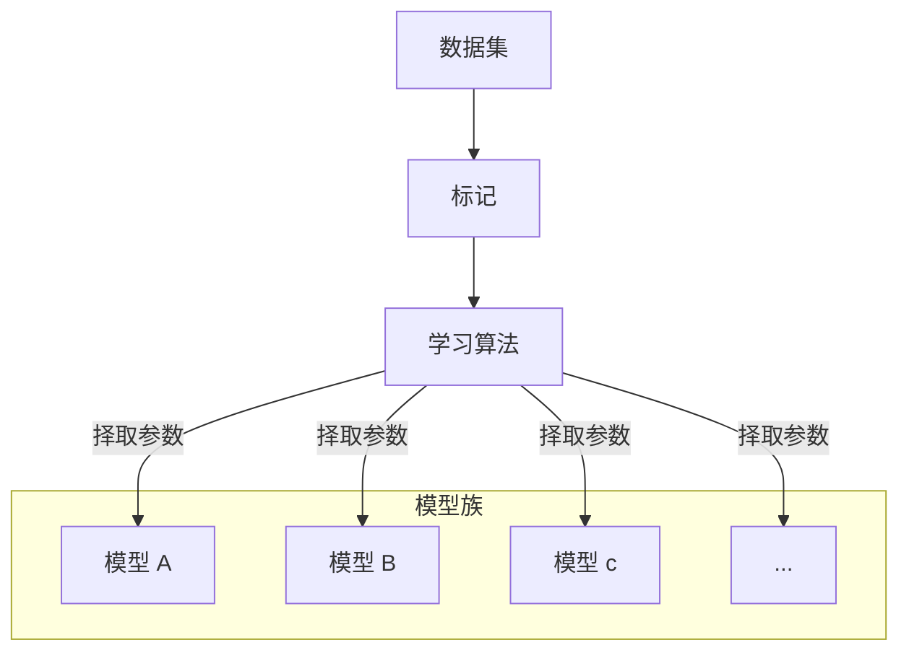
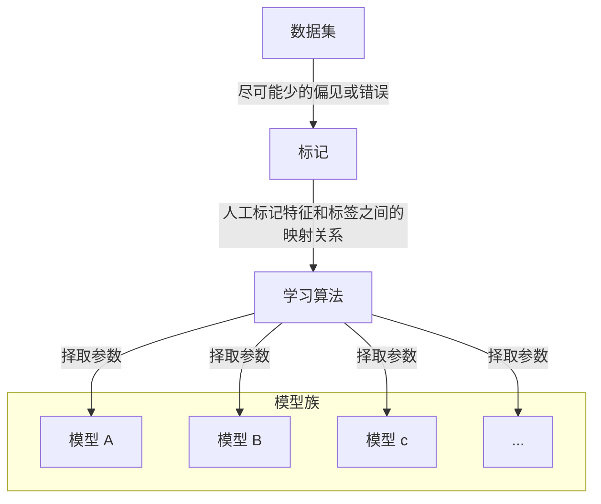
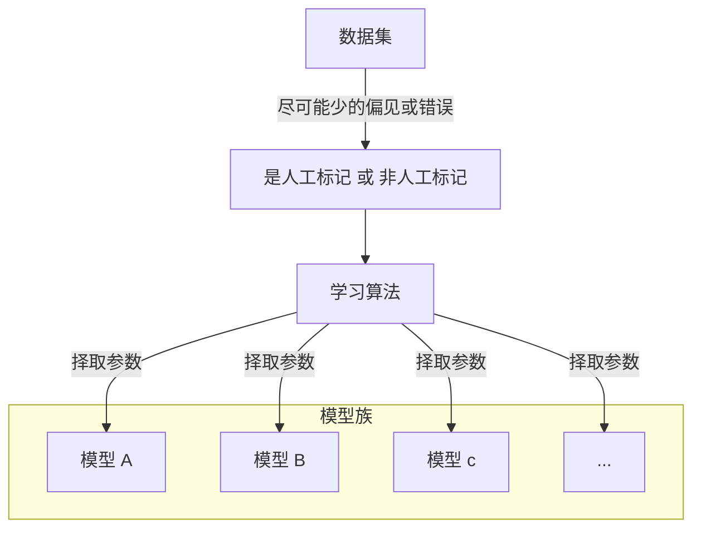
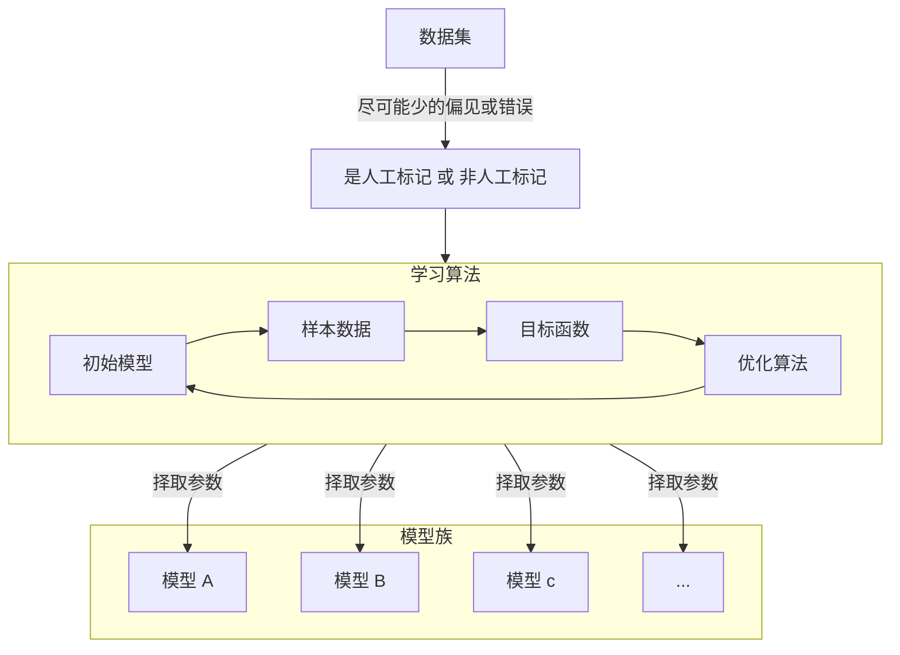
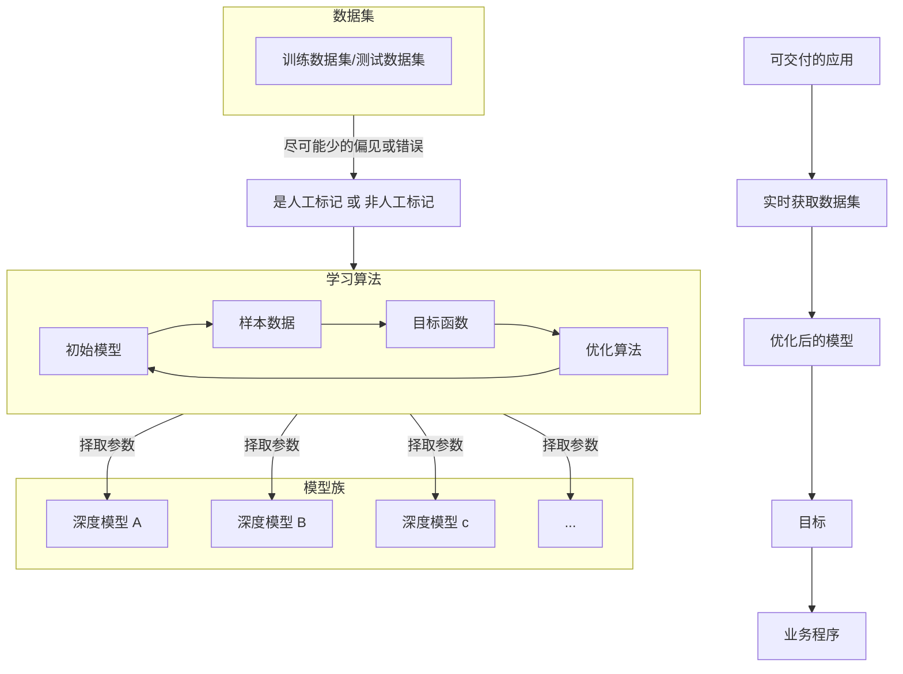

# 基础内容

## 1.机器学习分类

### 1.1.机器学习的流程

现在，假如需要我们编写程序来响应一个“唤醒词”（比如 “Alexa”、“Hey Siri”）。 我们试着用一台计算机和一个代码编辑器编写代码。问题看似很难解决：麦克风每秒钟将收集大约 `44000` 个样本，每个样本都是声波振幅的测量值。而该测量值与唤醒词难以直接关联。那又该如何编写程序，令其输入麦克风采集到的原始音频片段, 输出是否 `{是, 否}`（表示该片段是否包含唤醒词）的可靠预测呢？我们对编写这个程序毫无头绪，这就是需要机器学习的原因。

通常，即使我们不知道怎样明确地告诉计算机如何从输入映射到输出，大脑仍然能够自己执行认知功能。换句话说，即使我们不知道如何编写计算机程序来识别提示词，大脑自己也能够识别它。有了这一能力，我们就可以收集一个包含大量音频样本的 **数据集, dataset**，并对包含和不包含唤醒词的样本进行 **标记, annotate** 后。利用机器学习算法，我们不需要设计一个“明确地”识别唤醒词的系统。相反，我们只需要定义一个灵活的程序算法，其输出由许多 **参数, parameter** 决定，然后使用数据集来确定当下的“最佳参数集”，这些参数通过某种性能度量方式来达到完成任务的最佳性能。

那么到底什么是参数呢？参数可以被看作旋钮，旋钮的转动可以调整程序的行为。任一调整参数后的程序被称为 **模型, model**。通过操作参数而生成的所有不同程序（输入-输出映射）的集合称为 **模型族, family models**。使用数据集来选择参数的元程序被称为 **学习算法, learning algorithm**。



### 1.2.机器学习的细节

#### 1.2.1.数据集

可以看出来，优质的数据在这其中占据很大的地位。每个数据集由一个个 **样本, sample** 组成，大多时候，它们遵循 **独立同分布** 的原则。 样本有时也叫做 **数据点/数据实例**，通常每个样本由一组称为 **特征/协变量** 的属性组成。机器学习模型会根据这些属性进行预测，在上面的监督学习问题中，要预测的是一个特殊的属性，它被称为 **标签/目标**。

例如当处理图像数据时，每一张单独的照片即为一个样本，它的特征由每个像素数值的有序列表表示。 比如，`200×200` 彩色照片由 `200×200×3=120000` 个数值组成，其中的“3”对应于每个空间位置的红、绿、蓝通道的强度。再比如，对于一组医疗数据，给定一组标准的特征（如年龄、生命体征和诊断），此数据可以用来尝试预测患者是否会存活。而标签就是“猫、狗、鸟”等。

-   当每个样本的特征类别数量都是相同的时候，其特征向量是固定长度的，这个长度被称为数据的 **维数**。固定长度的特征向量是一个方便的属性，它可以用来量化学习大量样本。
-   然而，并不是所有的数据都可以用“固定长度”的向量表示。以图像数据为例，如果它们全部来自标准显微镜设备，那么“固定长度”是可取的；但是如果图像数据来自互联网，它们很难具有相同的分辨率或形状。这时，将图像裁剪成标准尺寸是一种方法，但这种办法很局限，有丢失信息的风险。此外，文本数据更不符合“固定长度”的要求。比如，对于亚马逊等电子商务网站上的客户评论，有些文本数据很简短（比如“好极了”），有些则长篇大论。与传统机器学习方法相比，深度学习的一个主要优势是可以处理不同长度的数据。

一般来说，拥有越多数据的时候，工作就越容易。更多的数据可以被用来训练出更强大的模型，从而减少对预先设想假设的依赖。不过仅仅拥有海量的数据是不够的，我们还需要正确的数据。如果数据中充满了错误甚至是偏见，那么模型很可能无效。



#### 1.2.2.标记

标记最主要的事情就是把原始的数据集特征到标签的一个映射，例如：

-   `image_001.jpg → "猫"`
-   `image_002.jpg → "狗"`

其实如果是我们自己标记的（无论是否人工）这个过程都叫做标记，标记的结果就是特征有了标签，而机器学习预测得到的最终结果就是模型，根据模型输入数据得到目标（个人习惯自己标记的叫标签，机器预测的叫目标，差不多是一个东西）。



#### 1.2.3.学习算法

最直接粗暴的学习算法就是使用随机函数，但这很粗暴并且很难得出一个我们需要的模型，因此一个学习算法内部通常包含以下内容：

1.   设定相关参数，初始参数得到初始模型（模型）
2.   获取数据样本（数据）
3.   调整参数尽量调优模型（优化算法）
4.   检查新得到的模型是否符合需要（目标函数）
5.   重复 `2、3、4` 的步骤



>   [!IMPORTANT]
>
>   补充：继续深入目标函数。机器学习这里所说的“学习”，是指自主提高模型完成某些任务的效能。但是，什么才算真正的提高呢？在机器学习中，我们需要定义模型的 **优劣程度的度量**，这个度量在大多数情况是“可优化”的，这被称之为目标函数。我们通常定义一个目标函数，并希望优化它到最低点。因为越低越好，所以这些函数有时被称为损失函数。但这只是一个惯例，我们也可以取一个新的函数，优化到它的最高点。这两个函数本质上是相同的，只是翻转一下符号。
>
>   当任务在试图预测数值时，最常见的损失函数是 **平方误差**，即预测值与实际值之差的平方。 当试图解决分类问题时，最常见的目标函数是 **最小化错误率**，即预测与实际情况不符的样本比例。有些目标函数（如平方误差）很容易被优化，有些目标（如错误率）由于不可微性或其他复杂性难以直接优化。在这些情况下，通常会优化 **替代目标**。
>
>   通常，损失函数是根据模型参数定义的，并取决于数据集。在一个数据集上，我们可以通过最小化总损失来学习模型参数的最佳值。 该数据集由一些为训练而收集的样本组成，称为 **训练数据集**。然而，在训练数据上表现良好的模型，并不一定在“新数据集”上有同样的性能，这里的“新数据集”通常称为 **测试数据集**。
>
>   因此，可用数据集通常可以分成两部分：
>
>   -   训练数据集用于拟合模型参数
>   -   测试数据集用于评估拟合模型
>
>   然后我们观察模型在这两部分数据集的性能。“一个模型在训练数据集上的性能”可以被想象成“一个学生在模拟考试中的分数”。这个分数用来为一些真正的期末考试做参考，即使成绩令人鼓舞，也不能保证期末考试成功。换言之，测试性能可能会显著偏离训练性能。当一个模型在训练集上表现良好，但不能推广到测试集时，这个模型被称为 **过拟合** 的。就像在现实生活中，尽管模拟考试考得很好，真正的考试不一定百发百中。

>   [!IMPORTANT]
>
>   补充：继续深入优化算法。当我们获得了一些数据源及其表示、一个模型和一个合适的损失函数，接下来就需要一种算法，它能够搜索出最佳参数，以最小化损失函数。深度学习中，大多流行的优化算法通常基于一种基本方法 —— **梯度下降**。 简而言之，在每个步骤中，梯度下降法都会检查每个参数，看看如果仅对该参数进行少量变动，训练集损失会朝哪个方向移动。然后，它在可以减少损失的方向上优化参数。

#### 1.2.4.模型

深度学习与经典方法的区别主要在于：前者关注的功能强大的模型，这些模型由神经网络错综复杂的交织在一起，包含层层数据转换，因此被称为深度学习。在讨论深度模型的过程中也将提及一些传统方法。

而我们最终得到的进一步细节就如下：



### 1.3.机器学习的方案

我们还需要探究一下机器学习自发展起来的各种方案：有监督学习、无监督学习、环境互动、强化学习。

#### 1.3.1.有监督学习

**监督学习** 擅长在“给定输入特征”的情况下预测标签。每个“特征-标签”对都称为一个样本。有时，即使标签是未知的，样本也可以指代输入特征。我们的目标是生成一个模型，能够将任何输入特征映射到标签（即预测）。

监督学习之所以能发挥作用，是因为在训练参数时，我们为模型提供了一个数据集，其中每个样本都有真实的标签。用概率论术语来说，我们希望预测“估计给定输入特征的标签”的条件概率。虽然监督学习只是几大类机器学习问题之一，但是在工业中，大部分机器学习的成功应用都使用了监督学习。这是因为在一定程度上，许多重要的任务可以清晰地描述为，在给定一组特定的可用数据的情况下，估计未知事物的概率。比如：根据计算机断层扫描肿瘤图像，预测是否为癌症；给出一个英语句子，预测正确的法语翻译；根据本月的财务报告数据，预测下个月股票的价格；

监督学习的学习过程一般可以分为三大步骤：

1.   从已知大量数据样本中随机选取一个子集，为每个样本获取真实标签
     1.   有时，这些样本已有标签（例如，患者是否在下一年内康复）
     2.   有时，这些样本可能需要被人工标记（例如，图像分类）
     3.   这些输入和相应的标签一起构成了训练数据集
2.   选择有监督的学习算法，它将训练数据集作为输入，并输出一个“已完成学习的模型”
3.   将之前没有见过的样本特征放到这个“已完成学习的模型”中，使用模型的输出作为相应标签的预测

综上所述，即使使用简单的描述给定输入特征的预测标签，监督学习也可以采取多种形式的模型，并且需要大量不同的建模决策，这取决于输入和输出的类型、大小和数量。例如，我们使用不同的模型来处理“任意长度的序列”或“固定长度的序列”。

而有监督学习主要有以下常见的任务：

| 任务 | 说明                                                         | 应用         |
| ---- | ------------------------------------------------------------ | ------------ |
| 回归 | 最简单的任务，根据 **特征-标签** 训练得到模型，以后新的属性进来就可以预测得到新的目标 | 未来的降雨量 |
| 分类 | 训练数据时有明确的标签，根据 **特征-标签** 训练得到模型，以后新的属性进来就可以根据 **已有** 的标签进行分类 | 识别手写汉字 |
| 标记 | 学习预测不相互排斥的类别，并且允许一个样本同时属于多个已有的标签 | 博文内容标签 |
| 搜索 | 根据搜索词、网页为特征，评分为标签，训练得到模型后，用户需要给出搜索词，而网页我们自己输入，一个一个输入到模型中得到最终评分，再根据评分排序 | 谷歌搜索引擎 |
| 推荐 | 用户不用搜索词，而是依靠用户画像和某些内容作为特征，评分为标签，训练得到模型后，根据输入的用户画像和内容得出评分，排序推荐给用户 | 电商货物推荐 |
| 序列 | 输入的样本之间具有时间依赖性关系或顺序关系，模型可能就需要拥有“记忆”功能来处理连续的样本（例如处理视频需要上下帧，而不再像图片一样图片和图片之间没有关联） | 监控重症病人 |

#### 1.3.2.无监督学习

到目前为止，所有的例子都与监督学习有关，即需要向模型提供巨大数据集：每个样本包含特征和相应标签值。打趣一下，“监督学习”模型像一个打工仔，有一份极其专业的工作和一位极其平庸的老板。老板站在身后，准确地告诉模型在每种情况下应该做什么，直到模型学会从情况到行动的映射。取悦这位老板很容易，只需尽快识别出模式并模仿他们的行为即可。

相反，如果工作没有十分具体的目标，就需要“自发”地去学习了。比如，老板可能会给我们一大堆数据，然后要求用它做一些数据科学研究，却没有对结果有要求。这类数据中不含有“目标”的机器学习问题通常被为 **无监督学习**。

由于无监督学习的特殊性，我暂时不展开对应的细节，因为我们无法理解某些细节，不过可以先提前预览下无监督学习主要任务：

| 任务                 | 说明                                                         | 应用         |
| -------------------- | ------------------------------------------------------------ | ------------ |
| 聚类                 | 训练数据时无明确的标签，根据 **特征** 来训练得到模型，以后新的属性进来就可以根据 **发现** 的标签进行分类 | 消费习惯划分 |
| 成分分析             | 能否找到少量的参数来准确地捕捉数据的线性相关属性？           |              |
| 因果关系和概率图模型 | 我们能否描述观察到的许多数据的根本原因？                     |              |
| 生成对抗网络         | 为我们提供一种合成数据的方法，甚至像图像和音频这样复杂的非结构化数据。潜在的统计机制是检查真实和虚假数据是否相同的测试，它是无监督学习的另一个重要而令人兴奋的领域。 |              |

#### 1.3.3.环境互动

有人一直心存疑虑：机器学习的输入（数据）来自哪里？机器学习的输出又将去往何方？ 到目前为止，不管是监督学习还是无监督学习，我们都会预先获取大量数据，然后启动模型，不再与环境交互。这里所有学习都是在算法与环境断开后进行的，被称为离线学习。

这种简单的离线学习有它的魅力。好的一面是，我们可以孤立地进行模式识别，而不必分心于其他问题。但缺点是，解决的问题相当有限。这时我们可能会期望人工智能不仅能够做出预测，而且能够与真实 **环境互动**。与预测不同，“与真实环境互动”实际上会影响环境。这里的人工智能是“智能代理”，而不仅是“预测模型”。因此，我们必须考虑到它的行为可能会影响未来的观察结果。

考虑“与真实环境互动”将打开一整套新的建模问题。以下只是几个例子。

-   环境还记得我们以前做过什么吗？
-   环境是否有助于我们建模？例如，用户将文本读入语音识别器。
-   环境是否想要打败模型？例如，一个对抗性的设置，如垃圾邮件过滤或玩游戏？
-   环境是否重要？
-   环境是否变化？例如，未来的数据是否总是与过去相似，还是随着时间的推移会发生变化？是自然变化还是响应我们的自动化工具而发生变化？

当训练数据和测试数据不同时，最后一个问题提出了分布偏移的问题。

#### 1.3.4.强化学习


如果你对使用机器学习开发与环境交互并采取行动感兴趣，那么最终可能会专注于 **强化学习**。这可能包括应用到机器人、对话系统，甚至开发视频游戏的人工智能。 深度强化学习将深度学习应用于强化学习的问题，是非常热门的研究领域。突破性的深度 `Q` 网络在雅达利游戏中仅使用视觉输入就击败了人类，以及 `AlphaGo` 程序在棋盘游戏围棋中击败了世界冠军，是两个突出强化学习的例子。

在强化学习问题中，“智能体”在一系列的时间步骤上与环境交互。在每个特定时间点，智能体从环境接收一些 `观察, observation`，并且必须选择一个 `动作, action`，然后通过某种机制（有时称为执行器）将其传输回环境，最后智能体从环境中获得 `奖励, reward`。此后新一轮循环开始，智能体接收后续观察，并选择后续操作，依此类推。请注意，强化学习的目标是产生一个好的 `策略, policy`。强化学习智能体选择的“动作”受策略控制，即一个从环境观察映射到行动的功能。

## 2.相关数学基础

### 2.1.数据操作

-   张量：$n$ 维数组
    -   在 `MXNet` 中为 `ndarray`
    -   在 `PyTorch` 和 `TensorFlow` 中为 `Tensor`（可知识 `GPU`）
    -   在 `Numpy` 中为 `ndarray`（仅支持 `CPU`）

```python
import torch

x = torch.arange(12) # 创建一个行向量 x, 默认生成从 0 到 11 的 12 个数字存储在内部, 说白了就是一个一维数组
print(x) # tensor([ 0,  1,  2,  3,  4,  5,  6,  7,  8,  9, 10, 11])

print(x.shape) # 通过使用 shape 查看张量的形状, 其实就是查看这个数组的类型

```

### 2.2.数据预处理


### 2.3.线性代数


### 2.4.微积分


### 2.5.自动微分


### 2.6.概率


### 2.7.补充知识


## 3.神经网络类别

