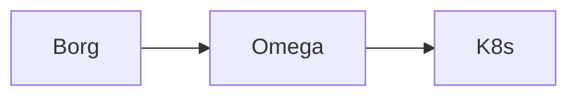

# 集群管理软件

## 1.集群管理的历史发展

集群管理最早的知名方案就是 `Apche MESOS` 了，这是一个开源分布式管理框架，曾经被推特使用。

随着 `K8s` 的流行，`Mesos` 不再是唯一的选择。`Mesos` 作为一种资源调度器，可以与 `K8s` 结合使用，`Mesos` 作为一种资源调度器，后者提供了丰富的容器编排功能。

二者结合后，可以有效地在 `Mesos` 的资源管理框架上，部署 `K8s` 来管理容器应用。`K8s` 的出现也让 `Mesos` 的局限性更加明显。而 `Docker` 为了和 `Google` 抢夺对容器编排技术的事实标准也研发了针对 `Docker` 的编排技术 `Docker Swarm`。

尽管 `Docker Swarm` 非常轻量，专为 `Docker` 容器准备，但是依旧不如 `K8s`，功能对于企业过于局限，但是也不算不好用。

另外 `K8s` 实际上由谷歌内部的 `Borg` 使用 `Go` 语言翻写而来，本身也是轻量级，开源，弹性伸缩，自动负载均衡，支持 `IPVS`。而 `Google` 还曾经维护过 `Borg` 的分支 `Omega`，因此实际上 `Google` 贡献了相当多的 `Linux` 上关于容器管理的代码，而 `K8s` 实际上是 `Google` 的第三款产品。

`K8s` 是开源的，这与 `Borg` 和 `Omega` 形成鲜明对比，后两者是纯粹为谷歌内部开发的系统。与
`Omega` 类似，`K8s` 的核心是一个共享的持久存储，各组件会监控相关对象的变化。但与 `Omega` 直接将存
储暴露给受信任的控制平面组件不同，`K8s` 中的状态只能通过特定领域的 `REST API` 访问，该 `API` 应用了更高层次的版本控制、验证、语义和策略，以支持更多样化的客户端。更重要的是，`K8s` 的开发更注重编写在集群中运行的应用程序的开发人员的体验。其主要设计目标是让部署和管理复杂的分布式系统变得容
易，同时还能受益于容器带来的更高利用率。



这方面的心路历程，可以在 [这份 .pdf 中](https://static.googleusercontent.com/media/research.google.com/zh-CN//pubs/archive/44843.pdf) 查阅。

## 2.集群管理的相关配置

您必须先下载 `Docker` 后再来 [根据官方文档下载一些必要工具](https://K8s.io/docs/tasks/tools/)，统一下载后我们再来进行研究。

```shell
# 下载 kubectl 集群管理工具
$ sudo apt-get install -y apt-transport-https ca-certificates curl gnupg
$ curl -fsSL https://pkgs.K8s.io/core:/stable:/v1.31/deb/Release.key | sudo gpg --dearmor -o /etc/apt/keyrings/K8s-apt-keyring.gpg
$ sudo chmod 644 /etc/apt/keyrings/K8s-apt-keyring.gpg
$ echo 'deb [signed-by=/etc/apt/keyrings/K8s-apt-keyring.gpg] https://pkgs.K8s.io/core:/stable:/v1.31/deb/ /' | sudo tee /etc/apt/sources.list.d/K8s.list
$ sudo chmod 644 /etc/apt/sources.list.d/K8s.list
$ sudo apt-get update
$ sudo apt-get install -y kubectl
$ kubectl version
Client Version: v1.31.2
Kustomize Version: v5.4.2
Error from server (NotFound): the server could not find the requested resource # 这个只有配置了集群才会显示版本号

```

```shell
# 下载 minikube 集群构建工具
$ curl -LO https://storage.googleapis.com/minikube/releases/latest/minikube_latest_amd64.deb
$ sudo dpkg -i minikube_latest_amd64.deb
$ minikube version
minikube version: v1.34.0
commit: 210b148df93a80eb872ecbeb7e35281b3c582c61

```

```shell
# 下载 kind 集群构建工具
$ wget https://golang.org/dl/go1.20.linux-amd64.tar.gz
$ sudo tar -C /usr/local -xzf go1.20.linux-amd64.tar.gz
$ echo 'export PATH=$PATH:/usr/local/go/bin' >> ~/.bashrc # 看终端
$ source ~/.bashrc
$ go version
$ go install sigs.K8s.io/kind@v0.24.0
$ echo 'export PATH=$PATH:$(go env GOPATH)/bin' >> ~/.bashrc
$ source ~/.bashrc
$ kind --version
$ kind version 0.24.0

```

```shell
# 下载 kubeadm 集群构建工具
$ sudo apt install -y apt-transport-https ca-certificates curl
$ curl -s https://packages.cloud.google.com/apt/doc/apt-key.gpg | sudo apt-key add -
$ cat << EOF | sudo tee /etc/apt/sources.list.d/K8s.list
deb https://apt.K8s.io/ K8s-xenial main
EOF
$ sudo apt update
$ sudo apt install -y kubelet kubeadm kubectl
$ sudo swapoff -a # 永久 sudo nano /etc/fstab 注释掉 "# /swapfile none swap sw 0 0"
$ sudo kubeadm init --pod-network-cidr=10.244.0.0/16

```

简单提及一下，`kubectl` 仅仅是一个客户端工具，下载后还需要根据 `k8s` 的架构图来安装组件，`minilube、kind、kubeadm` 可以提供 `K8s` 集群环境（相当于集群脚手架），而 `kubectl` 负责操作和管理该 `K8s` 集群的资源，是三个不同脚手架的底层工具。

-   **Minikube**：通常用于学习环境
-   **Kind**：通常用于开发环境
-   **Kubeadm**：通常用于生产环境

>   [!IMPORTANT]
>
>   补充：上述参考 [Linux 中国 | kubeadm 与 minikube 优缺点](https://cn.linux-console.net/?p=9791)。除此以外，还有一些别的集群脚手架，例如 `K3s、MicroK8s`。

>   [!WARNING]
>
>   注意：而还有个比较硬伤的问题，就是学习本文档的过程中物理机器越多越好，我这里有较多的物理机器可以供我实验，并且已被我虚拟化为多台服务器，我也不太喜欢使用 `VM Workstation` 去模拟这些东西，总觉得不够真实...

## 3.集群管理的现代标准

### 3.1.K8s 的前世今生

`K8s` 可以说是 `Borg` 的加强版本，并且使用 `Go` 重构而来。


上图就是 `Borg` 的设计架构图。

**BorgMaster(主节点) 通过 scheduler(调度器)，来进行根据应用的特点将请求分发，调度到具体的机器上去。主节点也负责维护整个集群的状态，并将数据持久化到 Paxos 存储中。而工作的节点就是一系列的 Borglet(工作节点)，这些节点一般都在容器中。（可以看到，每一份组件都有副本，且最好是奇数节点，避免出现“平局”的现象）。**

可以看到整体以数据和服务为中心，而这里有三种访问 `BorgMaster(主节点)` 的主要方法：

1.   `borgcfg` 命令行工具搭配配置文件进行读写
2.   命令行工具进行读写
3.   浏览器进行读写

其中 `scheduler(调度器)` 不会直接访问 `Borglet(工作节点)`，而是和 `Paxos(键值对数据库)` 进行交互，`Borglet` 就会从这个 `Paxos(键值对数据库)` 取出交给自己的请求进行消费。

### 3.2.K8s 的组件框架


上图就是 `K8s` 的设计架构图，这其中有一些 `Borg` 的影子。

**scheduler(调度器) 会把任务交给 Api server(接口服务)，Api server(接口服务) 再把请求写入到 Etcd 分布式数据库中，保存整个集群的状态。controller manager 负责维护集群的状态，比如故障检测、自动扩展、滚动更新等（而实际上，每一份组件都有副本，且最好是奇数节点，避免出现“平局”的现象）。**

**上述的所有重要组件整体可以看作是 K8s 的主节点，接下来我们来看我们的工作节点。一个工作节点就是一个 Node，多个工作节点加上主节点就是一个 K8s 集群。**

**而 Node 内部包含 Kubelet（CRI, 容器/运行时环境/接口）, 会维护 Api server 和 Docker 容器之间的交互和操作，也就是负责维护容器的生命周期，同时也负责存储卷（CSI）和网络（CNI）的管理，是本 Node 节点的管理者。Container runtime 负责镜像管理以及 Pod 和容器的真正运行（CRI），Node 其实直接管理的是多个 Pod，而 Pod 内部是由一个镜像文件运行起来的相同容器副本集合，Container runtime 其实就是提供一个容器运行的环境。此外其实还有一个没有展示出来的 Kube proxy，负责处理集群中部分 Pod 的网络流量, 支持 ipvs 以及多种代理模式, 默认的操作对象是 firewail, 也就是防火墙去实现 Pod 的映射, 以设置 IPTables、IPVS 来实现服务映射访问，以支持某些 Pod 被外部网络所访问。**

可以看到整体以服务为中心，因此这里也有三种访问 `api server(接口服务)` 的主要方式：

-   `kubectl` 命令行工具搭配配置文件进行读写
-   `Etcd` 分布式键值对存储系统进行读写
-   浏览器进行读写

>   [!IMPORTANT]
>
>   补充：这里还可以给出关于 `Etcd` 的架构图。
>
>   
>
>   `Etcd` 和 `MySQL` 一样都是基于 `C/S` 服务开发。其中，`Raft` 是分布式的选举算法，通过选举领导的方式来处理写入请求。而为了防止数据损坏，还配备了 `WAL` 这种日志记录机制，防止数据的意外丢失。`Entry` 记录日志中的单个条目，包含一个操作或状态变更的具体信息，代表一个对状态机的修改。`Snapshot` 是状态机在某一时刻的完整快照，包含当前所有数据的状态，可以在系统恢复时避免重放所有的 `Entries`。最后才实际存储在 `Store` 中进行持久化。
>
>   `WAL(Write-Ahead Logging, 预写日志)` 是一种用于数据持久化的日志记录机制。在写入数据库之前，首先将数据变更记录到日志中。这种机制确保了在系统崩溃或故障后，可以通过回放日志来恢复数据的完整性。
>
>   `WAL` 的主要优点包括：
>
>   -   **数据安全性** 在数据写入数据库之前，先记录到日志中，即使发生故障，也能通过日志恢复数据
>   -   **性能提升** 批量写入时，可以先将日志写入内存，减少磁盘 `I/O` 操作，提高性能
>   -   **一致性** 通过日志，确保数据变更操作的顺序一致，维护数据的一致性
>
>   现在 `Etcd` 转而使用 `v3` 以上的版本，前面的版本已经被抛弃（ `v2` 版本几乎只把数据存储在内存中，`v3` 版本增加了关于存储卷的持久化方案）...

>   [!IMPORTANT]
>
>   补充：可以看出 `K8s` 架构里的 `api server(接口服务)` 非常繁忙（控制器、调度器、命令行工具、浏览器、存储系统、容器运行时接口、网络代理...都需要访问），因此每个组件也可以在本地生成一定的缓存降低 `api server(接口服务)` 的压力（这种缓存机制可以由多种方案解决，比如设置缓存有效期 `TTL`，版本号时间戳确认请求，服务器事件驱动机制...）。不过这么讲有些抽象，后面还会细细讲解...

>   [!IMPORTANT]
>
>   补充：`IPVS(IP Virtual Server)` 是一个 `Linux` 内核模块，提供基于 `IP` 的负载均衡功能（也就是传输层级别的负载均衡）。它通过将多个后端服务器（如 `Pod`）绑定到一个虚拟 `IP` 地址，实现负载均衡。
>
>   主要特点包括：
>
>   1.  **高性能**：`IPVS` 在内核中实现，能够处理大量并发连接，提供更高的性能和更低的延迟。
>   2.  **多种负载均衡算法**：支持多种负载均衡算法（如轮询、最少连接、加权轮询等），可以根据不同的场景选择合适的算法。
>   3.  **集成支持**：`K8s` 中的 `Kube Proxy` 可以配置为使用 `IPVS` 模式，以便更高效地管理服务流量。
>
>   通过这些功能，`IPVS` 可以在大规模的分布式系统中有效地管理流量，提高应用的可用性和可靠性。
>
>   ```shell
>   # 尝试使用 ipvs 来实现传输层级别的负载均衡
>   # 准备地址为 10.10.174.101 的主机负责负载均衡
>   # 确保内核加载了 IPVS 模块
>   $ lsmod | grep ip_vs
>   
>   # 安装 ipvsadm
>   $ sudo apt-get install ipvsadm
>   # sudo modprobe ip_vs # 如果没有看到相关的模块可以手动加载
>   # sudo modprobe ip_vs_rr # 也可加载不同的调度算法
>   
>   # 创建虚拟 ip 后进行查看
>   $ sudo ip addr add 10.10.174.101/24 dev eno1 # 注意这个虚拟 IP 是没有办法直接在外部进行访问的
>   $ ip addr show eno1
>   2: eno1: <BROADCAST,MULTICAST,UP,LOWER_UP> mtu 1500 qdisc fq_codel state UP group default qlen 1000
>       link/ether 04:7c:16:f3:00:35 brd ff:ff:ff:ff:ff:ff
>       altname enp0s31f6
>       inet 10.10.174.100/24 brd 10.10.174.255 scope global dynamic noprefixroute eno1
>          valid_lft 34640sec preferred_lft 34640sec
>       inet 10.10.174.101/24 scope global secondary eno1
>          valid_lft forever preferred_lft forever
>       inet6 fe80::4189:c1a3:5e9e:ab8/64 scope link noprefixroute 
>          valid_lft forever preferred_lft forever
>          
>   # 检查虚拟 ip 是否可用
>   $ ping 10.10.174.101
>   PING 10.10.174.101 (10.10.174.101) 56(84) bytes of data.
>   64 bytes from 10.10.174.101: icmp_seq=1 ttl=64 time=0.194 ms
>   64 bytes from 10.10.174.101: icmp_seq=2 ttl=64 time=0.066 ms
>   64 bytes from 10.10.174.101: icmp_seq=3 ttl=64 time=0.066 ms
>   ^C
>   --- 10.10.174.101 ping statistics ---
>   3 packets transmitted, 3 received, 0% packet loss, time 2038ms
>   rtt min/avg/max/mdev = 0.066/0.108/0.194/0.060 ms
>   
>   # 配置传输层负载均衡
>   $ sudo ipvsadm -A -t 10.10.174.101:8080 -s rr  # 添加新的虚拟 IP 地址配置
>   
>   # 将后端服务器重新添加到新的虚拟 IP 地址配置中
>   $ sudo ipvsadm -a -t 10.10.174.101:8080 -r 10.10.174.46:8080 -m
>   $ sudo ipvsadm -a -t 10.10.174.101:8080 -r 10.10.174.77:8080 -m
>   
>   $ sudo ipvsadm -L -n
>   IP Virtual Server version 1.2.1 (size=4096)
>   Prot LocalAddress:Port Scheduler Flags
>     -> RemoteAddress:Port           Forward Weight ActiveConn InActConn
>   TCP  10.10.174.101:8080 rr
>     -> 10.10.174.46:8080            Masq    1      0          0         
>     -> 10.10.174.77:8080            Masq    1      0          0 
>   
>   # 做好负载对象的准备
>   ### >>> 准备负载对象 1 主机 10.10.174.46 >>> ###
>   $ sudo ufw allow 8080
>   $ sudo apt install python3
>   $ python3 -m http.server 8080
>   # ...
>   ### <<< 准备负载对象 1 主机 10.10.174.46 <<< ###
>   
>   ### >>> 准备负载对象 2 主机 10.10.174.77 >>> ###
>   $ sudo ufw allow 8080
>   $ sudo apt install python3
>   $ python3 -m http.server 8080
>   # ...
>   ### <<< 准备负载对象 2 主机 10.10.174.77 <<< ###
>   
>   # 尝试用负载均衡服务
>   $ curl http://10.10.174.101:8080
>   $ curl http://10.10.174.101:8080
>   $ curl http://10.10.174.101:8080
>   # ... 多次访问可以发现 负载对象 1 和 负载对象 2 轮流打印日志, 所以说明负载均衡成功
>   
>   # 删除负载均衡服务
>   $ sudo ipvsadm -D -t 10.10.174.101:8080
>   $ sudo ipvsadm -L -n
>   IP Virtual Server version 1.2.1 (size=4096)
>   Prot LocalAddress:Port Scheduler Flags
>     -> RemoteAddress:Port           Forward Weight ActiveConn InActConn
>     
>   # 删除虚拟 ip
>   $ sudo ip addr del 10.10.174.101/24 dev eno1
>   $ ip addr show eno1
>   2: eno1: <BROADCAST,MULTICAST,UP,LOWER_UP> mtu 1500 qdisc fq_codel state UP group default qlen 1000
>       link/ether 04:7c:16:f3:00:35 brd ff:ff:ff:ff:ff:ff
>       altname enp0s31f6
>       inet 10.10.174.100/24 brd 10.10.174.255 scope global dynamic noprefixroute eno1
>          valid_lft 32248sec preferred_lft 32248sec
>       inet6 fe80::4189:c1a3:5e9e:ab8/64 scope link noprefixroute 
>          valid_lft forever preferred_lft forever
>          
>   ```

>   [!IMPORTANT]
>
>   补充：主要组件如上，但是还有一些非常重要的插件也值得一提。
>
>   - `CoreDNS` 可以为集群中的服务（`SVC, service, 服务, 在这里也就是一个 Pod 公开为网络服务`）创建一个域名服务器 `IP` 对应的解析
>   - `Dashboard` 可以 `K8s` 提供关于 `B/S` 架构的支持
>   - `Ingress Controller` 可以实现七层代理（官方只实现了四层）
>   - `Fedetation` 可以提供跨集群中心多 `K8s` 统一管理功能
>   - `Prometheus` 可以 `K8s` 集群的日志统一分析平台

>   [!WARNING]
>
>   注意：`Pod` 本身在某些实现中可能会部署到容器中，但是大部分情况下是直接部署到裸机上的，同时每个 `Pod` 内部一定会包含多个容器, 主要是 `Docker` 容器。

### 3.3.K8s 的分层架构

`K8s` 设计理念和功能其实就是一个类似 `Linux` 的分层架构，如下图所示。


*   核心层：`K8s` 最核心的功能，对外提供 `API` 构建高层的应用，对内提供插件式应用执行环境
*   应用层：部署（无状态应用、有状态应用、批处理任务、集群应用等）和路由（服务发现、`DNS` 解析等）、`Service Mesh`（部分位于应用层）
*   管理层：系统度量（如基础设施、容器和网络的度量），自动化（如自动扩展、动态 `Provision` 等）以及策略管理（`RBAC、Quota、PSP、NetworkPolicy` 等）、`Service Mesh`（部分位于管理层）
*   接口层：`kubectl` 命令行工具、客户端 `SDK` 以及集群联邦
*   生态层：在接口层之上的庞大容器集群管理调度的生态系统，可以划分为两个范畴
    *   `K8s` 外部：日志、监控、配置管理、`CI/CD`、`Workflow`、`FaaS`、`OTS` 应用、`ChatOps`、`GitOps`、`SecOps` 等
    *   `K8s` 内部：`CRI`、`CNI`、`CSI`、镜像仓库、`Cloud Provider`、集群自身的配置和管理等

### 3.4.K8s 的资源清单

| 类别         | 名称                                                         |
| :----------- | :----------------------------------------------------------- |
| 普通资源对象 | Node、Pod、Namespace、Label                                  |
| 控制资源对象 | ReplicationController、ReplicaSet、Deployment、HorizontalPodAutoscaling、StatefulSet、DaemonSet、Job、CronJob |
| 网络资源对象 | Service、Ingress                                             |
| 身份对象     | ServiceAccount、Role、ClusterRole                            |
| 存储对象     | Volume、PersistentVolume、Secret、ConfigMap                  |
| 策略对象     | SecurityContext、ResourceQuota、LimitRange                   |
| 自定对象     | CustomResourceDefinition                                     |

在 `K8s` 中，**资源清单** 指的是用于描述 `K8s` 集群中各类资源的声明性配置文件，通常以 `YAML` 或 `JSON` 格式编写。资源清单定义了集群中工作负载（如何运行、如何进行网络配置、如何管理存储和资源调度等。我们来一个一个介绍...

#### 3.4.1.Node

集群中的一个工作机器，可以是物理机或虚拟机（一般在生产环境中直接部署在裸机上）。`Node` 上运行着一个或多个 `Pod`，包含必要的组件来确保 `Pod` 正常运行（也就是我们之前的架构图）。

#### 3.4.2.Pod

`Pod` 是最小的可调度单位，包含一个或多个容器，因此 `Pod` 也叫做工作负载，可以分为两种：

- 自主式 `Pod`，生命周期结束后没有处理策略
- 控制器 `Pod`，生命周期结束后存在处理策略

而更加准确来说，`Pod` 只要运行起来，一定有一个容器被运行起来，而如果后续 `Pod` 中加入了其他容器（这些容器可能是不同的镜像文件生成的），就必须保证这些容器使用一些相同的资源。这种做法就需要用一个 `Pause` 父容器来做到，它就相当于其他容器的父进程，可以共享给多个容器自己管理的资源（一般共享网络、共享存储卷）。

因此默认情况下，一个 `Pod` 内部的所有容器都共享相同的资源。

一台主机就视为一个工作节点 `Node`，内部包含多个 `Pod` 资源，这种设计也方便一台主机也可以实现分布式架构。

#### 3.4.3.Controller

由于 `Pod` 有死亡的风险，因此我们需要某些自动化策略，控制 `Pod` 的生命周期，[而 K8s 官方文档中定义的  Pod 的控制器](https://K8s.io/zh-cn/docs/concepts/workloads/) 可以分为以下几种。

-   `ReplicationController`
-   `ReplicaSet`
-   `Deployment`
-   `Horizontal Pod Autoscaler`
-   `StatefulSet`
-   `DaemonSet`
-   `Job`
-   `Cron Job`

#### 3.4.5.Namespace

命名空间是一种逻辑隔离机制，允许在同一集群内划分多个虚拟集群。每个 `Namespace` 中可以有独立的资源，如 `Pod、Service` 等，便于资源管理和资源隔离，让不同团队之间可以合作开发。不过 `Node` 资源对象是全局资源，不属于任何一个命名空间。

#### 3.4.5.Service

`Service` 资源在 `K8s` 中主要是用于集群内部的 `Pod` 之间的代理和流量转发。它为 `Pod` 提供了一个稳定的访问入口，确保即使 `Pod` 的 `IP` 地址发生变化，外部或者其他 `Pod` 依然能够通过相同的 `Service` 访问它们。

`K8s` 网络模型默认集群中所有的 `Pod` 内的容器都在一个可以直接连通的扁平化网络中（其实就是一个局域网中），因此我们后续需要保证这个网络假设成立。

理论上来说一个 `K8s` 集群中的所有 `Pod` 都是可以相互 `ping` 通的，但 `K8s` 中的 `Pod` 一般是动态的，会随着调度、扩容、缩容等操作被创建或销毁。因此，`Pod` 的 `IP` 地址也是临时的，客户端很难直接依赖 `Pod` 的 `IP` 进行访问。`Service` 通过为一组 `Pod` 提供一个 **稳定的 IP 地址** 和 **域名**，从而让其他 `Pod` 不需要关心某组 `Pod` 的动态变化。

而 `Service` 也被称为“服务发现”，会把一组相关的 `Pod`（同标签或者说由 `ReplicaSet` 标签管理的）提供一个被外界发现的功能，其他 `Pod` 可以通过服务发现使用这些 `Pod`，而不至于由于动态发生服务访问失败。

>   [!IMPORTANT]
>
>   补充：上面 `Pod` 这种管理也被称为“扁平化管理”，在公司中的“扁平化管理”是一种组织管理结构，它的特点是减少管理层级，强调较少的管理层次和更大的员工自主权（也是有的公司规模较小的一种委婉说辞...）。
>
>   这里我们怎么保证多个 `Pod` 在集群都在一个扁平化网络中呢（毕竟多个 `Node` 有可能部署在多个裸机上）？首先您要明白多个 `Pod` 不一定只在一个 `Node` 上，尽管可以保证 `Node` 们处于同一个局域网中（由网络工程师来组件 `Nodes` 局域网，如果 `Node` 对应一个裸机，那么这些裸机需要人为保证处于同一个局域网中），但由于一个集群的不同 `Pod` 可能存放在不同的 `Node` 上，而 `Pod` 又需要保持在一个局域网中，这该怎么办呢？我们先来研究不同主体间的通信。
>
>   
>
>   -   **Pod 内的多个容器通信**：多个 `Pod` 在一个本地网中通信（其实共享的是 `Pause` 容器的网络栈，也就是 `Pause` 容器的 `lo`，这其实还是在容器内部做本地通信，这个简单，可以手动配置）
>   -   **Pod 和 Pod 间通信**：`Pod` 内多个容器在一个局域网中通信，并且保证源头和目的都是 `Pod` 的 `IP` 地址（如果是一个物理主机上的，直接通过 `Docker` 实现的虚拟网卡 `docker0` 即可完成不同 `Pod` 的通信；但是如果是不同主机上的 `Pod` 就需要进一步通过虚拟网卡 `Flannel0` 来实现，这通常需要物理主机安装一个 `Flanneld` 的守护进程，`Flannel0` 负责抓包、封装、转发 `docker0` 的请求，然后通过 `Etcd` 获取得到路由表判断到底该使用 `Flanneld` 转发到物理局域网中的哪一个机器上，由不同物理机上部署的 `Flanneld` 来处理，而这就是 `Overlay Network` 的原理）
>   -   **Node 和 Node 间通信**：这是由网络工程师保证的，因为 `Node` 很有可能在生产环境中直接部署在裸机上，要搭建居群本来就需要保证这些裸机处于同一个局域网中，因此 `Node` 之间直接使用裸机的网卡就可以访问。
>   -   **Service 和 Service 间通信**：待补充...
>   -   **pod 和 Service 间通信**：待补充...
>   -   **外网访问 Pod**：待补充...
>
>   因此我们可以看到有四层局域网，既 `Service、Nodes、Pods、Container` 四层（不过其实也可以忽略 `Container` 只剩下三层，毕竟这一层是不一定成立的，要看设置）。
>
>   `Flannel` 使用的是 `UDP` 来转发报文，在 `Flannerl` 内部有一个封装栈，可以封装 `UDP` 报文、`源头 Pod IP`、`目的 Pod IP` 等信息为一个新的报文转发出去，有多个物理主机中部署的 `Flanneld` 来负责相互传递和解包处理。当然这其中的消耗看上去还是有的，并且感觉不少...
>
>   `Etcd` 在这里发挥了很大的作用，它必须能够做到存储管理 `Flannel` 可以分配的 `IP` 地址资源，监控每一个 `Pod` 的地址，并在内存中建立维护集群所有的 `Pod` 节点路由。
>
>   

#### 3.4.6.Ingress

允许集群外部 `HTTP` 和 `HTTPS` 流量访问集群内部的服务。`Ingress` 可以提供负载均衡、`SSL` 终结、基于路径或主机名的路由等功能，通常需要与 `Ingress Controller` 配合使用。

#### 3.4.7.Label

资源附加的键值对，用于标识、选择和组织资源。通过标签选择器可以选择一组资源，方便进行筛选和管理。例如，您可以为一组 `Pod` 添加相同的标签，然后通过 `Service` 或 `Deployment` 来选择这些 `Pod`。

#### 3.4.8.CustomResourceDefinition

允许用户扩展 `K8s API`，定义自定义资源类型。`CRD` 可以用来管理集群中的自定义应用程序资源，类似于内建资源（如 `Pod、Service` 等）。一旦定义了 `CRD`，用户就可以创建和管理这种类型的资源。

### 3.5.K8s 的基本操作

总得来说 `K8s` 是一个管理和调度容器的系统，它的工作原理很像是在“执行目标”。每次您在 `K8s` 中创建一个资源对象（例如一个 `Pod、Service、Deployment`），`K8s` 就会开始努力确保这个对象按您的要求存在和运行。

*   **K8s 对象是目标**：比如您希望集群中有一个特定数量的 **Pod** 在运行，或者您希望某个服务始终可用。当您在 K8s 中创建这些对象时，您其实是在告诉系统：“我希望这些资源以这种方式存在”。
*   **K8s 会持续监控**：一旦您创建了这些对象，K8s 就会持续确保它们处于您希望的状态。假如某个 Pod 因为某种原因停止工作，K8s 会自动重新创建它，确保系统始终符合您定义的“期望状态”。
*   **K8s API**：所有这些操作（比如创建、修改、删除对象）都需要通过 **K8s API** 来进行。您可以使用 `kubectl` 命令行工具，它会通过 `API` 与 `K8s` 集群进行通信，执行您要求的操作（如创建一个新的 Pod，或者修改一个服务的配置）。另外，`K8s` 还提供了用 `Golang` 写的客户端库 [client-go](https://github.com/kubernetes/client-go)，这让您可以通过编程接口来与 `K8s` 交互。

另外，`K8s` 对象包含一些嵌套的对象字段，它们负责管理对象的配置

-   `metadata`：元数据，填写一些用于标识 `K8s` 对象的关键信息。
    -   **name**：对象的唯一标识符，在同一个命名空间内每个对象的名称必须是唯一
    -   **namespace**：对象所属的命名空间，使得资源之间可以相互隔离。大多数情况下，如果没有特别配置，默认放在 `default` 命名空间中
    -   **labels**：用于为对象打标签（键值对），通过标签，用户可以对多个对象进行分组，并且方便地查询和管理
    -   **annotations**：类似于标签，但通常用于存储非标识性的信息，例如配置或调试信息。与标签不同，`Annotations` 可以存储更多样的信息，且没有大小限制
    -   **uid**：对象的唯一标识符，在整个集群中是唯一的，通常由 `K8s` 自动生成，`uid` 通常用于区分不同版本的同名对象
    -   **creationTimestamp**：对象的创建时间戳，记录该对象在集群中的创建时间
    -   **ownerReferences**：用于描述当前对象的关联对象。通过 `ownerReferences`，`K8s` 可以知道哪些对象是依赖于其他对象的，从而进行对象的级联删除等操作
-   `spec`：规格，是您创建或配置 `K8s` 对象时所提供的描述，它定义了您希望对象是什么样子的。例如您想让一个 `Deployment` 控制器对象拥有 `3` 个副本（`Pod`），那么在 `spec` 中您会明确指出这个要求，这个字段是用户自己编写的。
-   `status`：状态，描述的是 `K8s` 系统当前实际管理的状态，它是由 `K8s` 自动更新的。这意味着，系统会根据 `spec` 所描述的期望状态来调整实际的运行情况。例如，如果您要求 `3` 个副本，而由于某些原因其中一个 `Pod` 没有运行，`Kubernetes` 会通过启动新的 `Pod` 来确保 `spec` 中定义的副本数始终得到满足，这个字段是 `K8s` 自己管理的。

`K8s` 控制平面会持续监控 `spec` 和 `status` 之间的差异，并自动调整系统状态（比如启动一个新的对象实例来满足需要），确保它符合您的期望。基本的理论知识我们都有了，这里我们简单演示一下关于 `K8s` 的命令行工具来构建一个可用的 `K8s` 集群。

#### 3.5.1.Minikube

实际上我很推荐您使用 `Minikube` 进行单机测试学习使用的，`Minikube` 可以使用容器技术，快速部署一个简单的 `K8s` 集群在本地，进而可以使用 `K8s` 的原生命令行客户端工具 `kubectl` 来操作集群。对比起来，如果直接自己手动部署一个集群，这个学习曲线可能让您感到沮丧...不过万幸的是我们可以利用 `Minikube` 度过这个难关不是么~

##### 3.5.1.1.Minikube 的集群创建

我们先来设置一些方便您操作的权限配置，以及启动本主机的一个 `K8s` 集群。

-   `minikube start` 初始化并且启动集群
-   `minikube stop` 停止集群
-   `minikube delete` 删除集群

```shell
# 使用 minilube 初始化集群
# 给当前用户设置启动 docker 不需要使用 sudo
$ sudo usermod -aG docker $USER # 将当前用户添加到 docker 组中
$ newgrp docker # 立即更新当前 shell 会话中的用户组, 使得新加入的 docker 组生效

# 创建 Minikube 集群
$ minikube start --nodes=3 --docker-env HTTP_PROXY=http://192.168.101.254:7890 --docker-env HTTPS_PROXY=http://192.168.101.254:7890 --docker-env NO_PROXY=localhost,127.0.0.1 # 启动 3 个 Node, 默认第一个 Node 为主节点其他为工作节点
# 实际上 minikube start 这个指令拉取了镜像文件(默认使用 Docker 工具拉取)
# 可以使用 sudo docker image ls 来查看拉取的镜像文件如下
# gcr.io/K8s-minikube/kicbase   v0.0.45   aeed0e1d4642   4 weeks ago   1.28GB
# gcr.io/K8s-minikube/kicbas 这个基础镜像内部包含了运行 K8s 的基础工具), 适用于 Minikube 的 KIC 功能(K8s In Docker, 一个在 Docker 容器中运行 K8s 的方法), minikube start 会启动这个镜像为容器, 方便开发者快速进行核心组件的集群部署, 您可以使用 sudo docker container ls 进行查看

# 可以看到代理配置成功
$ docker container exec -it minikube bash
root@minikube:/# docker info | grep -i proxy
 HTTP Proxy: http://192.168.101.254:7890
 HTTPS Proxy: http://192.168.101.254:7890
 No Proxy: localhost,127.0.0.1,10.96.0.0/12,192.168.59.0/24,192.168.49.0/24,192.168.39.0/24
root@minikube:/# exit

```

>   [!WARNING]
>
>   注意：强烈推荐在学习阶段配置 `alias kubectl="minikube kubectl --"` 提高终端体验，`Minikube` 自带一个 `kubectl` 客户端, 和 `Minikube` 兼容性较好，这也是一个最佳实践。当然，如果您愿意尝试用我们之前下载的原生命令行客户端工具 `kubectl` 也是可以的，有问题再切换就可以。

>   [!CAUTION]
>
>   警告：如果在上面的内容中，您发现您的集群启动异常，很可能需要对 `Docker` 做一些魔法处理（上述 `--docker-env HTTP_PROXY=http://192.168.101.254:7890 --docker-env HTTPS_PROXY=http://192.168.101.254:7890 --docker-env NO_PROXY=localhost,127.0.0.1` 就是配置代理的过程）。或者启动集群后，再进入 `minikube` 容器内部，把宿主主机拉取的 `minikube` 集群的核心组件手动传输到 `minikube` 容器中（无需手动运行核心组件，拉取成功后退出集群容器回到宿主主机即可自动启动）。这里记录下本教程中使用的 `K8s` 架构中核心组件镜像的版本，以供您进行参考。
>
>   ```shell
>   # 记录核心组件的版本
>   $ docker container exec -it minikube bash
>   root@minikube:/# docker image ls
>   REPOSITORY                                TAG                  IMAGE ID       CREATED         SIZE
>   kindest/kindnetd                          v20240813-c6f155d6   12968670680f   6 months ago    85.8MB
>   registry.k8s.io/kube-scheduler            v1.31.0              1766f54c897f   6 months ago    67.4MB
>   registry.k8s.io/kube-controller-manager   v1.31.0              045733566833   6 months ago    88.4MB
>   registry.k8s.io/kube-apiserver            v1.31.0              604f5db92eaa   6 months ago    94.2MB
>   registry.k8s.io/kube-proxy                v1.31.0              ad83b2ca7b09   6 months ago    91.5MB
>   registry.k8s.io/etcd                      3.5.15-0             2e96e5913fc0   6 months ago    148MB
>   registry.k8s.io/pause                     3.10                 873ed7510279   8 months ago    736kB
>   registry.k8s.io/coredns/coredns           v1.11.1              cbb01a7bd410   18 months ago   59.8MB
>   gcr.io/k8s-minikube/storage-provisioner   v5                   6e38f40d628d   3 years ago     31.5MB
>   root@minikube:/# exit
>   
>   ```

实际上在 `minilube` 中使用的 `K8s` 集群是装载进一个容器中运行的，而容器内部又下载了镜像文件，运行了多个子容器（这种现象就是 `KIC`），这些子容器都是 `K8s` 的核心组件（就是我们之前提到的架构中的每一个小组件）。因此，如果环境不支持嵌套虚拟化，是没办法运行 `minilube` 工具的。

简单来说，`minikube` 通过一个镜像文件创建了一个 `Node` 容器，而该 `Node` 容器内部又运行多个 `Pod` 容器，用来，用来部署 `K8s` 中的核心组件和用户指定的 `Pod`。这样对于用户来说，一个 `gcr.io/k8s-minikube/kicbase` 运行起来的容器就直接是一个成形的集群。

这样用户不需要一上来就解决 `K8s` 的核心组件问题，而是直接在工作节点上创建管理 `Pod` 的控制器，进而直接创建 `Pod` 节点来使用。因此所谓的 `Minikube` 用于本机部署的意思是主节点容器和工作节点容器都运行在运行在主机上。

```shell
# 探究集群的原理
# 显示本机网卡
$ ifconfig # 注意每台主机的网卡信息不同, 
# (1) br-cfa65467e0ff: 桥接网络，用于 Docker 容器之间的网络通信。br- 表示它是 Docker 创建的桥接网络接口。该接口的 IP 地址是 192.168.49.1, 它是 Docker 容器的宿主机与容器之间的通信网段
# (2) br-eacc59fd10d9: 这是另一个 Docker 桥接网络接口, 与第一个类似，br- 前缀表示它是 Docker 创建的。它的 IP 地址是 172.18.0.1, 可能属于某个特定的 Docker 容器网络, 它用于容器间的通信
# (3) br-76a325f39805: 也和前面类似, 不过 IP 地址是 192.168.49.1
# (4) docker0: 本地 Docker 默认创建的 桥接网络接口，通常会在宿主机上看到该接口。它的 IP 地址是 172.17.0.1, 是 Docker 默认网络的桥接接口，用于容器与宿主机的通信
# (5) enp5s0: 物理网络接口, 表示宿主机上的以太网接口。该接口的 IP 地址是 192.168.101.254，通常用于与外部网络(例如互联网)通信, 这是我的路由器默认分配给我的本机 IP 地址
# (6) lo: 本地环回接口, 它的 IP 地址是 127.0.0.1, 用于宿主机内部通信, 不会经过物理网络。所有发送到 127.0.0.1 的流量都被返回到本地机器

# 显示 K8s 集群的大概信息
$ kubectl cluster-info
K8s control plane is running at https://192.168.49.2:8443 # 这行表示 K8s 控制平面(其实就是之前架构图中提到的 K8s 核心组件)正在运行，并且暴露在 https://192.168.49.2:8443 地址上(这个 IP 地址是在虚拟网卡 br-76a325f39805 那得到的, 因为 br-76a325f39805 的地址为 192.168.49.1, 您可以把它理解为类似路由器的 IP 地址, Linux 下创建虚拟网卡并且分配虚拟地址的指令是使用 'ip', 您可以研究一下)
CoreDNS is running at https://192.168.49.2:8443/api/v1/namespaces/kube-system/services/kube-dns:dns/proxy # 这行表示 K8s 中的 DNS 服务 CoreDNS 正在运行, 并且它可以通过地址 CoreDNS is running at https://192.168.49.2:8443/api/v1/namespaces/kube-system/services/kube-dns:dns/proxy 访问
# 其中: 控制平面是 K8s 集群的核心, 负责全局管理和调度任务, 它决定集群的状态, 并确保集群在期望的状态下运行。控制平面由多个组件构成, 主要包括:
# kube-apiserver, etcd, kube-scheduler, kube-controller-manager, cloud-controller-manager
To further debug and diagnose cluster problems, use 'kubectl cluster-info dump'. 

# 显示 K8s 集群的所有 Node
$ kubectl get nodes # 这些 Node 对于宿主主机来说其实就是三个 Docker 容器
NAME           STATUS   ROLES           AGE     VERSION
minikube       Ready    control-plane   2m47s   v1.31.0
minikube-m02   Ready    <none>          2m33s   v1.31.0
minikube-m03   Ready    <none>          2m23s   v1.31.0

# 显示 K8s 集群的所有 Pod
$ kubectl get pods --all-namespaces # 查看所有的 pod, pod 通常代表 K8s 中的一个最小调度单位(可以由一个或多个容器组成), 可以理解为一个逻辑主机, 拥有唯一的 ip 地址, 共享网络端口资源, 共享存储卷资源, 简化指令为 kubectl get pod -A
NAMESPACE     NAME                               READY   STATUS    RESTARTS      AGE
# Etcd-minikube 就是上面我们提到的分布式键值存储系统 Etcd
kube-system   etcd-minikube                      1/1     Running   0             76m
# kube-apiserver-minikube 就是上面我们提到的繁忙的 api server
kube-system   kube-apiserver-minikube            1/1     Running   0             76m
# kube-controller-manager-minikube 就是上面我们提到的管理 pod 生命周期的控制器 controller
kube-system   kube-controller-manager-minikube   1/1     Running   0             76m
# kube-scheduler-minikube 就是上面我们提到用来提交任务分配的调度器
kube-system   kube-scheduler-minikube            1/1     Running   0             76m
# kube-proxy-xxx 就是上面我们提到的用来网络负载均衡的网络代理
kube-system   kube-proxy-2h85l                   1/1     Running            0             2m51s
kube-system   kube-proxy-mcmn7                   1/1     Running            0             3m1s
kube-system   kube-proxy-xj2gq                   1/1     Running            0             3m8s
# storage-provisioner 自动化存储卷, 以后再来理解
kube-system   storage-provisioner                1/1     Running   2 (76m ago)   76m
# coredns 是 K8s 默认的 DNS 服务, 负责集群内部的 DNS 解析, 以后再来理解
kube-system   coredns-6f6b679f8f-xflf5           1/1     Running   0             76m
# 这些 pod 其实就是 gcr.io/K8s-minikube/kicbase 镜像运行为容器后中的子容器, 这也就是为什么我说 Minikube 适合学习的原因
# 另外这些容器都属于同一个命名空间 kube-system

# 查看宿主机上运行的容器, 下面的 minikube 就是 Main Node
$ sudo docker container ls
CONTAINER ID   IMAGE                                 COMMAND                   CREATED             STATUS             PORTS                                                                                                                                  NAMES
5cdda7e5aa79   gcr.io/k8s-minikube/kicbase:v0.0.45   "/usr/local/bin/entr…"   About an hour ago   Up About an hour   127.0.0.1:32894->22/tcp, 127.0.0.1:32895->2376/tcp, 127.0.0.1:32896->5000/tcp, 127.0.0.1:32897->8443/tcp, 127.0.0.1:32898->32443/tcp   minikube-m03
9dc4efb36f66   gcr.io/k8s-minikube/kicbase:v0.0.45   "/usr/local/bin/entr…"   About an hour ago   Up About an hour   127.0.0.1:32889->22/tcp, 127.0.0.1:32890->2376/tcp, 127.0.0.1:32891->5000/tcp, 127.0.0.1:32892->8443/tcp, 127.0.0.1:32893->32443/tcp   minikube-m02
3812c9757a00   gcr.io/k8s-minikube/kicbase:v0.0.45   "/usr/local/bin/entr…"   About an hour ago   Up About an hour   127.0.0.1:32884->22/tcp, 127.0.0.1:32885->2376/tcp, 127.0.0.1:32886->5000/tcp, 127.0.0.1:32887->8443/tcp, 127.0.0.1:32888->32443/tcp   minikube

# 进入 Main Node 容器内部, 可以查看所有的核心组件 Pod
$ sudo docker container exec -it minikube bash
root@minikube:/# docker container ls
CONTAINER ID   IMAGE                        COMMAND                  CREATED             STATUS             PORTS     NAMES
e0ba04cd8dd0   cbb01a7bd410                 "/coredns -conf /etc…"   About an hour ago   Up About an hour             k8s_coredns_coredns-6f6b679f8f-xflf5_kube-system_4b154a73-befe-48f9-b841-5211991e90a1_3
f00e5b7b0eac   registry.k8s.io/pause:3.10   "/pause"                 About an hour ago   Up About an hour             k8s_POD_coredns-6f6b679f8f-xflf5_kube-system_4b154a73-befe-48f9-b841-5211991e90a1_3
c75048742c3b   kindest/kindnetd             "/bin/kindnetd"          About an hour ago   Up About an hour             k8s_kindnet-cni_kindnet-9t8hv_kube-system_dd817e5b-b30c-4dc6-9366-5035a0d946d3_0
9841cbf8ead1   6e38f40d628d                 "/storage-provisioner"   About an hour ago   Up About an hour             k8s_storage-provisioner_storage-provisioner_kube-system_4aecf7af-9913-4b41-bcae-a2240943bd22_2
6e80516a702c   ad83b2ca7b09                 "/usr/local/bin/kube…"   About an hour ago   Up About an hour             k8s_kube-proxy_kube-proxy-xj2gq_kube-system_2e606df4-a47a-4a05-985d-04fca60b9d05_0
e3797719160c   registry.k8s.io/pause:3.10   "/pause"                 About an hour ago   Up About an hour             k8s_POD_kube-proxy-xj2gq_kube-system_2e606df4-a47a-4a05-985d-04fca60b9d05_0
089cb80ca863   registry.k8s.io/pause:3.10   "/pause"                 About an hour ago   Up About an hour             k8s_POD_kindnet-9t8hv_kube-system_dd817e5b-b30c-4dc6-9366-5035a0d946d3_0
e2dfd0fe8a9b   registry.k8s.io/pause:3.10   "/pause"                 About an hour ago   Up About an hour             k8s_POD_storage-provisioner_kube-system_4aecf7af-9913-4b41-bcae-a2240943bd22_0
57adc388a407   045733566833                 "kube-controller-man…"   About an hour ago   Up About an hour             k8s_kube-controller-manager_kube-controller-manager-minikube_kube-system_40f5f661ab65f2e4bfe41ac2993c01de_0
206eeee7d47e   1766f54c897f                 "kube-scheduler --au…"   About an hour ago   Up About an hour             k8s_kube-scheduler_kube-scheduler-minikube_kube-system_e039200acb850c82bb901653cc38ff6e_0
39681a2e0b44   604f5db92eaa                 "kube-apiserver --ad…"   About an hour ago   Up About an hour             k8s_kube-apiserver_kube-apiserver-minikube_kube-system_9e315b3a91fa9f6f7463439d9dac1a56_0
c6ccfe2e7f7e   2e96e5913fc0                 "etcd --advertise-cl…"   About an hour ago   Up About an hour             k8s_etcd_etcd-minikube_kube-system_a5363f4f31e043bdae3c93aca4991903_0
3f35da357f61   registry.k8s.io/pause:3.10   "/pause"                 About an hour ago   Up About an hour             k8s_POD_kube-controller-manager-minikube_kube-system_40f5f661ab65f2e4bfe41ac2993c01de_0
5f10123440ba   registry.k8s.io/pause:3.10   "/pause"                 About an hour ago   Up About an hour             k8s_POD_kube-apiserver-minikube_kube-system_9e315b3a91fa9f6f7463439d9dac1a56_0
4f9db6e0263a   registry.k8s.io/pause:3.10   "/pause"                 About an hour ago   Up About an hour             k8s_POD_kube-scheduler-minikube_kube-system_e039200acb850c82bb901653cc38ff6e_0
62f723da91f5   registry.k8s.io/pause:3.10   "/pause"                 About an hour ago   Up About an hour             k8s_POD_etcd-minikube_kube-system_a5363f4f31e043bdae3c93aca4991903_0
root@minikube:/# exit

# 进入 Work Node 容器内部, 可以查看所有的基本组件 Pod
$ sudo docker container exec -it minikube-m02 bash
root@minikube-m02:/# docker container ls
CONTAINER ID   IMAGE                        COMMAND                  CREATED             STATUS             PORTS     NAMES
a250df11361a   nginx                        "/docker-entrypoint.…"   5 minutes ago       Up 5 minutes                 k8s_nginx_nginx-deployment-7cf9b95bd5-r797s_default_e444c454-c6a2-42ca-a84e-dee29d06819f_0
a86cfc170b0b   nginx                        "/docker-entrypoint.…"   5 minutes ago       Up 5 minutes                 k8s_nginx_nginx-deployment-7cf9b95bd5-c88qc_default_75c31971-7280-4a66-acb7-1cf538e98c3d_0
5e5482262fee   nginx                        "/docker-entrypoint.…"   5 minutes ago       Up 5 minutes                 k8s_nginx_nginx-deployment-7cf9b95bd5-9jqdm_default_d222b310-971c-46bc-a302-dd6eee5243f2_0
4cddf348ba7f   registry.k8s.io/pause:3.10   "/pause"                 6 minutes ago       Up 6 minutes                 k8s_POD_nginx-deployment-7cf9b95bd5-9jqdm_default_d222b310-971c-46bc-a302-dd6eee5243f2_0
98713e4dee38   registry.k8s.io/pause:3.10   "/pause"                 6 minutes ago       Up 6 minutes                 k8s_POD_nginx-deployment-7cf9b95bd5-c88qc_default_75c31971-7280-4a66-acb7-1cf538e98c3d_0
b920e32d9cb8   registry.k8s.io/pause:3.10   "/pause"                 6 minutes ago       Up 6 minutes                 k8s_POD_nginx-deployment-7cf9b95bd5-r797s_default_e444c454-c6a2-42ca-a84e-dee29d06819f_0
d50df30392c7   kindest/kindnetd             "/bin/kindnetd"          About an hour ago   Up About an hour             k8s_kindnet-cni_kindnet-wsgcj_kube-system_ec064913-74c3-4487-986c-e5879bebf1e2_0
f84713ca63b6   ad83b2ca7b09                 "/usr/local/bin/kube…"   About an hour ago   Up About an hour             k8s_kube-proxy_kube-proxy-mcmn7_kube-system_502038ee-d61b-4a8d-b94d-a6353e5713ea_0
1057f505bbbe   registry.k8s.io/pause:3.10   "/pause"                 About an hour ago   Up About an hour             k8s_POD_kube-proxy-mcmn7_kube-system_502038ee-d61b-4a8d-b94d-a6353e5713ea_0
b99b34c5ae63   registry.k8s.io/pause:3.10   "/pause"                 About an hour ago   Up About an hour             k8s_POD_kindnet-wsgcj_kube-system_ec064913-74c3-4487-986c-e5879bebf1e2_0

```

##### 3.5.1.3.Minilube 的集群查看

-   `kubectl cluster-info` 显示本机所部署集群的基本信息

##### 3.5.1.4.Minikube 的集群启停

-   `minikube start` 启动集群
-   `minikube paus` 暂停集群（就相当于冻结容器的运行）
-   `minikube unpaus` 启动集群
-   `minikube stop` 停止集群（就相当于关闭容器的运行）
-   `minikube delete` 销毁集群

不过先不要暂停、暂停、销毁集群，先保持 `minikube start` 的执行，我们后面有用。

##### 3.5.1.5.Minikube 的集群操作

这里的集群操作主要指的是关于 `Node、Pod` 的一些常规操作，不涉及对象的操作。


##### 3.5.1.6.Minikube 的集群对象

###### 3.5.1.6.1.普通对象

-   `kubectl get <资源对象类别+s> [--all-namespaces | -n <指定的命名空间名>]` 可以查看某一类资源（默认查看命名空间 `default`），可以附带选项 `--all-namespaces` 查看所有的命名空间下同种类资源的信息，也可以使用 `-n <指定的命名空间名>` 来指定在某个命名空间下查询

-   `kubectl get <资源对象类别(不加s)> <资源实例名称> [...]` 这里举几个例子供您参考一下：

    -   `kubectl get <资源对象类别(不加s)> <资源实例名称> -o yaml > <控制器名称>.yaml`：可以导出配置文件以迁移到别处（导出的配置文件可能包含自动填充的字段），不过有些时候我们可能只需要导出一部分信息进行查看，这个时候可以使用 `kubectl get <资源种类><资源实例> -o custom-columns="<第一列列名>:.<配置文件顶层元素>.<顶层元素的子元素>..., <第二列列名>:.<配置文件顶层元素>.<顶层元素的子元素>..., ...` 自定义列来实现。
    -   `kubectl get nodes [--show-labels] [-o wide]` 显示所有 `node` 的信息，如果携带 `--show-labels` 则会给出 `node` 的标签，`-o wide` 则会显示所有 `Node` 的 `IP` 地址。
    -   `kubectl get pods [--show-labels] [--all-namespaces | -n <指定的命名空间名>] [--field-selector spec.nodeName=<node_name>]` 可以显示所有命名空间的 `pod` 信息（不加选项默认显示 `default` 命名空间，如果需要指定命名空间则使用 `kubectl get pods -n <命名空间名称>`），还可以使用过滤器 `--field-selector` 指定在某一个 `Node` 中查看 `Node`
    -   `kubectl get event` 获取集群创建过程的历史事件
    -   `kubectl get ns` 获取集群中的所有命名空间，用户的普通应用默认是在 `default` 下，与集群管理相关的为整个集群提供服务的应用一般部署在 `kube-system` 下，在安装 `K8s` 集群时部署的 `kubedns`、`heapseter`、`EFK` 等都是在这个 `namespace` 下面。另外，并不是所有的资源对象都会对应 `namespace`，`node` 资源对象就不属于任何 `namespace`（其实还有存储对象 `persistentVolume` 也不属于任何 `namespace`）。
    
-   `kubectl describe 资源类型 资源名称 [-n 命名空间]` 查看指定资源的详细信息

    ```shell
    # 详细查看 Main Node 资源对象的信息
    $ kubectl describe node minikube
    # 当前节点的名称
    Name:               minikube
    # 节点所任角色
    Roles:              control-plane # 控制平面, 意味着它承担着管理和控制 K8s 集群的任务, 此节点不应该运行应用程序工作负载 Pod
    # 节点标签标识
    Labels:             beta.kubernetes.io/arch=amd64 # 列出了一些标签, 用于标识节点的不同属性
                        beta.kubernetes.io/os=linux
                        kubernetes.io/arch=amd64
                        kubernetes.io/hostname=minikube
                        kubernetes.io/os=linux
                        minikube.k8s.io/commit=210b148df93a80eb872ecbeb7e35281b3c582c61
                        minikube.k8s.io/name=minikube
                        minikube.k8s.io/primary=true
                        minikube.k8s.io/updated_at=2025_02_17T14_25_26_0700
                        minikube.k8s.io/version=v1.34.0
                        node-role.kubernetes.io/control-plane=
                        node.kubernetes.io/exclude-from-external-load-balancers=
    # 节点的元数据
    Annotations:        kubeadm.alpha.kubernetes.io/cri-socket: unix:///var/run/cri-dockerd.sock
                        node.alpha.kubernetes.io/ttl: 0
                        volumes.kubernetes.io/controller-managed-attach-detach: true
    # 节点创建时间
    CreationTimestamp:  Mon, 17 Feb 2025 14:25:23 +0800
    # 节点没有污点
    Taints:             <none> # 意味着没有限制 Pods 在此节点上运行, 后续会介绍
    # 节点可以调度
    Unschedulable:      false # 表示此节点是可调度的, 即可以调度 Pod 到这个节点
    Lease:
      HolderIdentity:  minikube
      AcquireTime:     <unset>
      RenewTime:       Mon, 17 Feb 2025 15:03:32 +0800
    # 节点当前状态
    # MemoryPressure: False, 表示没有内存压力
    # DiskPressure: False, 表示没有磁盘压力
    # PIDPressure: False, 表示没有进程 ID 压力
    # Ready: True, 表示节点处于就绪状态, 能够接收调度的 Pod
    Conditions:
      Type             Status  LastHeartbeatTime                 LastTransitionTime                Reason                       Message
      ----             ------  -----------------                 ------------------                ------                       -------
      MemoryPressure   False   Mon, 17 Feb 2025 15:01:18 +0800   Mon, 17 Feb 2025 14:25:22 +0800   KubeletHasSufficientMemory   kubelet has sufficient memory available
      DiskPressure     False   Mon, 17 Feb 2025 15:01:18 +0800   Mon, 17 Feb 2025 14:25:22 +0800   KubeletHasNoDiskPressure     kubelet has no disk pressure
      PIDPressure      False   Mon, 17 Feb 2025 15:01:18 +0800   Mon, 17 Feb 2025 14:25:22 +0800   KubeletHasSufficientPID      kubelet has sufficient PID available
      Ready            True    Mon, 17 Feb 2025 15:01:18 +0800   Mon, 17 Feb 2025 14:25:23 +0800   KubeletReady                 kubelet is posting ready status
    # 节点地址信息
    Addresses:
      InternalIP:  192.168.49.2 # 节点的内网 IP
      Hostname:    minikube # 节点的主机名
    # 节点资源总量
    Capacity:
      cpu:                16
      ephemeral-storage:  473908312Ki
      hugepages-1Gi:      0
      hugepages-2Mi:      0
      memory:             49167224Ki
      pods:               110
    # 节点实际资源
    Allocatable:
      cpu:                16
      ephemeral-storage:  473908312Ki
      hugepages-1Gi:      0
      hugepages-2Mi:      0
      memory:             49167224Ki
      pods:               110
    # 节点系统信息
    System Info:
      Machine ID:                 77c592d00fc94022aa4fa8a4bde53396 # 与主机硬件相关的标识符
      System UUID:                0f96c20f-ab31-4e56-bdfa-6b7e00e0509e
      Boot ID:                    f544981b-3d63-469f-8869-5201475fdb2f
      Kernel Version:             6.8.0-51-generic # 节点使用的 Linux 内核版本
      OS Image:                   Ubuntu 22.04.4 LTS # 节点运行的是 Ubuntu 操作系统
      Operating System:           linux
      Architecture:               amd64
      Container Runtime Version:  docker://27.2.0 # 容器运行时是 Docker 版本
      Kubelet Version:            v1.31.0
      Kube-Proxy Version:         
    PodCIDR:                      10.244.0.0/24
    PodCIDRs:                     10.244.0.0/24
    # 节点活跃 Pod
    Non-terminated Pods:          (8 in total)
      Namespace                   Name                                CPU Requests  CPU Limits  Memory Requests  Memory Limits  Age
      ---------                   ----                                ------------  ----------  ---------------  -------------  ---
      kube-system                 coredns-6f6b679f8f-hnvtn            100m (0%)     0 (0%)      70Mi (0%)        170Mi (0%)     38m
      kube-system                 etcd-minikube                       100m (0%)     0 (0%)      100Mi (0%)       0 (0%)         38m
      kube-system                 kindnet-pr6ss                       100m (0%)     100m (0%)   50Mi (0%)        50Mi (0%)      38m
      kube-system                 kube-apiserver-minikube             250m (1%)     0 (0%)      0 (0%)           0 (0%)         38m
      kube-system                 kube-controller-manager-minikube    200m (1%)     0 (0%)      0 (0%)           0 (0%)         38m
      kube-system                 kube-proxy-qbj7j                    0 (0%)        0 (0%)      0 (0%)           0 (0%)         38m
      kube-system                 kube-scheduler-minikube             100m (0%)     0 (0%)      0 (0%)           0 (0%)         38m
      kube-system                 storage-provisioner                 0 (0%)        0 (0%)      0 (0%)           0 (0%)         38m
    # 节点已配资源
    Allocated resources:
      (Total limits may be over 100 percent, i.e., overcommitted.)
      Resource           Requests    Limits
      --------           --------    ------
      cpu                850m (5%)   100m (0%)
      memory             220Mi (0%)  220Mi (0%)
      ephemeral-storage  0 (0%)      0 (0%)
      hugepages-1Gi      0 (0%)      0 (0%)
      hugepages-2Mi      0 (0%)      0 (0%)
    # 节点事件历史
    Events:
      Type    Reason                   Age   From             Message
      ----    ------                   ----  ----             -------
      Normal  Starting                 38m   kube-proxy       
      Normal  Starting                 38m   kubelet          Starting kubelet.
      Normal  NodeAllocatableEnforced  38m   kubelet          Updated Node Allocatable limit across pods
      Normal  NodeHasSufficientMemory  38m   kubelet          Node minikube status is now: NodeHasSufficientMemory
      Normal  NodeHasNoDiskPressure    38m   kubelet          Node minikube status is now: NodeHasNoDiskPressure
      Normal  NodeHasSufficientPID     38m   kubelet          Node minikube status is now: NodeHasSufficientPID
      Normal  RegisteredNode           38m   node-controller  Node minikube event: Registered Node minikube in Controller
      
    ```

    ```shell
    # 详细查看 Main Node 中某个 Pod 资源对象的信息
    $ kubectl \
    describe \ # 代表要查看资源的详细信息
    pod \ # 要查看资源的类型
    etcd-minikube \ # 要查看的资源的名称
    -n kube-system # 要查看的资源的命名空间
    # 合起来为 kubectl describe pod etcd-minikube -n kube-system
    Name:                 etcd-minikube
    Namespace:            kube-system
    Priority:             2000001000
    Priority Class Name:  system-node-critical
    Node:                 minikube/192.168.49.2
    Start Time:           Mon, 17 Feb 2025 14:25:25 +0800
    Labels:               component=etcd
                          tier=control-plane
    Annotations:          kubeadm.kubernetes.io/etcd.advertise-client-urls: https://192.168.49.2:2379
                          kubernetes.io/config.hash: a5363f4f31e043bdae3c93aca4991903
                          kubernetes.io/config.mirror: a5363f4f31e043bdae3c93aca4991903
                          kubernetes.io/config.seen: 2025-02-17T06:25:25.360443311Z
                          kubernetes.io/config.source: file
    Status:               Running
    SeccompProfile:       RuntimeDefault
    IP:                   192.168.49.2
    IPs:
      IP:           192.168.49.2
    Controlled By:  Node/minikube
    Containers:
      etcd:
        Container ID:  docker://590666f529a2353afea2a8ae7a405efb1f8b2421be2d73d2cd8eda58dfd78d67
        Image:         registry.k8s.io/etcd:3.5.15-0
        Image ID:      docker-pullable://registry.k8s.io/etcd@sha256:a6dc63e6e8cfa0307d7851762fa6b629afb18f28d8aa3fab5a6e91b4af60026a
        Port:          <none>
        Host Port:     <none>
        Command:
          etcd
          --advertise-client-urls=https://192.168.49.2:2379
          --cert-file=/var/lib/minikube/certs/etcd/server.crt
          --client-cert-auth=true
          --data-dir=/var/lib/minikube/etcd
          --experimental-initial-corrupt-check=true
          --experimental-watch-progress-notify-interval=5s
          --initial-advertise-peer-urls=https://192.168.49.2:2380
          --initial-cluster=minikube=https://192.168.49.2:2380
          --key-file=/var/lib/minikube/certs/etcd/server.key
          --listen-client-urls=https://127.0.0.1:2379,https://192.168.49.2:2379
          --listen-metrics-urls=http://127.0.0.1:2381
          --listen-peer-urls=https://192.168.49.2:2380
          --name=minikube
          --peer-cert-file=/var/lib/minikube/certs/etcd/peer.crt
          --peer-client-cert-auth=true
          --peer-key-file=/var/lib/minikube/certs/etcd/peer.key
          --peer-trusted-ca-file=/var/lib/minikube/certs/etcd/ca.crt
          --proxy-refresh-interval=70000
          --snapshot-count=10000
          --trusted-ca-file=/var/lib/minikube/certs/etcd/ca.crt
        State:          Running
          Started:      Mon, 17 Feb 2025 14:25:22 +0800
        Ready:          True
        Restart Count:  0
        Requests:
          cpu:        100m
          memory:     100Mi
        Liveness:     http-get http://127.0.0.1:2381/livez delay=10s timeout=15s period=10s #success=1 #failure=8
        Readiness:    http-get http://127.0.0.1:2381/readyz delay=0s timeout=15s period=1s #success=1 #failure=3
        Startup:      http-get http://127.0.0.1:2381/readyz delay=10s timeout=15s period=10s #success=1 #failure=24
        Environment:  <none>
        Mounts:
          /var/lib/minikube/certs/etcd from etcd-certs (rw)
          /var/lib/minikube/etcd from etcd-data (rw)
    Conditions:
      Type                        Status
      PodReadyToStartContainers   True 
      Initialized                 True 
      Ready                       True 
      ContainersReady             True 
      PodScheduled                True 
    Volumes:
      etcd-certs:
        Type:          HostPath (bare host directory volume)
        Path:          /var/lib/minikube/certs/etcd
        HostPathType:  DirectoryOrCreate
      etcd-data:
        Type:          HostPath (bare host directory volume)
        Path:          /var/lib/minikube/etcd
        HostPathType:  DirectoryOrCreate
    QoS Class:         Burstable
    Node-Selectors:    <none>
    Tolerations:       :NoExecute op=Exists
    Events:            <none>
    
    ```

-   `kubectl label <资源对象类别> <资源实例名称> <label_name=label_value>` 可以添加或更新资源实例的标签，另外其实也可以使用 `kubectl label <资源对象类别>s -l <select_label_name=select_label_value> <label_name=label_value>` 这将为所有标签为 `select_label_name=select_label_value` 的资源对象添加或更新 `label_name=label_value` 标签。如果需要取消标签，则在对于标签的后面紧跟着 `-` 符号即可去除标签。

    >   [!IMPORTANT]
    >
    >   补充：另外 `-l` 后的标签除了使用 `=、==、!=` 都是可以的，还可以使用 `in`、`notin`、`!` 操作符，设置还可以没有操作符，直接写出某个 `label` 的 `lable_name`，表示过滤有某个 `label_name` 的资源对象而不管该 `label_name` 的 `label_value` 是何值，其中 `!` 表示返回没有该 `label_name` 的资源对象集合的操作。并且在后面，我们可以使用配置文件来为某些对象打上标签。`-l` 也可以应用在别处，用来快速匹配指定的资源对象后进行操作。

    >   [!CAUTION]
    >
    >   警告：一个 `Pod` 死亡后，原本在命令行处配置的标签会消失，但是配置文件处指定了元数据就会继承模板中的设置。

    ```shell
    # 实验指令
    # 查看当前的节点和对应标签信息
    $ kubectl get nodes --show-labels
    NAME           STATUS   ROLES           AGE    VERSION   LABELS
    minikube       Ready    control-plane   174m   v1.31.0   beta.kubernetes.io/arch=amd64,beta.kubernetes.io/os=linux,kubernetes.io/arch=amd64,kubernetes.io/hostname=minikube,kubernetes.io/os=linux,minikube.k8s.io/commit=210b148df93a80eb872ecbeb7e35281b3c582c61,minikube.k8s.io/name=minikube,minikube.k8s.io/primary=true,minikube.k8s.io/updated_at=2025_02_17T14_25_26_0700,minikube.k8s.io/version=v1.34.0,node-role.kubernetes.io/control-plane=,node.kubernetes.io/exclude-from-external-load-balancers=
    minikube-m02   Ready    <none>          174m   v1.31.0   beta.kubernetes.io/arch=amd64,beta.kubernetes.io/os=linux,kubernetes.io/arch=amd64,kubernetes.io/hostname=minikube-m02,kubernetes.io/os=linux,minikube.k8s.io/commit=210b148df93a80eb872ecbeb7e35281b3c582c61,minikube.k8s.io/name=minikube,minikube.k8s.io/primary=false,minikube.k8s.io/updated_at=2025_02_17T14_25_37_0700,minikube.k8s.io/version=v1.34.0
    minikube-m03   Ready    <none>          174m   v1.31.0   beta.kubernetes.io/arch=amd64,beta.kubernetes.io/os=linux,kubernetes.io/arch=amd64,kubernetes.io/hostname=minikube-m03,kubernetes.io/os=linux,minikube.k8s.io/commit=210b148df93a80eb872ecbeb7e35281b3c582c61,minikube.k8s.io/name=minikube,minikube.k8s.io/primary=false,minikube.k8s.io/updated_at=2025_02_17T14_25_48_0700,minikube.k8s.io/version=v1.34.0
    
    # 给其中的一个工作节点配置标签
    $ kubectl label node minikube-m02 role=worker
    node/minikube-m02 labeled
    
    ```

-   `kubectl create/delete -f <./xxx.yaml> [--cascade=true/false]` 可以根据资源清单来创建所描述的资源对象/销毁所描述的资源对象，或直接使用命令行创建（不过不常用），我们可以尝试在描述文件中创建控制器并指定 `Pod` 的副本数，指定控制器的命名空间，指定标签，指定控制器下副本内的容器启动指令...创建控制器的同时就会自动调度到某个 `Node` 中，也可以手动制定调度目标节点（关于 `.yaml` 文件的编写后面我再细说...）。

    >   [!WARNING]
    >
    >   注意：`--cascade` 需要补充后面垃圾回收的级联删除模式才能彻底理解，只有在设置 `--cascade=true` 时，会按照依赖关系级联删除。当使用 `--cascade=false` 时，删除操作不会级联影响到关联的子资源（级联规则失效）。

    >   [!IMPORTANT]
    >
    >   补充：指定配置文件使用 `delete` 进行销毁时，只会删除对应配置文件中定义的资源，这很方便，对于 `Cpper` 有些受宠若惊（哈）。

    ```shell
    # 实验指令
    # 编写配置文件
    $ vim nginx-deployment.yaml && cat nginx-deployment.yaml
    # nginx-deployment.yaml
    # 这个配置定义了一个名为 nginx-deployment 的 Deployment, 它根据模板管理 3 个 Nginx 容器实例, 并确保它们始终保持运行, 每个容器都暴露了端口 80
    apiVersion: apps/v1 # 指定 api server 组件的版本
    kind: Deployment # 指定资源种类
    metadata: # 指定元数据
    	name: nginx-deployment # 指定元数据 - 本资源的名字为 nginx-deployment
    spec: # 指定规格
    	replicas: 3 # 指定规格 - 副本为 3
    	selector: # 指定规格 - Pod 选择器
        	matchLabels: # 指定规格 - Pod 选择器 - 描述需选的 Pod 携带标签为 app=nginx 的 Pod
    			app: nginx
    	template: # 指定规格 - 模板
    		metadata: # 指定规格 - 模板 - 元数据
    			labels:
    				app: nginx
    		spec: # 指定规格 - 模板 - 规格
    			nodeSelector: # 指定规格 - 模板 - 规格 - Node 选择器
            		role: worker # 指定规格 - 模板 - 规格 - Node 选择器 - 描述需选的 Node 携带标签为 role=worker 的 Node
    			containers: # 指定规格 - 模板 - 规格 - 容器
    				- name: nginx
    				  image: nginx:1.27.4
    				  ports:
    					- containerPort: 80
    
    # 利用上面的配置文件创建对象
    $ kubectl create -f ./nginx-deployment.yaml
    
    # 查看新 Pod 的状态和信息
    $ kubectl get pods -A --field-selector spec.nodeName=minikube-m02
    NAMESPACE     NAME                                READY   STATUS    RESTARTS   AGE
    default       nginx-deployment-7cf9b95bd5-9jqdm   1/1     Running   0          14m
    default       nginx-deployment-7cf9b95bd5-c88qc   1/1     Running   0          14m
    default       nginx-deployment-7cf9b95bd5-r797s   1/1     Running   0          14m
    kube-system   kindnet-wsgcj                       1/1     Running   0          83m
    kube-system   kube-proxy-mcmn7                    1/1     Running   0          83m
    
    $ kubectl describe pod nginx-deployment-7cf9b95bd5-9jqdm
    Name:             nginx-deployment-7cf9b95bd5-9jqdm
    Namespace:        default
    Priority:         0
    Service Account:  default
    Node:             minikube-m02/192.168.49.3
    Start Time:       Mon, 17 Feb 2025 20:21:13 +0800
    Labels:           app=nginx
                      pod-template-hash=7cf9b95bd5
    Annotations:      <none>
    Status:           Running
    IP:               10.244.1.14
    IPs:
      IP:           10.244.1.14
    Controlled By:  ReplicaSet/nginx-deployment-7cf9b95bd5
    Containers:
      nginx:
        Container ID:   docker://5e5482262feee5b06d0867e3f0303c9289851528e4f729da10507510a749a8b5
        Image:          nginx:1.27.4
        Image ID:       docker-pullable://nginx@sha256:91734281c0ebfc6f1aea979cffeed5079cfe786228a71cc6f1f46a228cde6e34
        Port:           80/TCP
        Host Port:      0/TCP
        State:          Running
          Started:      Mon, 17 Feb 2025 20:21:36 +0800
        Ready:          True
        Restart Count:  0
        Environment:    <none>
        Mounts:
          /var/run/secrets/kubernetes.io/serviceaccount from kube-api-access-679kz (ro)
    Conditions:
      Type                        Status
      PodReadyToStartContainers   True 
      Initialized                 True 
      Ready                       True 
      ContainersReady             True 
      PodScheduled                True 
    Volumes:
      kube-api-access-679kz:
        Type:                    Projected (a volume that contains injected data from multiple sources)
        TokenExpirationSeconds:  3607
        ConfigMapName:           kube-root-ca.crt
        ConfigMapOptional:       <nil>
        DownwardAPI:             true
    QoS Class:                   BestEffort
    Node-Selectors:              role=worker
    Tolerations:                 node.kubernetes.io/not-ready:NoExecute op=Exists for 300s
                                 node.kubernetes.io/unreachable:NoExecute op=Exists for 300s
    Events:
      Type    Reason     Age   From               Message
      ----    ------     ----  ----               -------
      Normal  Scheduled  19m   default-scheduler  Successfully assigned default/nginx-deployment-7cf9b95bd5-9jqdm to minikube-m02
      Normal  Pulling    19m   kubelet            Pulling image "nginx:1.27.4"
      Normal  Pulled     18m   kubelet            Successfully pulled image "nginx:1.27.4" in 22.903s (22.903s including waiting). Image size: 191994076 bytes.
      Normal  Created    18m   kubelet            Created container nginx
      Normal  Started    18m   kubelet            Started container nginx
      
    ```

-   `kubectl apply -f <./xxx.yaml>` 重新加载配置文件

-   `kubectl cordon/uncordon <node_name>` 拉起警戒线/取消警戒线（并且还会顺带解开取消调度），禁止继续调度 `Pod` 到 `Node` 中，但它不会影响已经调度到该节点的 `Pod。`

    ```shell
    # 实验指令
    # 查看工作节点的详情
    $ kubectl describe node minikube-m02
    # ...
    Unschedulable:      false # 表示此节点是可调度的, 即可以调度 Pod 到这个节点
    # ...
    
    # 查看工作节点内现有的所有 Pod
    $ kubectl get pods -A --field-selector spec.nodeName=minikube-m02
    NAMESPACE     NAME                                READY   STATUS    RESTARTS   AGE
    default       nginx-deployment-7cf9b95bd5-9jqdm   1/1     Running   0          48m
    default       nginx-deployment-7cf9b95bd5-c88qc   1/1     Running   0          48m
    default       nginx-deployment-7cf9b95bd5-r797s   1/1     Running   0          48m
    kube-system   kindnet-wsgcj                       1/1     Running   0          117m
    kube-system   kube-proxy-mcmn7                    1/1     Running   0          117m
    
    # 拉起警戒线
    $ kubectl cordon minikube-m02
    
    # 依旧留有之前的 Pod
    $ kubectl get pods -A --field-selector spec.nodeName=minikube-m02
    NAMESPACE     NAME                                READY   STATUS    RESTARTS   AGE
    default       nginx-deployment-7cf9b95bd5-9jqdm   1/1     Running   0          54m
    default       nginx-deployment-7cf9b95bd5-c88qc   1/1     Running   0          54m
    default       nginx-deployment-7cf9b95bd5-r797s   1/1     Running   0          54m
    kube-system   kindnet-wsgcj                       1/1     Running   0          123m
    kube-system   kube-proxy-mcmn7                    1/1     Running   0          123m
    
    # 再次查看工作节点的详情, 发生变动
    $ kubectl describe node minikube-m02
    # ...
    Unschedulable:      true # 表示此节点不可调度的, 即无法调度 Pod 到这个节点
    # ...
    
    ```

-   `kubectl drain/uncordon <node_name> [--ignore-daemonsets] [--selector=label_name=label_value]` 排空/恢复一个节点，排空操作会把所有的 `Pod` 从 `Node` 中驱除，还可以根据标签指定驱除的 `Pod` 类型，并且有时需要使用 `--ignore-daemonsets` 跳过删除 `DaemonSet` 管理的 `Pod`, 因为这种控制器会保证每个结点都有一个提供基础服务的 `Pod`，`K8s` 默认不允许驱除这种类型的 `Pod`（直接使用该命令会自动调用 `kubectl cordon <node_name>` 命令）。

    ```shell
    # 实验指令
    # 尝试驱除所有的 Pod
    $ kubectl get pods -A --field-selector spec.nodeName=minikube-m02
    NAMESPACE     NAME                                READY   STATUS    RESTARTS   AGE
    default       nginx-deployment-7cf9b95bd5-9jqdm   1/1     Running   0          64m
    default       nginx-deployment-7cf9b95bd5-c88qc   1/1     Running   0          64m
    default       nginx-deployment-7cf9b95bd5-r797s   1/1     Running   0          64m
    kube-system   kindnet-wsgcj                       1/1     Running   0          133m
    kube-system   kube-proxy-mcmn7                    1/1     Running   0          133m
    
    $ kubectl drain minikube-m02
    node/minikube-m02 already cordoned
    error: unable to drain node "minikube-m02" due to error: cannot delete DaemonSet-managed Pods (use --ignore-daemonsets to ignore): kube-system/kindnet-wsgcj, kube-system/kube-proxy-mcmn7, continuing command...
    There are pending nodes to be drained:
     minikube-m02
    cannot delete DaemonSet-managed Pods (use --ignore-daemonsets to ignore): kube-system/kindnet-wsgcj, kube-system/kube-proxy-mcmn7
    
    # 发现上面这里驱除失败
    
    $ kubectl get pods -A --field-selector spec.nodeName=minikube-m02
    NAMESPACE     NAME                                READY   STATUS    RESTARTS   AGE
    default       nginx-deployment-7cf9b95bd5-9jqdm   1/1     Running   0          68m
    default       nginx-deployment-7cf9b95bd5-c88qc   1/1     Running   0          68m
    default       nginx-deployment-7cf9b95bd5-r797s   1/1     Running   0          68m
    kube-system   kindnet-wsgcj                       1/1     Running   0          136m
    kube-system   kube-proxy-mcmn7                    1/1     Running   0          136m
    
    $ kubectl get pods -A --show-labels --field-selector spec.nodeName=minikube-m02
    NAMESPACE     NAME                                READY   STATUS    RESTARTS   AGE    LABELS
    default       nginx-deployment-7cf9b95bd5-9jqdm   1/1     Running   0          70m    app=nginx,pod-template-hash=7cf9b95bd5
    default       nginx-deployment-7cf9b95bd5-c88qc   1/1     Running   0          70m    app=nginx,pod-template-hash=7cf9b95bd5
    default       nginx-deployment-7cf9b95bd5-r797s   1/1     Running   0          70m    app=nginx,pod-template-hash=7cf9b95bd5
    kube-system   kindnet-wsgcj                       1/1     Running   0          139m   app=kindnet,controller-revision-hash=65cbdfc95f,k8s-app=kindnet,pod-template-generation=1,tier=node
    kube-system   kube-proxy-mcmn7                    1/1     Running   0          139m   controller-revision-hash=5976bc5f75,k8s-app=kube-proxy,pod-template-generation=1
    
    # 尝试忽略 Daemonsets 管理的 Pod 后再次驱除
    $ kubectl drain minikube-m02 --ignore-daemonsets
    node/minikube-m02 already cordoned
    Warning: ignoring DaemonSet-managed Pods: kube-system/kindnet-wsgcj, kube-system/kube-proxy-mcmn7
    evicting pod default/nginx-deployment-7cf9b95bd5-r797s
    evicting pod default/nginx-deployment-7cf9b95bd5-c88qc
    evicting pod default/nginx-deployment-7cf9b95bd5-9jqdm
    pod/nginx-deployment-7cf9b95bd5-9jqdm evicted
    pod/nginx-deployment-7cf9b95bd5-r797s evicted
    pod/nginx-deployment-7cf9b95bd5-c88qc evicted
    node/minikube-m02 drained
    
    # 驱除成功, 查看该 Node 内部的状态
    $ kubectl get pods -A --field-selector spec.nodeName=minikube-m02
    NAMESPACE     NAME               READY   STATUS    RESTARTS   AGE
    kube-system   kindnet-wsgcj      1/1     Running   0          160m
    kube-system   kube-proxy-mcmn7   1/1     Running   0          160m
    
    # 或者快捷一些, 直接查看所有 Pod 状态
    $ kubectl get pods -A
    NAMESPACE     NAME                                READY   STATUS    RESTARTS       AGE
    default       nginx-deployment-7cf9b95bd5-bbqs9   0/1     Pending   0              14m
    default       nginx-deployment-7cf9b95bd5-hvl47   0/1     Pending   0              14m
    default       nginx-deployment-7cf9b95bd5-rqjdk   0/1     Pending   0              14m
    kube-system   coredns-6f6b679f8f-xflf5            1/1     Running   3 (164m ago)   165m
    kube-system   etcd-minikube                       1/1     Running   0              165m
    kube-system   kindnet-9t8hv                       1/1     Running   0              165m
    kube-system   kindnet-jxzvz                       1/1     Running   0              165m
    kube-system   kindnet-wsgcj                       1/1     Running   0              165m
    kube-system   kube-apiserver-minikube             1/1     Running   0              165m
    kube-system   kube-controller-manager-minikube    1/1     Running   0              165m
    kube-system   kube-proxy-2h85l                    1/1     Running   0              165m
    kube-system   kube-proxy-mcmn7                    1/1     Running   0              165m
    kube-system   kube-proxy-xj2gq                    1/1     Running   0              165m
    kube-system   kube-scheduler-minikube             1/1     Running   0              165m
    kube-system   storage-provisioner                 1/1     Running   2 (165m ago)   165m
    
    # 恢复状态就会自动调度, 因为我们之前定义的资源清单要求 K8s 要尽最大的可能符合我们的合法资源清单
    $ kubectl uncordon minikube-m02
    node/minikube-m02 uncordoned
    
    $ kubectl get pods -A --field-selector spec.nodeName=minikube-m02
    NAMESPACE     NAME                                READY   STATUS    RESTARTS   AGE
    default       nginx-deployment-7cf9b95bd5-5wp2b   1/1     Running   0          113s
    default       nginx-deployment-7cf9b95bd5-7pmws   1/1     Running   0          113s
    default       nginx-deployment-7cf9b95bd5-z9t8c   1/1     Running   0          113s
    kube-system   kindnet-wsgcj                       1/1     Running   0          3h7m
    kube-system   kube-proxy-mcmn7                    1/1     Running   0          3h7m
    
    ```

当然还有一些比较重要的事情还需要给您解说一下，我在这里只是给您简单说以下概念，在最后我会初步给您使用一个模板文件进行解说，并且使用这个模板文件来进行实践。

-   **注解（Annotation）**：在配置文件的元数据中还可以添加注解，注解的目的不像标签的目的是为了被选择，而是仅供开发人员来查阅而已，例如下面这些信息，回比标签更加自由一些。

    *   声明配置层管理的字段，使用 `annotation` 关联这类字段可以用于区分以下几种配置来源：客户端或服务器设置的默认值，自动生成的字段或自动生成的 `auto-scaling` 和 `auto-sizing` 系统配置的字段。
    *   创建信息、版本信息或镜像信息，例如时间戳、版本号、`git` 分支、`PR` 序号、镜像哈希值以及仓库地址。
    *   记录日志、监控、分析或审计存储仓库的指针。
    *   可以用于 `debug` 的客户端（库或工具）信息，例如名称、版本和创建信息。
    *   用户信息，以及工具或系统来源信息、例如来自非 `Kubernetes` 生态的相关对象的 `URL` 信息。
    *   轻量级部署工具元数据，例如配置或检查点。
    *   负责人的电话或联系方式，或能找到相关信息的目录条目信息，例如团队网站。

-   **亲和（Affinity）**：将 `Pod` 分配到特定 `Node` 的过程称为 **绑定**，而选择使用哪个 `Node` 的过程称为 **调度**。而 `Pod` 在其生命周期中只会被调度一次，一旦 `Pod` 被调度并绑定到某个节点，`K8s` 会尝试在该节点上运行 `Pod`，直到 `Pod` 停止或者被终止。如果 `K8s` 无法在选定的节点上启动 `Pod`（例如 `Node` 在 `Pod` 启动前崩溃），那么特定的 `Pod` 将永远不会启动。而 **亲和策略** 是 `K8s` 中用于控制 `Pod` 调度到节点上的规则，它基于标签的匹配来决定 `Pod` 可以或不能在哪些 `Node` 上运行，实际上就是描述 `Pod` 需要在哪些节点或其他 `Pod` 附近运行的约束规则。

-   **污点（Taint）和容忍（Toleration）**：亲和性是 `Pod` 的一种属性，它使 `Pod` 被吸引到一类特定的 `Node`（这可能出于一种软性要求，也可能是硬性要求），但是由于只调度一次 `Pod`，因此亲和规则只在调度前生效，当 `Pod` 运行起来后就无法约束 `Pod` 的去向。

    (1)污点则是处于更加细粒度的策略，在配置文件生效后仍然可以动态对 `Pod` 做调度限制，它使节点能够排斥一类特定的 `Pod`，用户可以在命令行中通过 `kubectl taint nodes <node_name | -l <select_node_name_1:select_node_value_1, select_node_name_2:select_node_value_2, ...>> <label_name_1=label_value_1, label_name_2=label_value_2, ...>` 来对某个 `Node` 或符合某些标签的 `Node` 应用一个或多个污点（其实设置污点就会添加一个标签），如果在命令的污点标签后紧跟一个 `-` 就会取消这个污点的应用（而前面提及的 `describe` 的指令可以看到 `Node` 中存在的污点）。

    (2)容忍度则是应用于 `Pod` 上的，容忍度允许调度器调度带有对应污点的 `Pod`，容忍度允许调度但并不保证调度，作为其功能的一部分，调度器也会评估其他参数，用户可以在配置文件中使用 `tolerations` 来配置容许运行的 `Node`。

    污点和容忍度相互配合，可以用来避免 `Pod` 被动态分配到不合适的节点上，每个节点上都可以应用一个或多个污点，这表示对于那些不能容忍这些污点的 `Pod`， 是不会被该节点接受的。

-   **依赖和回收**：一些 `K8s` 对象是其它一些的 `Owner`。例如一个 `ReplicaSet` 控制器是一组 `Pod` 的 `Owner`。具有 `Owner` 的对象被称为是 `Owner` 的 `Dependent`。每个 `Dependent` 对象具有一个指向其所属对象的 `metadata.ownerReferences` 字段。

    有时，`K8s` 会自动设置 `ownerReference` 的值。例如创建一个 `ReplicaSet` 时，`Kubernetes` 自动设置 `ReplicaSet` 中每个 `Pod` 的 `ownerReference` 字段值。在 `1.6` 版本，`K8s` 会自动为一些对象设置 `ownerReference` 的值，这些对象是由 `ReplicationController、ReplicaSet、StatefulSet、DaemonSet、Deployment` 所创建或管理。如果您手动创建一个控制器并且使用命令行导出某个 `Pod` 的配置文件，那么将会看到该字段。也可以通过手动设置 `ownerReference` 的值，来指定 `Owner` 和 `Dependent` 之间的关系。

    不过这就会引来一个问题了，有些资源是存在依赖关系的，我们需要解决一个资源消亡时，该资源所有的 `Dependent` 都最好都进行正确的清理，否则就会称为 “孤儿资源”，销毁的过程就叫 **级联删除**。`K8s` 支持的级联删除模式有三种（`Background、Foreground、Orphan`），均可以在 `Owner` 资源中设置。

-   **调度**：`K8s` 作为一个容器编排调度引擎，资源调度是它的最基本也是最重要的功能，不过 `K8s` 中是如何做到资源调度的呢。

    `K8s` 中有一个叫做 `kube-scheduler` 的核心组件，该组件就是专门监听 `kube-apiserver` 中是否有还未调度到 `Node` 上的 `Pod`，再通过特定的算法为 `Pod` 指定分派 `Node` 运行（亲和策略会在调度后和污点容忍会在运行时影响分派策略的算法）。

    `K8s` 中的众多资源类型，例如 `Deployment、DaemonSet、StatefulSet` 等都已经定义了 `Pod` 运行的一些默认调度策略，但是如果我们细心的根据 `Node` 或者 `Pod` 的不同属性，分别为它们打上标签之后，我们将发现 `K8s` 中的高级调度策略是多么强大。当然如果要实现动态的资源调度，即 `Pod` 已经调度到某些节点上后，因为一些其它原因，想要让 `Pod` 重新调度到其它节点。

    考虑以下两种情况：

    *   集群中有新增节点，想要让集群中的节点的资源利用率比较均衡一些，想要将一些高负载的节点上的 `Pod` 驱逐到新增节点上，这是 `k8s` 的 `kube-scheduler` 所不支持的，需要使用如 [descheduler](https://github.com/kubernetes-sigs/descheduler) 这样的插件来实现。
    *   想要运行一些大数据应用，设计到资源分片，`Pod` 需要与数据分布达到一致均衡，避免个别节点处理大量数据，而其它节点闲置导致整个作业延迟，这时候可以考虑使用 [kube-batch](https://github.com/kubernetes-sigs/kube-batch)。

    不过上面的插件我还没实践过（主要是没有对应的实践场景），有机会再补充...

-   **质量**：`QoS, Quality of Service`，大部分译为“服务质量等级”，又译作“服务质量保证”，是作用在 `Pod` 上的一个配置，当 `K8s` 创建一个 `Pod` 时，它就会给这个 `Pod` 分配一个 `QoS` 等级，可以是以下等级之一：

    *   `Guaranteed`：`Pod` 里的所有容器都必须有 `内存/CPU` 限制和请求，而且值都必须相等。
    *   `Burstable`：`Pod` 里的至少有一个容器有 `内存/CPU` 请求且不满足 `Guarantee` 等级的要求（即 `内存/CPU` 的设置不同）。
    *   `BestEffort`：`Pod` 里的所有容器都必须没有任何 `内存/CPU` 的限制或请求。

    该配置不是通过一个配置项来配置的，而是通过配置 `CPU/内存` 的 `limits` 与 `requests` 值的大小来确认服务质量等级的。使用 `kubectl get pod -o yaml ...` 可以看到 `Pod` 的配置输出中有 `qosClass` 一项。该配置的作用是为了给资源调度提供策略支持，调度算法根据不同的服务质量等级可以确定将 `Pod` 调度到哪些节点上，可以使用 `kubectl get pod <pod_name> -o custom-columns='QOS:.status.qosClass'` 进行快速的查看。

    >   [!NOTE]
    >
    >   吐槽：因此 `K8s` 是结合以下机制进行调度的。
    >
    >   -   亲和策略机制
    >   -   污点容忍机制
    >   -   服务质量机制

根据上述所写，编写以下的控制器模板文件，这个模板文件主要适用于 `Deployment` 控制器。这份模板文件就是上述知识提取出来的精华，给出模板文件后，您可以尝试和我一样进行一些实践，以验证我们所学。

```yaml
# xxx-controller.yaml
# 指定 api server 组件的版本
apiVersion: apps/v1

# 1. 指定资源种类
kind: <Deployment(最常用, 兼容性好) | ReplicaSet(很少用, 测试就行) | ReplicationController(已弃用, 建议别用)>

# 2. 指定资源元数
metadata:
  # (1) 资源名称
  name: <xxx-deployment(资源名称)>
  # (2) 资源标签
  labels:
    <本资源标签名>: <本资源标签值>
    <本资源标签名>: <本资源标签值>
  # (3) 资源注解
# annotations:
#   <本资源注解名>: <本资源注解值>
#   <本资源注解名>: <本资源注解值>
  # (4) 资源删除传播策略
# deletionPropagation: <Orphan(默认值, 删除 Owner 后 Dependent 会成为孤儿资源) | Background(立即删除 Owner 对象, 然后垃圾收集器会在后台删除这些 Dependent) | Foreground(立刻标记 Owner 对象, 但仍然可以通过 REST API 可见, 只有在垃圾收集器删除了所有 ownerReference.blockOwnerDeletion=true 的 Dependent 之后, 它才会删除 Owner 对象)>

# 3. 指定资源规格
spec:
  # (1) 副本数量
  replicas: <number> # 如果需要测试可以使用 kubectl scale deployment <Deployment控制器名称> --replicas <副本个数> 来临时动态调整副本数量
  # (2) 记录版次
# revisionHistoryLimit: <number(默认值为 10)> # 在使用控制器资源为 Deployment 时有效, 可以设置记录的历史版本数量
  # 可用 kubectl apply -f <./xxx.yaml> 将会重新加载配置文件
  # 可用 kubectl rollout status deployment <deployment_name> 查看滚动更新状态, 如果输出为 deployment "<deployment_name>" successfully rolled out 则表示滚动更新成功
  # 可用 kubectl rollout history deployment <deployment_name> [--revision=<revision_number>] 查看历史版本, 可用 --revision=<revision_number> 详细查看指定的历史版本
  # 可用 kubectl rollout undo deployment <deployment_name> [--to-revision=<revision_number>] 回滚到指定历史版本(不带 --to-revision 参数默认回滚到上一个版本)
  # (3) 标签选择
  selector:
    # a. 简单的等值匹配
    matchLabels:
      <要选的副本标签名>: <要选的副本标签值>
      <要选的副本标签名>: <要选的副本标签值>
    # b. 表达式精准匹配(可替换 matchLabels 做精准匹配)
#   matchExpressions:
#     - key: <标签名>
#       operator: <In(存在于标签值) | NotIn(不存在于标签值) | Exists(只匹配标签名) | DoesNotExist(不匹配标签名)>
#       values: # 如果使用的是 Exists 和 DoesNotExist 则不用写 values
#         - <标签值_1>
#         - <标签值_2>
#     - key: <标签名>
#       operator: <In(存在于标签值) | NotIn(不存在于标签值) | Exists(只匹配标签名) | DoesNotExist(不匹配标签名)>
#       values: # 如果使用的是 Exists 和 DoesNotExist 则不用写 values
#         - <标签值_1>
#         - <标签值_2>
  # (4) 副本模板
  template:
    # a. 指定模板元数
    metadata:
      #   i. 命名空间
      namespace: default
      #  ii. 副本标签
      labels:
        <本副本标签名>: <本副本标签值>
        <本副本标签名>: <本副本标签值>
      # iii. 副本注解
#     annotations:
#       <本副本注解名>: <本副本注解值>
#       <本副本注解名>: <本副本注解值>
      #  iv. 所属引用
#     ownerReferences: # 如果不填写本字段, 则默认本 Dependent 的 Owner 为开头指定的控制器资源
#       - apiVersion: apps/v1
#         kind: <资源种类(控制器资源或其他副本资源等)>
#         name: <资源名称>
#         uid: <资源唯一标识符> # 可以使用 kubectl get <资源种类><资源实例> -o custom-columns="UID:.metadata.uid" 自定义列来获取一个资源对象的 UUID
#         blockOwnerDeletion: <true(删除 Owner 对象会被阻止) | false(删除 Owner 对象不被阻止)> # 只在 Foreground 删除传播策略下有效, 可以更加细粒度控制该模式
    # b. 指定模板规格
    spec:
      #   i. 节点选择
      nodeSelector: # 仅能做简单等值匹配(如果使用亲和性策略则可以忽略本配置)
        <要选的节点标签名>: <要选的节点标签值>
        <要选的节点标签名>: <要选的节点标签值>
      #  ii. 亲和策略
#     affinity:
#       # 【节点亲和性: 调度到某个节点内部】
#       nodeAffinity:
#         requiredDuringSchedulingIgnoredDuringExecution: # 必须满足条件才调度
#           nodeSelectorTerms:
#             - matchExpressions: <...填写标签选择表达式...>
#         preferredDuringSchedulingIgnoredDuringExecution: # 尽量满足条件就调度
#           - weight: <weight_value_1>
#             preference:
#             - matchExpressions:
#               - <...填写标签选择表达式...>
#           - weight: <weight_value_2>
#             preference:
#             - matchExpressions:
#               - <...填写标签选择表达式...>
#       # 【节点反亲和: 调度到某个节点外部】
#       nodeAntiAffinity:
#         requiredDuringSchedulingIgnoredDuringExecution: # 必须满足条件才调度
#           nodeSelectorTerms:
#             - matchExpressions:
#               - <...填写标签选择表达式...>
#         preferredDuringSchedulingIgnoredDuringExecution: # 尽量满足条件就调度
#           - weight: <weight_value_1>
#             preference:
#             - matchExpressions:
#               - <...填写标签选择表达式...>
#           - weight: <weight_value_2>
#             preference:
#             - matchExpressions:
#               - <...填写标签选择表达式...>
#       # 【副本亲和性: 调度到某个副本邻处】
#       podAffinity:
#         requiredDuringSchedulingIgnoredDuringExecution: # 必须满足条件才调度
#           - labelSelector:
#               matchExpressions:
#               - <...填写标签选择表达式...>
#             topologyKey: "<kubernetes.io/hostname | failure-domain.beta.kubernetes.io/zone | topology.kubernetes.io/zone | topology.kubernetes.io/region | kubernetes.io/os |  kubernetes.io/arch>" # 拓扑关键
#         preferredDuringSchedulingIgnoredDuringExecution: # 尽量满足条件就调度
#             - weight: <weight_value_1> # 规则的优先级越高, 多个规则的权重总和应为 100, 以便于 K8s 根据总权重来做决策, 调度器会优先选择权重较大的规则, 来决定 Pod 应该调度到哪个节点
#               podAffinityTerm:
#                 labelSelector:
#                   matchExpressions: 
#                   - <...填写标签选择表达式...>
#               topologyKey: <"kubernetes.io/hostname" | "failure-domain.beta.kubernetes.io/zone" | "topology.kubernetes.io/zone" | "topology.kubernetes.io/region" | "kubernetes.io/os" | "kubernetes.io/arch"> # 拓扑关键
#             - weight: <weight_value_2> # 规则的优先级越高, 多个规则的权重总和应为 100, 以便于 K8s 根据总权重来做决策, 调度器会优先选择权重较大的规则, 来决定 Pod 应该调度到哪个节点
#               podAffinityTerm:
#                 labelSelector:
#                   matchExpressions: 
#                   - <...填写标签选择表达式...>
#               topologyKey: <"kubernetes.io/hostname" | "failure-domain.beta.kubernetes.io/zone" | "topology.kubernetes.io/zone" | "topology.kubernetes.io/region" | "kubernetes.io/os" | "kubernetes.io/arch"> # 拓扑关键
#       # 【副本反亲和：调度到某个副本远处】
#       podAntiAffinity:
#         requiredDuringSchedulingIgnoredDuringExecution: # 必须满足条件才调度
#           - labelSelector:
#               matchExpressions:
#               - <...填写标签选择表达式...>
#             topologyKey: "<kubernetes.io/hostname | failure-domain.beta.kubernetes.io/zone | topology.kubernetes.io/zone | topology.kubernetes.io/region | kubernetes.io/os |  kubernetes.io/arch>" # 拓扑关键
#         preferredDuringSchedulingIgnoredDuringExecution: # 尽量满足条件就调度
#           - weight: <weight_value_1> # 规则的优先级越高, 多个规则的权重总和应为 100, 以便于 K8s 根据总权重来做决策, 调度器会优先选择权重较大的规则, 来决定 Pod 应该调度到哪个节点
#             podAffinityTerm:
#               labelSelector:
#                 matchExpressions: 
#                 - <...填写标签选择表达式...>
#               topologyKey: <"kubernetes.io/hostname" | "failure-domain.beta.kubernetes.io/zone" | "topology.kubernetes.io/zone" | "topology.kubernetes.io/region" | "kubernetes.io/os" | "kubernetes.io/arch"> # 拓扑关键
#           - weight: <weight_value_2> # 规则的优先级越高, 多个规则的权重总和应为 100, 以便于 K8s 根据总权重来做决策, 调度器会优先选择权重较大的规则, 来决定 Pod 应该调度到哪个节点
#             podAffinityTerm:
#               labelSelector:
#                 matchExpressions: 
#                 - <...填写标签选择表达式...>
#               topologyKey: <"kubernetes.io/hostname" | "failure-domain.beta.kubernetes.io/zone" | "topology.kubernetes.io/zone" | "topology.kubernetes.io/region" | "kubernetes.io/os" | "kubernetes.io/arch"> # 拓扑关键
      # iii. 容器模板
      containers: # 如果需要测试可以使用 kubectl set image <(控制器资源种类)>/<资源实例> <模板容器名=镜像名:版本号> <其他容器名...>
        - name: <容器名>
          image: <镜像名:版本号>
          ports:
            - containerPort: <容器内部监听的端口号>
              hostPort: <监听端口映射宿主主机的端口号>
              protocol: <本次端口使用的网络协议>
            - containerPort: <容器内部监听的端口号>
              hostPort: <监听端口映射宿主主机的端口号>
              protocol: <本次端口使用的网络协议>
#         resources:
#           requests:
#             cpu: <请求的 CPU 核数> # 1m <= 2*500m == 1000m == 1 表示一个完整的 CPU 核心
#             memory: <请求的内存大小+单位> # 单位为 Ei | Pi | Ti | Gi | Mi | Ki
#           limits:
#             cpu: <限制的 CPU 核数> # 1m <= 2*500m == 1000m == 1 表示一个完整的 CPU 核心
#             memory: <限制的内存大小> # 单位为 Ei | Pi | Ti | Gi | Mi | Ki
        - name: <容器名>
          image: <镜像名>:<版本号>
          ports:
            - containerPort: <容器内部监听的端口号>
              hostPort: <监听端口映射宿主主机的端口号>
              protocol: <本次端口使用的网络协议>
            - containerPort: <容器内部监听的端口号>
              hostPort: <监听端口映射宿主主机的端口号>
              protocol: <本次端口使用的网络协议>
#         resources:
#           requests:
#             cpu: <请求的 CPU 核数> # 1m <= 2*500m == 1000m == 1 表示一个完整的 CPU 核心
#             memory: <请求的内存大小+单位> # 单位为 Ei | Pi | Ti | Gi | Mi | Ki
#           limits:
#             cpu: <限制的 CPU 核数> # 1m <= 2*500m == 1000m == 1 表示一个完整的 CPU 核心
#             memory: <限制的内存大小+单位> # 单位为 Ei | Pi | Ti | Gi | Mi | Ki
      #  iv. 容忍污点
#     tolerations:
#       - key: "<所容忍的污点标签名>"
#         operator: <In(存在于标签值) | NotIn(不存在于标签值) | Exists(只匹配标签名) | DoesNotExist(不匹配标签名)>
#         value: <所容忍的污点标签值>
#         effect: <"NoSchedule"(表示该节点上有这个污点时不会调度 Pod 到该节点上) | "PreferNoSchedule"(表示尽量避免将 Pod 调度到带有此污点的节点上, 但如果没有其他节点可用仍会调度) | "NoExecute"(表示带有此污点的节点不仅不会调度新 Pod, 还会驱逐已经在该节点上的 Pod)>
#         tolerationSeconds: <seconds_number> # 在上述策略为 NoExecute 时, 可以设置 Pod 可容忍该污点的持续时间, 持续时间一到就驱除 Pod

```

待实践，待补充...

###### 3.5.1.6.2.控制对象

资源对象的操作大部分是讲解完毕了，但是最终重要的资源其实是控制器，我们需要再详细解释一下，到目前为止，我们只使用了一种控制器，也就是 `Deployment`，我们需要了解多种控制器的特性，然后再根据我们之前设计的模板文件来补充和测试。

-   **(静态数量+直接管理+无状管理) ReplicationController**：`ReplicationController` 是 `K8s` 早期版本使用的控制器，用于确保指定数量的 `Pod` 实例在集群中始终保持运行状态（多则删，少则增），[这种控制器在官方文档中已经被写明为弃用](https://K8s.io/zh-cn/docs/concepts/workloads/)。

-   **(静态数量+标签管理+无状管理) ReplicaSet**：`ReplicaSet` 是 `ReplicationController` 的改进版，功能类似，但提供了更灵活的标签选择器（`selectors`，这样就可以给 `Pod` 打上标签）。

    它的作用也是维持某个指定数量的 `Pod` 副本（`replicas`）运行，即使某些 `Pod` 崩溃或删除，`ReplicaSet` 会创建新的 `Pod` 来确保副本数恒定（但是一般还是会要求使用二十一时四十五分 `Reployment` 来自动管理，因为有可能 `ReplicaSet` 不支持 `rolling-updata, 滚动更新`）。

    虽然 `ReplicaSet` 可以独立使用，但一般还是建议使用 `Deployment` 来自动管理 `ReplicaSet`，这样就无需担心跟其他机制的不兼容问题（比如 `ReplicaSet` 不支持 `rolling-update` 但 `Deployment` 支持）。

-   **(静态数量+标签管理+无状管理)+自动回滚+扩容升级 Deployment**：`Deployment` 是一种更高级的控制器，用于管理无状态应用的部署。它通常用于管理应用的滚动更新、回滚、扩展和其他运维任务。

    `Deployment` 会创建一个 `ReplicaSet`，再由 `ReplicaSet` 来管理 `Pod` 的副本，并由 `ReplicaSet` 提供更新和版本控制的功能（可以方便杀掉原本的 `Pod`，重新建立新标签版本的 `Pod`，如果此次滚动更新导致 `bug`，也可以进行版本回滚）。

    其实修改了配置文件后再重新加载就是一种改动（不过有些配置生效后就无法改动了，例如一些标签选择器配置等；还有的配置被修改后不会导致版本发生变化，例如修改副本的个数通常不被认为这种改动不算大）。

    而扩容也比较简单，可以使用 `kubectl scale deployment <Deployment控制器名称> --replicas <副本个数>` 以动态管理 `Pod` 的个数（但是最好更新配置文件，除非您需要进行临时测试）。

    更新镜像文件也比较方便，可以使用 `如果需要测试可以使用 kubectl set image <资源类别(本模板一般是指控制器资源种类)>/<资源实例> <模板容器名=镜像名:版本号> <其他容器名...>` 进行容器更新。

    >   [!IMPORTANT]
    >
    >   补充：当您更新一个正在进行中的 `Deployment` 时，新的 `ReplicaSet` 会被创建，负责创建新的 `Pod`，保证与新的 `.spec.template`（即新的 `Pod` 模板）匹配。同时，旧的 `ReplicaSet` 会根据新的 `.spec.replicas`（即期望的 `Pod` 数量）进行缩容。
    >
    >   并且如果由于 `Pod` 够多，但是控制器仍在等待所有 `Pod` 调度完毕的过程中发生了更新，会立刻对所有旧的 `Pod` 进行删除，不会等待所有的 `Pod` 创建完毕。

    >   [!CAUTION]
    >
    >   警告：您不该手动管理由 `Deployment` 创建的 `ReplicaSet`，否则就篡越了 `Deployment controller` 的职责。

-   **(动态数量+标签管理+无状管理) Horizontal Pod Autoscaler**：`HPA` 根据用户定义的指标（通常是指 `Pod` 的 `CPU` 使用率、内存使用率或其他自定义指标）来动态调整 `Pod` 的副本数。

    `HPA` 也是基于 `ReplicaSet` 的，如果发现 `Pod` 资源指标过大，就会制作 `Pod` 的副本降低容器指标，一旦利用率变过低就会回收副本，也就做到了所谓的水平拓展。

    可以直接在配置文件中写明该资源，也可以使用 `kubectl autoscale deployment <deployment_name> --min=<最小容器数> --max=<最大容器数> --cpu-percent=<CPU使用率阈值> --memory-percent=<内存使用率阈值>` 指令手动把 `deployment` 交给 `HPA` 托管，方便动态管理，不过我还是建议放进配置文件中。

    `Horizontal Pod Autoscaler` 由一个控制循环实现，循环周期由 `controller manager` 中的 `--horizontal-pod-autoscaler-sync-period` 标志指定（默认是 `30` 秒）。简而言之，`HPA` 会每 `30` 秒检查一次 `Pod` 的资源使用情况，并根据设定的目标（例如，`CPU` 使用率达到某个阈值时增加 `Pod` 数量）来调整 `Pod` 的副本数。

    >   [!IMPORTANT]
    >
    >   补充：`K8s` 自 `1.2` 版本引入 `HPA` 机制，到 `1.6` 版本之前一直是通过 `kubelet` 来获取监控指标来判断是否需要扩缩容，`1.6` 版本之后必须通过 `api-server`、`heapseter` 或者 `kube-aggregator` 来获取监控指标。而我们之前就查询过，我们本文档使用的集群为 `Server Version: v1.31.0`，则需要部署 [metrics-server](https://github.com/kubernetes-sigs/metrics-server#deployment) 才能使用 `hpa`，只需要执行 `kubectl apply -f https://github.com/kubernetes-sigs/metrics-server/releases/latest/download/components.yaml` 即可。
    >
    >   不过 `Minikube` 早就帮我们做好对应的处理了，您可以直接使用 `minikube addons enable metrics-server` 快速启动服务。但是这里有一个坑，就是 `TLS` 问题，可以根据 [这个回答](https://stackoverflow.com/questions/68648198/metrics-service-in-kubernetes-not-working) 在 `kubectl edit deployment.apps/metrics-server -n kube-system` 打开的配置文中，在 `spec.template.spec.containers.args` 选项中添加 `- --kubelet-insecure-tls=true` 的选项，只有这样才能正常使用 `metrics-server` 服务。

    >   [!IMPORTANT]
    >
    >   补充：并且如果希望使用 `HPA` 并且还是使用利用率作为副本扩容策略的参考，那么在 `Deployment` 控制器中就必须设置对容器的资源请求和资源限制进行定义才可以使用，否则利用率无法计算，`HPA` 控制器无法使用。

    >   [!IMPORTANT]
    >
    >   补充：`HPA` 本质上是水平拓展，而如果您需要垂直拓展，您可以考虑使用 `VPA, VerticalPodAutoscaler` 实现工作负载的垂直扩缩。不同于 `HPA`，`VPA` 并非默认来源于 `K8s`，而是一个独立的项目， 参见 [on GitHub](https://github.com/kubernetes/autoscaler/tree/9f87b78df0f1d6e142234bb32e8acbd71295585a/vertical-pod-autoscaler) 即可下载。

-   **(静态数量+标签管理+有状管理) StatefulSet**：这是为了解决 `Docker` 这种无状态容器的一种控制器，上面提到的四种控制器都是为无状态而设计的，只有 `StatefulSet` 是为了有状态而设计的。

    >   [!IMPORTANT]
    >
    >   补充：`Docker` 被称为“无状态”的主要原因是其设计理念和容器化的工作方式。尽管您可以将数据文件封装进 `Docker` 镜像中，但这并不改变 `Docker` 本身的无状态特性。
    >
    >   1. **容器的临时性** `Docker` 容器通常是短暂的，启动和停止相对容易。它们被设计为在需要时快速启动，而不是长期运行。因此，如果一个容器崩溃或被删除，任何未持久化的数据都将丢失。
    >   2. **数据持久化** 虽然可以将数据文件放入容器中，但如果不使用数据卷，这些数据在容器删除后将丢失。`Docker` 通过引入数据卷来实现持久化存储，允许容器与宿主机的文件系统共享数据。数据卷提供了一种持久化的方式，但容器本身仍然是无状态的。
    >   3. **不依赖于容器的状态** 在微服务架构中，无状态服务不依赖于任何特定的请求上下文或会话信息。这使得服务更易于扩展和管理。无状态设计的服务可以在多个实例间负载均衡，任意实例的崩溃或重启不会影响整体服务。
    >   4. **影响镜像的可重用性** `Docker` 镜像是不可变的，这意味着每次创建新容器时都是从相同的镜像开始。这个特性促进了容器的可重用性和可移植性，但也意味着容器内部的任何状态或变化（例如日志文件、数据库文件）都不会持久保存。
    >   5. **应用状态管理** 对于有状态应用，推荐使用外部数据库或持久化存储解决方案。这与 `Docker` 容器本身的短暂性和无状态特性相一致。使用外部存储，可以确保数据在容器重新启动或替换后仍然可用。
    >
    >   因此有些公司的实践就是业务应用都使用 `K8s` 来部署集群，但存储建设直接部署在裸机上，以避免带来状态管理的麻烦。

    -   每个 `Pod` 在 `StatefulSet` 中都有一个唯一的、稳定的网络标识符（稳定网络标识），`Pod` 名称是由 `StatefulSet` 名称和一个序号（例如 `myapp-0`, `myapp-1`）组成，这使得每个 `Pod` 可以通过其稳定的 `DNS` 名称进行访问，不会因为 `Pod` 被顶替就发生改变。
    -   每个 `Pod` 都可以绑定一个持久卷（[官方文档中有提到这个持久卷](https://K8s.io/zh-cn/docs/concepts/storage/persistent-volumes/)，这个概念应该来源于容器，可以稳定地持久化存储），即使在 `Pod` 重启或迁移的情况下，数据也能保持一致。持久卷可以为每个 `Pod` 提供独立的存储，确保应用的状态不会丢失。

    `StatefulSet` 确保 `Pods` 按顺序部署和终止（有序部署/有序拓展，有序收缩/有序删除），在扩展或缩减 `StatefulSet` 时，`Pods` 的创建和删除遵循特定顺序，这对于需要有序启动或关闭的应用（例如数据库）非常重要。

-   **特定的服务 DaemonSet**：

    -   `DaemonSet` 确保集群内的每一个 `Node` 内都有一个 `Pod`
    -   当集群加入新的 `Node` 后，就会增加一个 `Pod`
    -   当集群去除旧的 `Node` 后，就会减少一个 `Pod`
    -   这种 `Pod` 都存在于不同的 `Node` 中，并且各自只有一个
    -   这些 `Pod` 都是相同功能的，一般会提供基础设置的服务，例如 `存储daemon`、`日志daemon`、`监控daemon` 等，这在有些时候非常方便

-   **一次性任务 Job**：`Job` 负责批处理任务，即只执行一次的任务，保证批处理任务的一个或多个 `Pod` 成功结束。

-   **周期性任务 Cron Job**：`Cron Job` 管理基于时间的 `Job`

    -   (1) 给定时间只允许发生一次
    -   (2)周期性在给定时间进行运行

    一般情况下，没有特殊要求直接使用 `Deployment` 即可。

大致了解了控制器的概念和控制器的分类后，关于控制器有一些常见的指令可以使用：

-   `kubectl rollout history deployment <deployment_name> [--revision=<revision_number>]`：查看历史版本, 可用 `--revision=<revision_number>`：详细查看指定的历史版本
-   `kubectl apply -f <./xxx.yaml> [--record]`：将会重新加载配置文件，在使用 `Deployment` 也会根据情况进行版本更新，如果带上 `--record` 会记录每次版本更新所使用的指令，这也将会在 `status` 中显示。
-   `kubectl set image <(控制器资源种类)> <资源实例> <模板容器名=镜像名:版本号> <其他容器名...> [--record]`：可以用来临时更新容器镜像
-   `kubectl rollout undo deployment <deployment_name> [--to-revision=<revision_number>]`：回滚到指定历史版本，不带 `--to-revision` 参数默认回滚到上一个版本
-   `kubectl edit <资源种类> <资源实例>` 可以直接打开当前 `K8s` 对资源实例的最新最热的配置文件，如果在这里修改并且直接保存可以立刻更新资源实例的配置，但如果不持久化配置可能对导致配置数据丢失，因此可以作为临时测试使用
-   `kubectl rollout status deployment <deployment_name>`：，查看滚动更新状态, 如果输出为 `deployment "<deployment_name>" successfully rolled out`：则表示滚动更新成功

>   [!IMPORTANT]
>
>   补充：如果使用了更新指令，就可以使用 `--record` 来记录每次版本更新所使用的指令，这将会在版本记录中显示。

继续扩充我们的模板文件进行测试，根据有无状态控制器就可以得到两个模板文件，而根据一次性任务和周期性任务又可以得到一份模板文件。

```yaml
# <项目名称>-stateless-service-controller.yaml: 适合无状态服务控制器的配置文件

# 可以使用 kubectl create -f # <项目名称>-stateless-service-controller.yaml 来创建对象
# 可以使用 kubectl apply -f # <项目名称>-stateless-service-controller.yaml 来更新配置
# 可以使用 kubectl delete -f # <项目名称>-stateless-service-controller.yaml 来删除资源
# 可以使用 kubectl get -f # <项目名称>-stateless-service-controller.yaml 来获取资源
# 可以使用 kubectl describe -f # <项目名称>-stateless-service-controller.yaml 来详细查询
# 可以使用 kubectl edit -f # <项目名称>-stateless-service-controller.yaml 来临时修改

#####################################################################
# <year:month:day-author>: This a Deployment config.                #
#####################################################################
### >>> beg >>> ###
# 1. 指定资源种类
apiVersion: apps/v1
kind: Deployment # <Deployment(最常用, 兼容性好) | ReplicaSet(很少用, 测试就行) | ReplicationController(已弃用, 建议别用)> # 如果无需动态调整, 则可以注释掉本文件尾部的 HPA 配置

# 2. 指定资源元数
metadata:
  # (1) 资源名称
  name: <项目名称>-dep # 本资源名称
  # (2) 资源标签
  labels:
    <本资源标签名>: <本资源标签值>
    <本资源标签名>: <本资源标签值>
  # (3) 资源注解
# annotations:
#   <本资源注解名>: <本资源注解值>
#   <本资源注解名>: <本资源注解值>
  # (4) 资源删除传播策略
# deletionPropagation: <Orphan(默认值, 删除 Owner 后 Dependent 会成为孤儿资源) | Background(立即删除 Owner 对象, 然后垃圾收集器会在后台删除这些 Dependent) | Foreground(立刻标记 Owner 对象, 但仍然可以通过 REST API 可见, 只有在垃圾收集器删除了所有 ownerReference.blockOwnerDeletion=true 的 Dependent 之后, 它才会删除 Owner 对象)>

# 3. 指定资源规格
spec:
  # (1) 副本数量
  replicas: <number> # 如果需要测试可以使用 kubectl scale deployment <Deployment控制器名称> --replicas <副本个数> 来临时动态调整副本数量
  # (2) 记录版次
# revisionHistoryLimit: <number(默认值为 10)> # 在使用控制器资源为 Deployment 时有效, 可以设置记录的历史版本数量(保留最新的 number 个版本和一个当前版本)
  # 可用 kubectl rollout status deployment <deployment_name> 查看滚动更新状态, 如果输出为 deployment "<deployment_name>" successfully rolled out 则表示滚动更新成功
  # 可用 kubectl rollout history deployment <deployment_name> [--revision=<revision_number>] 查看历史版本, 可用 --revision=<revision_number> 详细查看指定的历史版本
  # 可用 kubectl rollout undo deployment <deployment_name> [--to-revision=<revision_number>] 回滚到指定历史版本(不带 --to-revision 参数默认回滚到上一个版本)
  # 可用 kubectl apply -f <./xxx.yaml> 将会重新加载配置文件
  # 如果使用了更新指令, 就可以使用 ` 来
  # (3) 标签选择
  selector:
    # 做标签选择时应尽可能避免多个选择器使用相同标签名, 否则会导致选择器冲突, 尽管 K8s 不禁止这种行为, 但会导致不稳定的行为
    # a. 简单的等值匹配
    matchLabels:
      <要选的副本标签名>: <要选的副本标签值>
      <要选的副本标签名>: <要选的副本标签值>
    # b. 表达式精准匹配(可替换 matchLabels 做精准匹配)
#   matchExpressions:
#     - key: <标签名>
#       operator: <In(存在于标签值) | NotIn(不存在于标签值) | Exists(只匹配标签名) | DoesNotExist(不匹配标签名)>
#       values: # 如果使用的是 Exists 和 DoesNotExist 则不用写 values
#         - <标签值_1>
#         - <标签值_2>
#     - key: <标签名>
#       operator: <In(存在于标签值) | NotIn(不存在于标签值) | Exists(只匹配标签名) | DoesNotExist(不匹配标签名)>
#       values: # 如果使用的是 Exists 和 DoesNotExist 则不用写 values
#         - <标签值_1>
#         - <标签值_2>
  # (4) 副本模板
  template:
    # a. 指定模板元数
    metadata:
      #   i. 命名空间
#     namespace: <指定命名空间> # 如果不填写则默认为 default 命名空间
      #  ii. 副本标签
      labels:
        <本副本标签名>: <本副本标签值>
        <本副本标签名>: <本副本标签值>
      # iii. 副本注解
#     annotations:
#       <本副本注解名>: <本副本注解值>
#       <本副本注解名>: <本副本注解值>
      #  iv. 所属引用
#     ownerReferences: # 如果不填写本字段, 则默认本 Dependent 的 Owner 为开头指定的控制器资源
#       - apiVersion: apps/v1
#         kind: <资源种类(控制器资源或其他副本资源等)>
#         name: <资源名称>
#         uid: <资源唯一标识符> # 可以使用 kubectl get <资源种类> <资源实例> -o custom-columns="UID:.metadata.uid" 自定义列来获取一个资源对象的 UUID
#         blockOwnerDeletion: <true(删除 Owner 对象会被阻止) | false(删除 Owner 对象不被阻止)> # 只在 Foreground 删除传播策略下有效, 可以更加细粒度控制该模式
    # b. 指定模板规格
    spec:
      #   i. 节点选择
      nodeSelector: # 仅能做简单等值匹配(如果使用亲和性策略则可以忽略本配置)
        <要选的节点标签名>: <要选的节点标签值>
        <要选的节点标签名>: <要选的节点标签值>
      #  ii. 亲和策略
#     affinity:
#       # 【节点亲和性: 调度到某个节点内部】
#       nodeAffinity:
#         requiredDuringSchedulingIgnoredDuringExecution: # 必须满足条件才调度
#           nodeSelectorTerms:
#             - matchExpressions: <...填写标签选择表达式...>
#         preferredDuringSchedulingIgnoredDuringExecution: # 尽量满足条件就调度
#           - weight: <weight_value_1>
#             preference:
#             - matchExpressions:
#               - <...填写标签选择表达式...>
#           - weight: <weight_value_2>
#             preference:
#             - matchExpressions:
#               - <...填写标签选择表达式...>
#       # 【节点反亲和: 调度到某个节点外部】
#       nodeAntiAffinity:
#         requiredDuringSchedulingIgnoredDuringExecution: # 必须满足条件才调度
#           nodeSelectorTerms:
#             - matchExpressions:
#               - <...填写标签选择表达式...>
#         preferredDuringSchedulingIgnoredDuringExecution: # 尽量满足条件就调度
#           - weight: <weight_value_1>
#             preference:
#             - matchExpressions:
#               - <...填写标签选择表达式...>
#           - weight: <weight_value_2>
#             preference:
#             - matchExpressions:
#               - <...填写标签选择表达式...>
#       # 【副本亲和性: 调度到某个副本邻处】
#       podAffinity:
#         requiredDuringSchedulingIgnoredDuringExecution: # 必须满足条件才调度
#           - labelSelector:
#               matchExpressions:
#               - <...填写标签选择表达式...>
#             topologyKey: "<kubernetes.io/hostname | failure-domain.beta.kubernetes.io/zone | topology.kubernetes.io/zone | topology.kubernetes.io/region | kubernetes.io/os |  kubernetes.io/arch>" # 拓扑关键
#         preferredDuringSchedulingIgnoredDuringExecution: # 尽量满足条件就调度
#             - weight: <weight_value_1> # 规则的优先级越高, 多个规则的权重总和应为 100, 以便于 K8s 根据总权重来做决策, 调度器会优先选择权重较大的规则, 来决定 Pod 应该调度到哪个节点
#               podAffinityTerm:
#                 labelSelector:
#                   matchExpressions: 
#                   - <...填写标签选择表达式...>
#               topologyKey: <"kubernetes.io/hostname" | "failure-domain.beta.kubernetes.io/zone" | "topology.kubernetes.io/zone" | "topology.kubernetes.io/region" | "kubernetes.io/os" | "kubernetes.io/arch"> # 拓扑关键
#             - weight: <weight_value_2> # 规则的优先级越高, 多个规则的权重总和应为 100, 以便于 K8s 根据总权重来做决策, 调度器会优先选择权重较大的规则, 来决定 Pod 应该调度到哪个节点
#               podAffinityTerm:
#                 labelSelector:
#                   matchExpressions: 
#                   - <...填写标签选择表达式...>
#               topologyKey: <"kubernetes.io/hostname" | "failure-domain.beta.kubernetes.io/zone" | "topology.kubernetes.io/zone" | "topology.kubernetes.io/region" | "kubernetes.io/os" | "kubernetes.io/arch"> # 拓扑关键
#       # 【副本反亲和：调度到某个副本远处】
#       podAntiAffinity:
#         requiredDuringSchedulingIgnoredDuringExecution: # 必须满足条件才调度
#           - labelSelector:
#               matchExpressions:
#               - <...填写标签选择表达式...>
#             topologyKey: "<kubernetes.io/hostname | failure-domain.beta.kubernetes.io/zone | topology.kubernetes.io/zone | topology.kubernetes.io/region | kubernetes.io/os |  kubernetes.io/arch>" # 拓扑关键
#         preferredDuringSchedulingIgnoredDuringExecution: # 尽量满足条件就调度
#           - weight: <weight_value_1> # 规则的优先级越高, 多个规则的权重总和应为 100, 以便于 K8s 根据总权重来做决策, 调度器会优先选择权重较大的规则, 来决定 Pod 应该调度到哪个节点
#             podAffinityTerm:
#               labelSelector:
#                 matchExpressions: 
#                 - <...填写标签选择表达式...>
#               topologyKey: <"kubernetes.io/hostname" | "failure-domain.beta.kubernetes.io/zone" | "topology.kubernetes.io/zone" | "topology.kubernetes.io/region" | "kubernetes.io/os" | "kubernetes.io/arch"> # 拓扑关键
#           - weight: <weight_value_2> # 规则的优先级越高, 多个规则的权重总和应为 100, 以便于 K8s 根据总权重来做决策, 调度器会优先选择权重较大的规则, 来决定 Pod 应该调度到哪个节点
#             podAffinityTerm:
#               labelSelector:
#                 matchExpressions: 
#                 - <...填写标签选择表达式...>
#               topologyKey: <"kubernetes.io/hostname" | "failure-domain.beta.kubernetes.io/zone" | "topology.kubernetes.io/zone" | "topology.kubernetes.io/region" | "kubernetes.io/os" | "kubernetes.io/arch"> # 拓扑关键
      # iii. 容器模板
      containers: # 如果需要测试可以使用 kubectl set image <(控制器资源种类)> <资源实例> <模板容器名=镜像名:版本号> <其他容器名...> [--record] 来临时更新容器镜像, 如果带上 --record 会记录更新所使用的指令，这也将会在版本中显示
        - name: <容器名>
          image: <镜像名:版本号>
          ports:
            - containerPort: <容器内部监听的端口号>
              hostPort: <监听端口映射宿主主机的端口号>
              protocol: <本次端口使用的网络协议>
            - containerPort: <容器内部监听的端口号>
              hostPort: <监听端口映射宿主主机的端口号>
              protocol: <本次端口使用的网络协议>
#         resources:
#           requests:
#             cpu: <请求的 CPU 核数> # 1m <= 2*500m == 1000m == 1 表示一个完整的 CPU 核心
#             memory: <请求的内存大小+单位> # 单位为 Ei | Pi | Ti | Gi | Mi | Ki
#           limits:
#             cpu: <限制的 CPU 核数> # 1m <= 2*500m == 1000m == 1 表示一个完整的 CPU 核心
#             memory: <限制的内存大小> # 单位为 Ei | Pi | Ti | Gi | Mi | Ki
        - name: <容器名>
          image: <镜像名>:<版本号>
          ports:
            - containerPort: <容器内部监听的端口号>
              hostPort: <监听端口映射宿主主机的端口号>
              protocol: <本次端口使用的网络协议>
            - containerPort: <容器内部监听的端口号>
              hostPort: <监听端口映射宿主主机的端口号>
              protocol: <本次端口使用的网络协议>
#         resources:
#           requests:
#             cpu: <请求的 CPU 核数> # 1m <= 2*500m == 1000m == 1 表示一个完整的 CPU 核心
#             memory: <请求的内存大小+单位> # 单位为 Ei | Pi | Ti | Gi | Mi | Ki
#           limits:
#             cpu: <限制的 CPU 核数> # 1m <= 2*500m == 1000m == 1 表示一个完整的 CPU 核心
#             memory: <限制的内存大小+单位> # 单位为 Ei | Pi | Ti | Gi | Mi | Ki
      #  iv. 容忍污点
#     tolerations:
#       - key: "<所容忍的污点标签名>"
#         operator: <In(存在于标签值) | NotIn(不存在于标签值) | Exists(只匹配标签名) | DoesNotExist(不匹配标签名)>
#         value: <所容忍的污点标签值>
#         effect: <"NoSchedule"(表示该节点上有这个污点时不会调度 Pod 到该节点上) | "PreferNoSchedule"(表示尽量避免将 Pod 调度到带有此污点的节点上, 但如果没有其他节点可用仍会调度) | "NoExecute"(表示带有此污点的节点不仅不会调度新 Pod, 还会驱逐已经在该节点上的 Pod)>
#         tolerationSeconds: <seconds_number> # 在上述策略为 NoExecute 时, 可以设置 Pod 可容忍该污点的持续时间, 持续时间一到就驱除 Pod
  # (5) 更新策略
  strategy:
    type: <RollingUpdate(默认策略, 允许逐步替换副本, 避免服务中断) | Recreate(删除所有副本后再替换, 允许服务中断)>
    rollingUpdate: # 只有在 RollingUpdate 更新策略下才能使用这个字段
      maxUnavailable: <number> # 最多可以有 number 个副本不可用
      maxSurge: <number> # 最多可以多出 number 个副本

### === mod === ###
# 如果上述文件有改动请在这里改动, 以保留原始的配置文件, 并在这里记录改动的时间和作者
# year:month:day-<author>: 改动信息...
### === mod === ###
# 如果上述文件有改动请在这里改动, 以保留原始的配置文件, 并在这里记录改动的时间和作者
# year:month:day-<author>: 改动信息...
### <<< end <<< ###


#####################################################################
# <year:month:day-author>: This a Horizontal Pod Autoscaler config. #
#####################################################################
### >>> beg >>> ###
# 1. 指定资源种类
apiVersion: autoscaling/v2
kind: HorizontalPodAutoscaler # 可以针对所有的副本进行平均计算来进行动态伸缩

# 2. 指定资源元数
metadata:
  name: <xxx>-dep-hpa # 本资源名称

# 3. 指定资源规格
spec:
  # (1) 指定目标
  scaleTargetRef:
    apiVersion: apps/v1
    kind: Deployment
    name: <项目名称>-dep # 自动伸缩目标是 xxx-deployment 也就是上述填写的控制器资源实例名称
  # (2) 标签选择
# selector: # 如果使用本选择器, 则不需要 scaleTargetRef 字段中的 name 字段
#   matchExpressions:
#     - <...填写标签选择表达式...>
  # (3) 副本范围
  minReplicas: <最小副本数>
  maxReplicas: <最大副本数>
  # (4) 同步周期配置
# horizontalPodAutoscalerSyncPeriod: <同步周期时间> # 默认为 30s, 格式为 1m, 10s 等
  # (5) 指标规则
  metrics:
    # a. 资源指标
    - type: Resource
      resource:
        name: cpu
        target:
          type: <Utilization(利用率) | AverageValue(具体值)> # 如果需要使用利用率则必须要填写 deployment.spec.template.spec.containers.resources 字段
          <averageUtilization | averageValue>: <平均利用率 | 平均具体值>
    - type: Resource
      resource:
        name: memory
        target:
          type: <Utilization(利用率) | AverageValue(具体值)>
          <averageUtilization | averageValue>: <平均利用率 | 平均具体值>
    # b. 副本指标
#   - type: Pods
#     pods:
#       metric:
#         name: <cpu | memory>
#       target:
#         type: <Utilization(利用率) | AverageValue(具体值)>
#         <averageUtilization | averageValue>: <平均利用率 | 平均具体值>
    # c. 外部指标
#   - type: External
#     external:
#       metric:
#         name: <指标名称>
#       target:
#         type: <Utilization(利用率) | AverageValue(具体值)>
#         <averageUtilization | averageValue>: <平均利用率 | 平均具体值>
    # d. 对象指标
#   - type: Object
#     object:
#       metric:
#         name: <指标名称>
#       target:
#         type: <Utilization(利用率) | AverageValue(具体值)>
#         <averageUtilization | averageValue>: <平均利用率 | 平均具体值>
### === mod === ###
# 如果上述文件有改动请在这里改动, 以保留原始的配置文件, 并在这里记录改动的时间和作者
# year:month:day-<author>: 改动信息...
### === mod === ###
# 如果上述文件有改动请在这里改动, 以保留原始的配置文件, 并在这里记录改动的时间和作者
# year:month:day-<author>: 改动信息...
### <<< end <<< ###

```

###### 3.5.1.6.3.网络对象

待补充...

https://jimmysong.io/book/kubernetes-handbook/service-discovery/

###### 3.5.1.6.2.存储对象

待补充...

https://jimmysong.io/book/kubernetes-handbook/storage/

###### 3.5.1.6.3.策略对象

待补充...

https://jimmysong.io/book/kubernetes-handbook/storage/

###### 3.5.1.6.4.身份对象

https://jimmysong.io/book/kubernetes-handbook/auth/

待补充...

###### 3.5.1.6.5.自定对象

由于当前我也没有遇到过需要自定义的需要，待补充...

>   [!IMPORTANT]
>
>   补充：如果还需要 [了解 Minikube 的内容可查看文档](https://minikube.sigs.k8s.io/docs/)。

#### 3.5.2.Kind

早期的 `Minikube` 主要是使用虚拟机 `VM` 来运行 `K8s` 集群。这是因为在早期的 `K8s` 开发阶段，虚拟机提供了较好的隔离性和兼容性，尤其是在本地环境中模拟生产环境时，`VM` 更容易支持各种平台。

随着容器化技术的进步，`Minikube` 后续加入了对多种容器运行时的支持。包括 `Docker` 和 `Containerd`，这使得 `Minikube` 可以更加高效地运行，而不必依赖于传统的虚拟机。这样不仅提升了性能，还增强了灵活性，因为使用容器运行时比使用虚拟机更轻量，启动速度也更快。

目前 `Minikube` 提供了多种选择，包括使用 `VM` 或者直接在宿主机上运行 `K8s` 集群，支持 `Docker` 和其他容器运行时。

而 `Kind` 优点就是启动速度很快，基本只使用 `Docker` 作为容器运行时，因此这里不多介绍。

>   [!IMPORTANT]
>
>   补充：如果还需要 [了解 Kind 的内容可查看文档](https://kind.sigs.k8s.io/)。

##### 3.5.1.6.Minikube 的模板引入


#### 3.5.3.Kubeadm


## 4.集群管理的架构模板

