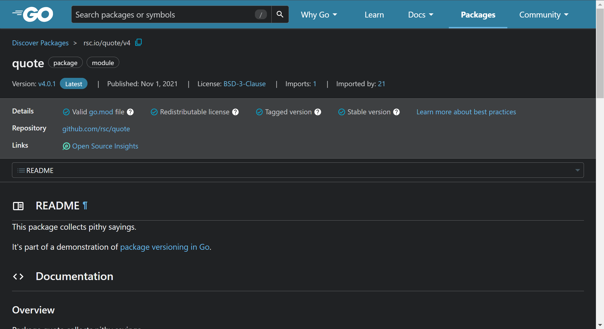

# 1.第一份代码

先检查自己是否有正确下载 `Go`，如果没有直接去 [Go 安装](https://go.dev/doc/install) 进行安装。

```shell
# 检查是否有 Go
$ go version
go version go1.23.4 linux/amd64

```

然后根据 [Go 的入门教程](https://go.dev/doc/tutorial/getting-started) 开始进行学习。

```shell
# 初始化 Go 项目
$ mkdir example && cd example # Go 会在 example 目录下创建一个 go.mod 文件, 并将模块路径设置为 example/hello

$ go mod init example/hello 
go: creating new go.mod: module example/hello

$ ls -al
总计 16
drwxrwxr-x  3 ljp ljp 4096  2月  3 23:24 .
drwxrwxr-x 15 ljp ljp 4096  1月 27 23:44 ..
-rw-rw-r--  1 ljp ljp   32  2月  3 23:24 go.mod

$ cat go.mod
module example/hello

go 1.23.4

$ ll -al hello/
总计 8.0K
drwxrwxr-x 2 ljp ljp 4.0K  2月  3 23:21 .
drwxrwxr-x 3 ljp ljp 4.0K  2月  3 23:24 ..

```

`go mod init example/hello` 是用来在 `example/` 下初始化一个 `Go` 项目的模块的命令：

*   `go mod`：这是 `Go 1.11` 引入的模块系统的命令，用于管理项目的依赖
*   `init`：该命令用于创建一个新的模块并初始化 `go.mod` 文件，`go.mod` 文件是 `Go` 项目的模块定义文件，用于记录模块的依赖信息和 `Go` 版本等信息
*   `example/hello`：这是您为某一个模块指定的名称。通常模块名称是一个符合 `Go` 命名规则的路径，也可能是一个 `Git` 仓库地址（比如 `github.com/user/repo`）或者本地路径（比如 `example/hello`）

```shell
# 编写第一份代码
$ vim hello.go && cat hello.go
package main

import "fmt"

func main() {
    fmt.Println("Hello, World!")
}

$ go run .
Hello, World!

$ go run hello.go
Hello, World!

```

简单说一下关于上述代码的一些重点。

-   第一行代码 `package main` 定义了包名。您必须在源文件中非注释的第一行指明这个文件属于哪个包。`package main` 表示一个可独立执行的程序，每个 `Go` 应用程序都包含一个名为 `main` 的包
-   下一行 `import "fmt"` 告诉 `Go` 编译器这个程序需要使用 `fmt` 包（的函数或其他元素），`fmt` 包实现了格式化 `IO`（输入/输出）的函数
-   下一行 `func main()` 是程序开始执行的函数。`main` 函数是每一个可执行程序所必须包含的，一般来说都是在启动后第一个执行的函数（如果有 `init()` 函数则会先执行该函数）
-   单行注释是最常见的注释形式，你可以在任何地方使用以 `//` 开头的单行注释。多行注释也叫块注释，均已以 `/*` 开头，并以 `*/` 结尾，且不可以嵌套使用，多行注释一般用于包的文档描述或注释成块的代码片段
-   下一行 `fmt.Println(...)` 可以将字符串输出到控制台，并在最后自动增加换行字符 `\n`。使用 `fmt.Print("hello, world\n")` 可以得到相同的结果。`Print()` 和 `Println()` 这两个函数也支持使用变量，如：`fmt.Println(arr)`。如果没有特别指定，它们会以默认的打印格式将变量 `arr` 输出到控制台。
-   另外标识符的大小写是有说法的，大小写决定了包内外的可见性
    -   标识符（包括常量、变量、类型、函数名、结构字段等等）以一个大写字母开头，如 `Group1`，那么使用这种形式的标识符的对象就可以被外部包的代码所使用（客户端程序需要先导入这个包），这被称为导出（像面向对象语言中的 `public`）
    -   标识符如果以小写字母开头，则对包外是不可见的，但是他们在整个包的内部是可见并且可用的（像面向对象语言中的 `protected`）。

`go` 的运行方式有两种，一种是即时编译运行，一种是执行编译后的可执行文件。

```shell
# 编译 Go 程序
$ go build -o hello.exe hello.go

$ ls -al
总计 2100
drwxrwxr-x 2 ljp ljp    4096  2月  4 00:13 .
drwxrwxr-x 3 ljp ljp    4096  2月  3 23:49 ..
-rw-rw-r-- 1 ljp ljp      32  2月  4 00:12 go.mod
-rwxrwxr-x 1 ljp ljp 2130759  2月  4 00:13 hello.exe
-rw-rw-r-- 1 ljp ljp      77  2月  4 00:13 hello.go

$ ./hello.exe
Hello, World!

```

接下来尝试引入外部的包，相关的包可以在 [pkggodev](https://pkg.go.dev/) 上搜索，例如搜索 `quote`。



```bash
# 修改代码以使用外部的模块
$ vim hello.go && cat hello.go
package main

import "fmt"
import "rsc.io/quote" // 引入外部依赖

func main() {
    fmt.Println(quote.Go())
}

$ go mod tidy # 会自动下载 rsc.io/quote 包并更新 go.mod 文件

go: finding module for package rsc.io/quote
go: downloading rsc.io/quote v1.5.2
go: found rsc.io/quote in rsc.io/quote v1.5.2
go: downloading rsc.io/sampler v1.3.0
go: downloading golang.org/x/text v0.0.0-20170915032832-14c0d48ead0c

$ ls -al
总计 2.1M
drwxrwxr-x  3 ljp ljp 4.0K  2月  3 23:42 .
drwxrwxr-x 15 ljp ljp 4.0K  1月 27 23:44 ..
-rw-rw-r--  1 ljp ljp  175  2月  3 23:42 go.mod
-rw-rw-r--  1 ljp ljp  499  2月  3 23:42 go.sum # 多出该文件
-rwxrwxr-x  1 ljp ljp 2.1M  2月  3 23:36 hello.exe
-rw-rw-r--  1 ljp ljp   95  2月  3 23:39 hello.go

$ cat go.mod
module example/hello

go 1.23.4

require rsc.io/quote v1.5.2

require (
        golang.org/x/text v0.0.0-20170915032832-14c0d48ead0c // indirect
        rsc.io/sampler v1.3.0 // indirect
)

$ go run hello.go
Don't communicate by sharing memory, share memory by communicating.

```

`go.sum` 文件在 `Go` 项目中扮演着重要的角色，它用于记录项目依赖的 **模块** 的 **校验和**，确保模块在下载时的完整性和一致性。防止恶意代码和不一致的版本被引入项目中，确保依赖项的安全和可重现性。

# 2.数据类型


# 3.类型转化


# 4.控制程序流


# 5.函数


# 6.导入导出


# 7.数组和字符串


# 8.集合框架


# 9.面向哲学

-   面向并发编程
-   面向函数式编程
-   面向消息编程

# 10.错误处理


# 11.文件操作


# 12.包管理器


# 13.语言特性

